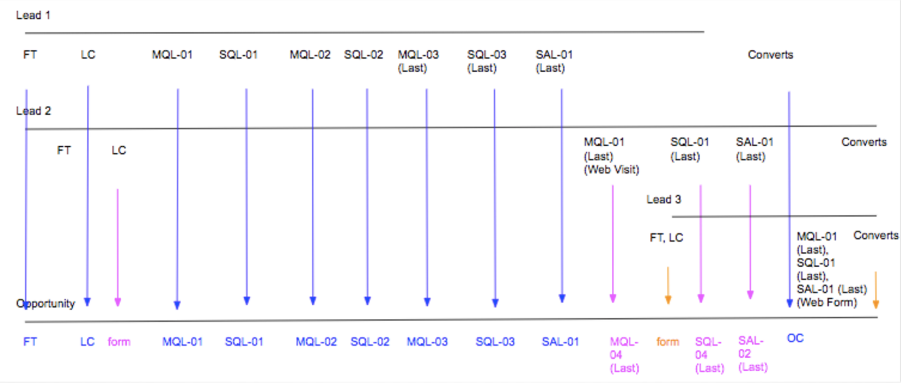

# Cenários de Estágio de Boomerang {#boomerang-stage-scenarios}

Abaixo estão alguns exemplos de cenários de Estágio de Boomerang para fornecer uma compreensão de como [!DNL Marketo Measure] O criará pontos de contato em cada situação.

## Cenários de lead únicos {#single-lead-scenarios}

**Cenário 1: Pontos de Contato de Boomerang Padrão para um Cliente Potencial**

Este é o cenário mais simples de Boomerang. A linha superior (identificada como Lead 1) representa a jornada de cada Leads e como seus pontos de contato aparecem no registro de Lead. A conclusão (chamada de Oportunidade) exibe como os pontos de contato dos leads são traduzidos para a Oportunidade. A progressão dos pontos de contato será explicada em ocorrências cronológicas, da esquerda para a direita.

Nesse cenário, um cliente optou por ter seus **MQL** e **SQL** palcos rastreados com bumerangue. Cada posição do ponto de contato do Boomerang será rotulada com o estágio e o número em que ocorre (MQL-01, SQL-01, MQL-02. etc). O último ponto de contato de boomerang para esse estágio também terá &quot;(Last)&quot; na posição do ponto de contato.

O lead 1 é então convertido em um Contato com uma Oportunidade, que é considerado o toque do OC.

**Cenário 2: Pontos de contato de bumerangue e estágios personalizados para um cliente em potencial**

Nesse cenário, um cliente optou por rastrear somente a variável **Fase SQL** com pontos de contato de bumerangue. Os estágios de MQL e SAL ainda estão sendo rastreados, mas com o [!DNL Marketo Measure] Recurso de preparo personalizado.

Observe que a posição do ponto de contato MQL não está rotulada com um número. Isso ocorre porque não foi selecionado para ser rastreado com pontos de contato de Boomerang. Ao criar pontos de contato para palcos incluídos no modelo personalizado, mas não são rastreados com o Boomerang, [!DNL Marketo Measure] A aceitará a última ocorrência desse estágio.

No caso da fase SAL, [!DNL Marketo Measure] ignora as duas primeiras ocorrências deste estágio. [!DNL Marketo Measure] cria apenas um ponto de contato SAL para a _last_ ocorrência. No exemplo acima, isso acontece logo antes do ponto de contato do OC.

O estágio SQL está sendo rastreado com pontos de contato de Boomerang e três pontos de contato foram criados e rotulados de acordo.

O lead 1 é então convertido em um Contato com uma Oportunidade, que é considerado o toque do OC.

**Cenário 3: Quando os leads não atingem/ignoram um estágio**

Este cenário utiliza os mesmos critérios do cenário 2. Um cliente optou por rastrear somente o estágio SQL com pontos de contato de boomerang. MQL e SAL ainda estão sendo rastreados, mas com o [!DNL Marketo Measure] Recurso de preparo personalizado.

Nesse cenário, o Lead nunca é transferido para o estágio SAL. Ele é convertido em um Contato antes de chegar ao estágio SAL, essencialmente &quot;ignorando&quot; o estágio SAL. Nesta situação, [!DNL Marketo Measure] presumirá que a SAL ocorre com o ponto de contato OC e que tanto a posição SAL quanto a OC aparecerão no mesmo ponto de contato.

O lead 1 é então convertido em um Contato com uma Oportunidade, que é considerado o toque do OC.

## Cenários com vários leads {#scenarios-with-multiple-leads}

Os cenários a seguir são onde os Estágios de Boomerang podem se complicar, já que estamos olhando para como vários Leads podem influenciar a jornada de Oportunidade.

A linha superior (rotulada como Lead 1, em azul) representa a jornada dos leads individuais e como seus pontos de contato aparecem no registro de leads. O mesmo se aplica ao Chumbo 2 (em rosa) e ao Chumbo 3 (em laranja). O resultado final (chamado de Oportunidade) exibe como ambos os pontos de contato de Clientes potenciais se traduzem na Oportunidade. A progressão dos pontos de contato será explicada em ocorrências cronológicas, da esquerda para a direita.

**Cenário 1: [!UICONTROL Três leads com oportunidade]**

Nesse cenário, um cliente optou por rastrear a variável **MQL** e **Estágios SAL** com pontos de contato de bumerangue. O estágio SQL está sendo rastreado pelos estágios personalizados padrão.

Os pontos de contato da FT e da LC na Oportunidade serão provenientes do Chumbo 1 (azul), porque ocorreram antes da FT e da LC do Chumbo 2 (rosa). O ponto de contato LC para Lead 2 será exibido como um ponto de contato &quot;Formulário&quot; na Oportunidade.

O MQL-01 (Último) do Lead 2 se tornará o primeiro MQL da Oportunidade. O MQL-01 do Lead 1 não será exibido como um ponto de contato na Oportunidade porque o MQL do Lead 2 ocorreu primeiro. No entanto, o MQL-02 e o MQL-03 do lead 1 aparecerão na Oportunidade.

Observe que o estágio SQL está sendo rastreado com estágios personalizados, e não por estágios de bumerangue. Embora existam três ocorrências do estágio SQL entre o Lead 1 e o Lead 2, somente a última ocorrência SQL será incluída como um ponto de contato na Oportunidade.

O ponto de contato SAL-01 (Último) do Lead 1 é transportado como um ponto de contato da Oportunidade. O lead 1 é então convertido em um Contato com uma Oportunidade, que é considerado o toque do OC. O ponto de contato SAL-01 (Último) do lead 2 será criado como um ponto de contato, pois essa transição de estágio ocorreu _after_ o toque OC.

Os pontos de contato FT, LC e MQL, SQL, SAL (laranja) do lead 3 ocorreram após o ponto de contato do OC na Oportunidade. Esses pontos de contato serão incluídos na Oportunidade, mas são considerados &quot;toques médios&quot;.

Quando o lead 2 e 3 são convertidos em Contatos, [!DNL Marketo Measure] O não criará outro ponto de contato do OC porque só pode haver uma etapa de criação de oportunidade.

**Cenário 2 - [!UICONTROL Três leads com oportunidade]**

Nesse cenário, um cliente optou por rastrear a variável **MQL**, **SQL** e **SAL** palcos com pontos de contato de boomerang.

Todos os pontos de contato do Lead 1 serão incluídos na oportunidade, da FT ao SAL-01 (último). O ponto de contato LC do Lead 2 será incluído como um ponto de contato de formulário entre os pontos de contato LC e MQL-01 na Oportunidade.

O MQL-01 (Último) do Lead 2 acaba sendo o ponto de contato MQL-04 (Último) da Oportunidade. Como este cenário está olhando para várias jornadas de Clientes potenciais em uma Oportunidade, o posicionamento e a numeração dos pontos de contato de Clientes potenciais podem mudar quando são traduzidos como pontos de contato na Oportunidade. Da mesma forma, o SQL-01 (Último) do Lead 2 se torna o SQL-04 (Último) no Opp. O SAL-01 (Último) do Lead 2 também se torna o SAL-02 (Último) da Oportunidade.

Além disso, observe que há apenas 2 pontos de contato SAL incluídos na Oportunidade. [!DNL Marketo Measure] O não tentará forçar/criar pontos de contato para transições de estágio se elas não tiverem realmente ocorrido.

A jornada do ponto de contato do lead 3 começa logo antes do toque do OC ocorrer, mas muito depois do lead 1 e do lead 2 terem seu toque de FT e LC. Nesse caso, o FT e o LC do lead 3 serão exibidos como um ponto de contato de formulário na Oportunidade. O lead 1 é então convertido em um Contato com uma Oportunidade, que é considerado o toque do OC.

Os toques MQL, SQL e SAL do lead 3 ocorrem simultaneamente, após o toque do OC. Como ocorreram após o ponto de contato do OC, esse ponto de contato aparecerá como um Formulário/Meio de Toque na Oportunidade em vez de uma transição de estágio do Boomerang.

**Cenário 2a - Pontos de contato do boomerang de visita à Web**

Nesse cenário, um cliente optou por rastrear a variável **MQL**, **SQL** e **SAL** palcos com pontos de contato de boomerang. Este cenário é quase idêntico ao acima, com algumas exceções.

Todos os pontos de contato do Lead 1 serão incluídos na oportunidade, da FT ao SAL-01 (último). O ponto de contato LC do Lead 2 será incluído como um ponto de contato de formulário entre os pontos de contato LC e MQL-01 na Oportunidade.

O MQL-01 (Última) do Lead 2 (Visita à Web) não será criado como ponto de contato na opção. Isso ocorre porque esse ponto de contato foi uma visita da Web que ocorreu após a última ocorrência do estágio SQL e não ajuda a impulsionar a Oportunidade para frente.

O palco do Lead 1 é alterado para SAL e, em seguida, é convertido em um Contato com uma Oportunidade; nesse caso, a posição SAL-01 (Last) e OC serão combinadas no mesmo ponto de contato.

O toque de FT e LC do lead 3 será criado como um ponto de contato de Formulário no Opp. Somente ações de preenchimento de formulário serão criadas como pontos de contato após o toque do OC. Por isso, as transições de estágio SQL-01 (Último) e SAL-01 (Último) para Lead 2 não serão criadas como pontos de contato porque esses pontos de contato eram visitas da Web.

Os toques MQL, SQL e SAL do Lead 3 serão incluídos como um ponto de contato, pois essa foi uma ação de preenchimento de formulário.

**Cenário 3 - Ponderação de atribuição de bumerangue**

Nesse cenário, um cliente optou por rastrear a variável **MQL**, **SQL** e **SAL** palcos com pontos de contato de boomerang.

Os pontos de contato da FT e da LC na Oportunidade serão provenientes do Chumbo 1 (azul), porque ocorreram antes da FT e da LC do Chumbo 2 (rosa). O ponto de contato LC para Lead 2 será exibido como um ponto de contato &quot;Formulário&quot; na Oportunidade.

O MQL-01 (Último) do Lead 2 se tornará o primeiro MQL da Oportunidade. O MQL-01 do Lead 1 não será exibido como um ponto de contato na Oportunidade porque o MQL do Lead 2 ocorreu primeiro.

O SQL-01 (Último) do Lead 2 se tornará SQL-01 na Oportunidade. O SQL-01 no Lead 1 não aparecerá como um ponto de contato na oportunidade porque o SQL-01 no Lead 2 aconteceu primeiro.

Observe que os bumerangue do Lead 1 entre MQL e SQL algumas vezes antes de finalmente chegar ao estágio SAL. SQL-01, MQL-02, SQL-02, MQL-03, SQL-03 _não_ ser incluído como pontos de contato na oportunidade, pois essas transições de estágio não ajudam a impulsionar a oportunidade na jornada.

O ponto de contato SAL-01 (Último) do Lead 1 será o próximo ponto de contato a ser incluído na Opção. O lead 1 então converte-se em um contato com uma oportunidade, criando o ponto de contato OC.

O FT e o LC do lead 3, e o ponto de contato MQL, SQL e SAL, serão exibidos como um formulário toca na Oportunidade.

O ponto de contato SQL-01 (Último) do cliente potencial 2 não será incluído como um ponto de contato na opção porque ocorreu após o ponto de contato OC. Além disso, ocorreu a transição do estágio SQL do Lead 2 _após a transição final da fase SAL_ e não ajuda a impulsionar a jornada de oportunidade.

## Cenários de Oportunidade {#opportunity-scenarios}

**Cenário 1 - Contatos com Oportunidade e Rastreamento de Boomerang**

Nesse cenário, um cliente optou por rastrear a variável **Transições de estágio de demonstração e negociação** no **Contato**. Cada estágio de boomerang pode receber até dois pontos de contato. A diferença entre as transições de estágio em um Contato versus transições de estágio em um Lead é que as transições de estágio de Contato podem aparecer como pontos de contato de Boomerang na Oportunidade _after_ o ponto de contato OC. Isso não é verdadeiro para transições de palco que ocorrem no lead, pois elas aparecerão como um ponto de contato de formulário.

Neste exemplo, as transições de Demonstração e Estágio de Negociação do Contato 1 são incluídas como pontos de contato Demo-01 e Negociação-01 na Oportunidade. A transição do estágio Demonstração do Contato 2 ocorre _after_ Entre em contato com a 1 e aparecerá como o ponto de contato Demo-02 (Último) da Oportunidade.

Observe que não há uma segunda transição para a fase de negociação; a Oportunidade salta imediatamente de Demo-02 (Último) para Fechar vencedor. Nesse caso, [!DNL Marketo Measure] incluirá a transição Negociação com o ponto de contato Vencedor Fechado.
