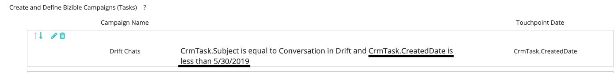

# Perguntas frequentes sobre integração de Drift {#drift-integration-faq}

Como parte do [!DNL Marketo Measure] integração com o Drift, descrevemos algumas das perguntas mais frequentes. Se houver alguma dúvida não descrita abaixo, entre em contato com o Gerente de sucesso do cliente ou [Suporte Marketo](https://nation.marketo.com/t5/support/ct-p/Support){target=&quot;_blank&quot;}.

**Como a integração está habilitada?**

Rastreamento do Chat de Drift para [!DNL Marketo Measure] está ativada por padrão. Se, por qualquer motivo, você quiser desativá-lo (e não criar pontos de contato a partir do Drift Chats por padrão), precisaremos de um atributo adicional adicionado ao seu [!DNL Marketo Measure] Implementação de JavaScript, em negrito abaixo:

``

Para aqueles que usam [!DNL Google Tag Manager] para carregar o [!DNL Marketo Measure] Script, se você quiser excluir seus Chats de Drift da qualificação de Pontos de Contato, será necessário adicionar o seguinte `` logo após a [!DNL Marketo Measure] Script:

``

**O que a integração faz?**

A integração agora permite [!DNL Marketo Measure] para rastrear quando um usuário final fornece seu endereço de email em um chat de Drift. A partir daí, criamos pontos de contato a partir dessas interações com um tipo de ponto de contato &quot;Bate-papo da Web&quot;. Essa integração permite que os profissionais de marketing entendam o desempenho de suas interações de chat, juntamente com os canais/subcanais/campanhas que fazem com que as pessoas interajam com esses chats.

**E se eu rastrear o Drift por meio das regras de sincronização da campanha?**

Se houver regras de sincronização de campanha em vigor para criar pontos de contato para interações do chat de Drift, será necessário garantir que pare de adicionar esses usuários finais específicos à campanha de CRM correspondente. Caso contrário, uma vez que o bit de recurso estiver ativado, criaremos um ponto de contato de Campanha CRM e um ponto de contato digital para uma interação de chat de Drift.

**E se eu rastrear o Drift via Campanhas do CRM?**

Se houver campanhas de CRM em vigor para criar pontos de contato para interações de chat por Drift, uma Data final do ponto de contato precisará ser definida nessas campanhas específicas (a Data final do ponto de contato deve ser a data em que o bit do recurso de Integração de chat da Web está ativado).

**E se eu rastrear o Drift via Atividades?**

Se houver regras de atividade em vigor para criar pontos de contato para interações do chat de Drift, será necessário adicionar uma lógica adicional às regras. Você precisará adicionar lógica usando o campo Data da criação da tarefa para impedir que a duplicação de pontos de contato seja criada (IE CrmTask.CreatedDate é Menor que a data em que o bit de recurso foi ativado). Veja a captura de tela abaixo, por exemplo.

