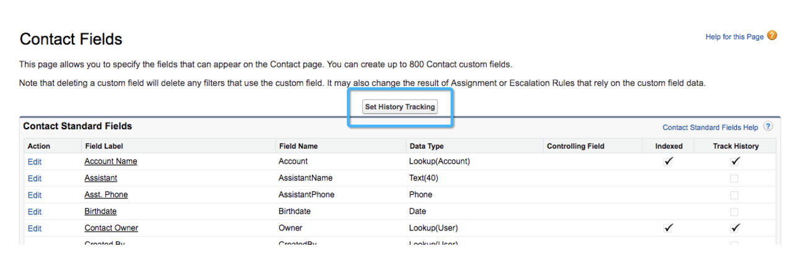

# Configuração de modelo personalizado: ativar o rastreamento do histórico de campos {#custom-model-setup-enable-field-history-tracking}

## Por que e quando ativar o rastreamento do histórico do campo {#why-and-when-to-enable-field-history-tracking}

Se você decidir incluir um campo personalizado como um estágio no modelo de atribuição personalizado, o rastreamento do histórico do campo **deve ser ativado** para este campo. Habilitar o rastreamento do histórico de campo permitirá [!DNL Salesforce] para rastrear qualquer momento em que o campo personalizado for editado, crie um registro na tabela Rastreamento de histórico. [!DNL Marketo Measure] Você pode baixar essa tabela e usar essas informações para medir o horário e o dia em que uma &quot;transição&quot; ocorreu. Sem rastreamento do histórico de campo, [!DNL Marketo Measure] O não pode rastrear alterações relacionadas a este campo.

Se somente [!UICONTROL Status do lead] Para Estágios de oportunidade serem usados no modelo personalizado, não há necessidade de ativar o rastreamento do Histórico de campo, pois ele será rastreado automaticamente como uma transição de estágio.

Para ativar o rastreamento do histórico de campo, siga as instruções abaixo.

## Ativar o rastreamento do histórico do campo {#enable-field-history-tracking}

>[!NOTE]
>
>Você precisará ser um Administrador do sistema para fazer essas alterações nos campos do objeto Lead/Contato/Oportunidade.

1. Vá para o Objeto onde o campo personalizado está e clique no **[!UICONTROL Definir rastreamento do histórico]** botão.

   

1. Selecione os campos nos quais você deseja rastrear as alterações.

   

[!DNL Marketo Measure] O só poderá reimportar um registro se detectar que o registro foi modificado recentemente. Tecnicamente, os campos de fórmula não modificam um registro quando ele é alterado, pois faz o cálculo em segundo plano. Vimos problemas em que uma regra é ignorada porque [!DNL Marketo Measure] O não viu a alteração de registro, portanto, recomenda-se **não usar campos de fórmula em definições de regra**. A solução é criar um campo de texto e usar um fluxo de trabalho para preencher esse campo com o valor ou cálculo apropriado sempre que o registro for editado ou se ajustar aos critérios. Isso requer que todos os registros sejam editados para que o fluxo de trabalho possa funcionar retroativamente em registros antigos.
