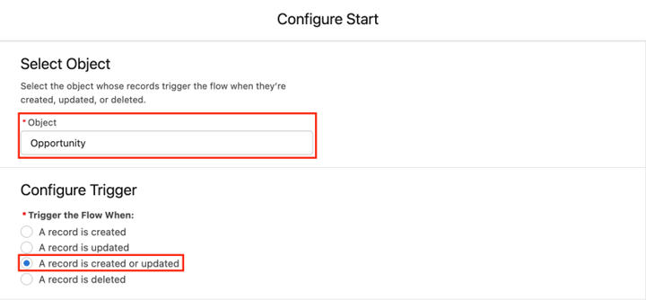

# Utilização de um campo de quantia de receita personalizada {#using-a-custom-revenue-amount-field}

Por padrão, os Pontos de Contato da Atribuição do Comprador extrairão a Quantia da Oportunidade de um dos dois campos:

* Valor (padrão SFDC)
* [!DNL Marketo Measure] Valor da oportunidade (personalizado)

Se você estiver usando um campo Valor personalizado em suas Oportunidades, precisaremos configurar um fluxo de trabalho para calcular a Receita do ponto de contato do comprador. Isso exige um conhecimento mais avançado sobre [!DNL Salesforce], portanto, pode precisar de assistência do administrador do SFDC.

A partir de agora, precisaremos das seguintes informações:

* Nome da API do seu campo Valor

A partir daqui, começaremos a criar o workflow.

## Criar o fluxo de trabalho no Salesforce Lightning {#create-the-workflow-in-salesforce-lightning}

As etapas a seguir são para usuários do Salesforce Lightning. Se você ainda usar o Salesforce Classic, essas etapas [estão listados abaixo](#create-the-workflow-in-salesforce-classic).

1. Em Configuração, digite &quot;Fluxos&quot; na Caixa Localização Rápida e selecione **Fluxos** para iniciar o Construtor de fluxo. No painel direito, clique na guia **Novo Fluxo** botão.

   

1. Selecionar **Fluxo acionado por registro** e clique no link **Criar** botão na parte inferior direita.

   

1. Na janela Configurar início, selecione o objeto Oportunidade. Na seção Configurar Acionador, selecione **Um registro é criado ou atualizado**.

   

1. Na seção Definir Condições de Entrada, em Requisitos da Condição, selecione **A Lógica De Condição Personalizada Foi Atendida**.
   * No campo de pesquisa, selecione o campo Valor personalizado.
   * Definir o operador como **Is Null**, e o valor como **Falso**.
   * Defina os critérios de avaliação como **Toda vez que um registro é atualizado e atende aos requisitos de condição**.

   

1. Na seção &quot;Otimizar o fluxo para&quot;, selecione **Atualizações rápidas de campo**. Clique em **Concluído**.

   

1. Para adicionar o elemento, clique no ícone de adição (+) e selecione **Atualizar Registro de Disparo**.

   

1. Na janela Novos Registros de Atualização, informe o seguinte:

   * Insira um rótulo — o nome da API será gerado automaticamente
   * Em &quot;Como localizar registros para atualizar e definir seus valores&quot;, selecione **Usar o registro de oportunidade que acionou o fluxo**.
   * Na seção &quot;Definir condições de filtro&quot;, selecione **Sempre atualizar registro** como um Requisito de Condição para Atualizar Registro.
   * Em &quot;Definir valores de campo para o registro da campanha&quot;, no campo, selecione Valor de oportunidade da Marketo Measure e valore seu campo de valor personalizado.
   * Clique em **Concluído**.

   

1. Clique em **Salvar**. Um pop-up será exibido. Digite &quot;Rótulo de fluxo&quot; na janela Salvar o fluxo (o Nome da API de fluxo será gerado automaticamente). Clique em **Salvar** novamente.

   

1. Clique em **Ativar** botão para ativar o fluxo.

   

## Criar o fluxo de trabalho no Salesforce Classic {#create-the-workflow-in-salesforce-classic}

As etapas a seguir são para usuários do Salesforce Classic. Se você tiver alternado para o Salesforce Lightning, essas etapas [pode ser encontrado acima](#create-the-workflow-in-salesforce-lightning).

1. Navegue até **[!UICONTROL Configuração]** > **[!UICONTROL Criar]** > **[!UICONTROL Fluxo de trabalho e aprovações]** > **[!UICONTROL Regras de fluxo de trabalho]**.

   

1. Selecionar **[!UICONTROL Nova regra]**, defina o objeto como &quot;Oportunidade&quot; e clique em **[!UICONTROL Próxima]**.

   

   

1. Configure o workflow. Defina o Nome da regra como &quot;Atualizar&quot; [!DNL Marketo Measure] Valor da oportunidade.&quot; Defina o Critério de avaliação como &quot;Criado e sempre que for editado&quot;. Para os Critérios da regra, selecione o campo Valor personalizado e selecione o Operador [!UICONTROL como &quot;Não Igual a&quot;] e deixe o campo &quot;Valor&quot; em branco.

   

1. Adicione uma ação de workflow. Defina esta lista de opções como &quot;[!UICONTROL Nova atualização de campo].&quot;
   

1. Aqui você preencherá as informações de campo. No campo &quot;Nome&quot;, recomendamos usar este nome: &quot;[!DNL Marketo Measure] Quantia Opp.&quot; O &quot;Nome exclusivo&quot; será preenchido automaticamente com base no campo &quot;Nome&quot;. Na lista de opções &quot;Campo a atualizar&quot;, selecione &quot;[!DNL Marketo Measure] Valor da oportunidade.&quot; Depois de selecionar o campo, marque a caixa &quot;Reavaliar Regras de Workflow após Alteração do Campo&quot;. Em &quot;Especificar novo valor do campo&quot;, selecione &quot;Usar uma fórmula para definir o novo valor&quot;. Na caixa vazia, solte o nome da API do campo Valor personalizado. Clique em **[!UICONTROL Salvar]**.

   

1. Você será redirecionado a uma página de rollup do seu fluxo de trabalho, certifique-se de &quot;Ativar&quot; e pronto para começar. Para ativar, clique em **Editar** ao lado do novo fluxo de trabalho e clique em **Ativar**.

   Depois de concluir essas etapas, as oportunidades precisarão ser atualizadas para acionar o workflow para ter o novo valor do [!UICONTROL oportunidade personalizada] campo.

   Isso pode ser feito abrindo oportunidades por meio do Data Loader no SFDC. Encontre detalhes sobre o uso do Carregador de dados no [este artigo](/help/advanced-marketo-measure-features/custom-revenue-amount/using-data-loader-to-update-marketo-measure-custom-amount-field.md).

Se houver dúvidas ao longo do caminho, entre em contato com a Equipe de conta do Adobe (seu gerente de conta) ou [[!DNL Marketo] Suporte](https://nation.marketo.com/t5/support/ct-p/Support){target="_blank"}.
