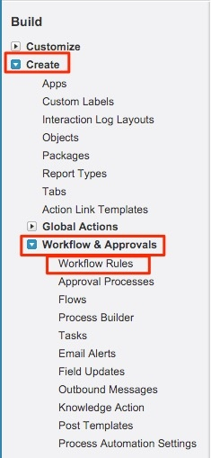

# Utilização de um campo de quantia de receita personalizada {#using-a-custom-revenue-amount-field}

Por padrão, os Pontos de Contato da Atribuição do Comprador extrairão a Quantia da Oportunidade de um dos dois campos:

* Valor (padrão do SFDC)
* [!DNL Marketo Measure] Valor da oportunidade (personalizado)

Se você estiver usando um campo Valor personalizado em suas Oportunidades, precisaremos configurar um fluxo de trabalho para calcular a Receita da Buyer Touchpoint. Isso requer mais conhecimento sobre o [!DNL Salesforce] e pode exigir a assistência do administrador do SFDC.

A partir de agora, precisaremos das seguintes informações:

* Nome da API do seu campo Valor

A partir daqui, começaremos a criar o workflow.

## Criar o fluxo de trabalho no Salesforce Lightning {#create-the-workflow-in-salesforce-lightning}

As etapas a seguir são para usuários do Salesforce Lightning. Se você ainda usa o Salesforce Classic, essas etapas [estão listadas abaixo](#create-the-workflow-in-salesforce-classic).

1. Na Instalação, digite &quot;Fluxos&quot; na Caixa Localização Rápida e selecione **[!UICONTROL Fluxos]** para iniciar o Construtor de Fluxos. No painel direito, clique no botão **[!UICONTROL Novo Fluxo]**.

   

1. Selecione **[!UICONTROL Fluxo acionado por Registro]** e clique em **[!UICONTROL Criar]** na parte inferior direita.

   

1. Na janela Configurar início, selecione o objeto Oportunidade. Na seção [!UICONTROL Configurar Acionador], selecione **[!UICONTROL Um registro foi criado ou atualizado]**.

   

1. Na seção Definir Condições de Entrada, em [!UICONTROL Requisitos da Condição], selecione **[!UICONTROL Lógica de Condição Personalizada Atendida]**.
   * No campo de pesquisa, selecione o campo Valor personalizado.
   * Defina o operador como **Is Null**, e o valor como **[!UICONTROL False]**.
   * Defina os critérios de avaliação como **[!UICONTROL Toda vez que um registro for atualizado e atender aos requisitos de condição]**.

   

1. Na seção &quot;Otimizar o fluxo para&quot;, selecione **[!UICONTROL Atualizações rápidas de campo]**. Clique em **[!UICONTROL Concluído]** na parte inferior direita.

   

1. Para adicionar o elemento, clique no ícone de adição (+) e selecione **[!UICONTROL Atualizar Registro de Disparo]**.

   

1. Na janela Novos Registros de Atualização, informe o seguinte:

   * Insira um rótulo — o nome da API será gerado automaticamente
   * Em &quot;Como localizar registros para atualizar e definir seus valores&quot;, selecione **[!UICONTROL Usar o registro de oportunidade que acionou o fluxo]**.
   * Na seção &quot;[!UICONTROL Definir Condições de Filtro]&quot;, selecione **[!UICONTROL Sempre Atualizar Registro]** como um Requisito de Condição para Atualizar Registro.
   * No campo &quot;[!UICONTROL Definir Valores de Campo para o Registro de Campanha]&quot;, selecione o Valor de Oportunidade da Marketo Measure (**bizible2_Bizible_Opportunity_Amount__c**) e o Valor de. Em seguida, selecione o campo Valor personalizado.
   * Clique em **[!UICONTROL Concluído]**.

   

1. Clique em **[!UICONTROL Salvar]**. Um pop-up será exibido. Digite &quot;Rótulo de fluxo&quot; na janela Salvar o fluxo (o Nome da API de fluxo será gerado automaticamente). Clique em **[!UICONTROL Salvar]** novamente.

   

1. Clique no botão **[!UICONTROL Ativar]** para ativar o fluxo.

   

## Criar o fluxo de trabalho no Salesforce Classic {#create-the-workflow-in-salesforce-classic}

As etapas a seguir são para usuários do Salesforce Classic. Se você alternou para o Salesforce Lightning, essas etapas [podem ser encontradas acima](#create-the-workflow-in-salesforce-lightning).

1. Navegue até **[!UICONTROL Configuração]** > **[!UICONTROL Criar]** > **[!UICONTROL Fluxo de Trabalho e Aprovações]** > **[!UICONTROL Regras de Fluxo de Trabalho]**.

   

1. Selecione **[!UICONTROL Nova regra]**, defina o objeto como &quot;Oportunidade&quot; e clique em **[!UICONTROL Avançar]**.

   

   

1. Configure o workflow. Defina o Nome da regra como &quot;Atualizar [!DNL Marketo Measure] Valor da oportunidade&quot;. Defina o Critério de avaliação como &quot;Criado e sempre que for editado&quot;. Para os Critérios da Regra, selecione o campo Valor personalizado e selecione o Operador [!UICONTROL &#x200B; como &quot;Diferente de&quot;] e deixe o campo &quot;Valor&quot; em branco.

   

1. Adicione uma ação de workflow. Defina esta lista de opções como &quot;[!UICONTROL Nova Atualização de Campo]&quot;.
   

1. Aqui você preencherá as informações do campo. No campo &quot;Nome&quot;, recomendamos usar este nome: &quot;[!DNL Marketo Measure] Valor de Opp.&quot; O &quot;Nome exclusivo&quot; será preenchido automaticamente com base no campo &quot;Nome&quot;. Na lista de opções &quot;Campo a ser atualizado&quot;, selecione &quot;[!DNL Marketo Measure] Valor da oportunidade&quot;. Depois de selecionar o campo, marque a caixa &quot;Reavaliar Regras de Workflow após Alteração do Campo&quot;. Em &quot;Especificar novo valor do campo&quot;, selecione &quot;Usar uma fórmula para definir o novo valor&quot;. Na caixa vazia, solte o nome da API do campo Valor personalizado. Clique em **[!UICONTROL Salvar]**.

   

1. você será redirecionado a uma página de rollup do seu fluxo de trabalho, certifique-se de &quot;Ativar&quot; e poderá continuar. Para ativar, clique em **[!UICONTROL Editar]** ao lado do novo fluxo de trabalho e em **[!UICONTROL Ativar]**.

   Após concluir essas etapas, as oportunidades precisarão ser atualizadas para acionar o fluxo de trabalho para ter o novo valor do campo [!UICONTROL oportunidade personalizada].

   Isso pode ser feito abrindo oportunidades por meio do Carregador de dados na SFDC. Encontre detalhes sobre como usar o Carregador de Dados em [este artigo](/help/advanced-marketo-measure-features/custom-revenue-amount/using-data-loader-to-update-marketo-measure-custom-amount-field.md){target="_blank"}.

Em caso de dúvidas durante o processo, entre em contato com a Equipe de Contas do Adobe (seu Gerente de Contas) ou com o [[!DNL Marketo] Suporte](https://nation.marketo.com/t5/support/ct-p/Support){target="_blank"}.
