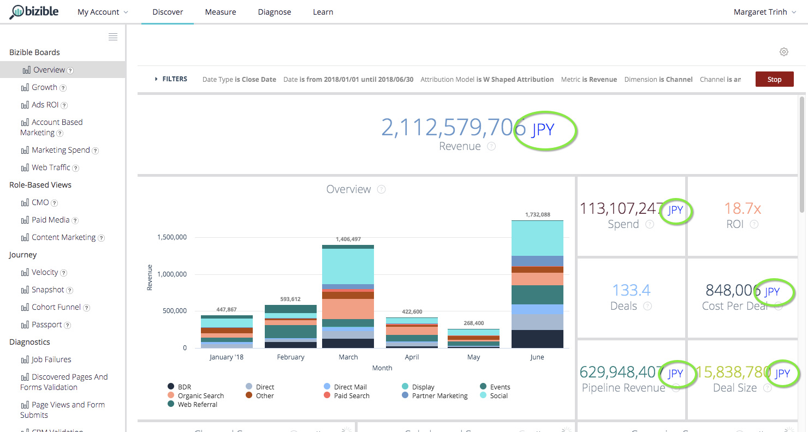

# Relatórios do Discover {#discover-reporting}

Em [!UICONTROL Configurações de Usuário], os usuários terão a opção de alterar a moeda padrão para qualquer uma das moedas corporativas listadas. Isso alterará a exibição de valores como Custo, Receita e Receita do pipeline, por exemplo, ao lado do código monetário de três letras.

