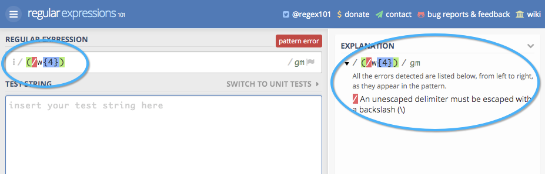

# Campos do Touchpoint {#touchpoint-fields}

Historicamente, quando os clientes estão integrados com o [!DNL Marketo Measure] e, no caso de não termos uma integração de marcação direta, nossa equipe de Sucesso do Cliente instrui nossos clientes sobre como marcar apropriadamente suas páginas de aterrissagem para que eles utilizem o formato correto da UTM e possamos resolver seus anúncios. Alguns desses clientes não usam UTMs, mas usam seus próprios parâmetros de marcação, o que significa que pode ser muito demorado editar todas as landing pages em todas as redes de anúncios com uma nova estrutura de marcação que [!DNL Marketo Measure] aplica. Para adaptar-se à estrutura de marcação, agora aceitamos parâmetros personalizados que podem ser mapeados com nossas definições de regra. O objetivo é adaptar-se ao uso pelos clientes de seus parâmetros de rastreamento personalizados para que não precisemos que eles alterem sua estrutura de URL.

>[!AVAILABILITY]
>
>Disponível agora com Segmentação completa na camada 2 e 3.

>[!NOTE]
>
>Este é um recurso avançado e deve ser configurado apenas pelos Serviços profissionais.

## Ativar o recurso {#enabling-the-feature}

No [!DNL Marketo Measure] Configurações , navegue até a página Campos do ponto de contato . A partir daí, é possível ativar o recurso selecionando **Sim** under **Ativar campos calculados**. Depois de ativá-los, você poderá criar Campos de ponto de contato.

## Como {#how-to}

Para criar um campo calculado, lembre-se de que há três ações diferentes que um usuário pode realizar: extrações, mapas para, e concatenados. Eles também são conhecidos como operadores para definir um campo calculado.

Extrações

O operador de extração extrai o valor de um campo de outro local, como: um campo Campanha, um campo de lead ou um caso de uso mais avançado, [extrair parâmetros personalizados da landing page](https://docs.google.com/document/d/1NRViyCsXvPKbCTfGW32Yi2vWBjMDRF7bzkzKj9s2DDA/edit?ts=5e20b482#heading=h.xxwtissvw4){target="_blank"}. It then places it onto a Touchpoint Field (See [Maps To Example](https://docs.google.com/document/d/1NRViyCsXvPKbCTfGW32Yi2vWBjMDRF7bzkzKj9s2DDA/edit?ts=5e20b482#heading=h.xxwtissvw4){target="_blank"} 2).

**Exemplo #1**

Há um campo personalizado no Contact, campaign_source__c, que o cliente deseja colocar no ponto de contato para fins de relatório. Você pode definir uma regra para criar um Campo calculado chamado &quot;Fonte da campanha&quot; e soltar o valor nesse campo.

Objetivo: Use o valor de um campo personalizado e coloque-o no objeto de ponto de contato para facilitar o relatório.

* Criar um campo calculado e rotulá-lo como &quot;Fonte da campanha&quot;
* Defina a regra começando com a pesquisa pelo campo Contact.Campaign_Source__c
* Use o operador &quot;extrações&quot;, pois precisamos extrair o valor do parâmetro
* Para extrair a string completa do campo, usaremos a expressão &quot;(.&#42;)&quot;

   * **(** marca o início da extração
   * **)** marca o fim da extração
   * **.&#42;** nos diz que estamos extraindo a corda inteira

**Exemplo #2**

Um caso de uso comum que esse recurso permite é extrair valores de parâmetros personalizados de uma string de URL. Isso é útil se você usar parâmetros diferentes de UTM, mas quiser analisar os valores em campos de ponto de contato.

**Link:** `https://www.adobe.com/blog/marketing-revenue-reporting-overview?promo=5OFF` ou `https://www.adobe.com/blog/marketing-revenue-reporting-overview?promo=25OFF`.\
**Objetivo:** Crie um campo personalizado chamado &quot;Código de desconto&quot; e solte o valor &quot;5OFF&quot; ou &quot;25OFF&quot;, qualquer valor que seja passado.

* Crie um campo calculado e rotule-o como &quot;Código do desconto&quot;
* Defina a regra começando com a pesquisa pelo campo Touchpoint.Session.LandingPage
* Use o operador &quot;extrações&quot;, pois precisamos extrair o valor do parâmetro
* Para extrair o valor da promoção, definiremos o valor como &quot;promo=(\w+)&quot;

   * **(** marca o início da extração
   * **)** marca o fim da extração
   * **\w** diz-nos que estamos a extrair uma &quot;palavra&quot; que inclui 0-9
   * **+** extrairá o valor completo do parâmetro sem limite de caracteres
   * Observe que você está usando uma barra para a frente e não uma barra para trás

**Exemplo #3**

Vamos tentar um exemplo semelhante em que extraímos um código de rastreamento como: `https://www.adobe.com/blog/marketing-revenue-reporting-overview?cid=123456`.

**Objetivo:** Crie um Campo calculado e rotule-o como &quot;Adobe Campaign Id&quot; com o valor do parâmetro cid .

* Crie um campo calculado e rotule-o como &quot;Adobe Campaign Id&quot;
* Defina a regra começando com a pesquisa pelo campo Touchpoint.Session.LandingPage
* Use o operador &quot;extrações&quot;, pois precisamos extrair o valor do parâmetro
* Para extrair o valor &quot;123456&quot;, definiremos o valor como &quot;cid=(\d{6})&quot;

   * **(** marca o início da extração
   * **)** marca o fim da extração
   * **\d** diz-nos que estamos a extrair um &quot;dígito&quot;
   * **{6}** é o número de caracteres que estamos extraindo

**Exemplo #4**

À medida que suas landing pages se complicam e você tem vários parâmetros de rastreamento, pode ser necessário criar vários campos de ponto de contato e extrair valores várias vezes, como:
`https://www.adobe.com/blog/marketing-revenue-reporting-overview?trackID=123456&country=US&campaign_ID=7890`.

**Objetivo:** Crie vários campos calculados para &quot;País de destino&quot; e &quot;ID de campanha personalizada&quot; com os respectivos valores dos parâmetros.

* Crie um campo calculado e rotule-o como &quot;País de destino&quot;
* Defina a regra começando com a pesquisa pelo campo Touchpoint.Session.LandingPage
* Use o operador &quot;extrações&quot;, pois precisamos extrair o valor do parâmetro
* Para extrair o valor &quot;US&quot;, definiremos o valor como &quot;country=(\w{2})&quot;

   * **(** marca o início da extração
   * **)** marca o fim da extração
   * **\w** diz-nos que estamos a extrair uma palavra
   * **{2}** é o número de caracteres que estamos extraindo

* Crie um campo calculado e rotule-o como &quot;ID da campanha personalizada&quot;
* Defina a regra começando com a pesquisa pelo campo Touchpoint.Session.LandingPage
* Use o operador &quot;extrações&quot;, pois precisamos extrair o valor do parâmetro
* Para extrair o valor &quot;123456&quot;, definiremos o valor como &quot;campaign_ID=(\d{6})&quot;

   * **(** marca o início da extração
   * **)** marca o fim da extração
   * **\d** diz-nos que estamos a extrair um &quot;dígito&quot;
   * **{6}** é o número de caracteres que estamos extraindo

**Mapeia para**

O operador mapeia para cria uma tabela de valores que precisam ser traduzidos ou classificados em outro valor. Normalmente, isso assume o formato de um valor principal, onde um código representa um nome amigável e precisa ser mapeado para esse nome amigável.

**Exemplo #1**

Há campanhas que você criou para uma &quot;promoção de fim de verão&quot; e uma &quot;promoção da Black Friday&quot; que são executadas em vários canais. Você deseja criar um campo calculado chamado &quot;Iniciativa&quot; e mapear quaisquer pontos de contato com uma &quot;promoção de fim de verão&quot; ou &quot;promoção da Black Friday&quot; para um valor de Iniciativa, como &quot;Promoções&quot;, além de outros valores possíveis.

**Exemplo #2**

Agora que aprendemos a extrair e mapear para campos, vamos combinar essas ações para primeiro extrair um valor de um parâmetro e mapeá-lo para um nome amigável que faça um pouco mais de sentido. Vamos começar com esta landing page: `https://www.adobe.com/blog/marketing-revenue-reporting-overview?BZ=04-01-09-03-10`.

**Objetivo:** Crie vários Campos Calculados, onde o primeiro número mapeia para uma Região, o segundo mapeia para um Produto, o terceiro mapeia para uma Iniciativa, o quarto mapeia para uma Pessoa e o quinto para uma Plataforma de Mídia. Em seguida, mapeie o valor numérico para um &quot;nome amigável&quot;.

* Crie um campo calculado e rotule-o como &quot;Região&quot;
* Defina a regra começando com a pesquisa pelo campo Touchpoint.Session.LandingPage
* Use o operador &quot;[!UICONTROL extratos]&quot; , pois precisamos retirar o valor do parâmetro
* Para extrair o valor &quot;04&quot;, definiremos o valor como &quot;BZ=(\d{2})-\d{2}-\d{2}-\d{2}-\d{2}-\d{2}&quot;

   * **(** marca o início da extração

      * Observe que como estamos extraindo apenas os 4, somente os primeiros dígitos têm os parênteses em aberto
   * **)** marca o fim da extração

      * Observe que como estamos extraindo apenas os 4, apenas os primeiros dígitos têm os parênteses fechados
   * **\d** diz-nos que estamos a extrair um &quot;dígito&quot;
   * **{2}** é o número de caracteres que estamos extraindo

* Clique em [!UICONTROL Salvar]. Você deve salvar seu novo campo antes que ele possa estar disponível para uso na próxima regra!
* Em seguida, queremos mapear todos os valores possíveis dos primeiros dígitos para seus nomes amigáveis
* Crie um campo calculado e rotule-o como &quot;Region_Name&quot;
* Defina a regra começando com a pesquisa pelo campo extraído. Nesse caso, Touchpoint.Region
* Use o operador &quot;[!UICONTROL mapeia para]&quot; , pois queremos criar um mapeamento para cada número para seu valor
* Você verá uma tabela para listar cada mapeamento. No final, será algo como isto:
* Com base no mapeamento e no URL acima, o &quot;Region_Value&quot; para um ponto de contato com esta página inicial seria &quot;EMEA&quot;
* Repita a extração e o mapeamento para os 4 conjuntos restantes de dígitos

   * Para extrair o 01, defina o valor como &quot;BZ=\d{2}-**(\d{2})**-\d{2}-\d{2}-\d{2}&quot;
   * Para extrair o 09, defina o valor como &quot;BZ=\d{2}-\d{2}-**(\d{2})**-\d{2}-\d{2}&quot;
   * Para extrair o 03, defina o valor como &quot;BZ=\d{2}-\d{2}-\d{2}-\d{2}-**(\d{2})**-\d{2}&quot;
   * Para extrair o 10, defina o valor como &quot;BZ=\d{2}-\d{2}-\d{2}-\d{2}-\d{2}-**(\d{2})**&quot;

**Concatenados**

O operador concatenado combina valores de vários campos em um único campo. Isso é útil para criar um valor personalizado que extrai dados em vários campos para

**Exemplo #1**

Existem campos separados no objeto Oportunidade para Segmento__c e Grau__c que o usuário deseja combinar em um único campo no objeto de ponto de contato para fins de relatório. Ao concatenar os campos, você verá valores como Enterprise_A ou Mid-Market_B.

## Campos e segmentos de ponto de contato {#touchpoint-fields-and-segments}

Agora que os valores do URL foram analisados e existem no ponto de contato, você verá os novos campos sempre que os campos de ponto de contato forem usados, como a criação de segmentos ou a definição de regras de exclusão de ponto de contato.

A capacidade de criar segmentos usando campos de ponto de contato está disponível com esta versão do produto. Os segmentos não podiam ser criados com campos de ponto de contato antes.

Para facilitar a criação de segmentos, agora é possível criar segmentos dinâmicos a partir dos campos de ponto de contato que foram criados. Por exemplo, se você criou um Campo de ponto de contato que analisou uma região geográfica, em vez de criar um segmento para cada região possível, você pode configurar um segmento e criaremos segmentos para cada instância em que um novo valor for exibido. Isso é extremamente útil se um atributo, como CEP, precisar ser analisado e usado como um segmento!

Sua configuração seria parecida com a captura de tela abaixo. O Nome do segmento puxa dinamicamente o valor do Campo de ponto de contato usando as chaves para procurar seu campo.

A regra faz referência ao mesmo campo de ponto de contato e pesquisa valores que são &quot;não iguais a nulo&quot;.

## Perguntas frequentes {#faq}

**Existe um número máximo de campos de ponto de contato que podem ser criados?**

Há um limite de 100 campos.

**Não vejo meu novo campo de ponto de contato que acabei de criar na lista de opções. Onde está?**

Não se esqueça de salvar suas regras depois de criá-las. Se não vir seu novo campo, verifique se você salvou. Você deve salvar seu novo campo antes que ele possa estar disponível para uso na próxima regra.

>[!NOTE]
>
>Devido ao nível de complexidade, um Campo de ponto de contato que usa o operador &quot;mapear para&quot; não está disponível para ser usado em outro Campo de ponto de contato.

**Qual expressão devo usar para extrair vários parâmetros de uma única página de aterrissagem?**

Como no Exemplo de extração nº 4, será necessário criar vários campos para extrair cada um dos parâmetros. Portanto, se você tiver cinco valores diferentes, criará cinco Campos de ponto de contato para extrair cada um deles.

**Por que não vejo meus novos campos no [!DNL Marketo Measure] esquema?**

Há trabalho adicional necessário para expor os novos campos na variável [!DNL Marketo Measure] Esquema de Data Warehouse. No momento, os campos são expostos por meio de configurações e configurações, para que você possa usar os Campos de ponto de contato na criação de segmentos ou na criação de regras de Exclusão de ponto de contato.

**Como posso validar se minha expressão de extração é válida e obter o valor correto?**

Há uma ferramenta online ([https://regex101.com/](https://regex101.com/){target="_blank"}) que você pode executar e testar a expressão. A expressão será exibida em verde se for válida ou em vermelho se for inválida. Além disso, a caixa de explicação no canto superior direito é útil e informa o que você está extraindo.

