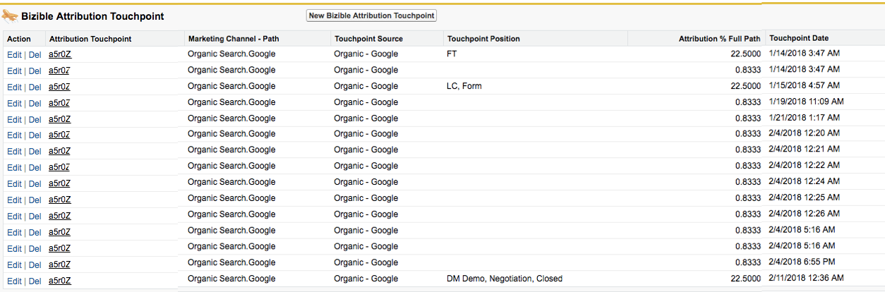

# Por que você nunca deve excluir touchpoints {#why-you-should-never-delete-touchpoints}

Se você descobrir que há um ponto de contato em uma oportunidade à qual está sendo atribuído um crédito de atribuição incorretamente, entre em contato com o Gerente de conta para determinar as próximas etapas. Nessas situações, recomendamos usar o recurso de supressão de ponto de contato do Comprador para remover o ponto de contato do SFDC e do painel de ROI. O gerente da sua conta pode ajudar a criar essas regras. Não exclua manualmente esses pontos de contato por conta própria.

A variável [!DNL Marketo Measure] O sistema de processamento não registrará se um ponto de contato foi excluído manualmente do SFDC. A partir de hoje, não há acionador que sinalize ao nosso sistema para ajustar os dados. [!DNL Marketo Measure] não enviará automaticamente outro ponto de contato para substituir o que foi excluído, nem reatribuirá a posição do ponto de contato ou a atribuição ao ponto de contato subsequente.

Quando um ponto de contato é excluído, ele cria um buraco nos dados de atribuição. Normalmente, isso se manifestará nos pontos de contato de atribuição em uma Oportunidade. Na imagem abaixo, o ponto de contato que teria recebido o toque de Criação da oportunidade foi excluído. Como resultado, essa oportunidade não tem o ponto de contato do OC e a porcentagem de atribuição para essa Opp não somará 100%.

Se os pontos de contato tiverem sido excluídos do SFDC, entre em contato com [[!DNL Marketo Support]](https://nation.marketo.com/t5/support/ct-p/Support){target="_blank"} para solicitar uma reimportação dos seus dados.
