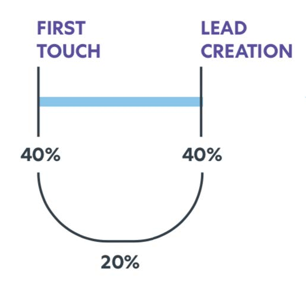

# Integração com o LinkedIn {#linkedin-integration}

## Visão geral {#overview}

A integração do [!DNL Marketo Measure] com o LinkedIn é dividida em duas partes:

Conteúdo Patrocinado: A integração de Conteúdo Patrocinado permite que o [!DNL Marketo Measure] marque URLs de destino em [!DNL LinkedIn] anúncios, o que permite que o [!DNL Marketo Measure] acompanhe um usuário por toda a sua jornada de ponto de contato e mapeie a atividade de volta para a Campanha [!DNL LinkedIn] e Creative específicas. Isso fornece informações aos clientes sobre o ROI da atividade [!DNL LinkedIn].

Lead Gen Forms: por meio da integração com o Lead Gen Forms do LinkedIn, a Marketo Measure transforma o insight em formulários que foram enviados por meio da plataforma LinkedIn. Esses preenchimentos de formulário são comparados com os clientes em potencial da sua instância do CRM ou do [!DNL Marketo Engage] para que eles sejam qualificados para atribuição. Com o insight no Campaign, Creative e Form que ajudaram a gerar os formulários, as equipes podem otimizar ainda mais seus gastos com marketing e anúncios do LinkedIn.

## Disponibilidade {#availability}

Disponível para todos os usuários.

## Requisitos {#requirements}

### Funções do gerente de campanha

Para que [!DNL Marketo Measure] possa baixar dados de custo de Anúncios e Dados de Anúncios, você deve ter uma das seguintes funções no Gerenciador de Campanhas:

* Administrador de Cobrança
* Gerenciador de conta
* Gerente de campanha

Saiba mais: [Funções e funções de usuário no Gerenciador de Campanha](https://www.linkedin.com/help/lms/answer/a425731/user-roles-and-functions-in-campaign-manager).

### Funções de administrador de mídia paga

Para que [!DNL Marketo Measure] possa Criar/Atualizar Criativos Patrocinados, você deve ter uma das seguintes funções de Administrador de Mídia Paga:

* Pôster de conteúdo patrocinado
* Gerente líder do Forms Manager

Saiba mais: [Funções de administrador da página do LinkedIn](https://www.linkedin.com/help/linkedin/answer/4783/linkedin-page-admin-roles-overview).

Existem outras funções do [!DNL LinkedIn] que **não** exigem para a nossa integração. Geralmente, essas funções são confundidas com as funções necessárias. Portanto, observe que há uma diferença!

### Funções do administrador da página

Para que [!DNL Marketo Measure] possa baixar/integrar clientes potenciais de formulários de geração de clientes potenciais, você deve ter a seguinte função de Administrador de Página:

* Super Admin

Saiba mais: [Funções de administrador da página do LinkedIn](https://www.linkedin.com/help/linkedin/answer/4783/linkedin-page-admin-roles-overview).

## Tipos de anúncios do LinkedIn {#linkedin-ad-types}

[!DNL Marketo Measure] oferecerá suporte a:

O Conteúdo Patrocinado permite que você forneça conteúdo ao feed [!DNL LinkedIn] de membros, além daqueles que estão acompanhando sua empresa. O Conteúdo Patrocinado pode ser direcionado para um público-alvo específico e pode ajudar os anunciantes a alcançar membros do [!DNL LinkedIn] sempre que e onde estiverem envolvidos na plataforma [!DNL LinkedIn] em computadores desktop, dispositivos móveis e tablets. O conteúdo patrocinado com o Forms da geração de clientes potenciais é compatível.

Os tipos de formatos de anúncio de Conteúdo Patrocinado com suporte do [!DNL Marketo Measure] são Anúncios de Imagem Única e Anúncios de Vídeo (por meio do Lead Gen Forms). Devido à complexidade do esquema, não oferecemos suporte aos anúncios do Carrossel.

[!DNL Marketo Measure] não oferece suporte a mensagens patrocinadas, anúncios de texto ou anúncios dinâmicos.

>[!TIP]
>
>Para qualquer uma de suas Campanhas/Gastos originados de uma fonte de Conteúdo não Patrocinada (como Tipo de Campanha de &quot;Anúncio de Texto&quot; ou &quot;InMail Patrocinado&quot;), [!DNL Marketo Measure] _não_ suporta inerentemente o rastreamento desses Tipos de Campanha. Se você quiser rastrear os gastos com campanhas como essas junto com seus gastos com &quot;conteúdo patrocinado&quot;, certifique-se de usar nosso CSV de gastos de marketing para registrar manualmente esse gasto.

## Como funciona: conteúdo patrocinado {#how-it-works-sponsored-content}

>[!NOTE]
>
>Antes da primeira utilização, esta configuração de recurso deve ser habilitada navegando até [!DNL Marketo Measure] [!UICONTROL Configurações] > [!UICONTROL Integrações] > [!UICONTROL Anúncios] > [!UICONTROL Habilitar o Forms de Geração de Cliente Potencial do LinkedIn].

### [!DNL LinkedIn's] Requisitos exclusivos de marcação automática

O [!DNL Marketo Measure] pode ajudar a monitorar o desempenho da campanha [!DNL LinkedIn] marcando automaticamente suas páginas de aterrissagem.

[!DNL Marketo Measure] pesquisará por criações com um compartilhamento LinkedIn exclusivo e adicionará um parâmetro `?_bl={creativeId}` ao final dele.

### Copiando compartilhamentos

Com essa integração do [!DNL Marketo Measure/LinkedIn], pedimos que os clientes não copiem/clonem/dupliquem criações existentes. Se compartilhamentos forem encontrados e detectados para serem usados apenas em uma Creative, o [!DNL Marketo Measure] poderá marcar o compartilhamento como está sem precisar recriar Criações ou Compartilhamentos, e todo o histórico de anúncios (impressões, cliques, compartilhamentos) permanecerá.

Assim que for detectado que um Compartilhamento está compartilhado em várias criações, o [!DNL Marketo Measure] terá que executar um processo de pausa, cópia e marcação novamente para criar um conjunto exclusivo. O [!DNL Marketo Measure] pausará e arquivará os anúncios ao vivo e, portanto, apagará o Histórico de Anúncios, incluindo impressões, cliques e compartilhamentos sociais, para marcar tudo automaticamente e tudo corretamente.

A partir de agora, o [!DNL Marketo Measure] recomenda que você não duplique nenhum compartilhamento [!DNL LinkedIn] e mantenha todos os compartilhamentos e criações o mais exclusivos possível para que possamos simplesmente adicionar nosso rastreamento sem ter que apagar o Histórico de Anúncios.

### URLs encurtados

O motivo da etapa extra é porque o LinkedIn permite que as URLs de destino sejam uma URL mais curta (bit.ly, goog.le etc.), o que significa que [!DNL Marketo Measure] não vê a URL longa e resolvida e [!DNL Marketo Measure] precisa adicionar parâmetros de rastreamento a uma URL resolvida. Para contornar esse problema, o [!DNL Marketo Measure] procura URLs encurtadas antes de recriar um anúncio, expande a URL e, em seguida, cria o novo anúncio com a URL resolvida e todos os seus parâmetros, permitindo que o [!DNL Marketo Measure] adicione marcas. A criação de um novo anúncio apagará o histórico de anúncios (impressões, cliques, compartilhamentos), daí a necessidade de permissão para marcar URLs encurtados.

Se você usar URLs encurtados intensamente, isso poderá afetar seriamente suas criações. Recomendamos que você não use mais URLs encurtadas para que [!DNL Marketo Measure] possa marcar as páginas de aterrissagem sem ter que criar novos anúncios e apagar o Histórico de Anúncios.

### O processo

Vamos começar com alguns exemplos. Digamos que temos...

Creative A : Share 123\
Creative B : Compartilhamento 234\
Creative C : Share 234\
Creative D : Share 234

`1)` [!DNL Marketo Measure] primeiro verificará todas as Campanhas, Ações e Compartilhamentos com status &quot;Ativo&quot;. [!DNL Marketo Measure] não marcará anúncios pausados, arquivados ou cancelados. Se um anúncio foi pausado e configurado como [!UICONTROL ativo], ele será marcado quando estiver ativo novamente. Se encontrarmos um Compartilhamento exclusivo, o que significa que ele não é usado em várias Criações ou Campanhas (por exemplo, Creative A : Share 123), o [!DNL Marketo Measure] adicionará nosso parâmetro personalizado `>> ?_bl={creativeId}` à URL de compartilhamento.

`2)` Agora, se o Compartilhamento tiver sido compartilhado e tiver perdido sua exclusividade (por exemplo, Creative B: Compartilhamento 234 e Creative C: Compartilhamento 234 e Creative D: Compartilhamento 234), o [!DNL Marketo Measure] pausará e arquivará todos os elementos de criação semelhantes (que seriam Creative B, Creative C e Creative D).

O `3)` [!DNL Marketo Measure] criará três novas criações, Creative E, Creative F e Creative G, que copiam o conteúdo do Creative B, que está arquivado.

O `4)` [!DNL Marketo Measure] também criará três novos compartilhamentos, Share 345, Share 456 e Share 567, que copiam o conteúdo do Share 234, exceto que ele terá sua própria marcação `?_bl` exclusiva.

`5)` [!DNL Marketo Measure] terá que verificar regularmente se os compartilhamentos não são compartilhados e, se forem compartilhados, reiniciaremos o processo na etapa 2 acima.

>[!NOTE]
>
>A implementação disso significará que nossos clientes perderão o histórico de anúncios do Creative B: Share 234, Creative C: Share 234 e Creative D: Share 234 porque agora ele é recriado com o Creative E: Share 345, Share F: Share 456 e Creative G: Share 567, respectivamente.

## Como funciona: líder da geração Forms {#how-it-works-lead-gen-forms}

O [!DNL Marketo Measure] pode ajudar a monitorar o desempenho da campanha [!DNL LinkedIn] marcando automaticamente suas páginas de aterrissagem.

[!DNL Marketo Measure] pesquisará por criações com um compartilhamento LinkedIn exclusivo e adicionará um parâmetro `?_bl={creativeId}` ao final dele.

Por meio da API de formulário de anúncio [!DNL LinkedIn's] e da API de resposta de formulário de anúncio, podemos coletar dados de envio de formulário para uma conta de anúncio e associar o endereço de email a um cliente potencial do CRM ou Marketo.

Os formulários do LinkedIn podem conter vários endereços de email. Quando baixamos respostas de formulário, procuraremos endereços de email com a seguinte prioridade: email comercial, Endereço de email (campo de formulário principal) ou campos personalizados com um valor de email válido.

Independentemente do status do Campaign ou do Creative, todas as respostas do formulário resultarão em um ponto de contato. [!DNL Marketo Measure] tem uma restrição de lookback de 90 dias, portanto, [!DNL Marketo Measure] não pode acessar respostas de formulário com mais de 90 dias, mas quanto mais tempo a integração [!DNL Marketo Measure] e [!DNL LinkedIn] estiver habilitada, mais pontos de contato do Formulário de Geração de Cliente Potencial estarão visíveis até [!DNL Marketo Measure].

>[!NOTE]
>
>Os custos do LinkedIn ainda são baixados como parte das Campanhas de conteúdo patrocinadas.

Antes de a Integração do Forms com a Geração líder do LinkedIn existir, era prática comum que os clientes enviassem seus envios de formulários para um Programa da Marketo e/ou Campanha de CRM para rastrear os formulários e receber atribuição nessas atividades. [!DNL Marketo Measure] Depois que a configuração Lead Gen Forms estiver ativada, queremos garantir que esses envios de formulários não sejam contados duas vezes. Verifique o seguinte:

* O campo &quot;Habilitar pontos de contato do comprador&quot; no objeto CRM está definido como &quot;Nenhum&quot; ou &quot;Excluir todos os membros da campanha&quot;
* Atualizar qualquer programa do Marketo ou regra de atividade do Marketo relacionada
* Atualizar todas as regras de Campanha do CRM relacionadas

>[!NOTE]
>
>A API do LinkedIn tem uma limitação de lookback de 90 dias; portanto, se você estiver usando regras do Marketo ou do CRM, é recomendável definir a data de término da regra como 90 dias antes da data em que você habilitou a integração no [!DNL Marketo Measure].

## Detalhes do Touchpoint {#touchpoint-details}

Depois que [!DNL Marketo Measure] marcar com êxito sua página de aterrissagem no criativo do LinkedIn, você poderá exibir os dados dos anúncios resolvidos no ponto de contato. Este é o mapeamento de valores de dados que você deve esperar:

<table> 
 <colgroup> 
  <col> 
  <col> 
 </colgroup> 
 <tbody> 
  <tr> 
   <th style="width:30%">Campo do ponto de contato</th> 
   <th>Valor da amostra</th> 
  </tr> 
  <tr> 
   <td>ID do anúncio</td>
   <td>84186224</td>
  </tr> 
  <tr> 
   <td>Conteúdo do anúncio</td>
   <td>copy-1-image-2-man 95% dos profissionais de marketing da #B2B consideram a estratégia de criação de demanda bem-sucedida. Saiba mais: [!DNL https]://lnkd.in/jgdi50vKrgv</td>
  </tr> 
  <tr> 
   <td>ID do grupo de anúncios</td>
   <td>(em branco)</td>
  </tr> 
  <tr> 
   <td>Nome do grupo de anúncios</td>
   <td>(em branco)</td>
  </tr> 
  <tr> 
   <td>ID da campanha publicitária</td>
   <td>138949954</td>
  </tr> 
  <tr> 
   <td>Nome da campanha publicitária</td>
   <td>SU - Contas COM - Habilidades por demanda</td>
  </tr> 
  <tr> 
   <td>URL de Destino do Anúncio <b>*</b></td>
   <td>https://www.adobe.com/marketing-attribution-for-demand-generation-leaders?_bl=84186217</td> 
  </tr> 
  <tr> 
   <td>URL do formulário</td> 
   <td>info.bizible.com/demo</td> 
  </tr> 
  <tr> 
   <td>URL do formulário - Bruto</td> 
   <td>info.bizible.com/demo</td> 
  </tr> 
  <tr> 
   <td>ID da palavra-chave</td> 
   <td>(em branco)</td> 
  </tr> 
  <tr> 
   <td>Tipo de Correspondência de Palavra-chave</td> 
   <td>(em branco)</td> 
  </tr> 
  <tr> 
   <td>Página de destino</td> 
   <td>https://www.adobe.com/marketing-attribution-for-demand-generation-leaders</td> 
  </tr> 
  <tr> 
   <td>Página de aterrissagem - bruta</td> 
   <td>https://www.adobe.com/marketing-attribution-for-demand-generation-leaders?_bl=84186217</td> 
  </tr> 
  <tr> 
   <td>Canal de marketing</td> 
   <td>Social pago</td> 
  </tr> 
  <tr> 
   <td>Canal de marketing - Caminho</td> 
   <td>Social.LinkedIn pago</td> 
  </tr> 
  <tr> 
   <td>Meio</td> 
   <td>"cpc" ou "Formulário de geração de leads"</td> 
  </tr> 
  <tr> 
   <td>Página de indicação</td> 
   <td>www.linkedin.com/</td> 
  </tr> 
  <tr> 
   <td>Página do referenciador - Bruta</td> 
   <td>www.linkedin.com/</td> 
  </tr> 
  <tr> 
   <td>Frase de pesquisa</td> 
   <td>(em branco)</td> 
  </tr> 
  <tr> 
   <td>Tipo de touchpoint</td> 
   <td>Formulário da Web</td>
  </tr> 
  <tr> 
   <td>Origem do touchpoint</td>
   <td>LinkedIn</td>
  </tr> 
 </tbody> 
</table>

**&#42;** _O campo &quot;URL de destino do anúncio&quot; só é preenchido para Conteúdo Patrocinado. Ele não está populado para o Forms da Geração de Clientes Potenciais._

 

## Custos {#costs}

Como o [!DNL Marketo Measure] tem integração direta com o [!DNL LinkedIn], baixamos os gastos gravados para cada Campanha e Creative todos os dias. Não há mais necessidade de um cliente relatar os gastos de [!DNL LinkedIn] no aplicativo [!DNL Marketo Measure].

Assim como em outras integrações de anúncios, o [!DNL Marketo Measure] definiu uma regra de canal de marketing para colocar todas as [!DNL LinkedIn] campanhas, criações e custos. Para usar a regra, o cliente desejará inserir uma nova linha para seus esforços de [!DNL LinkedIn] Pagos. Ele pode ser um canal novo ou existente. Na coluna Referenciador, use a definição &quot;[[!DNL LinkedIn] Pago]&quot; que [!DNL Marketo Measure] definiu como qualquer ponto de contato com uma marca [!DNL Marketo Measure].

## [!DNL Marketo Measure] Descobrir {#marketo-measure-discover}

Foram feitos alguns aprimoramentos no [!DNL Marketo Measure] Discover para oferecer suporte aos relatórios do Lead Gen Forms.

**Placa de mídia paga**

Bloco Forms da geração de clientes potenciais: novo bloco que inclui a contagem de preenchimentos de formulário do LinkedIn. O drill-through dessa contagem exibirá a ID da atividade, a data do formulário, o nome do formulário e o endereço de email.

**Quadro de Caminho de Compromisso**

Jornada de eventos: inclui o tipo de evento &quot;Atividade&quot; e o &quot;Formulário de geração de lead&quot; médio para formulários que vêm por meio da integração. A exibição de drill-through inclui detalhes do Campaign, Creative e Formulário.

## Perguntas frequentes sobre conteúdo patrocinado {#sponsored-content-faq}

**O que é um Compartilhamento Escuro?**

Um compartilhamento escuro é uma publicação em que ele nunca é postado na página da empresa e é criado imediatamente e adicionado diretamente como uma Creative. Para que os Criativos criados por [!DNL Marketo Measure] não apareçam no topo da página de uma empresa e sejam promovidos novamente, os compartilhamentos escuros são usados para que possam ser iniciados nos bastidores.

**Quais Status [!DNL Marketo Measure] realmente marca?**

Há quatro status diferentes em uma Campanha do [!DNL LinkedIn] e no Creative: Ativo, Pausado, Arquivado e Cancelado. Marcamos somente Campanhas e Criativas que estão Ativas. Marcar outros status os torna Ativos novamente. [!DNL Marketo Measure] não marcará Campanhas em Pausa, Arquivadas ou Canceladas ou Criação, mas retomará a marcação se o status for alterado para Ativo.

**Qual é o valor que [!DNL Marketo Measure] está usando para marcar?**

Ao final da URL de destino, [!DNL Marketo Measure] está adicionando o parâmetro `&_bl={creativeId}`, onde `{creativeId}` é a Creative Id do LinkedIn. Com a Creative Id, [!DNL Marketo Measure] também pode determinar a Campaign Id, pois [!DNL LinkedIn] tem uma estrutura de anúncios muito básica, já que cada Creative só pode pertencer a uma Campanha.

**O que acontece com meu criativo antigo depois que o [!DNL Marketo Measure] cria uma nova versão dele?**

Quando [!DNL Marketo Measure] recria um Compartilhamento e o coloca em uma nova Creative, o Creative antigo é arquivado. Também é por isso que o [!DNL Marketo Measure] não marcará Campanhas ou Criativas arquivadas; caso contrário, ele fará um loop com [!DNL Marketo Measure] tentando marcá-las indefinidamente.

**Por que a URL de destino do anúncio criado não corresponde ao meu anúncio original?**

[!DNL Marketo Measure] precisa adicionar os parâmetros de rastreamento a uma URL resolvida, mas a URL apresentada na API pode ser uma URL mais curta, sem todos os parâmetros presentes. Para contornar esse problema, [!DNL Marketo Measure] procura URLs encurtadas antes de recriar uma adição, resolve-a e cria o novo anúncio com a URL resolvida e todos os seus parâmetros, permitindo que [!DNL Marketo Measure] adicione marcas.

**Você está marcando todos os meus anúncios? Não vejo o parâmetro bl em todas as minhas páginas de aterrissagem?**

Observamos que alguns profissionais de marketing colocarão um link de imagem na URL de destino, que [!DNL Marketo Measure] não pode marcar. Portanto, pesquisamos a URL no conteúdo do anúncio. Se [!DNL Marketo Measure] tiver permissões para marcar URLs encurtadas, expandiremos a URL e marcaremos essa URL, mas devido à estrutura de cópia do LinkedIn, ela é encurtada automaticamente no texto. A tag conterá o URL encurtado do LinkedIn, que aparecerá no campo Conteúdo de anúncio do ponto de contato em vez de no campo Página inicial - Raw.

**Não, alguém da minha equipe clonou acidentalmente um compartilhamento. Posso pausar?**

Não se preocupe. O [!DNL Marketo Measure] verificará programaticamente se há compartilhamentos que não são mais exclusivos, o que significa que ele já foi copiado para uma Creative diferente. Depois que essa cópia for detectada, o [!DNL Marketo Measure] seguirá o fluxo normal para marcar e criar novos anúncios.

**Meu anúncio estava com revisão pendente anteriormente. Por que a revisão está pendente novamente depois que [!DNL Marketo Measure] a marcou?**

O LinkedIn exige que todos os anúncios criados ou modificados passem pelo processo normal de segurança antes de serem publicados. O [!DNL Marketo Measure] tenta interceptar o anúncio o mais rápido possível, pois verifica novos anúncios a cada 6 horas, mas com a etapa adicional [!DNL LinkedIn's], ele pode atrasar a inicialização em algumas horas.

**Há duas URLs no meu anúncio. Qual é marcado?**

Ambos. A integração do [!DNL Marketo Measure] permite marcar a URL de destino a partir da imagem de click-through no anúncio, mas também atualiza automaticamente a URL reduzida na descrição do anúncio.

**Conectei minha conta [!DNL LinkedIn ads]. Por que o [!DNL Marketo Measure] não está marcando meus links?**

O usuário conectado [!DNL LinkedIn] precisa ter acesso de edição adequado, o que significa que o usuário precisa ser um Gerente de conta, Gerente de campanha ou Gerente do Creative.

**Como saber se meu criativo será copiado? Posso ver se meus criadores estão usando o mesmo compartilhamento?**

A ID de compartilhamento não é fornecida em um relatório do [!DNL LinkedIn], portanto, não há uma maneira clara e óbvia de verificar os mapeamentos da criação para o compartilhamento. Se você suspeitar que um criativo seja uma cópia, verifique manualmente abrindo o anúncio no seu gerente de campanha do [!DNL LinkedIn]. Isso abrirá o anúncio em uma nova guia e você poderá encontrar a ID do compartilhamento no URL.

## Perguntas frequentes sobre a geração líder de Forms {#lead-gen-forms-faq}

**Qual é o custo deste aprimoramento?**

Esta oferta está incluída em qualquer assinatura paga do [!DNL Marketo Measure].

**A integração é retroativa?**

Sim, baixaremos respostas históricas de formulário de anúncio do LinkedIn, embora estejamos limitadas à janela de retrospectiva de 90 dias. Quanto mais tempo a integração do [!DNL Marketo Measure] e do LinkedIn estiver habilitada, mais pontos de contato do Formulário de Geração de Clientes Potenciais ficarão visíveis por meio do [!DNL Marketo Measure].

Não há opção para definir uma data específica para o download, mas você pode, opcionalmente, definir regras de exclusão de ponto de contato se houver pontos de contato que você precise suprimir.

**Isso será ativado automaticamente se eu já estiver usando a integração de anúncios do LinkedIn [!DNL Marketo Measure]?**

Não, não começaremos automaticamente a baixá-lo para todos os clientes, mas é uma opção muito simples para habilitar esse recurso nas configurações.

**Os dados do formulário estão disponíveis?**

Os dados do formulário estão disponíveis por meio da Descoberta [!DNL Marketo Measure], incluindo a ID e o Nome do Formulário. Os detalhes do formulário ainda não estão disponíveis nos objetos de ponto de contato no CRM.

**O que acontece com qualquer cliente em potencial [!DNL LinkedIn] que tenha sido sincronizado anteriormente com Programas do Marketo ou Campanhas do CRM?**

É recomendável ajustar quaisquer regras [!DNL Marketo Measure] para gerar pontos de contato a partir desses Programas ou Campanhas específicos para evitar duplicação. A API do LinkedIn tem uma limitação de lookback de 90 dias; portanto, se você estiver usando regras do Marketo ou do CRM, é recomendável definir a data de término da regra como 90 dias antes da data em que você habilitou a integração no [!DNL Marketo Measure]. A partir deste ponto, [!DNL Marketo Measure] poderá baixar esses clientes em potencial para você com mais insight e detalhes.

**Há alguma marcação automática ou rastreamento envolvido?**

Não, isso é diferente de outras [!DNL Marketo Measure] integrações. Em vez de modificar a página de aterrissagem (já que não há nenhum clique na página de aterrissagem), estamos baixando apenas as informações relevantes do LinkedIn e as tratando como atividades no [!DNL Marketo Measure].
