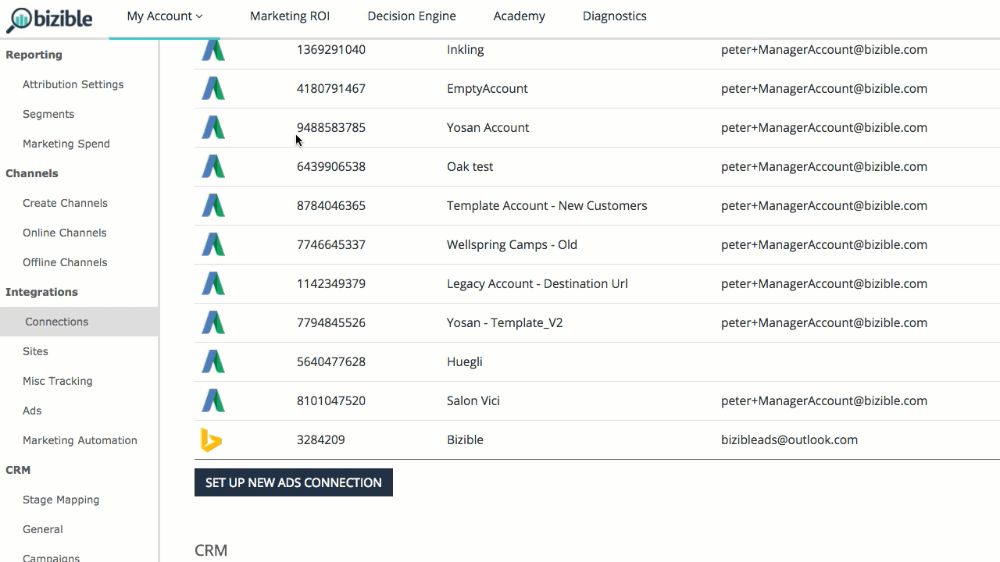

# API [!DNL Facebook] {#facebook-api}

## Introdução {#introduction}

Semelhante às nossas integrações AdWords e [!DNL Bing Ads], nossa integração [!DNL Facebook] faz duas ações fundamentais:

* Marcar automaticamente todos os anúncios de [!DNL Facebook] com um parâmetro [!DNL Marketo Measure] (_bf)
* Baixar informações sobre custos de anúncios em todos os anúncios ativos do Facebook

## Como configurar a integração do [!DNL Facebook] {#how-to-configure-the-facebook-integration}

Quanto à instalação, há sete etapas a serem concluídas no aplicativo [!DNL Marketo Measure].

1. Navegue até [experience.adobe.com/marketo-measure](https://experience.adobe.com/marketo-measure){target="_blank"} e faça logon.
1. Em Minha conta, selecione **[!UICONTROL Configurações]**.
1. Em Integrações, selecione **[!UICONTROL Conexões]**.
1. Selecione **[!UICONTROL Configurar nova conexão com anúncios]** e uma janela pop-up será exibida. Selecione **[!UICONTROL Facebook]** e faça logon usando suas credenciais da Facebook.

   >[!NOTE]
   >
   >A pessoa conectando a conta [!DNL Facebook Ads] precisa ser um administrador dentro da conta [!DNL Facebook Ads].

1. Depois que o [!DNL Marketo Measure] estiver conectado à sua conta do Facebook, clique no ícone de lápis ao lado da conta.
1. Nesta exibição, mover a opção &quot;Marcação automática?&quot; alternar para &#39;Sim&#39;. Em seguida, marque a caixa de seleção localizada na seção [!UICONTROL Saiba mais] para concordar com os termos e as condições. Verifique se a opção [!UICONTROL Marcação automática] ainda está definida como &#39;[!UICONTROL Sim]&#39;.

## Conexão com a conta {#connecting-the-account}

## Habilitando a marcação automática {#enabling-autotagging}

>[!NOTE]
>
>Se você ativar a marcação automática, redefiniremos o histórico de conversão e a prova social de todos os anúncios marcados. É altamente recomendável [exportar estes dados como um CSV](https://www.facebook.com/business/help/205067636197240) antes de habilitar a marcação automática.

Após habilitar a integração, o [!DNL Marketo Measure] começará a baixar o custo do nível de anúncio no Painel [!DNL Marketo Measure Marketing ROI].

Para que a integração funcione corretamente, é necessário habilitar a marcação automática na conta do [!DNL Facebook]. Isso permitirá que nosso sistema adicione um parâmetro _bf em todos os links de anúncios. Este processo adicionará o novo parâmetro além de qualquer outro parâmetro de rastreamento que você já tenha adicionado aos seus anúncios [!DNL Facebook].

## Mapeamento de campos {#field-mapping}

<table> 
 <colgroup> 
  <col> 
  <col> 
 </colgroup> 
 <tbody> 
  <tr> 
   <th>
<strong>Campo do ponto de contato</strong>
</th> 
   <th>
<strong>Valor</strong>
</th> 
  </tr> 
  <tr> 
   <td>
ID da campanha publicitária
</td> 
   <td>
[[!DNL Facebook] ID da campanha]
</td> 
  </tr> 
  <tr> 
   <td>
Nome da campanha publicitária 
</td> 
   <td>
[[!DNL Facebook] Nome da campanha] ou [utm_campaign], se fornecido
</td> 
  </tr> 
  <tr> 
   <td>
ID do grupo de anúncios
</td> 
   <td>
[[!DNL Facebook] Id Do Conjunto De Anúncios]
</td> 
  </tr> 
  <tr> 
   <td>
Nome do grupo de anúncios
</td> 
   <td>
[[!DNL Facebook] Nome do Conjunto de Anúncios]
</td> 
  </tr> 
  <tr> 
   <td>
Origem do touchpoint
</td> 
   <td>
"[!DNL Facebook]" ou [utm_source], se fornecido
</td> 
  </tr> 
  <tr> 
   <td>
Meio
</td> 
   <td>
"Social" ou [utm_medium] se fornecido
</td> 
  </tr> 
  <tr> 
   <td>
ID do anúncio ou Creative_Unique_Id (Data Warehouse)
</td> 
   <td>
[ID personalizada gerada de utm_content]
</td> 
  </tr> 
  <tr> 
   <td>
Conteúdo do anúncio ou Creative_Name (Data Warehouse)
</td> 
   <td>
[utm_content] se fornecido
</td> 
  </tr> 
  <tr> 
   <td>
Texto de palavra-chave ou Nome_de_palavra-chave (Data Warehouse)
</td> 
   <td>
[utm_term] se fornecido
</td> 
  </tr> 
  <tr> 
   <td>
Ad_Unique_Id (Data Warehouse)
</td> 
   <td>
[[!DNL Facebook] Id Do Anúncio]
</td> 
  </tr> 
  <tr> 
   <td>
Ad_Name (Data Warehouse)
</td> 
   <td>
[[!DNL Facebook] Ad Name]
</td> 
  </tr> 
  <tr> 
   <td>
Palavra-Chave_Unique_Id (Data Warehouse)
</td> 
   <td>
[ID personalizada gerada a partir de utm_term]
</td> 
  </tr> 
  <tr> 
   <td>
Ad_Provider (Data Warehouse)
</td> 
   <td>
[!DNL Facebook]
</td> 
  </tr> 
  <tr> 
   <td>
Account_Unique_ID (Data Warehouse)
</td> 
   <td>
[[!DNL Facebook] Número da conta]
</td> 
  </tr> 
  <tr> 
   <td>
Account_Name (Data Warehouse)
</td> 
   <td>
[[!DNL Facebook] Nome da Conta]
</td> 
  </tr> 
 </tbody> 
</table>

## Perguntas frequentes {#faq}

**P: Quais [!DNL Facebook] anúncios são aceitos pelo [!DNL Marketo Measure]?**

R: Carrossel, Imagem única. Não há vídeo, apresentação de slides ou coleção no momento.

**P: O que é prova social?**

R: Prova social é o envolvimento visível, como curtidas, cliques, comentários e compartilhamentos.

**P: O que acontece quando [!DNL Marketo Measure] marca o Anúncio?**

R: [!DNL Facebook] não permite que anúncios sejam editados, portanto [!DNL Marketo Measure] precisa excluir o criativo, que contém o URL de Destino, e em seguida recriar o anúncio com os novos parâmetros.

**P: Por que o [!DNL Marketo Measure] atualiza todos os [!DNL Facebook] anúncios?**

R: O processo [!DNL Marketo Measure] é marcar todos os anúncios caso eles sejam reativados.

**P: Qual permissão é necessária para o usuário conectado?**

R: ads_management, email

**P: Quanto tempo pode levar para importar dados de gastos?**

A: 1 hora

**P: Quanto tempo pode levar para importar dados de anúncios?**

A: 4 horas
