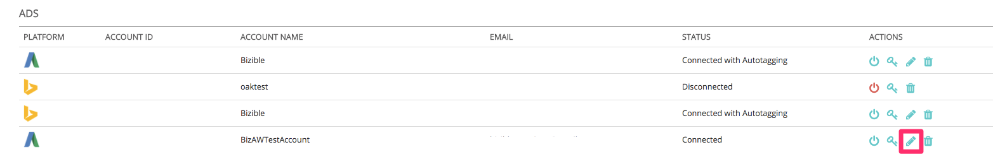

# Plataformas de anúncios integradas {#integrated-ad-platforms}

[!DNL Marketo Measure] tem conexões de API com o Google AdWords, Microsoft BingAds, [!DNL Facebook] Anúncios e DoubleClick Campaign Manager. Por meio dessas conexões de API, [!DNL Marketo Measure] O é capaz de extrair dados facilmente e enviá-los para o CRM junto com o aplicativo Comprador externo. Não é necessário fazer upload manual de custos ou dados. Em vez disso, suas contas precisam apenas estar conectadas e autorizadas ao [!DNL Marketo Measure] aplicativo. [!DNL Marketo Measure] baixará automaticamente seus custos de marketing das plataformas e os carregará na [!DNL Marketo Measure] aplicativo. Se você optar por habilitar a marcação automática para o AdWords, BingAds ou [!DNL Facebook] Anúncios, [!DNL Marketo Measure] O anexará automaticamente os parâmetros aos URLs dos anúncios.

## Como conectar plataformas de publicidade {#how-to-connect-ad-platforms}

Antes de entrar em detalhes específicos de cada plataforma, veremos como conectar qualquer uma dessas contas ao [!DNL Marketo Measure]. Primeiro logon na [!DNL Marketo Measure] e navegue até o **[!UICONTROL Configurações]** opção no campo **[!UICONTROL Minha conta]** no canto superior esquerdo da tela. Em seguida, selecione **[!UICONTROL Conexões]** no **[!UICONTROL Integrações]** à esquerda.

Como mostrado na imagem abaixo, você verá um botão para configurar novas conexões de anúncios.

Depois de clicar no botão [!UICONTROL Configurar nova conexão de anúncios] , uma janela (mostrada abaixo) será exibida com quatro anúncios [!UICONTROL conectar]tipos de íons. Clique em conectar e outra janela será exibida solicitando credenciais. Insira as credenciais e clique em [!UICONTROL authorize] para conectar a conta ao [!DNL Marketo Measure].

## Google AdWords {#google-adwords}

Ao criar seus anúncios no [!DNL Google AdWords]É recomendável marcar suas campanhas de uma das três formas a seguir: marcação manual, marcação automática ou criação de um Modelo de rastreamento. Marcar manualmente o URL do AdWords depende de você definir e adicionar os parâmetros ao final dos URLs dos anúncios. A marcação manual permite que qualquer plataforma que não seja da Google leia facilmente os dados coletados pelos parâmetros.

O modelo de rastreamento é uma ferramenta que a Google fornece para adicionar o que chama de parâmetros ValueTrack. Elas funcionam da mesma maneira que as UTMs e outros parâmetros de marcação.

## O que acontece quando a marcação automática está ativada {#what-happens-when-auto-tagging-is-enabled}

[!DNL Marketo Measure] Pesquisas por modelos de rastreamento no seu [!DNL AdWords] conta:

* *Opção A*: modelo de rastreamento foi encontrado. [!DNL Marketo Measure] O adiciona os parâmetros ao modelo.
* *Opção B*: redirecionamento de terceiros encontrado. Se um redirecionamento de terceiros for encontrado no Modelo de rastreamento, [!DNL Marketo Measure] O não pode realizar nenhuma ação. Será necessário adicionar manualmente a variável [!DNL Marketo Measure] para o sistema de terceiros. Um exemplo de redirecionamento por terceiros seria uma ferramenta de gerenciamento de ofertas, como Kenshoo ou Marin. Saiba mais sobre [as ferramentas de gerenciamento de lances afetam [!DNL Marketo Measure]](/help/api-connections/utilizing-marketo-measures-api-connections/how-bid-management-tools-affect-marketo-measure.md){target="_blank"}.

* *Opção C*: nenhum modelo de rastreamento foi encontrado. [!DNL Marketo Measure] fará a varredura de todos os URLs de destino do anúncio para a [!DNL Marketo Measure] parâmetros. Com base na verificação, se:
   * Parâmetros encontrados: a configuração está concluída!
   * Parâmetros não encontrados: [!DNL Marketo Measure] anexará seus parâmetros ao final dos URLs de destino do anúncio. [!DNL Marketo Measure] O anexa novos anúncios duas horas após sua criação. Lembre-se de que os parâmetros não serão adicionados a um modelo.

Saiba mais sobre [[!DNL AdWords] funcionalidade de marcação automática](/help/api-connections/utilizing-marketo-measures-api-connections/understanding-marketo-measure-adwords-tagging.md){target="_blank"}.

## Como ativar [!DNL Marketo Measure] Marcação automática para o Adwords {#how-to-enable-marketo-measure-auto-tagging-for-adwords}

Antes de ativar [!DNL Marketo Measure] marcação automática, **verifique se você tem um modelo de rastreamento ativado no nível de Conta, Campanha ou Grupo de publicidade na sua conta do Adwords. Isso é necessário para qualquer conta do Adwords que tenha [!DNL Marketo Measure] marcação automática ativada.** A ativação de um modelo de rastreamento impede qualquer perda de dados no histórico de desempenho do anúncio. Observe que ativar os modelos de rastreamento no nível de Palavra-chave, Link do site ou Anúncio fará com que o anúncio passe pelo processo de revisão e aprovação e poderá reiniciar o histórico de desempenho dos seus anúncios. Se não houver nenhum modelo de rastreamento ativado, [!DNL Marketo Measure] anexará a [!DNL Marketo Measure] rastrear parâmetros diretamente no &quot;URL final&quot; do anúncio, o que também pode resultar na perda de dados do histórico do anúncio.

Depois que você tiver um modelo de rastreamento em vigor, siga as instruções abaixo para ativar [!DNL Marketo Measure] Automarcação. Nota: [!DNL Marketo Measure] O também adicionará tags automáticas a todos os anúncios pausados em sua conta.

1. Faça logon no [!DNL Marketo Measure] conta em [experience.adobe.com/marketo-measure](https://experience.adobe.com/marketo-measure){target="_blank"}.

1. Ir para [!UICONTROL Minha conta] > [!UICONTROL Configurações] > [!UICONTROL Integrações] > [!UICONTROL Conexões].

   

1. Clique no ícone de lápis ao lado da conta do AdWords que terá [!DNL Marketo Measure] marcação automática ativada.

   

1. No canto superior direito, alterne a **[!UICONTROL Marcação automática]** alternar para **[!UICONTROL Sim]**. Na parte inferior da página, clique em **[!UICONTROL Saiba mais]** para expandir a caixa de texto e clicar em **[!UICONTROL Salvar]**. A configuração de marcação automática foi concluída.

   

## Como configurar um modelo de rastreamento no AdWords com [!DNL Marketo Measure] Parâmetros {#how-to-set-up-a-tracking-template-in-adwords-with-marketo-measure-parameters}

Lembre-se de adicionar modelos de rastreamento na [!UICONTROL Conta], [!UICONTROL Campaign] ou nível de Grupo de anúncios no AdWords. Se você adicionar Modelos de rastreamento ao nível de Palavra-chave, Link do site ou Anúncio, seu anúncio precisará passar pelo processo de revisão e aprovação e você corre o risco de reiniciar o histórico de desempenho de seus anúncios. Saiba mais sobre [criação de modelos de rastreamento](https://support.google.com/adwords/answer/6076199?hl=en#tracking){target="_blank"}.

1. Faça logon no [!DNL Google AdWords] Conta.
1. Vá para o [!UICONTROL Campanhas] exibir na barra de navegação à esquerda
1. Navegue até &quot;[!UICONTROL Configurações]&quot;, também na barra de navegação à esquerda
1. Alternar para o &quot;[!UICONTROL Configurações da conta]&quot; visualizar na parte superior
1. Expanda o &quot;[!UICONTROL Rastreamento]seção &quot;
1. Cole uma das seguintes cadeias de caracteres de texto no modelo de rastreamento para definir o valor do modelo:

   * Se você tiver pontos de interrogação em TODOS os URLs, use o seguinte texto de URL:

   `{lpurl}&_bt={creative}&_bk={keyword}&_bm={matchtype}&_bn={network}&_bg={adgroupid}`

   * Se você não tiver pontos de interrogação em nenhum dos URLs, adicione o seguinte texto de URL:

   `{lpurl}?_bt={creative}&_bk={keyword}&_bm={matchtype}&_bn={network}&_bg={adgroupid}*`

   Para evitar que erros ocorram ao marcar manualmente os URLs, geralmente é recomendável gerar os parâmetros de UTM automaticamente. Isso não precisa significar marcação automática com o AdWords ou [!DNL Marketo Measure] , há várias ferramentas que simplificam o processo, gerando automaticamente os parâmetros para o URL com base nas informações fornecidas.

   >[!TIP]
   >
   >Se você receber um erro informando que o modelo de rastreamento é inválido, tente limpar o cache do navegador e tentar novamente. Isso geralmente resolve o problema.

## Como gerar tags UTM automaticamente para [!DNL Google AdWords] {#how-to-automatically-generate-utm-tags-for-google-adwords}

As tags UTM podem parecer difíceis de criar no início, mas há muitas ferramentas disponíveis para criar URLs facilmente com parâmetros UTM. Você pode usar qualquer um dos recursos a seguir ou pesquisar mais ferramentas na Web. Lembre-se [!DNL Marketo Measure] A não endossa nem garante nada com essas plataformas e ferramentas.

**[!DNL Google URL]Construtor**

O Google URL Builder é uma ferramenta padrão para criar URLs formatados corretamente com tags UTM. Basta inserir o URL e o valor desejado de cada parâmetro e clicar em &quot;[!UICONTROL Gerar URL]&quot;. Essa é uma ferramenta ideal para usar se você só tiver alguns URLs para marcar. Acessar a ferramenta [aqui](https://support.google.com/analytics/answer/1033867?hl=pt-BR){target="_blank"}.

**Planilha do Google gerada pelo EpikOne**

Esta planilha tem uma fórmula que gerará automaticamente URLs de destino marcados. Essa é uma ótima ferramenta para ser usada se um grande número de links precisar ser marcado. Acessar a planilha [aqui](https://spreadsheets.google.com/ccc?key=p7c_HKcmspSUfEYSO0gskKw&amp;hl=en){target="_blank"}.

**Ferramenta de marcação de link Rafflecopter**

A planilha criada pela Rafflecopter é uma versão modificada do [!DNL EpikOne's] planilha eletrônica. Ela também contém uma fórmula que gerará automaticamente links de destino marcados para você usar.

Cada uma dessas ferramentas tem instruções detalhadas sobre como usá-la e modificá-la para atender às suas necessidades. A ferramenta está disponível [aqui](https://docs.google.com/spreadsheets/d/1QCIr1WUJQHE68cA4VTks2XE7nxuryaUymCEy_23-Oew/edit#gid=0){target="_blank"}.

**Construtor de UTM surpreendente Effin**

Essa ferramenta é uma extensão do Chrome que permite gerar tags UTM rapidamente. Encontrar [aqui](https://chrome.google.com/webstore/detail/effin-amazing-utm-builder/eoaapiimcaimddnfhfnifgkinmpcbccp?hl=en){target="_blank"}.

## Bing Ads {#bing-ads}

O Bing Ads é uma plataforma integrada que permite habilitar a marcação automática de URLs ou usar uma ferramenta de terceiros, como [!DNL Marketo Measure], para marcar anúncios. [!DNL Bing Ads] O também depende de parâmetros UTM.

O recurso de marcação automática do Bing Ads adiciona os seguintes parâmetros UTM:

* Utm_source
* Utm_medium
* Utm_term

A marcação automática do Bing Ads também adiciona o seguinte parâmetro personalizado:

`_bt={adid}`

A sequência de caracteres seria semelhante a:

`{lpurl}?_bt={adid}&utm_term={keyword}&utm_source=Bing_Yahoo&utm_medium=CPC`

É importante observar que [!DNL Bing Ads] O permite adicionar ainda mais parâmetros usando as tags personalizadas nos URLs finais para obter mais granularidade, se desejar.

Um template de rastreamento pode ser usado se desejado, mas não é necessário para [!DNL Bing Ads] e [!DNL Marketo Measure] para integrar. Isso ocorre porque [!DNL Bing] permite que os anúncios sejam editados sem alterar o histórico, portanto [!DNL Marketo Measure] O pode atualizar o URL de destino.

A marcação automática deve ser ativada por meio de [!DNL Marketo Measure] para que o personalizado [!DNL Marketo Measure] parâmetros podem ser anexados automaticamente. Não há risco de perder o histórico de desempenho de anúncios anteriores com o Bing Ads.

Visite o [[!DNL Bing Ads]](https://advertise.bingads.microsoft.com/en-us/blog/post/august-2016/upgraded-urls-now-available-in-bing-ads-an-easier-way-to-manage-your-tracking-urls){target="_blank"} site para obter mais informações sobre como adicionar tags na plataforma.

## Anúncios do Facebook {#facebook-ads}

A variável [!DNL Marketo Measure] integração com [!DNL Facebook] O permite baixar automaticamente informações de anúncios e marcar o URL com seus parâmetros. [!DNL Marketo Measure] O extrairá as informações da Campanha e do Conjunto de anúncios por meio da marcação automática. O Conjunto de anúncios preencherá o campo Nome do grupo de anúncios. Para obter mais informações sobre a configuração de tags de URL na [!DNL Facebook] , visite o [!DNL Facebook] [empresa](https://www.facebook.com/business/help/1016122818401732/?ref=u2u){target="_blank"} página.

Antes de ativar a marcação automática com [!DNL Facebook Ads], é importante exportar o histórico de desempenho anterior como um CSV. Neste ponto, quando [!DNL Marketo Measure] tags [!DNL Facebook Ads] com seu parâmetro _bf, [!DNL Facebook] O lê os anúncios como novos e apaga o histórico de desempenho. Portanto, é importante exportar um registro do desempenho anterior se isso for importante para você e para sua organização.

Observe que você pode conectar seu [!DNL Facebook] conta a qualquer momento para o [!DNL Marketo Measure] e nenhum dado será perdido — somente quando a marcação automática estiver ativada é que o histórico de desempenho será apagado.

Consulte [este artigo](https://www.facebook.com/business/help/393890194130036){target="_blank"} no Facebook para obter mais informações sobre a exportação [!DNL Facebook] Adicionar relatórios.

## Conteúdo patrocinado pela linkedIn {#linkedin-sponsored-content}

A integração do LinkedIn permite [!DNL Marketo Measure] para marcar URLs de destino em [!DNL LinkedIn] Conteúdo patrocinado, o que permite [!DNL Marketo Measure] para seguir um usuário por toda a jornada do ponto de contato e mapear a atividade de volta para a variável [!DNL LinkedIn] Campaign e Creative. Isso fornece insights aos clientes sobre o ROI de seus [!DNL LinkedIn] atividade. [!DNL Marketo Measure] pesquisará por criativos com uma [!DNL LinkedIn] Compartilhar e adicionar um `?_bl={creativeId}` até o fim dele.

Porque [!DNL LinkedIn] Os compartilhamentos podem ser usados em várias campanhas e criações, pedimos que os clientes não copiem/clonem/dupliquem criações existentes para que possam manter sua exclusividade. Se os compartilhamentos forem encontrados e detectados para serem usados apenas em uma Creative, [!DNL Marketo Measure] O pode marcar o Compartilhamento como está sem precisar recriar Criativos ou Compartilhamentos, e todo o histórico de anúncios (impressões, cliques, compartilhamentos) permanecerá.

Assim que um Compartilhamento for encontrado para ser compartilhado em vários Criativos, [!DNL Marketo Measure] precisará ser executado por um processo de pausa, cópia e remarcação para criar um conjunto exclusivo. [!DNL Marketo Measure] O pausará e arquivará as criações em tempo real, o que significa que o criativo que contém as impressões, cliques e compartilhamentos sociais também será arquivado.

## Plataformas não integradas {#non-integrated-platforms}

Para plataformas que não estão integradas ao [!DNL Marketo Measure], o [!DNL Marketo Measure] a funcionalidade de marcação automática não pode ser usada. Os parâmetros precisarão ser adicionados manualmente.
