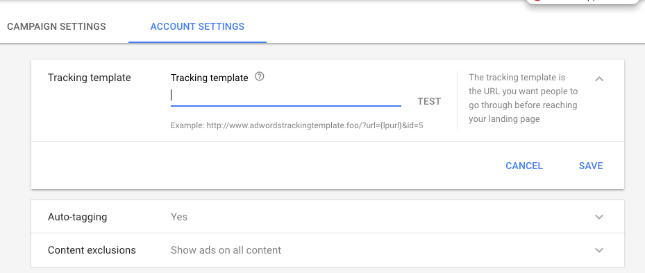

# Noções básicas de[!DNL Marketo Measure]Marcação do AdWords {#understanding-marketo-measure-adwords-tagging}

Para rastrear seus anúncios em um nível muito granular, os URLs de destino do anúncio devem ser exclusivos. Para fazer isso, [!DNL Marketo Measure] A marcação automática adiciona automaticamente parâmetros de rastreamento aos URLs de destino do anúncio do [!DNL AdWords] anúncios. Vamos observar um exemplo abaixo.

O URL a seguir não fornecerá dados granulares:

* `http://example.com/landing-page?myParam=foo`

No entanto, o mesmo URL fornecerá dados granulares devido à [!DNL Marketo Measure] parâmetros:

* `http://example.com/landing-page?myParam=foo&_bt={creative}&_bk={keyword}&_bm={matchtype}&_bn={network}&_bg={adgroupid}`

## Como [!DNL Marketo Measure] A marcação automática funciona {#how-marketo-measure-auto-tagging-works}

**Se [!DNL Marketo Measure] O encontra um modelo de rastreamento:**

* [!DNL Marketo Measure] adicionará os parâmetros ao Modelo de rastreamento.
* Se um redirecionamento de terceiros for encontrado em um Modelo de rastreamento, como Kenshoo ou Marin, [!DNL Marketo Measure] não tomará nenhuma ação. Em vez disso, você deve [adicionar [!DNL Marketo Measure] parâmetros para a ferramenta de terceiros na sua conta](/help/api-connections/utilizing-marketo-measures-api-connections/how-bid-management-tools-affect-marketo-measure.md){target="_blank"}.

No entanto, se nenhum modelo de rastreamento for encontrado, [!DNL Marketo Measure] irá:

* Verifique todos os URLs de destino de anúncios para [!DNL Marketo Measure] Parâmetros.
* Se for encontrado, você pode ir.
* Se não for encontrada, [!DNL Marketo Measure] anexará seus parâmetros ao final dos URLs de destino do anúncio. Para novos anúncios, [!DNL Marketo Measure] anexará seus parâmetros ao URL de destino do anúncio dentro de duas horas após a criação.
* É importante ter um modelo de rastreamento em vigor antes de ativar a marcação automática para que [!DNL Marketo Measure] pode se anexar a ele e impedir a redefinição de um histórico de anúncios.

[!DNL Marketo Measure] A recomenda o uso de um modelo de Rastreamento no nível da conta, do nível da campanha ou do nível do grupo de anúncios, pois ele permite a adição e a subtração de parâmetros para todos os anúncios, sem o risco de interrupções ou exclusão do Histórico de anúncios.

## Modelos de rastreamento {#tracking-templates}

Como explicado por [!DNL Google AdWords], um modelo de rastreamento é o URL usado para acessar uma landing page. As informações de rastreamento coletadas são usadas para entender o tráfego do anúncio. [Clique aqui](https://support.google.com/adwords/answer/7197008?hl=en){target="_blank"} para obter mais informações do Google.

[!DNL Marketo Measure] A recomenda o uso de um modelo de Rastreamento em nível de conta, nível de campanha ou nível de grupo de anúncios, pois ele permite a adição e a subtração de parâmetros para todos os anúncios, sem o risco de interrupções ou exclusão do Histórico de anúncios.

Há dois modelos de rastreamento [!DNL Marketo Measure] A recomenda usar. Use o seguinte para determinar qual versão é apropriada para você:

* Se todos os URLs de anúncios tiverem um &quot;?&quot; nelas, use este URL:

`{lpurl}&_bt={creative}&_bk={keyword}&_bm={matchtype}&_bn={network}&_bg={adgroupid}`

* Se nenhum dos URLs do seu anúncio tiver um &quot;?&quot; nelas, use este URL:

`{lpurl}?_bt={creative}&_bk={keyword}&_bm={matchtype}&_bn={network}&_bg={adgroupid}`

## Configuração de um modelo de rastreamento no nível da conta {#setting-up-a-tracking-template-at-the-account-level}

1. Faça logon no [!DNL Google AdWords] Conta.

1. Clique em **[!UICONTROL Todas as campanhas]** e depois **[!UICONTROL Configurações]** na janela de expansão.

   

1. Clique em **[!UICONTROL Configurações da conta]** na parte superior e **[!UICONTROL Modelo de rastreamento]**. Insira o [!DNL Marketo Measure] Modelo de rastreamento.

   

1. Clique em **[!UICONTROL Salvar]**.

## Configuração de um modelo de rastreamento no nível da campanha {#setting-up-a-tracking-template-at-the-campaign-level}

1. Clique em **[!UICONTROL Todas as campanhas]** e depois **[!UICONTROL Campanhas]** na janela de expansão.

   

1. Selecione todas as campanhas aplicáveis ou **[!UICONTROL Selecionar tudo]**, clique em **[!UICONTROL Editar]** e clique em **[!UICONTROL Modelos de Controle de Alterações]**.

   

1. Insira o [!DNL Marketo Measure] Modelo de rastreamento e clique em **[!UICONTROL Aplicar]**.

## Configuração de um modelo de rastreamento no nível do grupo de anúncios: {#setting-up-a-tracking-template-at-the-ad-group-level}

1. Clique em **[!UICONTROL Todas as campanhas]** e depois **[!UICONTROL Grupos de anúncios]** na janela de expansão.

   

1. Selecione todos os grupos de anúncios aplicáveis ou Selecionar tudo, clique em **[!UICONTROL Editar]** e clique em **[!UICONTROL Modelos de Controle de Alterações]**.

1. Insira o [!DNL Marketo Measure] Modelo de rastreamento e clique em **[!UICONTROL Aplicar]**.

   

## Perguntas frequentes {#faq}

**P: Quais permissões são necessárias para o usuário conectado?**

A: userinfo.email

**P: Quanto tempo pode levar para importar dados de gastos?**

A: 6 horas

**P: Quanto tempo pode levar para importar dados de anúncios?**

A: 4 horas

**P: Para anúncios de pesquisa dinâmica, podemos rastrear a combinação de título, descrição etc. no criativo que foi distribuído?**

R: Não é possível recuperar detalhes criativos individuais para anúncios de pesquisa dinâmica, mas se a marcação automática estiver habilitada, ainda poderemos obter a ID criativa e a receita do atributo.

>[!NOTE]
>
>Depois que as alterações forem feitas, você estará pronto. Fique à vontade para contatar [Suporte ao Marketo](https://nation.marketo.com/t5/support/ct-p/Support){target="_blank"} se houver dúvidas durante a configuração.

[Clique aqui](https://support.google.com/adwords/answer/6076199?hl=en#tracking){target="_blank"} para obter instruções da Google sobre como criar modelos de rastreamento no nível da conta.
