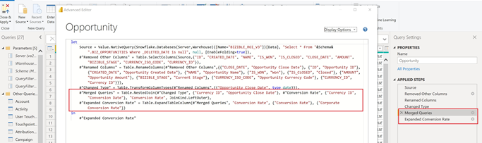

# [!DNL Marketo Measure] Modelo de relatório - Power BI {#marketo-measure-report-template-power-bi}

## Introdução {#getting-started}

Você pode acessar o modelo de relatório Power BI [aqui](https://github.com/adobe/Marketo-Measure-BI-Templates){target="_blank"}.

Abra o Adobe [!DNL Marketo Measure] Arquivo de Power BI do modelo de relatório.

Você pode encontrar suas informações específicas de Servidor, Warehouse e Esquema na [!DNL Marketo Measure] Interface do usuário no [!DNL Data Warehouse] página de informações. As instruções para localizar esta página são detalhadas [aqui](/help/marketo-measure-data-warehouse/data-warehouse-access-reader-account.md){target="_blank"}.

Os parâmetros QueryFilterStartDate e QueryFilterEndDate são usados para limitar a quantidade de dados importados. Esses parâmetros devem estar no formato SQL, pois são usados nas consultas enviadas para [!DNL Snowflake]. Por exemplo, se você quiser limitar os dados aos últimos dois anos, a QueryFilterStartDate será dateadd (year,-2,current_date()). Esses parâmetros são comparados com os tipos de dados datetime, portanto, é recomendável usar dateadd (day,1,current_date()) para QueryFilterEndDate para retornar todos os dados para a hora atual.

## Conexão de dados {#data-connection}

Os parâmetros inseridos ao abrir o arquivo são usados para estruturar consultas nativas que importam tabelas do data warehouse. Você ainda precisará configurar uma conexão de dados com o [!DNL Snowflake] instância. Para isso, você precisará dos mesmos nomes de Servidor e Depósito, juntamente com seu Nome de usuário e Senha. Detalhes sobre onde encontrar seu nome de usuário e redefinir sua senha, se necessário, estão documentados [aqui](/help/marketo-measure-data-warehouse/data-warehouse-access-reader-account.md){target="_blank"}.

## Importação de dados {#data-import}

Para melhorar o desempenho do relatório e aproveitar os recursos de transformação no Power Query, optamos por configurar esse template usando o método de armazenamento de importação.

### Parâmetros de consulta {#query-parameters}

Para limitar os dados importados para o modelo, cada tabela é configurada usando uma consulta nativa como origem. As consultas nativas exigem aprovação para serem executadas. Clique em Executar para cada consulta. Essa etapa só será necessária na primeira vez que as consultas forem executadas ou se os parâmetros forem alterados.

Todas as consultas filtram as linhas excluídas e o [!UICONTROL fatos] as tabelas são definidas para filtrar para linhas com uma data modificada entre as datas inicial e final inseridas como parâmetros.

>[!NOTE]
>
>Como os filtros de data são aplicados à data modificada de uma linha, tenha cuidado ao relatar datas que estão fora do intervalo de datas restrito. Por exemplo, o intervalo de datas modificado é limitado aos últimos dois anos. Isso pode incluir um evento com uma data de evento de três anos atrás, mas que foi modificado recentemente. No entanto, os relatórios de eventos de três anos atrás retornarão resultados incompletos, pois nem todas as linhas serão modificadas no período de dois anos.

As tabelas a seguir são tratadas como tabelas de fatos; os limites de data nas datas modificadas foram adicionados a essas consultas.

* Atividade
* Touchpoint
* Ponto de contato principal
* Ponto de contato de atribuição
* Custo
* Formulário do site
* Sessão
* Membro de campanha
* Tarefa
* Evento
* Transição de Estágio de Cliente Potencial/Contato
* Transição do estágio da oportunidade

As tabelas a seguir são tratadas como tabelas de dimensão; nenhum limite de data é definido para essas consultas.

* Conta
* Campanha
* Contato
* Taxa de conversões
* Oportunidade
* Lead
* Estágio
* Canal

## Transformações de dados {#data-transformations}

Algumas transformações foram aplicadas aos dados no Power Query. Para exibir as transformações específicas de qualquer tabela, abra o Power Query, navegue até uma tabela e observe as Etapas Aplicadas no lado esquerdo da janela. Algumas das transformações específicas são descritas abaixo.

### Colunas removidas {#removed-columns}

Para simplificar o modelo de dados e remover dados redundantes e desnecessários, reduzimos o número de colunas importadas no Power BI em relação ao original [!DNL Snowflake] tabela. As colunas removidas incluem chaves estrangeiras desnecessárias, dados dimensionais desnormalizados mais bem aproveitados por meio de relacionamentos com outras tabelas no modelo, colunas de auditoria e campos usados para internos [!DNL Marketo Measure] processando. Você pode adicionar ou remover colunas conforme necessário para suas necessidades comerciais. Navegue até a etapa &quot;Outras colunas removidas&quot; após a etapa &quot;Origem&quot; em qualquer tabela, clique no ícone de engrenagem e atualize as colunas selecionadas na lista fornecida.

>[!NOTE]
>
>* Tenha cuidado ao adicionar valores de chave estrangeira adicionais. O Power BI geralmente é definido para detectar automaticamente relações no modelo, e a adição de valores de chave estrangeira pode resultar em links indesejados entre as tabelas e/ou na desativação de relações existentes.
>
>* A maioria das tabelas no [!DNL Marketo Measure] o data warehouse contém dados dimensionais desnormalizados. Trabalhamos para normalizar e limpar o modelo no Power BI o máximo possível para melhorar o desempenho e a precisão dos dados. Tenha cuidado ao incluir campos desnormalizados adicionais em tabelas de fatos, isso pode quebrar a filtragem dimensional em tabelas e também resultar em relatórios imprecisos.

### Colunas renomeadas {#renamed-columns}

Tabelas e colunas foram renomeadas para torná-las mais amigáveis e padronizar convenções de nomenclatura. Para exibir as alterações no nome da coluna, navegue até a etapa &quot;Colunas renomeadas&quot; após a etapa &quot;Outras Colunas Removidas&quot; em qualquer tabela.

### Segmentos renomeados {#renamed-segments}

Como os nomes de segmentos são personalizáveis, eles têm nomes de coluna genéricos no data warehouse do Snowflake. [!DNL BIZ_SEGMENT_NAMES] é uma tabela de mapeamento que lista o nome de segmento genérico e seu nome de segmento personalizado mapeado, definido na seção segmento no [!DNL Marketo Measure] IU. A tabela Nome do segmento é usada para renomear as colunas de segmento nas tabelas Ponto de contato de lead e Ponto de contato de atribuição. Se não houver nenhum segmento personalizado, o nome do segmento genérico permanecerá.

### Conversão de ID com diferenciação de maiúsculas e minúsculas {#case-sensitive-id-conversion}

[!DNL Marketo Measure] Os dados do têm algumas tabelas em que os valores da chave primária (ID) fazem distinção entre maiúsculas e minúsculas, a saber, Pontos de contato e Campanhas. O mecanismo de dados que orienta a camada de modelagem do Power BI não diferencia maiúsculas de minúsculas, resultando assim em valores de id &quot;duplicados&quot;. Para preservar a diferenciação entre maiúsculas e minúsculas desses valores principais, implementamos etapas de transformação que anexam caracteres invisíveis a caracteres em minúsculas, preservando a exclusividade da ID quando avaliada na camada do mecanismo de dados. Mais detalhes sobre o problema e as etapas detalhadas sobre o método que empregamos podem ser encontrados [aqui] (https://blog.crossjoin.co.uk/2019 /10/06/power-bi-and-case-sensitive/){target="_blank"}. Esses valores de ID que diferenciam maiúsculas de minúsculas são rotulados como &quot;IDs de junção&quot; e usados como chaves de junção na camada de relacionamento. Ocultamos as IDs de associação na camada de relatórios, mantendo os valores de ID originais visíveis para uso nos relatórios, já que os caracteres invisíveis podem interferir nas funções de recorte/colagem e na filtragem.

### Linhas adicionadas {#rows-added}

Para adicionar recursos de conversão de moeda aos cálculos no modelo, adicionamos uma coluna de taxa de conversão corporativa às tabelas Oportunidade e Custo. O valor dessa coluna é adicionado no nível da linha e é avaliado unindo-se à tabela Taxa de conversão na data e ID da moeda. Para obter mais detalhes sobre como a conversão de moeda funciona neste modelo, consulte a [Conversão de moeda](#currency-conversion) nesta documentação.

A tabela Taxa de conversão armazenada em [!DNL Snowflake] contém um intervalo de datas para cada conversão. O Power BI não permite critérios de associação em um cálculo (ou seja, entre um intervalo de datas). Para unir uma data, adicionamos etapas à tabela Taxa de conversão para expandir as linhas para que haja uma linha para cada data no intervalo de datas de conversão.

## Modelo de dados {#data-model}

Clique na imagem abaixo para obter a versão em tamanho normal.

{target="_blank"}

### Relações e fluxo de dados {#relationships-and-data-flow}

Os dados do evento, usados para criar pontos de contato, são armazenados no [!UICONTROL Session], [!UICONTROL Tarefa], [!UICONTROL Evento], [!UICONTROL Atividade], e tabelas de Membros do Campaign. Essas tabelas de eventos se unem à tabela Touchpoint por meio de suas respectivas IDs e, se o evento resultou em um ponto de contato, os detalhes são armazenados na tabela Touchpoint.

Os pontos de contato principais e os pontos de contato de atribuição são armazenados em suas próprias tabelas, com um link para a tabela Pontos de contato. A maioria dos dados dimensionais para pontos de contato de lead e atribuição é originada do link para o ponto de contato correspondente.

Nesse modelo, as dimensões Campanha e Canal são vinculadas ao ponto de contato, de modo que todos os relatórios sobre essas dimensões são feitos por meio desse link e significa que os relatórios dimensionais nos dados do evento podem estar incompletos. Isso ocorre porque muitos eventos não têm links para essas dimensões até que sejam processados em Pontos de contato. Observação: alguns eventos, como Sessões, têm links diretos para as dimensões Campanha e Canal. Se desejar criar relatórios no nível da Sessão sobre essas dimensões, recomenda-se criar um modelo de dados separado para essa finalidade.

Os dados de custo são armazenados em diferentes níveis de agregação na [!DNL Snowflake] tabela de custos do data warehouse. Para todos os provedores de anúncios, os dados no nível da campanha podem ser acumulados no nível do canal. Por esse motivo, esse modelo extrai dados de custo com base no sinalizador &quot;campaign_is_aggregatable_cost&quot;. Os custos relatados automaticamente podem ser enviados somente no nível do Canal e não são necessários dados do Campaign. Para fornecer o relatório de custos mais preciso possível, os custos relatados automaticamente são obtidos com base no sinalizador &quot;channel_is_aggregatable_cost&quot;. A consulta que importa dados de custo é gravada com a seguinte lógica: Se ad_provider = &quot;SelfReported&quot; então channel_is_aggregatable_cost = true, else campaign_is_aggregatable_cost = true.

Os dados de custo e os dados de Touchpoint têm algumas dimensões comuns, de modo que ambas as tabelas de fatos têm relações com as tabelas de dimensão Campanha e Canal.

No contexto deste modelo, [!UICONTROL Lead], [!UICONTROL Contato], [!UICONTROL Conta], e [!UICONTROL Oportunidade] dados são considerados dados dimensionais e unidos diretamente à [!UICONTROL Lead] Ponto de contato e [!UICONTROL Atribuição] Tabelas de ponto de contato.

### Tabelas adicionadas {#added-tables}

**Data**

Como o Power BI só permite relacionamentos entre tabelas em uma coluna, uma tabela de dimensão de Data foi adicionada para facilitar a associação necessária entre as tabelas que contêm valores (Oportunidade e Custo) e a tabela de Taxa de Conversão. Consulte a seção Conversão de moeda para obter mais detalhes sobre como as conversões de moeda são calculadas neste modelo.

**Medidas**

Todas as medidas foram adicionadas a uma tabela Measures dedicada. Ele não está conectado ao modelo, mas serve como um único local para armazenar todas as medidas, para facilitar o uso.

**Modelo de atribuição**

Uma tabela separada foi adicionada para armazenar os nomes dos modelos de atribuição. Esta tabela é usada para criar filtros que permitem ao usuário alternar entre modelos de atribuição para cálculos de receita atribuída.

### Conversão de moeda {#currency-conversion}

As taxas na tabela Taxa de conversão representam o valor necessário para converter um valor da moeda corporativa. As conversões em qualquer moeda exigem uma conversão dupla, primeiro da moeda original para a moeda corporativa e, em seguida, da moeda corporativa para a moeda selecionada. A primeira etapa dessa cadeia no modelo é adicionar uma coluna com a taxa de conversão corporativa às tabelas com valores, Oportunidade e Custo. Essas etapas estão detalhadas no cabeçalho Linhas adicionadas da seção Transformações de dados neste documento. A conversão da moeda original para a moeda corporativa consiste em dividir o valor por essa coluna adicionada. A próxima etapa é multiplicar o valor da moeda corporativa pela taxa na tabela de Taxa de conversão que corresponde à moeda selecionada.

* Converter o valor original para o valor em moeda corporativa / taxa de conversão corporativa = valor em moeda corporativa
* Converter o valor da moeda corporativa para o valor da moeda selecionada na moeda corporativa `*` taxa de conversão da moeda selecionada = valor na moeda selecionada

Como as taxas de conversão não precisam ser estáticas e podem ser alteradas por intervalos de datas especificados, todos os cálculos de conversão de moeda devem ser executados no nível da linha. Novamente, como as taxas de conversão pertencem a um intervalo de datas específico, o cálculo de pesquisa deve ser executado dentro do DAX da medida, para que o relacionamento possa ser definido no código de moeda e na data.

As medidas de conversão de moeda nesse modelo substituem um valor de 1,0 para a taxa se nenhuma taxa de conversão puder ser identificada. Foram criadas medidas separadas para exibir o valor da moeda da medida e alertar se um cálculo inclui mais de um valor de moeda (isto é, não foi possível converter um valor para a moeda selecionada).

## Definições de dados {#data-definitions}

Foram adicionadas definições ao modelo de Power BI para tabelas, colunas personalizadas e medidas.

Para exibir definições de colunas provenientes diretamente de [!DNL Snowflake], consulte o [documentação do data warehouse](/help/marketo-measure-data-warehouse/data-warehouse-schema.md){target="_blank"}

## Discrepâncias entre modelos e descoberta {#discrepancies-between-templates-and-discover}

### Receita atribuída {#attributed-revenue}

Os pontos de contato principais e os pontos de contato de atribuição herdam dados dimensionais do ponto de contato original. O modelo de relatório origina todos os dados dimensionais herdados do relacionamento com o Touchpoint, enquanto no modelo de Descoberta, os dados dimensionais são desnormalizados para os registros de Lead e de Attribution Touchpoint. As receitas afetadas globais ou os valores das receitas afetadas devem estar alinhados entre os dois relatórios. No entanto, as discrepâncias podem ser observadas quando a receita é dividida ou filtrada por dados dimensionais (canal, subcanal ou campanha). Se os valores de receita dimensional não corresponderem entre o modelo e a Descoberta, é provável que haja registros de ponto de contato ausentes no conjunto de dados do relatório do modelo. Isso acontece quando há um registro de cliente potencial ou de ponto de contato de atribuição, mas nenhum registro correspondente na tabela de Pontos de contato no conjunto de dados importado para o relatório. Como essas tabelas são filtradas por data de modificação, é possível que o registro de lead/ponto de contato de atribuição tenha sido modificado mais recentemente do que o registro de ponto de contato e, portanto, o ponto de contato de lead/atribuição tenha sido importado para o conjunto de dados, enquanto o registro de ponto de contato original não era. Para corrigir esse problema, aumente o intervalo de datas filtrado para a tabela Touchpoint ou considere remover a restrição de data toda ela. Observação: o ponto de contato é uma tabela grande, portanto, considere as variações de um conjunto de dados mais completo em relação à quantidade de dados que devem ser importados.

### Custo {#cost}

Os relatórios de custos nos modelos só estão disponíveis no nível da campanha e do canal. No entanto, o Discover oferece relatórios em níveis mais baixos de granularidade para alguns provedores de anúncios (ou seja, criativo, palavra-chave, grupos de anúncios etc.). Para obter mais detalhes sobre como os dados de custo são modelados nos modelos, consulte a seção Modelo de dados desta documentação. Se o filtro de dimensão em [!UICONTROL Descobrir] for definido como canal ou campanha, os custos nos níveis de canal, subcanal e campanha deverão estar alinhados entre o Discover e os modelos de relatório.

### ROI {#roi}

Como o ROI é calculado a partir da Receita e do Custo Atribuídos, as mesmas discrepâncias que podem surgir em qualquer um desses cálculos podem surgir no ROI e pelos mesmos motivos, conforme observado nessas seções.

### Pontos de Contato {#touchpoints}

Essas métricas, conforme mostrado nos modelos de relatórios, não são espelhadas no Discover. Atualmente, não há comparação direta possível entre os dois.

### Tráfego na Web {#web-traffic}

O modelo de dados de relatório normaliza os dados dimensionais do canal, do subcanal e da campanha por meio da relação entre Sessão e Ponto de contato. Isso é diferente do modelo de dados Discover, que desnormaliza essas dimensões para Sessão. Devido a essa distinção, as contagens gerais de visitas e visitantes devem corresponder entre o Discover e o modelo de relatórios. No entanto, uma vez exibidos ou filtrados por dimensão, não é esperado que esses números se alinhem. Isso ocorre porque os dados dimensionais no modelo só estão disponíveis para eventos da Web que resultaram em um ponto de contato (ou seja, eventos não anônimos). Para obter mais detalhes, consulte [Modelo de dados](#data-model) seção desta documentação.

Pode haver pequenas discrepâncias nas contagens totais de formulários do site entre [!DNL Discover] e o template. Isso ocorre porque o modelo de dados no modelo de relatório obtém dados dimensionais para o Formulário do site por meio de uma relação com Sessão e, em seguida, Ponto de contato; há algumas instâncias em que os dados do formulário do site não têm uma sessão correlacionada.

### Clientes potenciais e contas {#leads-and-accounts}

Os relatórios dimensionais para contas tocadas podem diferir ligeiramente entre o Discover e o modelo, isso se deve novamente à modelagem dimensional proveniente da relação entre o ponto de contato e o ponto de contato principal ou ponto de contato de atribuição. Consulte os detalhes descritos na seção Receita atribuída para obter mais detalhes.

Todas as contagens de clientes potenciais em Descobrir são atribuídas a contagens de clientes potenciais e, no modelo de relatório, a métrica é de clientes potenciais em contato. Por conseguinte, não é possível uma comparação direta entre os dois relatórios no que respeita a esta medida.

### Caminho de engajamento {#engagement-path}

Não existe comparação direta entre a [!UICONTROL Caminho de engajamento] relatório no Discover e no modelo. O relatório em [!DNL Discover] é modelado a partir do ponto de contato, enquanto o relatório no modelo é modelado a partir do ponto de contato de atribuição. O modelo se concentra exclusivamente nas oportunidades e seus pontos de contato relacionados, em vez de mostrar todos os dados de pontos de contato.

### Velocidade da oferta {#deal-velocity}

Não deve haver discrepância entre esse relatório no modelo e o bloco Velocidade da transação no painel Velocidade no Discover.
