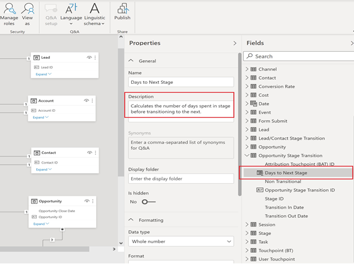

# Modelo de relatório do [!DNL Marketo Measure] - Power BI {#marketo-measure-report-template-power-bi}

## Introdução {#getting-started}

Você pode acessar o modelo de relatório do Power BI [aqui](https://github.com/adobe/Marketo-Measure-BI-Templates){target="_blank"}.

Abra o arquivo do Power BI do modelo de relatório do [!DNL Marketo Measure].

Você pode encontrar suas informações específicas de servidor, warehouse e esquema na interface do [!DNL Marketo Measure] na página de informações do [!DNL Data Warehouse]. As instruções para localizar esta página estão detalhadas [aqui](/help/marketo-measure-data-warehouse/data-warehouse-access-reader-account.md){target="_blank"}.

Os parâmetros QueryFilterStartDate e QueryFilterEndDate são usados para limitar a quantidade de dados importados. Esses parâmetros devem estar no formato SQL, pois são usados nas consultas enviadas para o [!DNL Snowflake]. Por exemplo, se você quiser limitar os dados aos últimos dois anos, defina QueryFilterStartDate como `dateadd` (year,-2,current_date()).  Esses parâmetros são comparados com os tipos de dados de data e hora, portanto, é recomendável usar `dateadd` (day,1,current_date()) no QueryFilterEndDate para retornar todos os dados para a hora atual.

## Conexão de dados {#data-connection}

Os parâmetros inseridos ao abrir o arquivo são usados para estruturar consultas nativas que importam tabelas do Data Warehouse. Você ainda precisará configurar uma conexão de dados com a instância do [!DNL Snowflake]. Para isso, é necessário os mesmos nomes de servidor e warehouse, juntamente com seu nome de usuário e senha. Detalhes de onde encontrar seu nome de usuário e redefinir sua senha, se necessário, estão documentados [aqui](/help/marketo-measure-data-warehouse/data-warehouse-access-reader-account.md){target="_blank"}.

## Importação de dados {#data-import}

Para melhorar o desempenho de relatórios e aproveitar os recursos de transformação do Power Query, configure esse modelo usando o método de armazenamento de importação.

### Parâmetros de consulta {#query-parameters}

Para limitar os dados importados para o modelo, cada tabela é configurada usando uma consulta nativa como origem. As consultas nativas precisam de aprovação prévia, portanto, clique em Executar em cada consulta. Essa etapa só é necessária na primeira execução das consultas ou se houver alteração nos parâmetros.

Todas as consultas filtram as linhas excluídas e as tabelas de [!UICONTROL fatos] são definidas para filtrar as linhas com uma data modificada entre as datas inicial e final inseridas como parâmetros.

>[!NOTE]
>
>Como os filtros de data são aplicados à data modificada de uma linha, tenha cuidado ao emitir relatórios sobre datas que estão fora do intervalo de datas restrito. Por exemplo, o intervalo de datas modificado é limitado aos últimos dois anos. Isso pode incluir um evento com uma data de três anos atrás que foi modificado recentemente. No entanto, emitir relatórios de eventos de três anos atrás retorna resultados incompletos, pois nem todas as linhas são modificadas em um intervalo de dois anos.

As tabelas a seguir são tratadas como tabelas de fatos. Os limites de data nas datas modificadas foram adicionados a essas consultas.

* Atividade
* Ponto de contato
* Ponto de contato de cliente potencial
* Ponto de contato de atribuição
* Custo
* Formulário do site
* Sessão
* Membro de campanha
* Tarefa
* Evento
* Transições de estágio de cliente/contato
* Transição do estágio de oportunidade

As tabelas a seguir são tratadas como tabelas dimensão. Nenhum limite de data é definido para essas consultas.

* Conta
* Campanha
* Contato
* Taxa de conversões
* Oportunidade
* Lead
* Estágio
* Canal

## Transformações de dados {#data-transformations}

Algumas transformações foram aplicadas aos dados no Power Query. Para exibir as transformações específicas de qualquer tabela, abra o Power Query, navegue até uma tabela e observe as Etapas aplicadas no lado esquerdo da janela. Algumas das transformações específicas são descritas abaixo.

### Colunas removidas {#removed-columns}

Para simplificar o modelo de dados e remover dados redundantes e desnecessários, reduzimos o número de colunas importadas no Power BI em relação à tabela original do [!DNL Snowflake]. As colunas removidas incluem chaves estrangeiras desnecessárias, dados dimensionais não normalizados que são melhor aplicados por meio de relacionamentos com outras tabelas no modelo, colunas de auditoria e campos usados para processamento interno no [!DNL Marketo Measure]. É possível adicionar ou remover colunas conforme necessário para suas necessidades empresariais. Navegue até a etapa “Outras colunas removidas” após a etapa “Origem” em qualquer tabela, clique no ícone de engrenagem e atualize as colunas selecionadas na lista fornecida.

>[!NOTE]
>
>* Tenha cuidado ao adicionar valores adicionais de chave estrangeira. O Power BI é geralmente definido para detectar automaticamente as relações no modelo e a adição de valores de chave estrangeira pode resultar em links indesejados entre as tabelas e/ou na desativação de relações existentes.
>
>* A maioria das tabelas no data warehouse do [!DNL Marketo Measure] contém dados dimensionais não normalizados. Trabalhamos para normalizar e limpar o modelo no Power BI o máximo possível para melhorar o desempenho e a precisão dos dados. Tenha cuidado ao incluir campos não normalizados adicionais em tabelas de fatos, pois isso pode quebrar a filtragem dimensional nas tabelas e também resultar em relatórios imprecisos.

### Colunas renomeadas {#renamed-columns}

Renomeamos as tabelas e colunas para facilitar o uso e padronizar convenções de nomeação. Para exibir as alterações no nome da coluna, navegue até a etapa “Colunas renomeadas” após a etapa “Outras colunas removidas” em qualquer tabela.

### Segmentos renomeados {#renamed-segments}

Como os nomes de segmentos são personalizáveis, eles têm nomes de coluna genéricos no data warehouse do Snowflake. [!DNL BIZ_SEGMENT_NAMES] é uma tabela de mapeamento que lista o nome de segmento genérico e seu nome de segmento personalizado mapeado, definido na seção segmento na interface do [!DNL Marketo Measure]. A tabela Nome do segmento é usada para renomear as colunas de segmento nas tabelas Ponto de contato de cliente potencial e de atribuição. Se não houver nenhum segmento personalizado, o nome do segmento genérico permanecerá.

### Conversão de ID com diferenciação de maiúsculas e minúsculas {#case-sensitive-id-conversion}

Os dados do [!DNL Marketo Measure] têm algumas tabelas em que os valores da chave primária (ID) fazem distinção entre maiúsculas e minúsculas, estes são: Ponto de contato e Campanha. O mecanismo de dados que orienta a camada de modelagem do Power BI não diferencia maiúsculas de minúsculas, resultando assim em valores de ID “duplicados”. Para preservar a diferenciação entre maiúsculas e minúsculas desses valores-chave, implementamos etapas de transformação que anexam caracteres invisíveis a caracteres em minúsculas, preservando a exclusividade do ID quando avaliado na camada do mecanismo de dados. Mais detalhes sobre o problema e as etapas detalhadas sobre o método que empregamos podem ser encontrados [aqui]
(https://blog.crossjoin.co.uk/2019/10/06/power-bi-and-case-sensitivity/){target="_blank"}. Esses valores de ID que diferenciam maiúsculas de minúsculas são rotulados como “IDs de associação” e usados como chaves de associação na camada de relação. Ocultamos as IDs de associação da camada de relatórios, mantendo os valores de ID originais visíveis para uso nos relatórios, já que os caracteres invisíveis podem interferir nas funções de cortar
/colar e na filtragem.

### Linhas adicionadas {#rows-added}

Para adicionar recursos de conversão de moeda aos cálculos no modelo, adicionamos uma coluna de taxa de conversão corporativa às tabelas Oportunidade e Custo. O valor nessa coluna é adicionado no nível da linha e é avaliado associando-se à tabela Taxa de conversão na data e na ID da moeda. Para obter mais detalhes sobre como a conversão de moeda funciona neste modelo, consulte a seção [Conversão de moeda](#currency-conversion) nesta documentação.

A tabela Taxa de conversão armazenada no [!DNL Snowflake] contém um intervalo de datas para cada conversão. O Power BI não permite critérios de associação em um cálculo (ou seja, entre um intervalo de datas). Para associar-se a uma data, adicionamos etapas à tabela Taxa de conversão para expandir as linhas até que haja uma linha para cada data no intervalo de datas de conversão.

## Modelo de dados {#data-model}

Clique na imagem abaixo para obter a versão em tamanho normal.

{target="_blank"}

### Relações e fluxo de dados {#relationships-and-data-flow}

Os dados do evento, usados para criar pontos de contato, são armazenados nas tabelas [!UICONTROL Sessão], [!UICONTROL Tarefa], [!UICONTROL Evento], [!UICONTROL Atividade] e Membro da campanha. Essas tabelas de eventos se juntam à tabela Ponto de contato por meio de suas respectivas IDs e, se o evento resultar em um ponto de contato, os detalhes são armazenados na tabela Ponto de contato.

Os Pontos de contato de clientes potenciais e de Atribuição são armazenados em suas próprias tabelas, com um link para a tabela Pontos de contato. A maioria dos dados dimensionais para Pontos de contato de cliente potencial e de atribuição é originada do link para o Ponto de contato correspondente.

Nesse modelo, as dimensões Campanha e Canal são vinculadas ao Ponto de contato, de modo que todos os relatórios sobre essas dimensões são feitos por meio desse link, e isso significa que os relatórios dimensionais sobre os dados do evento podem estar incompletos. Isso ocorre porque muitos eventos não têm links para essas dimensões até que sejam processados em Pontos de contato. Observação: alguns eventos, como Sessões, têm links diretos para as dimensões Campanha e Canal. Se desejar criar relatórios no nível da Sessão sobre essas dimensões, recomenda-se criar um modelo de dados separado para essa finalidade.

Os dados de custo são armazenados em diferentes níveis de agregação na tabela Custo do data warehouse do [!DNL Snowflake]. Para todos os provedores de anúncios, os dados no nível da Campanha podem ser acumulados no nível do Canal. Por esse motivo, esse modelo extrai dados de custo com base no sinalizador “campaign_is_aggregatable_cost”. Os custos autorrelatados podem ser enviados somente no nível do Canal e não precisam ter dados da Campanha. Para fornecer o relatório de custos o mais preciso possível, os custos autorrelatados são obtidos com base no sinalizador “channel_is_aggregatable_cost”. A consulta que importa dados de custo é gravada com a seguinte lógica: Se ad_provider = “SelfReported”, então channel_is_aggregatable_cost = true; caso contrário, campaign_is_aggregatable_cost = true.

Os dados de Custo e os dados de Pontos de contato têm algumas dimensões comuns, de modo que ambas as tabelas de fatos têm relações com as tabelas de dimensão Campanha e Canal.

No contexto deste modelo, dados de [!UICONTROL Cliente potencial], [!UICONTROL Contato], [!UICONTROL Conta] e [!UICONTROL Oportunidade] são considerados dados dimensionais e associados diretamente às tabelas Ponto de contato de [!UICONTROL Clientes potenciais] e de [!UICONTROL Atribuição].

### Tabelas adicionadas {#added-tables}

**Data**

Como o Power BI só permite relacionamentos entre tabelas em uma coluna, uma tabela de dimensão de Data foi adicionada para facilitar a associação necessária entre as tabelas que contêm valores (Oportunidade e Custo) e a tabela de Taxa de conversão. Consulte a seção Conversão de moeda para obter mais detalhes sobre como as conversões de moeda são calculadas neste modelo.

**Medidas**

Todas as medidas foram adicionadas a uma tabela de Medidas dedicada. Ela não está conectada ao modelo, mas serve como um único local para armazenar todas as medidas, para facilitar o uso.

**Modelo de atribuição**

Uma tabela separada foi adicionada para armazenar os nomes dos modelos de atribuição. Esta tabela é usada para criar filtros que permitem ao usuário alternar entre modelos de atribuição para cálculos de receita atribuída.

### Conversão de moeda {#currency-conversion}

As taxas na tabela Taxa de conversão representam o valor necessário para converter um valor da moeda corporativa. As conversões em qualquer moeda exigem uma conversão dupla, primeiro da moeda original para a moeda corporativa e, em seguida, da moeda corporativa para a moeda selecionada. A primeira etapa dessa cadeia no modelo é adicionar uma coluna com a taxa de conversão corporativa às tabelas com valores, Oportunidade e Custo. Essas etapas estão detalhadas no cabeçalho Linhas adicionadas da seção Transformações de dados neste documento. A conversão da moeda original para a moeda corporativa consiste em dividir o valor por essa coluna adicionada. A próxima etapa é multiplicar o valor da moeda corporativa pela taxa na tabela Taxa de conversão que corresponde à moeda selecionada.

* Converter o valor original para o valor em moeda corporativa / taxa de conversão corporativa = valor em moeda corporativa
* Converter o valor da moeda corporativa para o valor da moeda selecionada na moeda corporativa `*` taxa de conversão da moeda selecionada = valor na moeda selecionada

Como as taxas de conversão não precisam ser estáticas e podem ser alteradas por intervalos de datas especificados, todos os cálculos de conversão de moeda devem ser executados no nível da linha. Novamente, como as taxas de conversão pertencem a um intervalo de datas específico, o cálculo de pesquisa deve ser executado dentro do DAX da medida, para que a relação possa ser definida no código da moeda e na data.

As medidas de conversão de moeda nesse modelo substituem um valor de 1,0 para a taxa se nenhuma taxa de conversão puder ser identificada. Criamos medidas separadas para exibir o valor da moeda da medida e alertar se um cálculo inclui mais de um valor de moeda (isto é, quando um valor não pode ser convertido para a moeda selecionada).

## Definições de dados {#data-definitions}

Foram adicionadas definições ao modelo do Power BI para tabelas, colunas personalizadas e medidas.

Para exibir definições de colunas provenientes diretamente do [!DNL Snowflake], consulte a [documentação do data warehouse](/help/marketo-measure-data-warehouse/data-warehouse-schema.md){target="_blank"}

## Discrepâncias entre modelos e o Discover {#discrepancies-between-templates-and-discover}

### Receita atribuída {#attributed-revenue}

Os pontos de contato de cliente potencial e de atribuição herdam dados dimensionais do ponto de contato original. O modelo de relatório gera todos os dados dimensionais herdados da relação com o ponto de contato, enquanto no modelo do Discover, os dados dimensionais são desnormalizados para os registros dos pontos de contato de cliente potencial e de atribuição. As receitas gerais atribuídas ou os valores das receitas de pipeline atribuídas devem estar alinhados entre os dois relatórios. No entanto, discrepâncias podem ser observadas quando a receita é dividida ou filtrada por dados dimensionais (canal, subcanal ou campanha). Se os valores de receita dimensional não corresponderem entre o modelo e o Discover, é provável que haja registros de ponto de contato ausentes no conjunto de dados do relatório do modelo. Isso acontece quando há um registro de ponto de contato de cliente potencial ou de atribuição, mas nenhum registro correspondente na tabela Ponto de contato no conjunto de dados importado para o relatório. Como essas tabelas são filtradas por data de modificação, é possível que o registro de ponto de contato de cliente potencial/atribuição tenha sido modificado mais recentemente do que o registro de ponto de contato e, portanto, o ponto de contato de cliente potencial/atribuição foi importado para o conjunto de dados, enquanto o registro de ponto de contato original não foi. Para corrigir esse problema, aumente o intervalo de datas filtrado na tabela Ponto de contato ou considere remover a restrição de data completamente. Observação: a tabela Ponto de contato é grande, portanto, considere os prós e contras de um conjunto de dados mais completo em relação à quantidade de dados que devem ser importados.

### Custo {#cost}

O relatório de custos dos modelos só está disponível no nível da campanha e do canal. No entanto, o Discover oferece relatórios com níveis mais baixos de granularidade para alguns provedores de anúncios (ou seja, criativo, palavra-chave, grupos de anúncios e assim por diante). Para obter mais detalhes sobre como os dados de custo são modelados, consulte a seção Modelo de dados desta documentação. Se o filtro de dimensão no [!UICONTROL Discover] for definido como canal ou campanha, os custos nos níveis de canal, subcanal e campanha deverão estar alinhados entre o Discover e os modelos de relatório.

### ROI {#roi}

Como o ROI é calculado a partir da Receita e do Custo Atribuídos, as mesmas discrepâncias que podem surgir em qualquer um desses cálculos podem surgir no ROI e pelos mesmos motivos, conforme observado nessas seções.

### Pontos de contato {#touchpoints}

Essas métricas, conforme mostrado nos modelos de relatórios, não são espelhadas no Discover. Atualmente, não há comparação direta possível entre as duas.

### Tráfego na Web {#web-traffic}

O modelo de dados do modelo de relatório normaliza os dados dimensionais do canal, do subcanal e da campanha por meio da relação entre Sessão e Ponto de contato. Isso é diferente do modelo de dados do Discover, que desnormaliza essas dimensões para a Sessão. Devido a essa distinção, as contagens gerais de visitas e visitantes devem coincidir no Discover e no modelo de relatório. No entanto, uma vez exibidos ou filtrados por dimensão, não é esperado que esses números se alinhem. Isso ocorre porque os dados dimensionais no modelo só estão disponíveis para eventos da web que resultaram em um ponto de contato (ou seja, eventos não anônimos). Para obter mais detalhes, consulte a seção [Modelo de dados](#data-model) desta documentação.

Pode haver pequenas discrepâncias entre o [!DNL Discover] e o modelo nas contagens totais de formulários do site. Isso ocorre porque o modelo de dados no modelo do relatório obtém dados dimensionais para o formulário do site por meio de uma relação com a Sessão e, em seguida, com o Ponto de contato. Há algumas instâncias em que os dados do formulário do site não têm uma sessão correlacionada.

### Clientes potenciais e contas {#leads-and-accounts}

Os relatórios dimensionais para contas em contato podem divergir ligeiramente entre o Discover e o modelo, isso se deve novamente à modelagem dimensional proveniente da relação entre o Ponto de contato e o Ponto de contato de cliente potencial ou Ponto de contato de atribuição. Consulte a seção Receita atribuída para obter mais detalhes.

Todas as contagens de clientes potenciais no Discover são contagens de clientes potenciais atribuídas e, no modelo de relatório, a métrica é de clientes potenciais em contato. Portanto, não é possível uma comparação direta entre os dois relatórios no que diz respeito a esta medida.

### Caminho de engajamento {#engagement-path}

Não existe comparação direta entre o relatório [!UICONTROL Caminho de engajamento] no Discover e no modelo. O relatório no [!DNL Discover] é modelado a partir do Ponto de contato, enquanto o relatório no modelo é modelado a partir do Ponto de contato de atribuição. O modelo se concentra exclusivamente nas oportunidades e seus pontos de contato relacionados, em vez de mostrar todos os dados de pontos de contato.

### Velocidade do negócio {#deal-velocity}

Não deve haver discrepâncias entre esse relatório no modelo e o bloco Velocidade do negócio, no painel Velocidade do Discover.
