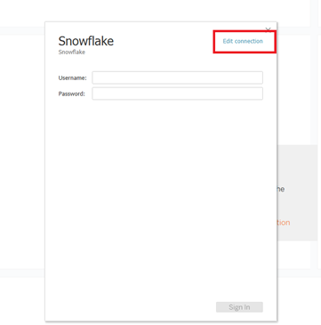
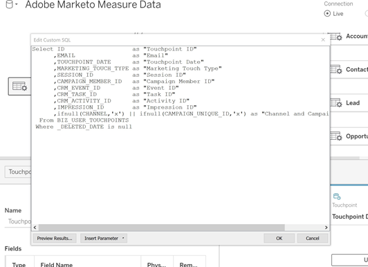
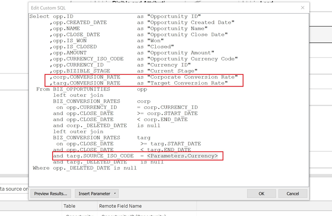
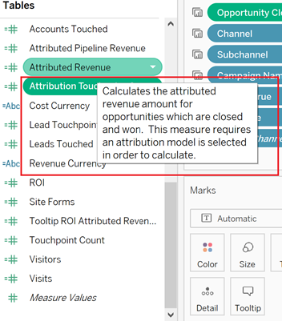

# [!DNL Marketo Measure] Modelo de relatório - Tableau {#marketo-measure-report-template-tableau}

## Introdução {#getting-started}

Você pode acessar o modelo de relatório do [!DNL Tableau] [aqui](https://github.com/adobe/Marketo-Measure-BI-Templates){target="_blank"}.

Abra o arquivo da Apostila do Tableau de Modelos de Relatório do [!DNL Adobe Marketo Measure].

É necessário atualizar os dados de conexão existentes para as informações de conexão específicas do Snowflake. Clique no botão [!UICONTROL Editar conexão] e siga as etapas descritas na seção [[!UICONTROL Conexão de dados]](#data-connection) desta documentação.



## Conexão de dados {#data-connection}

Você precisará configurar uma conexão de dados com sua instância do Snowflake. Para isso, será necessário o nome do servidor, além do seu nome de usuário e senha. Detalhes sobre onde encontrar essas informações e redefinir sua senha, caso necessário, estão documentados [aqui](/help/marketo-measure-data-warehouse/data-warehouse-access-reader-account.md){target="_blank"}.


Você também precisará inserir um comando SQL inicial. Isso permite o uso de consultas personalizadas nesse modelo de dados. O comando a ser inserido é “Usar esquema `<your schema name>`”. É possível localizar o nome de seu esquema na página [!UICONTROL conexões do data warehouse] (consulte a documentação referenciada acima).


### Consultas SQL Personalizadas {#custom-sql-queries}

Como o [!DNL Tableau] aplica filtros de fonte de dados à consulta geral e não na tabela individual em que o filtro está definido, optamos por usar SQL personalizado para cada tabela no modelo. Isso permite que o modelo filtre linhas excluídas ou duplicadas no nível da tabela. Por exemplo, quando aplicado como um filtro de fonte de dados, session._deleted_date é nulo e será adicionado à cláusula where da consulta, resultando na seguinte consulta.

**Filtros adicionados à fonte de dados**

```
--A deleted session removes this row completely and the touchpoint data is lost. Select *
   From Touchpoint    tp
      join Session sn
      on tp.session_id = sn.session_id 
 Where tp._deleted_date is null
    and sn._deleted_date is null
```

No entanto, isso está incorreto, pois se uma sessão foi excluída, mas o ponto de contado correspondente não, os dados do ponto de contado são removidos do conjunto de dados. Queremos que os dados de ponto de contato estejam presentes no conjunto de dados, pois o ponto de contato não foi excluído. A adição de SQL personalizado garante que os critérios de filtro sejam aplicados no nível da tabela, resultando na seguinte consulta.

**Filtros aplicados via SQL personalizado**

```
--A deleted session only removes the session related data, and the touchpoint data is preserved. Select *
   From Touchpoint       tp
      join Session sn
      on tp.session_id          = sn.session_id 
      and sn._deleted_date      is null
  Where tp._deleted_date is null
```

## Transformações de dados {#data-transformations}

Algumas transformações foram aplicadas aos dados no [!DNL Tableau] em relação ao seu estado original no Snowflake. A maioria dessas transformações é aplicada nas consultas SQL personalizadas que geram as tabelas no modelo do [!DNL Tableau]. Para exibir o SQL personalizado usado para gerar uma tabela, clique com o botão direito do mouse no nome da tabela e selecione “Editar consulta SQL personalizada”. Algumas das transformações específicas são descritas abaixo.




### Colunas removidas {#removed-columns}

Para simplificar o modelo de dados e remover dados redundantes e desnecessários, reduzimos o número de colunas importadas para o Tableau a partir da tabela original do Snowflake. As colunas removidas incluem chaves estrangeiras desnecessárias, dados dimensionais não normalizados melhor aproveitados por meio de relacionamentos com outras tabelas no modelo, colunas de auditoria e campos usados para processamento interno no [!DNL Marketo Measure]. É possível adicionar ou remover colunas conforme necessário para suas necessidades comerciais editando a lista de colunas importadas na seção Selecionar do SQL personalizado.

>[!NOTE]
>
>A maioria das tabelas no data warehouse contém dados dimensionais não normalizados. Trabalhamos para normalizar e limpar o modelo no [!DNL Tableau] o máximo possível para melhorar o desempenho e a precisão dos dados. Tenha cuidado ao incluir campos não normalizados adicionais em tabelas de fatos, pois isso pode quebrar a filtragem dimensional nas tabelas e também resultar em relatórios imprecisos.

### Colunas renomeadas {#renamed-columns}

Renomeamos as tabelas e colunas para facilitar o uso e padronizar convenções de nomeação. Para exibir as alterações no nome da coluna, consulte as instruções SQL personalizadas que criam as tabelas.

### Linhas adicionadas {#rows-added}

Para adicionar um recurso de conversão de moeda aos cálculos no modelo, adicionamos uma taxa de conversão corporativa e uma coluna de taxa de conversão de destino às tabelas de Oportunidade e Custo. O valor nessas colunas é adicionado no nível da linha e é avaliado associando-se à tabela Taxa de conversão na data e no ID da moeda. Como o Tableau não permite que as tabelas de fatos compartilhem mais de uma tabela de dimensão, as taxas de conversão foram adicionadas diretamente às tabelas que as utilizam. Para obter mais detalhes sobre como a conversão de moeda funciona neste modelo, consulte a seção [Conversão de moeda](#currency-conversion) nesta documentação.


Há alguns lugares onde duas tabelas do [!DNL Snowflake] foram combinadas com uma união para criar uma tabela no modelo de dados do [!DNL Tableau]. Nesses casos, uma coluna “Tipo” foi adicionada para indicar de qual tabela do [!DNL Snowflake] ela vem e designa qual entidade a linha representa. Para obter mais detalhes sobre as tabelas que foram combinadas, consulte a seção Relação e fluxo de dados nesta documentação.


### Nomes dos segmentos {#segment-names}

Como os nomes de segmentos são personalizáveis, eles têm nomes de coluna genéricos no data warehouse do Snowflake. [!DNL BIZ_SEGMENT_NAMES] é uma tabela de mapeamento que lista o nome de segmento genérico com o nome de segmento personalizado para o qual está mapeado, conforme definido na seção do segmento na interface do [!DNL Marketo Measure]. Se você usa nomes de segmento personalizados e deseja atualizar seu modelo do [!DNL Tableau] para incorporar estes, use esta tabela e renomeie manualmente as colunas dentro do modelo do Tableau. As colunas de segmento estão na tabela Pontos de contato de cliente potencial e de atribuição, e só precisarão ser renomeadas uma vez.

A coluna [!UICONTROL CATEGORIA] lista o número da categoria e a coluna SEGMENT_NAME tem o nome do segmento personalizado para o qual ela é mapeada.


Os nomes podem ser atualizados de duas maneiras. A primeira opção é atualizar o SQL personalizado. Neste exemplo, as categorias de 1 a 6 foram renomeadas com base no mapeamento da tabela Nomes de segmentos.


A outra opção é renomear as colunas diretamente na tabela do [!DNL Tableau].


## Modelo de dados {#data-model}

Clique na imagem abaixo para obter a versão em tamanho normal.

[](/help/bi-report-templates/assets/tableau-data-model.png){target="_blank"}

### Relações e fluxo de dados {#relationships-and-data-flow}

Os dados do evento, usados para criar pontos de contato, são armazenados nas tabelas [!UICONTROL Sessão], [!UICONTROL Tarefa], [!UICONTROL Evento], [!UICONTROL Atividade] e [!UICONTROL Membro da campanha]. Essas tabelas de eventos se juntam à tabela Ponto de contato por meio de suas respectivas IDs e, se o evento resultar em um ponto de contato, os detalhes são armazenados na tabela Ponto de contato.

Os Pontos de contato de cliente potencial e de Atribuição são combinados em uma tabela nesse modelo, com um link para a tabela Pontos de contato. A coluna “Tipo de ponto de contato” foi adicionada para designar se uma linha é um ponto de contato de cliente potencial ou de atribuição. A maioria dos dados dimensionais para Pontos de contato de cliente potencial e de atribuição é originada do link para o Ponto de contato correspondente.

As transições de estágio de oportunidade e as transições de estágio de cliente potencial são combinadas em uma tabela neste modelo, com um link para a tabela Pontos de contato de [!UICONTROL Cliente potencial e de atribuição]. A coluna “Tipo de transição” foi adicionada para designar se uma linha é uma transição de estágio de oportunidade ou de cliente potencial.

Os dados de Custo e Pontos de contato compartilham as dimensões Canal e Campanha. No entanto, o Tableau é limitado em sua capacidade de modelar dimensões compartilhadas entre tabelas de fatos. Como estamos limitados a apenas uma tabela de dimensão compartilhada, os dados de Canal e Campanha foram combinados em uma única tabela. Eles são combinados usando uma associação cruzada das duas dimensões em uma tabela no Tableau: Canal e Campanha. O identificador exclusivo é criado pela concatenação das IDs de canal e de campanha. Esse mesmo valor de ID é adicionado às tabelas Ponto de contato e Custo para criar uma relação com essa tabela de dimensão combinada.


Nesse modelo, as dimensões Campanha e Canal são vinculadas ao Ponto de contato, de modo que todos os relatórios sobre essas dimensões são feitos por meio desse link, e isso significa que os relatórios dimensionais sobre os dados do evento podem estar incompletos. Isso ocorre porque muitos eventos não têm links para essas dimensões até que sejam processados em Pontos de contato.

>[!NOTE]
>
>Alguns eventos, como Sessões, têm links diretos para as dimensões Campanha e Canal. Se desejar criar relatórios no nível da Sessão sobre essas dimensões, recomenda-se criar um modelo de dados separado para essa finalidade.

Os dados de custo são armazenados em diferentes níveis de agregação na tabela Custo do data warehouse do Snowflake. Para todos os provedores de anúncios, os dados no nível da Campanha podem ser acumulados no nível do Canal. Por esse motivo, esse modelo extrai dados de custo com base no sinalizador “campaign_is_aggregatable_cost”. Os custos autorrelatados podem ser enviados somente no nível do Canal e não precisam ter dados da Campanha. Para fornecer o relatório de custos o mais preciso possível, os custos autorrelatados são obtidos com base no sinalizador “channel_is_aggregatable_cost”. A consulta que importa dados de custo é gravada com a seguinte lógica: Se ad_provider = “SelfReported”, então channel_is_aggregatable_cost = true; caso contrário, campaign_is_aggregatable_cost = true.

No contexto deste modelo, os dados de Cliente potencial, [!UICONTROL Contato], [!UICONTROL Conta] e [!UICONTROL Oportunidade] são considerados dados dimensionais e associados diretamente à tabela Pontos de contato de cliente potencial e de atribuição.

### Conversão de moeda {#currency-conversion}

As taxas na tabela Taxa de conversão representam o valor necessário para converter um valor da moeda corporativa. As conversões em qualquer moeda exigem uma conversão dupla, primeiro da moeda original para a moeda corporativa e, em seguida, da moeda corporativa para a moeda selecionada. A primeira etapa dessa cadeia no modelo é adicionar duas colunas com essas taxas de conversão às tabelas com valores, Oportunidade e Custo. Essas etapas estão detalhadas na seção Linhas adicionadas deste documento. Como as taxas de conversão não precisam ser estáticas e podem ser alteradas por intervalos de datas especificados, todos os cálculos de conversão de moeda devem ser executados no nível da linha. A conversão da moeda original para a moeda corporativa consiste na divisão do valor pela taxa de conversão corporativa, seguida da multiplicação pela taxa de conversão do destino. A taxa de conversão do destino é determinada pelo valor de parâmetro da moeda selecionada.

* Converter o valor original para o valor em moeda corporativa / taxa de conversão corporativa = valor em moeda corporativa
* Converter o valor da moeda corporativa para o valor da moeda selecionada na moeda corporativa `*` taxa de conversão da moeda selecionada = valor na moeda selecionada



As medidas de conversão de moeda nesse modelo substituem um valor de 1,0 para a taxa se nenhuma taxa de conversão puder ser identificada. Criamos medidas separadas para exibir o valor da moeda da medida e alertar se um cálculo inclui mais de um valor de moeda (isto é, quando um valor não pode ser convertido para a moeda selecionada). Essas medidas, Moeda de custo e Moeda de receita, são incluídas como dicas de ferramentas em qualquer tela que exiba dados de Custo ou Receita.


## Definições de dados {#data-definitions}

Definições foram adicionadas ao [!DNL Tableau model] para parâmetros, colunas personalizadas e medidas.



Para exibir definições de colunas provenientes diretamente do [!DNL Snowflake], consulte a [documentação do data warehouse](/help/marketo-measure-data-warehouse/data-warehouse-schema.md){target="_blank"}.

## Discrepâncias entre modelos e o Discover {#discrepancies-between-templates-and-discover}

### Receita atribuída {#attributed-revenue}

Os pontos de contato de cliente potencial e de atribuição herdam dados dimensionais do ponto de contato original. O modelo de relatório gera todos os dados dimensionais herdados da relação com o ponto de contato, enquanto no modelo do Discover, os dados dimensionais são desnormalizados para os registros dos pontos de contato de cliente potencial e de atribuição. As receitas gerais atribuídas ou os valores das receitas de pipeline atribuídas devem estar alinhados entre os dois relatórios. No entanto, discrepâncias podem ser observadas quando a receita é dividida ou filtrada por dados dimensionais (canal, subcanal ou campanha). Se os valores de receita dimensional não corresponderem entre o modelo e o Discover, é provável que haja registros de ponto de contato ausentes no conjunto de dados do relatório do modelo. Isso acontece quando há um registro de ponto de contato de cliente potencial ou de atribuição, mas nenhum registro correspondente na tabela Ponto de contato no conjunto de dados importado para o relatório. Como essas tabelas são filtradas por data de modificação, é possível que o registro de ponto de contato de cliente potencial/atribuição tenha sido modificado mais recentemente do que o registro de ponto de contato e, portanto, o ponto de contato de cliente potencial/atribuição foi importado para o conjunto de dados, enquanto o registro de ponto de contato original não foi. Para corrigir esse problema, aumente o intervalo de datas filtrado na tabela Ponto de contato ou considere remover a restrição de data completamente.

>[!NOTE]
>
>A tabela Ponto de contato é grande, portanto, considere os prós e contras de um conjunto de dados mais completo em relação à quantidade de dados que deverão ser importados.

### Custo {#cost}

O relatório de custos nos modelos só está disponível no nível da campanha e do canal. No entanto, o Discover oferece relatórios em níveis mais baixos de granularidade para alguns provedores de anúncios (ou seja, criativo, palavra-chave, grupos de anúncios, etc.). Para obter mais detalhes sobre como os dados de custo são modelados, consulte a seção [!UICONTROL Modelo de dados] desta documentação. Se o filtro de dimensão no [!UICONTROL Discover] for definido como canal ou campanha, os custos nos níveis de canal, subcanal e campanha deverão estar alinhados entre o Discover e os modelos de relatório.

### ROI {#roi}

Como o ROI é calculado a partir da Receita e do Custo Atribuídos, as mesmas discrepâncias que podem surgir em qualquer um desses cálculos podem surgir no ROI e pelos mesmos motivos, conforme observado nessas seções.

### Pontos de contato {#touchpoints}

Essas métricas, conforme mostrado nos modelos de relatórios, não são espelhadas no Discover. Atualmente, não há comparação direta possível entre as duas.

### Tráfego na Web {#web-traffic}

O modelo de dados do modelo de relatório normaliza os dados dimensionais do canal, do subcanal e da campanha por meio da relação entre Sessão e Ponto de contato. Isso é diferente do modelo de dados do Discover, que desnormaliza essas dimensões para a Sessão. Devido a essa distinção, as contagens gerais de visitas e visitantes devem coincidir no Discover e no modelo de relatório. No entanto, uma vez exibidos ou filtrados por dimensão, não é esperado que esses números se alinhem. Isso ocorre porque os dados dimensionais no modelo só estão disponíveis para eventos da web que resultaram em um ponto de contato (ou seja, eventos não anônimos). Para obter mais detalhes, consulte a seção [Modelo de dados](#data-model) desta documentação.

Pode haver pequenas discrepâncias entre o [!DNL Discover] e o modelo nas contagens totais de formulários do site. Isso ocorre porque o modelo de dados no modelo do relatório obtém dados dimensionais para o formulário do site por meio de uma relação com a Sessão e, em seguida, com o Ponto de contato. Há algumas instâncias em que os dados do formulário do site não têm uma sessão correlacionada.

### Clientes potenciais e contas {#leads-and-accounts}

Os relatórios dimensionais para contas em contato podem divergir ligeiramente entre o [!DNL Discover] e o modelo, isso se deve novamente à modelagem dimensional proveniente da relação entre o Ponto de contato e o Ponto de contato de cliente potencial ou Ponto de contato de atribuição. Consulte a seção Receita atribuída para obter mais detalhes.

Todas as contagens de clientes potenciais no [!UICONTROL Discover] são contagens de clientes potenciais atribuídos e, no modelo de relatório, a métrica é [!UICONTROL clientes potenciais] em contato. Portanto, não é possível uma comparação direta entre os dois relatórios no que diz respeito a esta medida.

### Caminho de engajamento {#engagement-path}

Não existe comparação direta entre o relatório [!UICONTROL Caminho de engajamento] no [!DNL Discover] e o modelo. O relatório no [!DNL Discover] é modelado a partir do ponto de contato, enquanto o relatório no modelo é modelado a partir do ponto de contato de atribuição. O modelo se concentra exclusivamente nas oportunidades e seus pontos de contato relacionados, em vez de mostrar todos os dados de pontos de contato.

### Velocidade do negócio {#deal-velocity}

Não deve haver discrepâncias entre esse relatório no modelo e o bloco Velocidade do negócio, no painel Velocidade do Discover.
