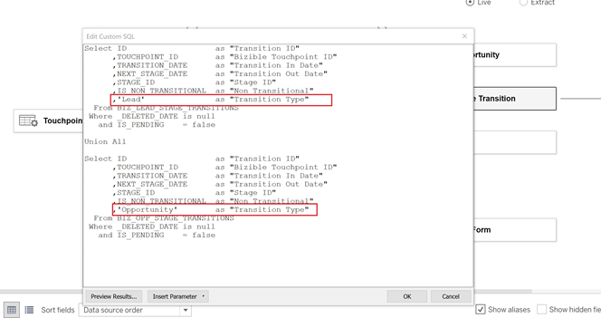

# [!DNL Marketo Measure] Modelo de relatório - Tableau {#marketo-measure-report-template-tableau}

## Introdução {#getting-started}

Você pode acessar o [!DNL Tableau] modelo de relatório [here](https://github.com/adobe/Marketo-Measure-BI-Templates){target="_blank"}.

Abra o [!DNL Adobe Marketo Measure] Relatório do arquivo de pasta de trabalho Tableau modelo.

Você precisará atualizar os dados de conexão existentes para suas informações específicas de conexão do Snowflake. Clique no botão [!UICONTROL Editar conexão] e siga as etapas descritas na [[!UICONTROL Conexão de dados]](#data-connection) desta documentação.


## Conexão de dados {#data-connection}

Você precisará configurar uma conexão de dados para a instância do Snowflake. Para isso, você precisará do nome do servidor junto com seu nome de usuário e senha. Detalhes sobre onde encontrar essas informações e redefinir sua senha, se necessário, estão documentados [here](/help/marketo-measure-data-warehouse/data-warehouse-access-reader-account.md){target="_blank"}.


Você também precisará inserir um comando SQL inicial. Isso suporta o uso de consultas personalizadas neste modelo de dados. O comando a ser inserido é &quot;Usar esquema `<your schema name>`&quot;. Você pode localizar o nome do esquema na variável [!UICONTROL conexões do data warehouse] consulte a documentação mencionada acima.


### Consultas SQL Personalizadas {#custom-sql-queries}

Porque [!DNL Tableau] aplica filtros de fonte de dados à consulta geral e não na tabela individual à qual o filtro está definido, optamos por usar SQL personalizado para cada tabela no modelo. Isso permite que o modelo filtre linhas excluídas e duplique no nível da tabela. Por exemplo, quando aplicado como um filtro de fonte de dados, sessão._deleted_date é null será adicionado à cláusula where do query, resultando na seguinte query.

**Filtros adicionados à fonte de dados**

```
--A deleted session removes this row completely and the touchpoint data is lost. Select *
   From Touchpoint    tp
      join Session sn
      on tp.session_id = sn.session_id 
 Where tp._deleted_date is null
    and sn._deleted_date is null
```

No entanto, isso está incorreto, pois se uma sessão foi excluída, mas o ponto de contato correspondente não é excluído, os dados do ponto de contato são removidos do conjunto de dados. Queremos os dados do ponto de contato presentes no conjunto de dados, pois o ponto de contato não foi excluído. Adicionar SQL personalizado garante que os critérios de filtro sejam aplicados no nível da tabela, resultando na seguinte query.

**Filtros Aplicados via SQL Personalizado**

```
--A deleted session only removes the session related data, and the touchpoint data is preserved. Select *
   From Touchpoint       tp
      join Session sn
      on tp.session_id          = sn.session_id 
      and sn._deleted_date      is null
  Where tp._deleted_date is null
```

## Transformações de dados {#data-transformations}

Algumas transformações foram aplicadas aos dados em [!DNL Tableau] do seu estado original em Snowflake. A maioria dessas transformações é aplicada nas queries SQL personalizadas que geram as tabelas no [!DNL Tableau] modelo. Para exibir o SQL personalizado usado para gerar uma tabela, clique com o botão direito do mouse no nome da tabela e selecione &quot;Editar Consulta SQL Personalizada&quot;. Algumas das transformações específicas são descritas abaixo.


### Colunas removidas {#removed-columns}

Para simplificar o modelo de dados e remover dados redundantes e desnecessários, reduzimos o número de colunas importadas para o Tableau a partir da tabela de Snowflake original. As colunas removidas incluem chaves estrangeiras desnecessárias, dados dimensionais desnormalizados melhor aproveitados por relacionamentos com outras tabelas no modelo, colunas de auditoria e campos usados para [!DNL Marketo Measure] processamento. Você pode adicionar ou remover colunas conforme necessário para suas necessidades comerciais editando a lista de colunas importadas na seção Selecionar do SQL personalizado.

>[!NOTE]
>
>A maioria das tabelas no data warehouse contém dados dimensionais desnormalizados. Trabalhamos para normalizar e limpar o modelo no [!DNL Tableau] o máximo possível para melhorar o desempenho e a precisão dos dados. Tenha cuidado ao incluir quaisquer campos desnormalizados adicionais em tabelas de fatos, isso pode quebrar a filtragem dimensional em tabelas e também pode resultar em relatórios imprecisos.

### Colunas renomeadas {#renamed-columns}

Tabelas e colunas foram renomeadas para torná-las mais amigáveis e para padronizar convenções de nomenclatura. Para exibir as alterações no nome da coluna, consulte as instruções SQL personalizadas que criam as tabelas.

### Linhas Adicionadas {#rows-added}

Para adicionar recursos de conversão de moeda aos cálculos no modelo, adicionamos uma taxa de conversão corporativa e uma coluna de taxa de conversão de destino às tabelas Oportunidade e Custo. O valor nessas colunas é adicionado no nível da linha e é avaliado ao unir-se à tabela Taxa de Conversão na data e id da moeda. Como o Tableau não permite que as tabelas de fatos compartilhem mais de uma tabela de dimensão, as taxas de conversão foram adicionadas diretamente às tabelas que a usam. Para obter mais detalhes sobre como a conversão de moeda funciona neste modelo, consulte o [Conversão de moeda](#currency-conversion) nesta documentação.


Há alguns lugares onde duas tabelas [!DNL Snowflake] foram combinadas com uma união para criar uma tabela no [!DNL Tableau] modelo de dados. Nesses casos, uma coluna &quot;Tipo&quot; foi adicionada para indicar qual [!DNL Snowflake] tabela de origem e designar qual entidade a linha representa. Para obter mais detalhes sobre as tabelas que foram combinadas, consulte a seção Relacionamento e fluxo de dados nesta documentação.



### Nomes dos segmentos {#segment-names}

Como os nomes de segmentos são personalizáveis, eles têm nomes de colunas genéricos no data warehouse do Snowflake. [!DNL BIZ_SEGMENT_NAMES] é uma tabela de mapeamento que lista o nome de segmento genérico com o nome de segmento personalizado para o qual está mapeado, conforme definido na seção de segmento no [!DNL Marketo Measure] IU. Se você usar nomes de segmentos personalizados e quiser atualizar seu [!DNL Tableau] para incorporá-las, use essa tabela e renomeie manualmente as colunas dentro do modelo Tableau. As colunas de segmento estão na tabela de Ponto de contato de lead e atribuição e só precisarão ser renomeadas uma vez.

O [!UICONTROL CATEGORIA] lista o número da categoria e a coluna SEGMENT_NAME tem o nome do segmento personalizado para o qual mapeia.


Os nomes podem ser atualizados de duas maneiras. A primeira opção é atualizar o SQL personalizado. Neste exemplo, as Categorias 1 a 6 foram renomeadas com base no mapeamento da tabela de Nomes de segmentos.


A outra opção é renomear as colunas diretamente no [!DNL Tableau] tabela.


## Modelo de dados {#data-model}

Clique na imagem abaixo para obter sua versão em tamanho real.

[](/help/bi-report-templates/assets/tableau-data-model.png){target="_blank"}

### Relacionamentos e fluxo de dados {#relationships-and-data-flow}

Os dados do evento, usados para criar pontos de contato, são armazenados na variável [!UICONTROL Sessão], [!UICONTROL Tarefa], [!UICONTROL Evento], [!UICONTROL Atividade]e [!UICONTROL Membro da campanha] tabelas. Essas tabelas de eventos se associam à tabela de ponto de contato por meio de suas respectivas IDs e, se o evento resultou em um ponto de contato, os detalhes são armazenados na tabela de ponto de contato.

Os pontos de contato de lead e os pontos de contato de atribuição são combinados em uma tabela neste modelo, com um link para a tabela de ponto de contato. A coluna &quot;Tipo de ponto de contato&quot; foi adicionada para designar se uma linha é um ponto de contato de lead ou atribuição. A maioria dos dados dimensionais dos pontos de contato de lead e atribuição é obtida de seu link para o ponto de contato correspondente.

Transições de Estágio de Oportunidade e Transições de Estágio de Lead são combinadas em uma tabela neste modelo, com um link para [!UICONTROL Lead e atribuição] Tabela de ponto de contato. A coluna &quot;Tipo de transição&quot; foi adicionada para designar se uma linha é uma transição de Oportunidade ou de Lead stage.

Os dados de Custo e ponto de contato compartilham as dimensões Canal e Campanha. No entanto, o Tableau é limitado na capacidade de modelar dimensões compartilhadas entre tabelas de fatos. Como estamos limitados a apenas uma tabela de dimensão compartilhada, os dados de Canal e Campanha foram combinados em uma tabela. Eles são combinados usando uma junção cruzada das duas dimensões em uma tabela em Tableau: Canal e campanha. A id exclusiva é criada pela concatenação de ids de canal e de campanha. Esse mesmo valor de id é adicionado às tabelas de Ponto de contato e Custo para criar uma relação com essa tabela de dimensão combinada.


Nesse modelo, as dimensões Campanha e Canal são vinculadas ao Ponto de contato, portanto, todos os relatórios sobre essas dimensões são por meio desse link e significa que o relatório dimensional dos dados do evento pode estar incompleto. Isso ocorre porque muitos eventos não têm links para essas dimensões até que sejam processados em Pontos de contato.

>[!NOTE]
>
>Alguns eventos, como Sessões, têm links diretos para as dimensões Campanha e Canal . Se desejar criar relatórios no nível da sessão sobre essas dimensões, é recomendável criar um modelo de dados separado para essa finalidade.

Os dados de custo são armazenados em diferentes níveis de agregação dentro da tabela Custo do data warehouse do Snowflake. Para todos os provedores de anúncios, os dados do nível da campanha podem ser acumulados no nível do Canal. Por esse motivo, esse modelo extrai dados de custo com base no sinalizador &quot;campaign_is_aggregate_cost&quot;. Os custos relatados automaticamente podem ser enviados somente no nível do Canal e não são solicitados a ter dados do Campaign. Para fornecer o relatório de custo mais preciso possível, os custos relatados automaticamente são obtidos com base no sinalizador &quot;channel_is_agregatable_cost&quot;. A consulta que importa dados de custo é gravada com a seguinte lógica: Se ad_provider = &quot;SelfReported&quot; então channel_is_aggregate_cost = true, else campaign_is_aggregate_cost = true.

No contexto deste modelo, Chumbo [!UICONTROL Contato], [!UICONTROL Conta]e [!UICONTROL Oportunidade] Os dados do são considerados dados dimensionais e unidos diretamente à tabela de Ponto de Contato de Atribuição e Lead.

### Conversão de moeda {#currency-conversion}

As taxas na tabela Índice de conversão representam o valor necessário para converter uma quantia da moeda corporativa. As conversões para qualquer moeda exigem uma conversão dupla, primeiro da moeda original para a moeda corporativa e, em seguida, da moeda corporativa para a moeda selecionada. A primeira etapa desta cadeia no modelo é adicionar duas colunas com essas taxas de conversão às tabelas com valores, Oportunidade e Custo. Essas etapas são detalhadas na seção Linhas adicionadas deste documento. Como as taxas de conversão não precisam ser estáticas e podem ser alteradas por intervalos de datas especificados, todos os cálculos de conversão de moeda devem ser executados no nível da linha. A conversão da moeda original para a moeda corporativa consiste em dividir o valor pela taxa de conversão corporativa e, em seguida, multiplicar pela taxa de conversão pretendida. A taxa de conversão de target é determinada pelo valor de parâmetro de moeda selecionado.

* Converter o valor original para o valor da moeda corporativa / taxa de conversão corporativa = valor na moeda corporativa
* Converter o valor de corporativo para o valor de moeda selecionado na moeda corporativa `*` taxa de conversão da moeda selecionada = valor na moeda selecionada


As medidas de conversão de moeda nesse modelo substituem um valor de 1,0 para a taxa se nenhuma taxa de conversão puder ser identificada. Foram criadas medidas separadas para exibir o valor da moeda da medida e alertar se um cálculo incluir mais de um valor da moeda (ou seja, um valor não pôde ser convertido para a moeda selecionada). Essas medidas, Moeda do Custo e Moeda da Receita, são incluídas como dicas de ferramentas em qualquer visual que exibe dados de Custo ou Receita.


## Definições de dados {#data-definitions}

Foram adicionadas definições à [!DNL Tableau model] para parâmetros, colunas personalizadas e medidas.


Para exibir definições de colunas provenientes diretamente de [!DNL Snowflake]consulte o [documentação do data warehouse](/help/marketo-measure-data-warehouse/data-warehouse-schema.md){target="_blank"}.

## Discrepâncias entre modelos e Discover {#discrepancies-between-templates-and-discover}

### Receita atribuída {#attributed-revenue}

Os pontos de contato de lead e os pontos de contato de atribuição herdam dados dimensionais do ponto de contato original. O modelo de relatório fornece todos os dados dimensionais herdados do relacionamento com o ponto de contato, enquanto no modelo do Discover os dados dimensionais são desnormalizados para os registros de Ponto de contato de lead e atribuição. A receita atribuída globalmente ou os valores de receita do pipeline atribuído devem estar alinhados entre os dois relatórios. No entanto, podem ser observadas discrepâncias quando a receita é dividida ou filtrada por dados dimensionais (canal, subcanal ou campanha). Se os valores de receita dimensional não corresponderem entre o modelo e o Discover, é provável que haja registros de ponto de contato ausentes no conjunto de dados do relatório de modelo. Isso acontece quando há um registro de Lead ou de ponto de contato de atribuição, mas nenhum registro correspondente na tabela de ponto de contato dentro do conjunto de dados importado para o relatório. Como essas tabelas são filtradas por data modificada, é possível que o registro de Ponto de Contato de Atribuição/Lead tenha sido modificado mais recentemente do que o registro de Ponto de Contato e, portanto, o Ponto de Contato de Atribuição/Lead tenha sido importado para o conjunto de dados, enquanto o registro de Ponto de Contato original não. Para corrigir esse problema, amplie o intervalo de datas filtrado para a tabela de Pontos de contato ou considere remover a restrição de data para todos juntos.

>[!NOTE]
>
>O ponto de contato é uma tabela grande, portanto, considere as compensações de um conjunto de dados mais completo em comparação à quantidade de dados que deve ser importada.

### Custo {#cost}

O relatório de custo nos modelos está disponível somente no nível da campanha e do canal, no entanto, o Discover oferece relatórios em níveis mais baixos de granularidade para alguns provedores de anúncios (ou seja, criativo, palavra-chave, grupos de anúncios etc.). Para obter mais detalhes sobre como os dados de custo são modelados nos modelos, consulte a [!UICONTROL Modelo de dados] desta documentação. Se o filtro de dimensão em [!UICONTROL Discover] é definido como canal ou campanha, os custos nos níveis de canal, subcanal e campanha devem se alinhar entre o Discover e os modelos de relatório.

### ROI {#roi}

Como o ROI é calculado a partir da Receita e do Custo Atribuído, as mesmas discrepâncias que podem surgir em qualquer um desses cálculos podem surgir no ROI e pelos mesmos motivos, conforme observado nessas seções.

### Pontos de Contato {#touchpoints}

Essas métricas, conforme mostrado nos modelos de relatórios, não são espelhadas no Discover. Atualmente, não é possível uma comparação direta entre as duas.

### Tráfego na Web {#web-traffic}

O modelo de dados do modelo de relatório normaliza os dados dimensionais do canal, subcanal e campanha por meio da relação entre Sessão e Ponto de Contato. Isso é diferente do modelo de dados do Discover, que denormaliza essas dimensões para Sessão. Devido a essa distinção, as contagens gerais de visitas e visitantes devem corresponder entre o Discover e o modelo de relatório. No entanto, uma vez exibido ou filtrado por dimensão, não é esperado que esses números se alinhem. Isso ocorre porque os dados dimensionais no modelo estão disponíveis somente para eventos da Web que resultaram em um ponto de contato (ou seja, eventos não anônimos). Para obter mais detalhes, consulte a [Modelo de dados](#data-model) desta documentação.

Pode haver pequenas discrepâncias nas contagens totais de formulários do site entre [!DNL Discover] e o modelo. Isso ocorre porque o modelo de dados no modelo de relatório obtém dados dimensionais para o Formulário do site por meio de uma relação com Sessão e, em seguida, ponto de contato; há algumas instâncias em que os dados do formulário do site não têm uma sessão correlacionada.

### Clientes potenciais e contas {#leads-and-accounts}

Os relatórios dimensionais das contas tocadas podem diferir ligeiramente entre si [!DNL Discover] e o modelo, isso ocorre novamente devido à modelagem dimensional que vem da relação entre o ponto de contato e o ponto de contato de cliente potencial ou o ponto de contato de atribuição. Consulte os detalhes descritos na seção Receita atribuída para obter mais detalhes.

Todas as contagens de lead em [!UICONTROL Discover] são atribuídas às contagens de lead, e no modelo de relatório a métrica é [!UICONTROL leads] tocado. Por conseguinte, não é possível uma comparação direta entre os dois relatórios para esta medida.

### Caminho de envolvimento {#engagement-path}

Não há comparação direta entre as variáveis [!UICONTROL Caminho de envolvimento] relatório em [!DNL Discover] e o modelo. O relatório em [!DNL Discover] é modelado fora do ponto de contato, enquanto o relatório no modelo é modelado fora do ponto de contato da atribuição. O modelo se concentra exclusivamente em oportunidades e pontos de contato relacionados, em vez de mostrar todos os dados de pontos de contato.

### Velocidade do contrato {#deal-velocity}

Não deve haver discrepância entre esse relatório no modelo e o bloco Velocidade do contrato no painel Velocity no Discover.
