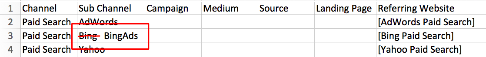

# Canais e subcanais de marketing {#marketing-channels-and-subchannels}

## Finalidade {#purpose}

Para definir o que são um canal e um subcanal no [!DNL Marketo Measure], como se relacionam com o seu conteúdo, a diferença entre as duas classificações e como são usados no aplicativo do [!DNL Marketo Measure].

## Visão geral {#overview}

Os Canais de marketing são usados para ajudar a categorizar (ou &quot;categoria&quot;) suas atividades de marketing para facilitar os relatórios, tanto no [!DNL Marketo Measure] Traço de ROI quanto no seu CRM. [!DNL Marketo Measure] O vem com 12 canais prontos para uso (que você pode personalizar/renomear para atender às convenções de sua organização), bem como a capacidade de criar canais personalizados para oferecer uma filtragem ainda mais granular.

Sempre que receber um visitante em uma página de conteúdo no site (seja esse conteúdo uma página da Web, um download de white paper, um URL de página, etc.), esse lead será &quot;compartimentado&quot; em um canal/subcanal com base em vários parâmetros de UTM encontrados no URL:

* Meio
* Origem
* Campanha
* Página de destino
* Site de referência

Para personalizar em qual &quot;compartimento&quot; seus leads se encaixarão com base nos parâmetros UTM, você pode usar as Regras de canal. Para obter mais informações sobre como configurar e manter suas Regras de canal, [clique aqui](/help/channel-tracking-and-setup/online-custom-channel-setup.md).

Saiba como configurar seus [Canais online](/help/channel-tracking-and-setup/online-custom-channel-setup.md) e [Canais offline](/help/channel-tracking-and-setup/offline-custom-channel-setup.md) bem como a diferença entre eles.

**Canal de marketing**

O Canal de marketing é o nível de classificação mais amplo e pode abranger uma grande variedade de subcanais. Considere-os como o “tipo” de subcanal de onde seus leads vêm. Exemplos de canais de marketing incluem **Pesquisa paga, Pesquisa orgânica, Exibição,** e **Social pago**. O Canal de marketing geralmente corresponde ao valor do parâmetro utm_medium encontrado no URL.

**Subcanal**

Os subcanais são a segunda peça do quebra-cabeça ao compartimentar seus leads recebidos. Os subcanais mostram exatamente _qual_ iteração do seu canal de marketing foi usada. Por exemplo, no Canal de Marketing Social Pago, você pode ter Subcanais para **AdWords**, **BingAds**, **Facebook** etc. O Subchannel geralmente corresponde ao valor do parâmetro utm_source encontrado no URL.

## Exemplo de caso de uso {#use-case-example}

O diagrama abaixo ilustra um exemplo de canal de marketing, subcanal e conteúdo com base em uma página da Web com o seguinte URL:

* [http://info.bizible.com/intro-guide-b2b-marketing-attribution?utm_source=linkedin&amp;utm_medium=paidsocial](http://info.bizible.com/intro-guide-b2b-marketing-attribution?utm_source=linkedin&utm_medium=paidsocial)*

Nesse caso, o conteúdo que o usuário está tentando acessar é o Guia de introdução à atribuição de marketing B2B. [!DNL Marketo Measure] O analisará o URL que leva a esse Conteúdo usando as Regras de canal configuradas nesta organização e as usará para &quot;agrupar&quot; esse lead no Canal de marketing &quot;Social pago&quot; e no Subcanal &quot;LinkedIn&quot;.

Mais exemplos...

**Canal de marketing (médio)**

* PPC
* Social pago
* Social orgânico
* Email
* Eventos e Conferências
* Pesquisa orgânica/SEO
* PR
* Programas de referência

**Subcanal (origem do ponto de contato)**

* Google AdWords
* BingAds
* Anúncios do Facebook
* Adroll
* Clique duplo
* Capterra
* Campanhas de gotejamento
* Anúncios do LinkedIn

**Conteúdo (white papers, URLs de páginas, publicações de blog)**

* www.adobe.com/blog1
* www.adobe.com/whitepaper
* www.adobe.com/sign-up-now
