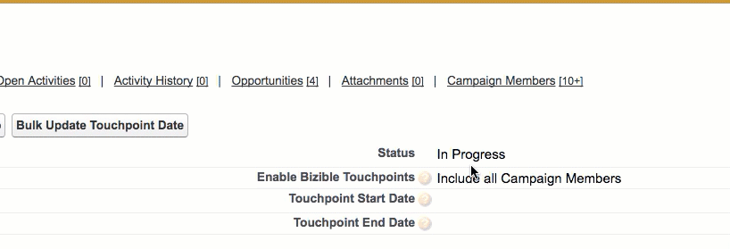

# Datas de sincronização da campanha {#campaign-sync-dates}

Saiba o que o recurso Datas de sincronização de campanha faz, bem como oferecer alguns casos de uso para esse recurso.

**[!DNL Marketo Measure]Pacote necessário: 6.9 ou superior**

Esse recurso consiste em dois campos de data simples no [!DNL Salesforce] Objeto da campanha:

* Data de início do ponto de contato
* Data final do ponto de contato

Quando os Pontos de contato do comprador estiverem ativados em uma campanha específica, as Datas de sincronização da campanha permitirão definir os parâmetros de Data do ponto de contato na campanha individual. Portanto, se você adicionasse uma Data final de ponto de contato de 1º de março de 2017 então [!DNL Marketo Measure] O criará somente pontos de contato em membros da campanha que foram adicionados à campanha antes dessa data. [!DNL Marketo Measure] O não criará pontos de contato para membros da campanha que foram adicionados após 1º de março de 2017.

Da mesma forma, se você adicionasse uma Data de início de ponto de contato em uma Campanha (digamos 1º de janeiro de 2017), então [!DNL Marketo Measure] O não criará pontos de contato nos membros da campanha que foram adicionados à campanha antes de 1º de janeiro de 2017. Você não precisa adicionar uma Data inicial do ponto de contato se adicionar uma Data final do ponto de contato e vice-versa.

## Casos de uso {#use-cases}

**Pontos de contato de preenchimento retroativo**

Pode haver momentos em que uma equipe de marketing não consegue adicionar parâmetros utm a um esforço de marketing específico. As Datas de sincronização da campanha permitirão (se você usar campanhas SFDC para esforços online) preencher retroativamente alguns dados perdidos. Digamos que você esteja executando uma campanha de email que começou em 1º de maio, mas sua equipe não adicionou parâmetros utm nessa campanha de email até 15 de maio. Se você estiver rastreando conversões de email por meio de uma Campanha SFDC, poderá definir uma Data final de ponto de contato, em 15 de maio, nessa Campanha e ativar pontos de contato para membros &quot;Respondidos&quot; da Campanha. Essa ação informará [!DNL Marketo Measure] para criar pontos de contato para todas essas respostas até 15 de maio.

**Pontos de contato da associação de campanha retroativa**

Se você é um novo [!DNL Marketo Measure] cliente, você pode estar interessado em trazer alguns dos dados de marketing que tem rastreado por meio das Campanhas SFDC. No entanto, se você ativasse os Pontos de Contato para suas campanhas SFDC online, você poderia se deparar com o problema da atribuição de dupla contagem desde [!DNL Marketo Measure] O cria automaticamente pontos de contato para seus esforços de marketing online. Em um esforço para evitar a dupla contagem de dados, você pode usar as Datas finais do ponto de contato da campanha para definir um limite nas datas do ponto de contato criadas por [!DNL Marketo Measure] na campanha SFDC. Como exemplo, se você deseja adicionar conversões retroativas para uma Campanha Social, você tem rastreado no SFDC, mas sabe que adicionou a variável [!DNL Marketo Measure] O JavaScript (que está criando pontos de contato online) em 1º de julho, você pode editar a Campanha SFDC Social para conter uma Data final do ponto de contato igual a 1º de julho e ativar os pontos de contato do comprador para essa campanha.

Pode haver muitos outros casos de uso para datas de término do ponto de contato. Se precisar de ajuda para descobrir uma situação específica, não hesite em entrar em contato com a [Suporte Marketo](https://nation.marketo.com/t5/support/ct-p/Support){target=&quot;_blank&quot;}.

>[!MORELIKETHIS]
>
>[[!DNL Marketo Measure] Universidade: Campos de membro da campanha e da campanha](https://learn.bizible.com/2-bizible-customization/137720https://universityonline.marketo.com/courses/bizible-fundamentals-channel-management/#/page/5c63007334d9f0367662b758)
