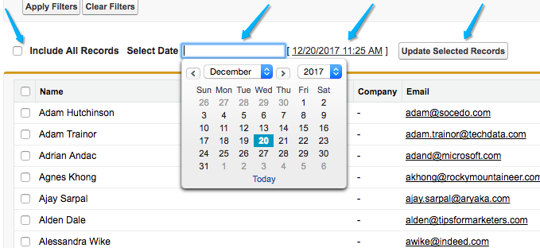

# Campanhas e membros da campanha {#campaigns-and-campaign-members}

[!DNL Salesforce] As campanhas são destinadas a rastrear listas de leads e contatos associados a um programa de marketing ou atividade. Isso geralmente tem sido webinars, registros ou ambas as visitas, por exemplo. Os profissionais de marketing podem selecionar se uma campanha deve ser creditada em uma jornada de ponto de contato.

## Ativação de pontos de contato {#enabling-touchpoints}

O [!DNL Marketo Measure] [!DNL Salesforce] O pacote incluirá um campo chamado &quot;Ativar pontos de contato do comprador&quot; no objeto Campanha. Depois que o campo for adicionado ao layout da página, ele será exibido da seguinte maneira:

As opções disponíveis na lista de seleção são:

* Incluir todos os membros da campanha - cada líder ou contato adicionado à campanha receberá um ponto de contato associado a ela.
* Incluir apenas membros da campanha &quot;Respondidos&quot; - Somente leads ou contatos com status de membro da campanha &quot;Respondidos&quot; receberão um ponto de contato associado à campanha.
* Excluir todos os membros da campanha - nenhum dos leads ou contatos receberá um ponto de contato associado à campanha.

Observe que os membros da campanha devem ter um endereço de email associado ao registro para [!DNL Marketo Measure] para criar um ponto de contato. Sem um endereço de email, [!DNL Marketo Measure] não atribuirá um ponto de contato ao membro da campanha.

## Datas de sincronização da campanha {#campaign-sync-dates}

Com a instalação do pacote, [!DNL Marketo Measure] também incluirá 2 campos de data no objeto Campaign: Data inicial do ponto de contato e Data final do ponto de contato.

Essas datas informam [!DNL Marketo Measure] quando devemos começar ou parar de incluir Membros da campanha da campanha na jornada do ponto de contato. Você pode definir uma data, ou ambas, ou nenhuma.

## Caso de uso para data de início do ponto de contato {#use-case-for-touchpoint-start-date}

A data de início pode ser usada no caso de uma Campanha existente ser usada para rastrear Leads e Contatos, mas o usuário só deseja iniciar a medição depois que novos sistemas ou processos estiverem em vigor, para que ele decida definir uma data de início uma vez [!DNL Marketo Measure] O deve começar a rastrear esses Membros da campanha.

## Caso de uso para data final do ponto de contato {#use-case-for-touchpoint-end-date}

Se antes de usar [!DNL Marketo Measure], você usou uma plataforma de Automação de marketing que rastreou as interações digitais dos Leads (envios de formulário do IE) e, em seguida, carregou esses Leads em um [!DNL Saleforce] Campanha, você pode aproveitar o campo Data final do ponto de contato . Você definiria a Data final do ponto de contato como a data inicial com [!DNL Marketo Measure] e ativar os Pontos de Contato do Comprador, então cada interação digital desses Leads seria criada como um Ponto de Contato. O motivo pelo qual você definirá a Data final do ponto de contato como a Data inicial com [!DNL Marketo Measure] é porque, seguindo em frente, nós rastrearemos essas interações digitais por meio do nosso javascript.

## Membros da campanha {#campaign-members}

Os membros da campanha são aninhados em [!UICONTROL Campanhas]e estão relacionadas a um Cliente Potencial ou Contato. Um lead ou um contato só pode ser adicionado uma vez a uma campanha, o que pode ser problemático dependendo do caso de uso da campanha. Quando uma Campanha é sincronizada, a associação da campanha é usada como uma atividade de marketing que é colocada na jornada do ponto de contato e tratada como um preenchimento de formulário.

## Status do ponto de contato do comprador {#buyer-touchpoint-status}

Se estiver ativado, [!DNL Marketo Measure] O enviará um valor de status para o Membro da campanha em 4 campos diferentes incluídos no pacote instalado: Status do ponto de contato (lead), Status do ponto de contato (contato), Status do ponto de contato (oportunidade) e Data do status do ponto de contato. Isso ajuda os clientes a auditar se um ponto de contato foi criado ou não como um ponto de contato de atribuição de comprador ou um ponto de contato de atribuição de comprador, dependendo do objeto ao qual ele está relacionado. A Data do status do ponto de contato é simplesmente a última data em que o status foi atualizado no membro da campanha.

## Data do ponto de contato do comprador {#buyer-touchpoint-date}

Com a instalação do pacote, [!DNL Marketo Measure] também inclui um campo no Membro da campanha chamado &quot;Data do ponto de contato do comprador&quot;. Isso permite que o usuário substitua a data que [!DNL Marketo Measure] usaria para a Data do ponto de contato no registro do ponto de contato.

Isso pode ser necessário se uma lista tiver sido carregada dias/semanas/meses após um evento realmente ter ocorrido. Há maneiras de atualizar todos os registros de uma só vez, o que é explicado abaixo.

Para saber se você precisa usar a Data do ponto de contato do comprador ou não, veja como as datas são determinadas por [!DNL Marketo Measure] dependendo do [!UICONTROL Tipo de sincronização] que é selecionado para a Campanha.

Se a variável [!UICONTROL Tipo de sincronização] for definida como &quot;Incluir todos os membros da campanha&quot;, a prioridade de definir a Data do ponto de contato será de cima para baixo:

* Data do ponto de contato do comprador
* Data de criação do membro da campanha

Se a variável [!UICONTROL Tipo de sincronização] for definida como &quot;Incluir somente membros da campanha &quot;respondidos&quot;, a prioridade de definir a Data do ponto de contato será de cima para baixo:

* Data do ponto de contato do comprador
* Data da primeira resposta
   * A Primeira Data Respondida é automaticamente definida assim que o Status é alterado para &quot;Respondido&quot; e é um padrão [!DNL Salesforce] campo que não pode ser alterado

* Data de criação do membro da campanha

## Data do ponto de contato de atualização em massa {#bulk-update-touchpoint-date}

A Data do ponto de contato da atualização em massa está incluída no [!DNL Marketo Measure] [!DNL Salesforce] o pacote e o botão precisarão ser adicionados ao layout da página.

Se um grande número de registros do Membro da campanha precisar ser atualizado, você poderá usar a variável [!UICONTROL Data do ponto de contato de atualização em massa] botão para editar em massa.

Se houver casos de uso exclusivos que não sejam abordados por essa interface, você também poderá usar o [Carregador de dados](https://dataloader.io/){target=&quot;_blank&quot;} para exportar os registros, fazer a alteração e fazer upload dos registros de volta.

Comece pesquisando os registros e filtrando aqueles para os quais deseja definir uma Data do ponto de contato do comprador.

>[!CAUTION]
>
>Há uma pesquisa que não funciona, que é exibida no exemplo abaixo. A interface do usuário não suporta a pesquisa por Datas nulas de ponto de contato do comprador (a pesquisa abaixo não funcionaria):

Se não precisar usar a pesquisa e apenas aplicar as datas a cada registro de Membro da campanha, use o &quot;[!UICONTROL Incluir todos os registros]&quot; caixa de seleção (veja a captura de tela abaixo), que verificará todos os registros em todas as páginas.

Selecione a data e a hora no seletor de calendário. Se desejar selecionar a data e hora atuais, clique na data/hora mostrada ao lado do seletor de calendário.

Depois que a data e a hora forem definidas, clique no botão **[!UICONTROL Atualizar Registros Selecionados]** para aplicar as alterações.

## Custos da campanha {#campaign-costs}

Saiba tudo sobre os custos da campanha [neste artigo](/help/marketing-spend/spend-management/crm-campaign-costs.md).

## Remoção de Membro da Campanha {#campaign-member-removal}

A maneira como [!DNL Marketo Measure] O mantém registros excluídos no Salesforce, independentemente de serem excluídos Leads ou Accounts ou Oportunidades, é visualizar esses registros na API e rastrear se uma entrada está marcada como &quot;IsDeleted&quot;. Infelizmente, com os Membros da Campanha, o Salesforce introduziu uma maneira diferente de excluir esses Membros da Campanha de uma Campanha e eles são apenas marcados como &quot;removidos&quot; em vez de &quot;excluídos&quot;, então o problema é que os pontos de contato ainda viviam no Salesforce, que estavam relacionados aos Membros excluídos da Campanha.

Para contornar esse problema, [!DNL Marketo Measure] criado um [!DNL Marketo Measure] Objeto History e um acionador a ser monitorado sempre que os membros da campanha forem removidos e, em seguida, excluir o ponto de contato correspondente. **Você precisará [!DNL Marketo Measure] Pacote do Marketing Analytics V6.15 ou superior** para usar esse recurso.

>[!CAUTION]
>
>Lembre-se de que esse acionador não rastreia nenhum membro da campanha que foi removido no passado, portanto, isso só funciona daqui para frente. Se precisar remover um grande número de pontos de contato de membros da campanha anteriores, entre em contato com [Suporte Marketo](https://nation.marketo.com/t5/support/ct-p/Support){target=&quot;_blank&quot;}.

>[!MORELIKETHIS]
>
>[[!DNL Marketo Measure] Universidade: Campos de objeto da campanha](https://universityonline.marketo.com/courses/bizible-fundamentals-channel-management/#/page/5c63007334d9f0367662b758)
>
>[[!DNL Marketo Measure] Universidade: Mapeamento de canais offline](https://universityonline.marketo.com/courses/bizible-fundamentals-channel-management/#/page/5c630eca34d9f0367662b77f)
