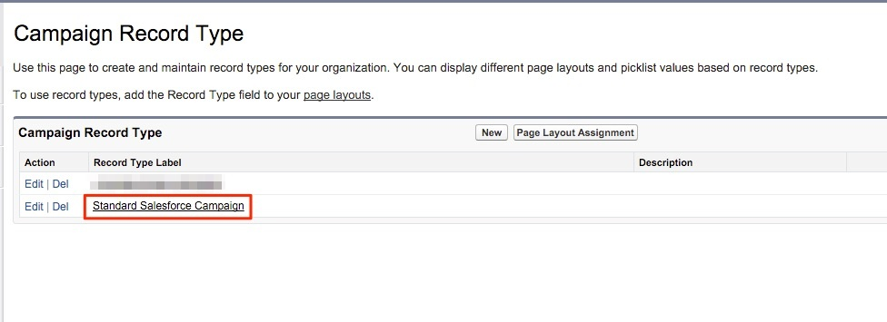
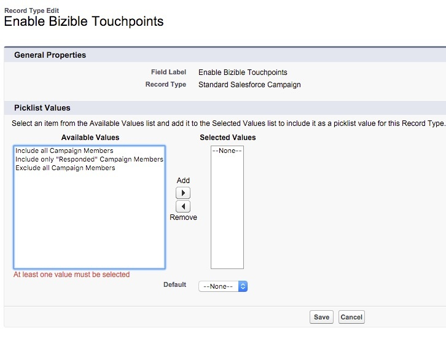

# Configurações para vários tipos de registro de campanha {#configurations-for-multiple-campaign-record-types}

**Valores de Lista de Opções Ausentes do Campo &quot;Habilitar Pontos de Contato do Comprador&quot;**

Se a organização da SFDC usar vários tipos de registro de campanha, os valores da lista de opções para &quot;Ativar pontos de contato do comprador&quot; deverão ser adicionados para cada tipo de registro. Para adicionar as opções, siga as etapas abaixo.

1. Vá para **[!UICONTROL Configuração]** > **[!UICONTROL Personalizar]** > **[!UICONTROL Campanhas]** > **[!UICONTROL Tipos de Registros]**.

   

1. Selecione os Tipos de registro de campanha clicando no **[!UICONTROL Rótulo de tipo de registro]**, não no botão [!UICONTROL editar].

   

1. Aqui você é trazido para a tela com as listas de seleção disponíveis para esse tipo de registro. Selecione **[!UICONTROL Editar]** ao lado do campo &quot;Habilitar pontos de contato do comprador&quot;.

   

1. Adicione todos os três valores do agrupamento &quot;Valores Disponíveis&quot; ao agrupamento &quot;Valores Selecionados&quot;.

   

1. Defina o valor padrão como &quot;None&quot; e clique em **[!UICONTROL Salvar]**. Repita o procedimento para qualquer tipo de registro de campanha adicional.
