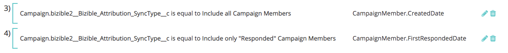
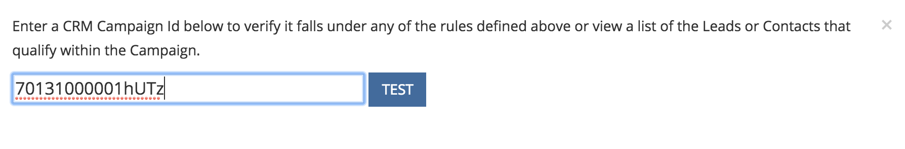

# Sincronização de campanha personalizada {#custom-campaign-sync}

Hoje, com o instalado [!DNL Marketo Measure] , é possível indicar quais campanhas devem ser incluídas como um ponto de contato qualificado. Há vários obstáculos para isso, pois existia anteriormente. Uma vez [!DNL Marketo Measure] estiver instalado no CRM, pode levar tempo para ser aprovado pela equipe de segurança. Além disso, há falta de flexibilidade ao usar uma única lista de seleção no objeto do Campaign. Com esse novo recurso, uma instalação de pacote não é necessária para começar a usar registros do Campaign e do Campaign Member. As regras podem ser criadas para definir exatamente quais registros podem ser criados para definir exatamente quais registros estão qualificados.

## Requisitos {#requirements}

* A Sincronização de Campanha está disponível em todas as camadas
* Para importar dados, você ainda precisa se conectar ao seu CRM [!DNL Marketo Measure] account

## Como funciona {#how-it-works}

1. Com permissões de AccountAdmin, você pode navegar até **[!UICONTROL Configurações]** > **[!UICONTROL Campanhas]** e veja a Interface do usuário de regras Sincronizar membros da campanha .
1. Clique no botão **+** ícone para começar a criar uma regra.

   

1. Você tem a opção de criar uma regra de [!UICONTROL Campanha] ou [!UICONTROL Membro da campanha] campos. Preencha o restante da regra com o Operador e o Valor que devemos validar. No exemplo abaixo, estamos verificando uma campanha específica pelo nome.

   

   >[!NOTE]
   >
   >Os campos de fórmula não podem ser usados em suas regras e não aparecerão na lista de seleção. Como as fórmulas são calculadas em segundo plano e não modificam um registro, [!DNL Marketo Measure] O não pode detectar se um registro se encaixa em uma regra ou não.

1. Escolha a Data do ponto de contato. A lista de datas possíveis será exibida depois que você inserir uma chave `{` - em seguida, você pode selecionar a data que deseja aplicar a todos os pontos de contato criados a partir da regra.

   

   >[!NOTE]
   >
   >Se estiver usando regras de Sincronização de campanha personalizadas, [!DNL Marketo Measure] O não lerá atualizações feitas usando o botão Atualizar data do ponto de contato em massa.

1. Clique na marca de seleção e adicione regras adicionais para campanhas adicionais, conforme necessário.

   

   >[!NOTE]
   >
   >Agora que as regras são definidas ao lado da Sincronização de CRM, as regras declaradas irão naturalmente começar a entrar em conflito. Se optar por continuar a usar a Sincronização de campanha personalizada _e_ No Tipo de Sincronização do CRM, é importante criar regras para que os Tipos de Sincronização do CRM não sejam ignorados.

   

   >[!NOTE]
   >
   >Se você estiver pensando em eventualmente parar o usuário do [!UICONTROL Tipo de Sincronização CRM], é ideal criar regras que não fazem referência ao &quot;Tipo de sincronização&quot;, mas _still_ mantenha os pontos de contato do CRM atual. Dessa forma, as regras ainda funcionam se/quando essa mudança é feita.

Este é um exemplo do que pareceria, para que nenhum ponto de contato existente do CRM seja perdido:

## Validação {#validation}

Você pode verificar facilmente os registros de Pontos de contato de atribuição do comprador e de Ponto de contato de atribuição do comprador dentro da campanha para garantir que as regras estejam funcionando corretamente. Aqui está um BAT que [!DNL Marketo Measure] criado com a Data do ponto de contato dinâmico apropriada, retirada da Campanha. O campo Data de criação está na imagem abaixo dele.

## Testando {#testing}

1. O recurso de Sincronização de campanha vem com um recurso de teste para que você possa verificar se as regras criadas realmente se encaixam nos critérios da campanha. Comece clicando no link [!UICONTROL Teste] botão. As regras devem ser salvas primeiro antes que você possa começar a testar.

   

   Um pop-up será exibido, onde você pode inserir um ID de campanha (15 ou 18 caracteres do CRM) para testar. O objetivo é inserir o ID da campanha do CRM que você estava tentando sincronizar para garantir que corresponda à regra criada.

   

1. Depois de clicar em [!UICONTROL Teste], você verá o nome da campanha e o número de membros da campanha qualificados para pontos de contato. Uma tabela será exibida abaixo mostrando todas as regras que correspondem à sua ID da campanha. Somente as correspondências serão exibidas.

   

1. Você também pode clicar na contagem de membros para ver uma lista dos Leads and Contacts e suas Ids que fazem parte da qualificação de regras do Campaign. Este é apenas um conjunto de amostras e será exibido em até 50 para que você possa ter uma ideia de quais registros se qualificam.

   
