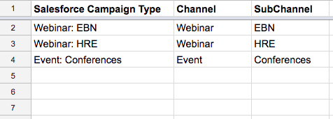

# Configuração de canal personalizado offline {#offline-custom-channel-setup}

## Introdução {#getting-started}

Em comparação com a forma como [!DNL Marketo Measure] lida com regras de canal online, você observará que as regras de canal offline não exigem o uso de uma planilha. No entanto, ainda há uma planilha fornecida no plano de implementação, pois isso pode ser útil para pensar a maneira como você deseja organizar seus canais offline.

A planilha tem três colunas:

**[!UICONTROL Salesforce] Tipo de campanha** - adicione os Tipos de campanha identificados em [!DNL Salesforce] aqui

* Por exemplo, pode ser um email, webinário, conferência ou qualquer valor criado para esse campo ao qual você deseja atribuir Pontos de contato.

**[!UICONTROL Canal]** - adicione seus vários canais de marketing aqui

**[!UICONTROL Subcanal]** - adicione quaisquer subcanais correspondentes aqui

## Lógica de canal offline {#offline-channel-logic}

A lógica do canal offline [!DNL Marketo Measure] é determinada pelo objeto Campaign, especificamente pelo Tipo de Campanha [!DNL Salesforce]. Cada esforço offline deve ter um [!DNL Salesforce] Tipo de Campanha, como jantar ou feira, porque [!DNL Marketo Measure] depende desse campo para entender para qual Canal e Subcanal mapear.

Os tipos de campanha do SFDC aparecerão na guia Canal offline, listada em [!DNL Salesforce] Tipo de campanha. Observe que [!DNL Marketo Measure] só pode importar Tipos de Campanha do SFDC para campanhas que tenham pontos de contato de Comprador associados a elas.

É aqui que você pode criar o mapeamento de Canal/Subcanal no aplicativo [!DNL Marketo Measure]. Isso provavelmente envolverá a criação de novos Canais e Subcanais no aplicativo [!DNL Marketo Measure], o que é feito na seção Criar Canais do aplicativo—mostrado na imagem abaixo. É necessário criar novos Canais e Subcanais para [!DNL Marketo Measure] para entender para onde enviar Pontos de Contato. Você pode decidir como deseja que os tipos de campanha sejam mapeados.

## Exemplo de mapeamento de canal {#channel-mapping-example}

Por exemplo, imagine que você participe de duas conferências [!DNL Salesforce] por ano. Cada conferência, no entanto, é muito diferente e tem um público-alvo exclusivo. Você quer saber qual dos dois traz mais valor. No ambiente [!DNL Salesforce], você pode dar ao evento de janeiro o Tipo de Campanha &quot;Conferência&quot;, nomear seu canal &quot;[!DNL Salesforce]&quot; e seu subcanal &quot;Conferência de janeiro&quot;.

Agora você quer fazer o mesmo para a conferência de junho. Como essa conferência também é uma conferência, pode receber o mesmo Tipo de campanha, nesse caso, &quot;Conferência&quot;. O canal é o mesmo, [!DNL Salesforce], e o subcanal desta segunda conferência é &quot;Conferência de junho&quot;. Isso faz sentido do ponto de vista organizacional. No entanto, é muito confuso para a lógica [!DNL Marketo Measure] ler e aplicar essas regras porque ambas as campanhas têm o mesmo Tipo de Campanha. O script [!DNL Marketo Measure] não pode mapear dados de um tipo para dois subcanais diferentes. Isso significa que seria necessário criar um novo Tipo de campanha para cada subcanal, mas os subcanais podem ter o mesmo canal.

Abaixo está um exemplo de lógica que [!DNL Marketo Measure] não conseguiria ler:

No cenário acima, você desejará criar um Tipo de campanha exclusivo, pois não é possível mapear o mesmo Tipo de campanha para dois subcanais diferentes. Em vez disso, você deve configurar tipos exclusivos como os seguintes:

Quaisquer tipos de campanha existentes devem ser incluídos no mapa do canal e &quot;NULL&quot; deve ser adicionado como canal.

Reserve tempo para acessar [!DNL Salesforce] para determinar o número e a natureza dos tipos de registros existentes que deseja incluir e se é necessário criar campanhas adicionais com base nas informações acima. Depois de preencher todas as informações necessárias, você estará pronto para fazer upload.

Saiba mais sobre [sincronização offline [!DNL Salesforce] Campanhas com [!DNL Marketo Measure]](/help/channel-tracking-and-setup/offline-channels/legacy-processes/syncing-offline-campaigns.md).

## Tratamento de campanhas do SFDC para esforços de marketing online {#handling-sfdc-campaigns-for-online-marketing-efforts}

É comum que as equipes de marketing criem campanhas do [!DNL Salesforce] para rastrear vários esforços de marketing digital. Não há problema com essa prática; no entanto, é importante tratar essas campanhas de forma diferente das campanhas offline reais, como correspondência direta ou conferências, por exemplo. Campanhas relacionadas a eventos digitais (interações que ocorrem em seu site) não devem ser sincronizadas com [!DNL Marketo Measure]. A sincronização dessas campanhas resultaria na duplicação de Pontos de Contato, pois o JavaScript [!DNL Marketo Measure] já está rastreando os esforços online.

Outra dica para manipular campanhas para atividades online é mapear o Tipo de Campanha [!DNL Salesforce] como NULL. Para fazer isso, primeiro crie um canal no aplicativo [!DNL Marketo Measure] chamado NULL, conforme demonstrado na imagem abaixo. Isso é encontrado no aplicativo [!DNL Marketo Measure], na seção **Criar Canais**. Isso será útil caso uma campanha que não deve ser sincronizada seja sincronizada acidentalmente. É fácil encontrar a campanha e corrigir o status de sincronização verificando tudo o que está classificado em NULL.

## Inserção de suas regras de canal offline no aplicativo {#entering-your-offline-channel-rules-to-the-app}

Depois de editar e atualizar a planilha com suas regras personalizadas, a próxima etapa é recriar esse mapeamento de canal no aplicativo [!DNL Marketo Measure]. Na verdade, você não carregará uma planilha para canais offline. Em vez disso, você inserirá as informações nas caixas de seleção conforme exibido na imagem abaixo. Isto é encontrado ao clicar em **[!UICONTROL Canais offline]** na seção **[!UICONTROL Canais]**.

>[!TIP]
>Deseja determinar _quando_ um Tipo de Campanha [!DNL Salesforce] é descarregado no mapeamento de canal [!DNL Marketo Measure]? Vá para **[!UICONTROL Configuração]** > **[!UICONTROL Campanhas]** > **[!UICONTROL Campos]** > **[!UICONTROL Tipo]**. Você pode ver quais valores estão na lista de opções e quais estão inativos. Os inativos não serão exibidos como um tipo selecionável na seção &quot;[!UICONTROL Canais offline]&quot;. Observe que esse processo pode levar de alguns minutos a 48 horas.

Clique em **[!UICONTROL Salvar]** quando terminar e [!DNL Marketo Measure] carregará as alterações e reprocessará os dados.

>[!MORELIKETHIS]
> [[!DNL Marketo Measure] Tutoriais: Mapeando Canais Offline](https://experienceleague.adobe.com/pt-br/docs/marketo-measure-learn/tutorials/onboarding/marketo-measure-salesforce/mapping-offline-channels){target="_blank"}
> [[!DNL Marketo Measure] Tutoriais: Sincronizando Campanhas Offline](https://experienceleague.adobe.com/en/docs/marketo-measure-learn/tutorials/onboarding/marketo-measure-salesforce/syncing-offline-campaigns){target="_blank"}
> [Integração de Programas Marketo Engage](/help/marketo-measure-and-marketo/marketo-engage-programs-integration.md#channel-mapping){target="_blank"}
