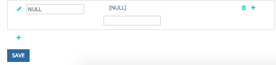

# Configuração de canal personalizado offline {#offline-custom-channel-setup}

## Introdução {#getting-started}

Em comparação com a forma [!DNL Marketo Measure] lida com regras de canal online, você notará que as regras de canal offline não exigem o uso de uma planilha. No entanto, ainda há uma planilha fornecida no plano de implementação, pois isso pode ser útil para pensar a maneira como você deseja organizar seus canais offline.

A planilha tem três colunas:

**[!UICONTROL Salesforce] Tipo de campanha** - adicionar Tipos de campanha identificados em [!DNL Salesforce] aqui

* Por exemplo, pode ser um email, webinário, conferência ou qualquer valor criado para esse campo ao qual você deseja atribuir Pontos de contato.

**[!UICONTROL Canal]** - adicione seus vários canais de marketing aqui

**[!UICONTROL Subcanal]** - adicione quaisquer subcanais correspondentes aqui

## Lógica de canal offline {#offline-channel-logic}

[!DNL Marketo Measure] a lógica do canal offline é determinada pelo objeto Campaign, especificamente pelo [!DNL Salesforce] Tipo de campanha. Cada esforço off-line deve ter um [!DNL Salesforce] Tipo de campanha, como jantar ou feira de negócios, porque [!DNL Marketo Measure] O depende desse campo para entender a qual Canal e Subcanal mapear.

Os tipos de campanha do SFDC aparecerão na guia do Canal offline, listada em [!DNL Salesforce] Tipo de campanha. Observe que [!DNL Marketo Measure] O só pode importar Tipos de campanha do SFDC para campanhas que tenham pontos de contato do comprador associados a elas.

É aqui que você pode criar o mapeamento de Canal/Subcanal no [!DNL Marketo Measure] aplicativo. Isso provavelmente envolverá a criação de novos Canais e Subcanais na [!DNL Marketo Measure] , que é feito na seção Criar canais do aplicativo, mostrado na imagem abaixo. Novos canais e subcanais precisam ser criados para o [!DNL Marketo Measure] para entender onde impulsionar os pontos de contato. Você pode decidir como deseja que os tipos de campanha sejam mapeados.

## Exemplo de mapeamento de canal {#channel-mapping-example}

Por exemplo, imagine que você compareça a dois [!DNL Salesforce] conferências por ano. Cada conferência, no entanto, é muito diferente e tem um público-alvo exclusivo. Você quer saber qual dos dois traz mais valor. No seu [!DNL Salesforce] ambiente, você pode dar ao evento de janeiro o tipo de campanha &quot;Conferência&quot;, nomeie o canal &quot;[!DNL Salesforce],&quot; e o subcanal &quot;Conferência de janeiro&quot;.

Agora você quer fazer o mesmo para a conferência de junho. Como essa conferência também é uma conferência, pode receber o mesmo Tipo de campanha, nesse caso, &quot;Conferência&quot;. O canal é o mesmo, [!DNL Salesforce], e o subcanal para esta segunda conferência é &quot;Conferência de junho&quot;. Isso faz sentido do ponto de vista organizacional. No entanto, é muito confuso [!DNL Marketo Measure] lógica para ler e aplicar essas regras, pois ambas as campanhas têm o mesmo Tipo de campanha. [!DNL Marketo Measure] o script não pode mapear dados de um tipo para dois subcanais diferentes. Isso significa que seria necessário criar um novo Tipo de campanha para cada subcanal, mas os subcanais podem ter o mesmo canal.

Abaixo está um exemplo de lógica que [!DNL Marketo Measure] não poderia ler:

No cenário acima, você desejará criar um Tipo de campanha exclusivo, pois não é possível mapear o mesmo Tipo de campanha para dois subcanais diferentes. Em vez disso, você deve configurar tipos exclusivos como os seguintes:

Quaisquer tipos de campanha existentes devem ser incluídos no mapa do canal e &quot;NULL&quot; deve ser adicionado como canal.

Reserve tempo para entrar em [!DNL Salesforce] para determinar o número e a natureza dos tipos de registro existentes, que você deseja incluir, e se você precisa criar campanhas adicionais com base nas informações acima. Depois de preencher todas as informações necessárias, você estará pronto para fazer upload.

Saiba mais sobre [sincronizando offline [!DNL Salesforce] Campanhas com [!DNL Marketo Measure]](/help/channel-tracking-and-setup/offline-channels/legacy-processes/syncing-offline-campaigns.md).

## Lidar com campanhas SFDC para esforços de marketing online {#handling-sfdc-campaigns-for-online-marketing-efforts}

É comum que as equipes de marketing criem [!DNL Salesforce] campanhas para rastrear vários esforços de marketing digital. Não há problema com essa prática; no entanto, é importante tratar essas campanhas de forma diferente das campanhas offline reais, como correspondência direta ou conferências, por exemplo. Campanhas relacionadas a eventos digitais (interações que ocorrem em seu site) não devem ser sincronizadas com [!DNL Marketo Measure]. A sincronização dessas campanhas resultaria na duplicação de Touchpoints, pois a [!DNL Marketo Measure] O JavaScript já está rastreando os esforços online.

Outra dica para lidar com campanhas para atividades online é mapear o [!DNL Salesforce] Tipo de campanha para NULL. Para fazer isso, primeiro crie um canal no [!DNL Marketo Measure] aplicativo intitulado NULL, conforme demonstrado na imagem abaixo. Isso é encontrado no [!DNL Marketo Measure] aplicativo no **Criar canais** seção. Isso será útil caso uma campanha que não deve ser sincronizada seja sincronizada acidentalmente. É fácil encontrar a campanha e corrigir o status de sincronização verificando tudo o que está classificado em NULL.

## Inserção de suas regras de canal offline no aplicativo {#entering-your-offline-channel-rules-to-the-app}

Depois de editar e atualizar a planilha com suas regras personalizadas, a próxima etapa é recriar esse mapeamento de canal no [!DNL Marketo Measure] app—na verdade, você não fará upload de uma planilha para canais offline. Em vez disso, você inserirá as informações nas caixas de seleção conforme exibido na imagem abaixo. Isso é encontrado clicando em **[!UICONTROL Canais offline]** no **[!UICONTROL Canais]** seção.

>[!TIP]
>
>Deseja determinar _quando_ a [!DNL Salesforce] O tipo de campanha é colocado em [!DNL Marketo Measure] mapeamento de canal? Ir para **[!UICONTROL Configuração]** > **[!UICONTROL Campanhas]** > **[!UICONTROL Campos]** > **[!UICONTROL Tipo]**. Você pode ver quais valores estão na lista de opções e quais estão inativos. Os inativos não serão exibidos como um tipo selecionável no nosso &quot;[!UICONTROL Canais offline]&quot;. Observe que esse processo pode levar de alguns minutos a 48 horas.

Clique em **[!UICONTROL Salvar]** quando terminar e [!DNL Marketo Measure] fará upload das alterações e reprocessará os dados.

>[!MORELIKETHIS]
>
>* [[!DNL Marketo Measure] Universidade: Mapeamento de Canais Offline](https://universityonline.marketo.com/courses/bizible-fundamentals-channel-management/#/page/5c630eca34d9f0367662b77f)
>
>* [[!DNL Marketo Measure] Universidade: sincronizando campanhas offline](https://universityonline.marketo.com/courses/bizible-fundamentals-channel-management/#/page/5c63286e34d9f0367662b78b)
>
>* [Integração de programas do Marketo Engage](/help/marketo-measure-and-marketo/marketo-measure-integrations-with-marketo/marketo-engage-programs-integration.md#channel-mapping)
