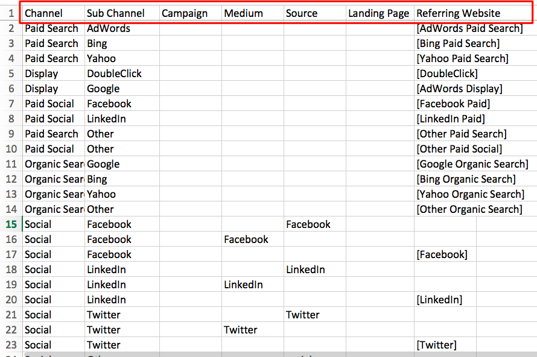

# Configuração de Canal Personalizado Online {#online-custom-channel-setup}

Para ter relatórios precisos, os canais de marketing devem ser configurados para refletir a estratégia de UTM da sua organização. Este guia o guiará pela melhor maneira de configurar suas regras de canal personalizadas.

## Antes de começar {#before-you-begin}

Antes de começar a criar as regras de canal para [!DNL Marketo Measure], tenha algum tempo para pensar sobre a organização de suas campanhas de marketing e como elas se encaixam no [!DNL Marketo Measure] estrutura. Você deve determinar quais canais, subcanais, campanhas e sites de referência deseja rastrear.

O que deve ser lembrado:

* Sua organização pode criar no máximo 40 canais de marketing personalizados. Isso inclui canais offline e online.
* Sua organização pode criar até 200 subcanais.
* Cada coleção ou bucket de dados precisa de sua própria regra (linha na planilha) para especificar como os dados serão organizados. Seja o mais específico possível.
* [!DNL Marketo Measure] A lógica prioriza os dados em ordem decrescente, começando pela linha superior da planilha e descendo. Ele lê cada bucket, ou célula, linha por linha, procurando pelo primeiro ajuste. Os dados são classificados de acordo com os valores nesses buckets. Mais informações sobre isso abaixo.
* Não classifique a planilha em ordem alfabética, pois isso interferirá nas regras de lógica.
* Depois que o arquivo for carregado, não será possível alterar nenhuma das regras por sete dias. [!DNL Marketo Measure] O utiliza esse tempo para processar e atualizar os pontos de contato.

## [!DNL Marketo Measure] Lógica e prioridades {#marketo-measure-logic-and-priorities}

O primeiro passo é baixar a planilha de canal personalizada do [!DNL Marketo Measure] aplicativo. Navegar para **Configurações** nos termos do **Minha conta** e selecione **Online**. Você pode selecionar **Baixar modelo original** ou **Baixar as regras atuais**.

A planilha tem 7 colunas:

* **Canal:** adicione seus vários canais de marketing aqui
* **Subcanal:** adicione os subcanais correspondentes aqui
* **Campanha:** adicione nomes de campanha aqui, independentemente do valor vir de UTMs ou Campanhas do Salesforce para a variável [!DNL Marketo Measure] Funcionalidade das atividades
* **Médio:** a coluna medium representa o valor do parâmetro utm_medium
* **Fonte:** a coluna de origem representa o valor do parâmetro utm_source
* **Página de aterrissagem:** adicionar página de aterrissagem aqui
* **Site de referência:** os URLs de sites que fazem referência ao tráfego para suas páginas ou [!DNL Marketo Measure] lógica (indicada por colchetes)

A 8ª coluna observa quais regras você não pode excluir da planilha com &quot;Não remover&quot;. A parte superior da planilha tem regras de canal padrão que [!DNL Marketo Measure] A recomenda que você não altere ou remova, mesmo que não use esses canais. [!DNL Marketo Measure] O tem integrações profundas com essas plataformas para que sejam incluídas por padrão.

As linhas representam as regras e a ordem em que [!DNL Marketo Measure] prioriza os dados. A primeira linha tem prioridade sobre a segunda linha, a segunda tem prioridade sobre a terceira linha e assim por diante. Ao determinar em qual canal e subcanal de marketing devem ser incluídos pontos de contato, [!DNL Marketo Measure] O lê de cima para baixo, da esquerda para a direita, até encontrar uma linha que atenda aos critérios do ponto de contato. (IE, se um ponto de contato tiver um utm_source=Facebook, o ponto de contato será inserido no canal Social.Facebook devido à regra 15 na captura de tela).

[!DNL Marketo Measure] O vem com 12 canais padrão para uso. Esses canais estão relacionados às plataformas com as quais [!DNL Marketo Measure] está totalmente integrado. Não os remova, quer os utilize ou não. Se você usar uma dessas plataformas, o Bing Ads, por exemplo, mas preferir usar uma convenção de nomenclatura diferente para o canal ou subcanal, será possível atualizar o nome. Um exemplo é mostrado na imagem abaixo.

A estrutura das regras também é importante. As regras podem parecer informações repetidas e dados ausentes, mas essa estrutura é intencional. Para uma classificação precisa de dados, é necessário mapear cada fonte individual para o canal apropriado separadamente, inclusive as fontes que compartilham subcanais e canais. Quanto mais detalhadas e granulares forem as regras, mais perceptíveis serão os resultados. Basicamente, é uma prática recomendada escrever uma regra detalhada para cada esforço de marketing que você deseja rastrear.

Considere a seguinte situação: você tem outros anúncios que não deseja rastrear por algum motivo, ou recebe visitas ao seu site de um canal familiar, mas não de uma fonte familiar. Essa situação pode levar à perda de dados se [!DNL Marketo Measure] não é possível encontrar a regra apropriada a ser usada para classificar os dados. Para evitar que isso aconteça, [!DNL Marketo Measure] O recomenda quebrar sua regra em várias linhas.

Cada parâmetro ou componente da regra é mapeado separadamente para o canal. Por exemplo, quando [!DNL Marketo Measure] has [!DNL Facebook] dados para classificar, ele procura regras relacionadas a [!DNL Facebook]. Ele faz a varredura de cima para baixo. No exemplo mostrado abaixo, [!DNL Marketo Measure] entenderia isso pela primeira vez [!DNL Facebook] subcanal, tudo o que ele precisa ler é o parâmetro de origem para soltar dados no bucket dessa regra.

A próxima regra somente solicita o parâmetro medium , portanto, todos os dados com esse parâmetro serão agrupados nesse canal. Por último, [!DNL Facebook], quaisquer dados provenientes do URL do Facebook serão colocados no último bucket do Facebook.

O canal padrão &quot;Outro&quot; existe para capturar dados que não atendem a nenhum critério de regra. Observe que alguns dos buckets no canal Outro contêm asteriscos (&#42;). Esses asteriscos representam curingas que agem como algo abrangente.

Devido a [!DNL Marketo Measure] lógica que funciona de cima para baixo, observe que a regra curinga, indicada com um asterisco (&#42;), deve ser colocada no final da planilha de regras. Todos os dados que não forem capturados ou classificados pelas outras regras serão automaticamente adicionados a este bucket curinga.

Abaixo estão mais exemplos de lógica curinga:

* &#42;email&#42; = contém &quot;email&quot;
* &#42;email = termina com &quot;email&quot;
* email&#42; = [!UICONTROL inicia com email]

Além disso, observe que se você criar um subcanal para um de seus canais, será necessário criar um subcanal para todas as regras nesse canal. Em outras palavras, se você criar um subcanal, não poderá deixar o restante das colunas em branco.

## Configuração das regras de canais personalizados {#setting-up-your-custom-channels-rules}

Depois de decidir como organizar e priorizar seus dados, você estará pronto para adicionar suas regras à planilha. Abaixo estão algumas práticas recomendadas:

* Mantenha suas regras o mais simples possível desde o início. Você sempre pode criar as regras conforme avança.
* Não adicione caracteres especiais nos nomes de canal (por exemplo, $%#&amp;&#42;@)
* Não edite as regras associadas ao BingAds e AdWords. Essas regras são cruciais para a segmentação de dados que vêm automaticamente da variável [!DNL Marketo Measure] Integração da API com essas plataformas. No entanto, alterar o subcanal e o nome do canal para atender às suas necessidades não é um problema.
* Não remova as regras que contêm uma nota &quot;Não remover&quot;.
* As regras de pesquisa orgânicas são sempre colocadas após a variável [!UICONTROL Regras de pesquisa paga]
* Não é possível criar regras com base em subdomínios diferentes.
* Se você tiver mais de um valor para adicionar em uma célula na planilha, certifique-se de separar os valores com um ponto e vírgula `;` somente. Sem vírgulas ou espaços.
* Não é necessário adicionar ponto com (.com) ao final do URL de referência.
* Ao adicionar um URL de referência, não o coloque entre parênteses como as outras regras relacionadas à API.

## Fazer upload de suas regras de canais personalizados {#uploading-your-custom-channels-rules}

Verifique se os novos valores de canal e subcanal adicionados no CSV já foram adicionados na área de configurações do canal da sua conta Bizible. Verifique novamente se todos os nomes de canal e subcanais correspondem no CSV com a área de configurações de canal de seu [!DNL Marketo Measure] conta. Verifique se há vírgulas e espaços.

Se você receber uma mensagem de erro durante o upload, corrija o problema e faça novamente o upload. Se nenhuma mensagem de erro for recebida, clique em **Salvar e processar** na parte inferior da página.
