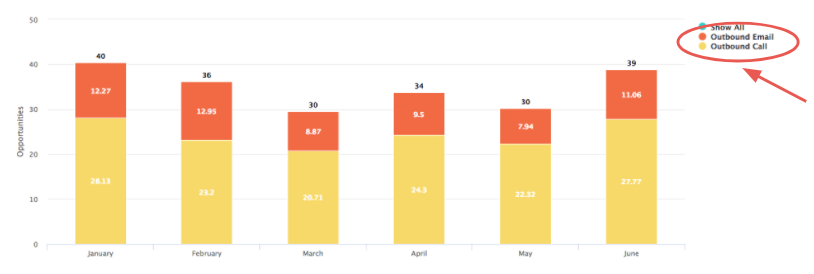
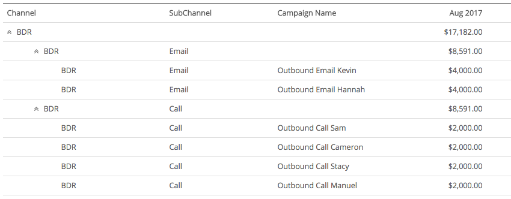
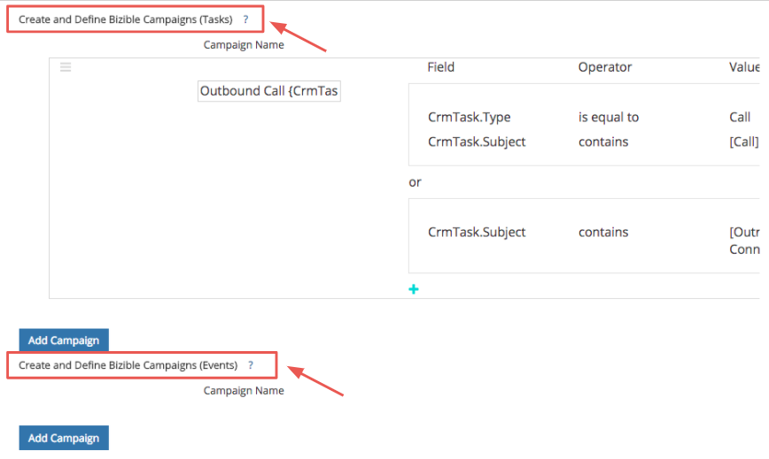
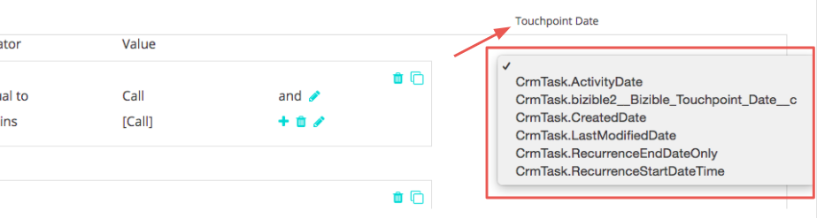
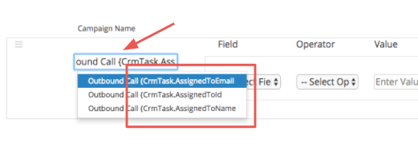
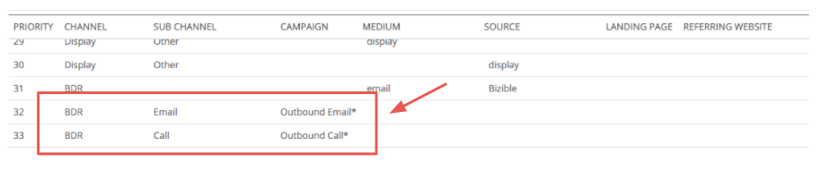
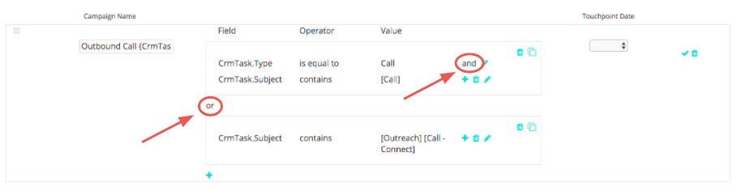

# Atribuição de atividades do Salesforce {#salesforce-activities-attribution}

A integração das Atividades do Salesforce [!DNL Marketo Measure] traz registros específicos de Tarefas e Eventos para seu modelo de atribuição. Comece a rastrear itens como emails de vendas ou telefonemas de vendas que não estavam recebendo o crédito devido. Para configurar a regra de atividades, vá para [experience.adobe.com/marketo-measure](https://experience.adobe.com/marketo-measure){target="_blank"}. A partir daí, vá para a guia **[!UICONTROL Configurações]** e clique na guia **[!UICONTROL Atividades]**.

Para começar, estamos introduzindo um novo conceito chamado Campanha [!DNL Marketo Measure]. Para cada regra que você definir, você vai agrupar os registros em uma Campanha [!DNL Marketo Measure] que pode nomear. Adicione várias campanhas conforme necessário. Imagine medir a eficácia de uma campanha de vendas de saída ao lado de uma campanha de mídia paga!

Você usará este Nome de Campanha [!DNL Marketo Measure] para nos informar a qual Canal ele deve ser mapeado. Se você ainda estiver pensando em Vendas de saída, talvez todas as campanhas de Vendas de saída devam ficar em um canal de BDR.

Familiarize-se com essa hierarquia:

* Canal
  * Subcanal
    * Campanha
    * Campanha
  * Subcanal
    * Campanha

>[!TIP]
>
>Se você quiser definir uma Campanha exclusiva para cada representante de vendas, por exemplo, use parâmetros de substituição dinâmicos para preencher o Nome da Campanha [!DNL Marketo Measure]. No mesmo exemplo, você pode inserir `"Outbound Sales - {AssignedTo}"` e ele o altera para algo como `"Outbound Sales - Jill"` ou `"Outbound Sales - Jack."`

Depois que o Nome da campanha [!DNL Marketo Measure] for definido, é hora de configurar as Regras de atividade.

As regras atuam como um filtro para informar quais registros estão qualificados para atribuição. Imagine que você esteja criando um relatório no seu CRM usando uma lógica semelhante para gerar esse relatório. Você tem a flexibilidade de usar uma combinação de instruções e/ou e vários operadores como `matches any`, `contains`, `starts with`, `ends with`, `is equal to`. Defina instruções `and` dentro de uma regra in a box ou instruções `or` de camada fora da caixa.

>[!NOTE]
>
>Os campos de fórmula não podem ser usados em suas regras e não aparecerão na lista de opções. Como as fórmulas são calculadas em segundo plano e não modificam um registro, o [!DNL Marketo Measure] não pode detectar se um registro se encaixa ou não em uma regra.
>
>Use os valores corretos para campos de ID, como CrmEvent.CreatedById. [!DNL Salesforce IDs] tem 18 caracteres (0054H000007WmrfQAC).

Por fim, escolha um dos campos de data ou data/hora para utilizar como a Data do Buyer Touchpoint. Os campos padrão e personalizados podem ser selecionados.

>[!TIP]
>
>Com a instalação do pacote, o [!DNL Marketo Measure] inclui um campo Data Buyer Touchpoint personalizado no registro de Atividade. Se quiser usar uma data dinâmica, como a data em que um status muda, é possível usar um fluxo de trabalho do CRM para definir a &quot;Data do Buyer Touchpoint&quot; e depois selecionar a Data do Buyer Touchpoint aqui nesta etapa.

Não se esqueça de definir regras diferentes para Tarefas ou Eventos. Você deve saber qual objeto a equipe de vendas usa para registrar as atividades.

Você provavelmente colocará esses novos pontos de contato em seu [Canal de marketing](https://experience.adobe.com/#/marketo-measure/MyAccount/Business?busView=false&id=10#/!/MyAccount/Business/Account.Settings.SettingsHome?tab=Channels.Online%20Channels){target="_blank"} apropriado. Faça isso definindo o Canal com o novo mapeamento de campanha que acabou de ser criado.

>[!TIP]
>
>Ao adicionar uma definição de Canal, use valores curingas, uma maneira mais fácil de indicar operadores como:
>
>começa com ( Saída&#42; )
>
>contém ( &#42;Saída&#42; )
>
>termina com ( &#42;Saída )
>
>Nenhum curinga significa basicamente &quot;é igual a&quot;, portanto, certifique-se de usá-los conforme necessário.

| **Operador** | **Caso de uso** |
|---|---|
| É Igual a | Valor único - correspondência exata |
| Contém | Valor único - contém valor |
| Corresponde a qualquer | Vários valores - Correspondência exata |
| Corresponde a Qualquer (Contém) | Vários valores - &#42;valor&#42;, &#42;valor, &#42;valor&#42; |

E por último, mas não menos importante, você tem a opção de inserir custos para seus novos canais. O [carregamento de Gastos com marketing](https://experience.adobe.com/#/marketo-measure/MyAccount/Business?busView=false&id=10#/!/MyAccount/Business/Account.Settings.SettingsHome?tab=Reporting.Marketing%20Gastos){target="_blank"} permite inserir seu gasto no nível do canal, do Subcanal ou da Campanha. Com suas novas Campanhas [!DNL Marketo Measure], você pode adicionar esses custos relacionados por mês e, em seguida, ver o ROI de cada Campanha!

>[!MORELIKETHIS]
>
>[Perguntas frequentes sobre atribuição de atividade](/help/channel-tracking-and-setup/activities-attribution-faq.md)
