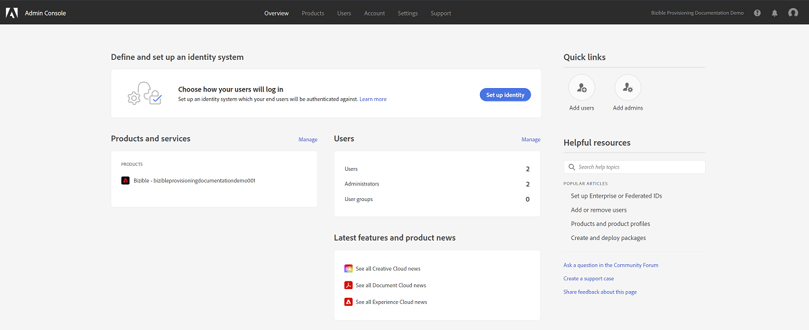
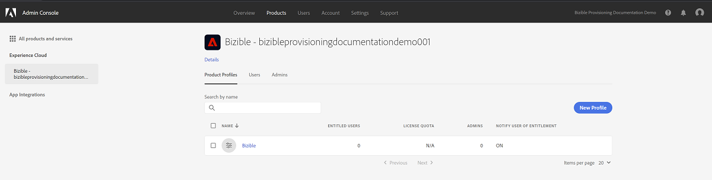

# Configuração do Adobe Admin Console {#adobe-admin-console-setup}

A primeira etapa para usar o [!DNL Marketo Measure] é criar e fazer logon no Adobe Admin Console provisionado. Se você ainda não recebeu o email com instruções de logon, entre em contato com o(a) representante de contas do [!DNL Marketo Measure].

## Configuração do Adobe Admin Console e do provedor de identidade {#set-up-your-adobe-admin-console-and-identity-provider}

Tratando-se de um produto do Adobe Suite, o [!DNL Marketo Measure] utiliza a funcionalidade completa do Adobe Admin Console para gerenciamento de identidade. Mais recursos podem ser [encontrados aqui](https://helpx.adobe.com/br/enterprise/using/admin-console.html).

Recomendamos analisar todos os recursos, práticas recomendadas e opções disponíveis para [gerenciamento de identidade](https://helpx.adobe.com/br/enterprise/using/set-up-identity.html).

Para obter orientação e revisar a configuração do gerenciamento de identidade no Adobe Admin Console, entre em contato com o(a) representante de conta do [!DNL Marketo Measure].

Para facilitar a autenticação e autorização de usuários nas instâncias do [!DNL Marketo Measure], siga estas etapas no Adobe Admin Console:

**Configuração do cartão do produto do [!DNL Marketo Measure]**

Ao acessar o Adobe Admin Console, você verá suas instâncias de produto do [!DNL Marketo Measure] na seção Visão geral.

Clique no cartão do produto do [!DNL Marketo Measure] para mostrar todas as instâncias do [!DNL Marketo Measure]. Por padrão, cada instância do [!DNL Marketo Measure] tem seu próprio perfil com o prefixo “[!DNL Marketo Measure]”. Todos os administradores ou usuários adicionados a este ou a qualquer outro perfil nesta instância poderão fazer logon no [!DNL Marketo Measure].

Nenhuma ação é necessária para criar um novo perfil nas instâncias de produto do [!DNL Marketo Measure].

Para começar a adicionar usuários com acesso ao [!DNL Marketo Measure], consulte a seção [Adição de admins do  [!DNL Marketo Measure]  e usuários do  [!DNL Marketo Measure] &#x200B;](#adding-marketo-measure-admins-and-marketo-measure-users) abaixo.

## Adição de administradores do [!DNL Marketo Measure] e usuários do [!DNL Marketo Measure] {#adding-marketo-measure-admins-and-marketo-measure-users}

A próxima etapa é conceder acesso ao aplicativo do [!DNL Marketo Measure] adicionando usuários. Isso pode ser feito no diretório de administradores e usuários do cartão de produto do [!DNL Marketo Measure].

| Tipo de usuário | Descrição |
|---|---|
| Administradores | são administradores(as) e usuários(as) avançados(as) do aplicativo do [!DNL Marketo Measure] com capacidade total de atualização e gerenciamento de opções de configuração específicas do [!DNL Marketo Measure] |
| Usuários | são usuários padrão do aplicativo do [!DNL Marketo Measure] com permissões somente leitura no aplicativo do [!DNL Marketo Measure] |

Ao adicionar usuários ao seu respectivo grupo, você verá o [tipo de identidade listado](https://helpx.adobe.com/br/enterprise/using/set-up-identity.html).

>[!NOTE]
>
>Para ser um administrador do [!DNL Marketo Measure] (em [experience.adobe.com/marketo-measure](https://experience.adobe.com/marketo-measure){target="_blank"}), um usuário deve ser adicionado como um Usuário _e_ como um Administrador em qualquer perfil de produto do [!DNL Marketo Measure] no cartão de produto do [!DNL Marketo Measure].

**Fazer logon no[!DNL Marketo Measure]**

Depois que um usuário é adicionado a um Perfil de Produto, ele pode acessar suas instâncias do [!DNL Marketo Measure] escolhendo a opção **Entrar com o Adobe ID** em [experience.adobe.com/marketo-measure](https://experience.adobe.com/marketo-measure){target="_blank"}.

