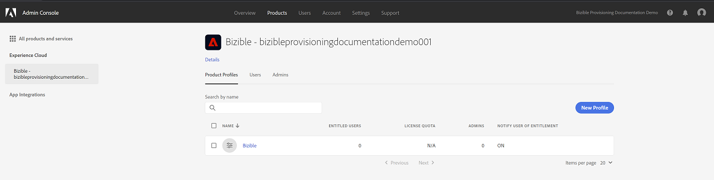

# Configuração do Adobe Admin Console {#adobe-admin-console-setup}

A primeira etapa para usar o [!DNL Marketo Measure] é criar e fazer logon na Adobe Admin Console provisionada. Se você ainda não recebeu o email com instruções de logon, entre em contato com [!DNL Marketo Measure] Representante da Conta.

## Configuração do Adobe Admin Console e o provedor de identidade {#set-up-your-adobe-admin-console-and-identity-provider}

Como um produto no Adobe Suite, [!DNL Marketo Measure] O usa a funcionalidade completa do Adobe Admin Console para Identity Management. Mais recursos podem ser [encontrados aqui](https://helpx.adobe.com/br/enterprise/using/admin-console.html).

Recomendamos analisar todos os recursos, práticas recomendadas e opções disponíveis para o [Identity Management](https://helpx.adobe.com/br/enterprise/using/set-up-identity.html).

Para obter orientação e revisão da configuração do Identity Management na Adobe Admin Console, entre em contato com o [!DNL Marketo Measure] Representante da Conta.

Para facilitar a autenticação e autorização do usuário com o seu [!DNL Marketo Measure] as seguintes etapas são necessárias no Adobe Admin Console:

**Configuração do Cartão do produto do [!DNL Marketo Measure]**

Ao acessar o Adobe Admin Console, você verá sua [!DNL Marketo Measure] Instâncias de produto presentes na seção Visão geral.

Clicar no [!DNL Marketo Measure] O Cartão do produto mostra todos os seus [!DNL Marketo Measure] instâncias. Por padrão, cada instância do [!DNL Marketo Measure] tem seu próprio perfil com o prefixo “[!DNL Marketo Measure]”. Todos os administradores ou usuários adicionados a este ou a qualquer outro perfil nesta instância poderão fazer logon no [!DNL Marketo Measure].

Nenhuma ação é necessária para criar um perfil na [!DNL Marketo Measure] Instâncias do produto.

Para começar a adicionar usuários que podem acessar [!DNL Marketo Measure], consulte o [Adicionando [!DNL Marketo Measure] Administradores e [!DNL Marketo Measure] Usuários](#adding-marketo-measure-admins-and-marketo-measure-users) abaixo.

## Adição de administradores do [!DNL Marketo Measure] e usuários do [!DNL Marketo Measure] {#adding-marketo-measure-admins-and-marketo-measure-users}

A próxima etapa é conceder acesso ao aplicativo do [!DNL Marketo Measure] adicionando usuários. Isso pode ser feito no diretório de administradores e usuários do cartão de produto do [!DNL Marketo Measure].

| Tipo de usuário | Descrição |
|---|---|
| Administradores | são administradores(as) e usuários(as) avançados(as) do aplicativo do [!DNL Marketo Measure] com capacidade total de atualização e gerenciamento de opções de configuração específicas do [!DNL Marketo Measure] |
| Usuários | esses são os usuários padrão do [!DNL Marketo Measure] Aplicativo com permissões somente leitura no [!DNL Marketo Measure] aplicativo |

Ao adicionar um usuário ao seu respectivo grupo, você verá seus [Tipo de identidade listado](https://helpx.adobe.com/br/enterprise/using/set-up-identity.html).

>[!NOTE]
>
>Para ser um [!DNL Marketo Measure] administrador (em [experience.adobe.com/marketo-measure](https://experience.adobe.com/marketo-measure){target="_blank"}), um usuário deve ser adicionado como um Usuário _e_ um Administrador para qualquer [!DNL Marketo Measure] perfil do produto no [!DNL Marketo Measure] cartão do produto.

**Fazendo logon no[!DNL Marketo Measure]**

Depois que um usuário é adicionado a um Perfil de produto, ele pode acessar seus [!DNL Marketo Measure] ao escolher a variável **Fazer logon com a Adobe ID** opção em [experience.adobe.com/marketo-measure](https://experience.adobe.com/marketo-measure){target="_blank"}.

