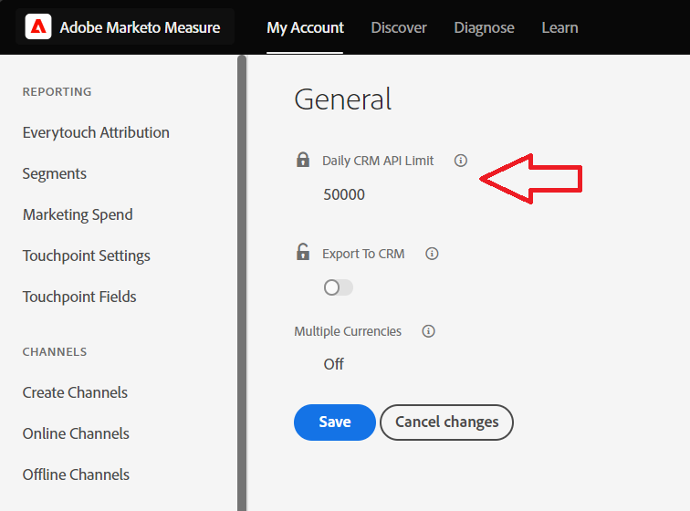
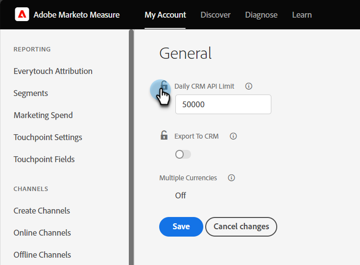

# Conectar o Marketo Measure ao Salesforce {#connect-marketo-measure-to-salesforce}

Este artigo fornece uma visão geral de como conectar seus [!DNL Salesforce] para a sua conta [!DNL Marketo Measure] conta.

## Conectando [!DNL Marketo Measure] com [!DNL Salesforce] {#connecting-marketo-measure-with-salesforce}

1. Use um navegador incógnito para fazer logon no [!DNL Marketo Measure].

1. Na barra de menus na parte superior da tela, navegue até **[!UICONTROL Minha conta]** e clique no link **[!UICONTROL Configurações]** opção.

1. Na coluna de opções de configuração à esquerda, clique em **[!UICONTROL Conexões]** localizado abaixo de [!UICONTROL Integrações] seção.

   

1. Na seção CRM, em Conexões, clique em **[!UICONTROL Configurar Nova Conexão do CRM]**.

   

1. Uma janela pop-up é exibida solicitando que você selecione a conexão CRM. Clique em **[!UICONTROL Conectar]** ao lado da [!DNL Salesforce] logotipo.

   

1. Uma janela pop-up final é exibida, solicitando o [!DNL Salesforce] credenciais, sandbox ou produção. Insira suas informações e clique em **[!UICONTROL Autorizar]** para conectar a conta ao [!DNL Marketo Measure].

>[!NOTE]
>
>[!DNL Marketo Measure] só pode ser conectado a um [!DNL Salesforce] instância de cada vez.
>
>* A [!DNL Marketo Measure] A instância do pode ser conectada a uma instância de sandbox do SFDC para testar a integração antes de alternar a conexão com sua instância de produção do SFDC.
>* Se você testar primeiro com uma sandbox da SFDC, recomendamos testar com uma que seja uma réplica exata da instância de produção da SFDC em termos de campos nos objetos Lead, Contact, Account, Opportunity, Campaign e Case. Se você tiver acionadores APEX ativos na produção que são acionados em atualizações dos objetos Lead, Contact, Account, Opportunity, Campaign e Case, tente ativá-los em sua sandbox.
>* Quando terminar os testes, você atualizará o [!DNL Marketo Measure] conta para apontar para sua Produção [!DNL Salesforce] (em vez de Sandbox [!DNL Salesforce]). Devido à forma como a integração foi criada, uma vez que um [!DNL Marketo Measure] A conta do está conectada à Produção [!DNL Salesforce], não é possível &quot;retroceder&quot; e conectar-se a uma sandbox [!DNL Salesforce] org.

## Uso de créditos de API {#api-credits-usage}

A Marketo Measure emprega uma tarefa de integração de CRM para fazer a interface com a Salesforce de um cliente por meio de um usuário integrado. Todas as trocas de dados por meio desse usuário usam créditos de API do Salesforce. Você pode alocar uma cota de crédito a um usuário de integração, o que serve para regular chamadas excessivas de API. Essa cota ou limite é redefinido a cada 24 horas.

É possível acessar esse limite no Marketo Measure via: **Minha conta** > **Configurações** > **CRM** > **Geral** > **Limite diário da API do CRM** e podem configurá-lo para seus locatários.

### Definição de um limite para créditos de API {#setting-a-limit-for-api-credits}

1. Navegue até **Minha conta** > **Configurações**.

1. Em CRM, clique em **Geral**. Você vê a **Limite diário da API do CRM** opção.

1. Clique no ícone Bloquear para editar.

   

1. Insira um limite desejado igual ou maior que 100.000. Clique em **Salvar** quando terminar.

   

>[!NOTE]
>
>Para aumentar os créditos de APIs do Salesforce disponíveis para sua solução conectada, entre em contato com o administrador do Salesforce e consulte [este documento do Salesforce](https://developer.salesforce.com/docs/atlas.en-us.salesforce_app_limits_cheatsheet.meta/salesforce_app_limits_cheatsheet/salesforce_app_limits_platform_api.htm){target="_blank"}.

>[!MORELIKETHIS]
>
>[Notificações de erro](/help/configuration-and-setup/getting-started-with-marketo-measure/error-notifications.md){target="_blank"}
