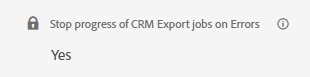
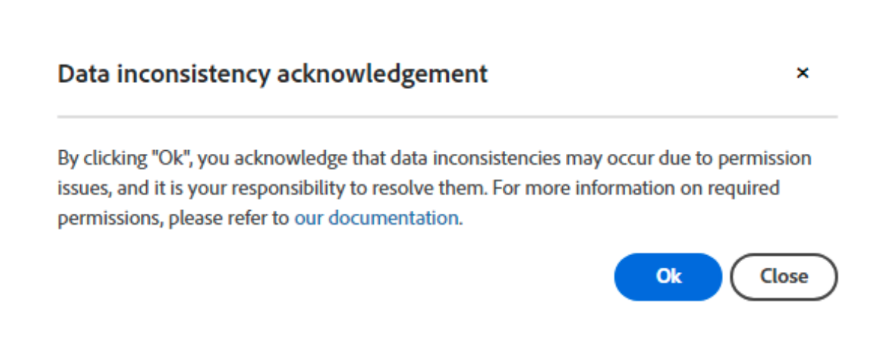

# Tratamento de erros para exportações do CRM

O recurso Pausar em Erros de Exportação permite controlar se os trabalhos de exportação do CRM devem ser pausados ao encontrar um erro de nível de registro.

A configuração pode ser encontrada em **Minha Conta** > **Configurações** > **CRM** > **Geral**.

>[!NOTE]
>
>Esse recurso só será visível se o recurso &quot;Exportar para CRM&quot; estiver habilitado.

Quando esse recurso é ativado, o trabalho de exportação para de progredir e permanece no registro em que o erro ocorreu, até que o problema seja resolvido. Esses erros geralmente ocorrem devido à ausência de permissões, regras de validação personalizadas aplicadas incorretamente ou problemas em fluxos de trabalho/acionadores. A tarefa continuará a ser executada conforme agendado e tentará automaticamente exportar o registro com falha novamente até que seja bem-sucedida.

Se você optar por desativar esse recurso, um pop-up de aviso será exibido, informando que isso pode levar a inconsistências de dados. Será sua responsabilidade tratar de qualquer problema que possa surgir a partir dessas inconsistências.

Em ambos os casos, se o recurso for ativado ou desativado, todos os erros de nível de registro encontrados serão registrados na tabela `ExportErrors`, e o trabalho `CRMExport_ExportError` tentará automaticamente reexportar esses registros diariamente. Isso elimina a necessidade de uma solicitação de suporte para iniciar uma reexportação, pois ela ocorrerá automaticamente sem qualquer intervenção do desenvolvedor.

Por que o trabalho está parando o comportamento necessário devido à funcionalidade `ExportErrors`? Ao interromper os trabalhos regulares de exportação de CRM em um registro específico, a solução de problemas se torna muito mais fácil. Ela permite executar tarefas localmente e impede a criação de um número potencialmente grande de ExportErrors, que precisariam ser recuperados e processados durante a reexportação.

Esse recurso pode ser ativado ou desativado com base no comportamento de sua preferência. Por exemplo, se você encontrar um código de erro particularmente desafiador e preferir aceitar dados &quot;incompletos&quot; temporariamente, poderá desativar o recurso. Depois que o problema for resolvido, você poderá ativar o recurso novamente para garantir que as exportações futuras sejam concluídas e precisas.
