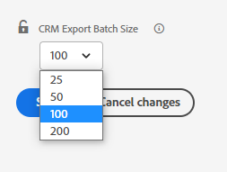

# Como o [!DNL Marketo Measure] e o [!DNL Salesforce] interagem {#how-marketo-measure-and-salesforce-interact}

>[!NOTE]
>
>Você pode ver instruções especificando “[!DNL Marketo Measure]” em nossa documentação, mas ainda ver “Bizible” em seu CRM. Estamos trabalhando para atualizar isso e a reformulação da marca será refletida em seu CRM em breve.

Vamos analisar em alto nível a relação entre o [!DNL Marketo Measure] e o Salesforce.

## Salesforce e [!DNL Marketo Measure] {#salesforce-and-marketo-measure}

Quando a conta do [!DNL Marketo Measure] é criada e o [!DNL Salesforce] é conectado, o [!DNL Marketo Measure] começará a enviar dados de marketing para a instância do CRM desde que o o pacote gerenciado do [!DNL Marketo Measure] esteja instalado e o usuário do Salesforce no [!DNL Marketo Measure] tenha permissões de edição.

Se você não instalou o pacote do Salesforce para [!DNL Marketo Measure], o [!DNL Marketo Measure] não gravará dados na sua instância do Salesforce.

Por padrão, o [!DNL Marketo Measure] exporta 200 registros por crédito de API sempre que um trabalho envia dados para seu CRM. Para a maioria dos clientes, isso fornece o equilíbrio ideal entre os créditos de API consumidos pelo [!DNL Marketo Measure] e os requisitos de recursos da CPU no CRM. No entanto, para clientes com configurações complexas de CRM, como fluxos de trabalho e acionadores, um tamanho de lote menor pode ser útil para melhorar o desempenho do CRM. Para isso, o [!DNL Marketo Measure] permite que os clientes configurem o tamanho do lote de exportação do CRM. Essa configuração está disponível na página [!UICONTROL Configurações] > [!UICONTROL CRM] > [!UICONTROL Geral] no aplicativo web do [!DNL Marketo Measure], e os clientes podem escolher entre tamanhos de lote de 200 (padrão), 100, 50 ou 25.

Ao modificar essa configuração, lembre-se de que tamanhos de lote menores consumirão mais créditos de API do seu CRM. É aconselhável reduzir o tamanho do lote somente se você estiver atingindo o tempo limite da CPU ou uma alta carga de CPU no CRM.

## Objetos e acesso padrão do Salesforce {#salesforce-standard-objects-and-access}

Lista os objetos padrão do [!DNL Salesforce] com os quais o [!DNL Marketo Measure] interage, bem como os campos personalizados que adicionamos a esses objetos depois que a conexão é estabelecida e o pacote do [!DNL Marketo Measure] é instalado. Pronto para uso, o [!DNL Marketo Measure] NÃO gravará em nenhum campo de objeto padrão do [!DNL Salesforce].

**Lead**

<table> 
 <tbody> 
  <tr> 
   <th>
Campos
</th> 
   <th>
Padrão/Personalizado
</th> 
   <th>
Ler
</th> 
   <th>
Gravar
</th> 
  </tr> 
  <tr> 
   <td>
ID
</td> 
   <td>
Padrão
</td> 
   <td>
x
</td> 
   <td> </td> 
  </tr> 
  <tr> 
   <td>
Email
</td> 
   <td>
Padrão
</td> 
   <td>
x
</td> 
   <td> </td> 
  </tr> 
  <tr> 
   <td>
Status
</td> 
   <td>
Padrão
</td> 
   <td>
x
</td> 
   <td> </td> 
  </tr> 
  <tr> 
   <td>
CreatedDate
</td> 
   <td>
Padrão
</td> 
   <td>
x
</td> 
   <td> </td> 
  </tr> 
  <tr> 
   <td>
LastModifiedDate
</td> 
   <td>
Padrão
</td> 
   <td>
x
</td> 
   <td> </td> 
  </tr> 
  <tr> 
   <td>
ConvertedDate
</td> 
   <td>
Padrão
</td> 
   <td>
x
</td> 
   <td> </td> 
  </tr> 
  <tr> 
   <td>
ConvertedContactId
</td> 
   <td>
Padrão
</td> 
   <td>
x
</td> 
   <td> </td> 
  </tr> 
  <tr> 
   <td>
ConvertedOpportunityId
</td> 
   <td>
Padrão
</td> 
   <td>
x
</td> 
   <td> </td> 
  </tr> 
  <tr> 
   <td>
IsConverted
</td> 
   <td>
Padrão
</td> 
   <td>
x
</td> 
   <td> </td> 
  </tr> 
  <tr> 
   <td>
IsDeleted
</td> 
   <td>
Padrão
</td> 
   <td>
x
</td> 
   <td> </td> 
  </tr> 
  <tr> 
   <td>
Site
</td> 
   <td>
Padrão
</td> 
   <td>
x
</td> 
   <td> </td> 
  </tr> 
  <tr> 
   <td>
Empresa
</td> 
   <td>
Padrão
</td> 
   <td>
x
</td> 
   <td> </td> 
  </tr> 
  <tr> 
   <td>
bizible2__Account__c
</td> 
   <td>
Personalizado
</td> 
   <td>
x
</td> 
   <td>
x
</td> 
  </tr> 
  <tr> 
   <td>
bizible2__Ad_Campaign_Name_FT__c
</td> 
   <td>
Personalizado
</td> 
   <td>
x
</td> 
   <td>
x
</td> 
  </tr> 
  <tr> 
   <td>
bizible2__Ad_Campaign_Name_LC__c
</td> 
   <td>
Personalizado
</td> 
   <td>
x
</td> 
   <td>
x
</td> 
  </tr> 
  <tr> 
   <td>
bizible2__Landing_Page_FT__c
</td> 
   <td>
Personalizado
</td> 
   <td>
x
</td> 
   <td>
x
</td> 
  </tr> 
  <tr> 
   <td>
bizible2__Landing_Page_LC__c
</td> 
   <td>
Personalizado
</td> 
   <td>
x
</td> 
   <td>
x
</td> 
  </tr> 
  <tr> 
   <td>
bizible2__Marketing_Channel_FT__c
</td> 
   <td>
Personalizado
</td> 
   <td>
x
</td> 
   <td>
x
</td> 
  </tr> 
  <tr> 
   <td>
bizible2__Marketing_Channel_LC__c
</td> 
   <td>
Personalizado
</td> 
   <td>
x
</td> 
   <td>
x
</td> 
  </tr> 
  <tr> 
   <td>
bizible2__Touchpoint_Date_FT__c
</td> 
   <td>
Personalizado
</td> 
   <td>
x
</td> 
   <td>
x
</td> 
  </tr> 
  <tr> 
   <td>
bizible2__Touchpoint_Date_LC__c
</td> 
   <td>
Personalizado
</td> 
   <td>
x
</td> 
   <td>
x
</td> 
  </tr> 
  <tr> 
   <td>
bizible2__Touchpoint_Source_FT__c
</td> 
   <td>
Personalizado
</td> 
   <td>
x
</td> 
   <td>
x
</td> 
  </tr> 
  <tr> 
   <td>
bizible2__Touchpoint_Source_LC__c
</td> 
   <td>
Personalizado
</td> 
   <td>
x
</td> 
   <td>
x 
</td> 
  </tr> 
 </tbody> 
</table>

**Contato**

<table> 
 <tbody> 
  <tr> 
   <th>
Campos
</th> 
   <th>
Padrão/Personalizado
</th> 
   <th>
Ler
</th> 
   <th>
Gravar
</th> 
  </tr> 
  <tr> 
   <td>
Conta
</td> 
   <td>
Padrão
</td> 
   <td>x</td> 
   <td> </td> 
  </tr> 
  <tr> 
   <td>
ID
</td> 
   <td>
Padrão
</td> 
   <td>
x
</td> 
   <td> </td> 
  </tr> 
  <tr> 
   <td>
Email
</td> 
   <td>
Padrão
</td> 
   <td>
x
</td> 
   <td> </td> 
  </tr> 
  <tr> 
   <td>
Data de criação
</td> 
   <td>
Padrão
</td> 
   <td>
x
</td> 
   <td> </td> 
  </tr> 
  <tr> 
   <td>
IsDeleted
</td> 
   <td>
Padrão
</td> 
   <td>
x
</td> 
   <td> </td> 
  </tr> 
  <tr> 
   <td>
LastModifiedDate
</td> 
   <td>
Padrão
</td> 
   <td>
x
</td> 
   <td> </td> 
  </tr> 
  <tr> 
   <td>
bizible2__Ad_Campaign_Name_FT__c
</td> 
   <td>
Personalizado
</td> 
   <td>
x
</td> 
   <td>
x
</td> 
  </tr> 
  <tr> 
   <td>
bizible2__Ad_Campaign_Name_LC__c
</td> 
   <td>
Personalizado
</td> 
   <td>
x
</td> 
   <td>
x
</td> 
  </tr> 
  <tr> 
   <td>
bizible2__Landing_Page_FT__c
</td> 
   <td>
Personalizado
</td> 
   <td>
x
</td> 
   <td>
x
</td> 
  </tr> 
  <tr> 
   <td>
bizible2__Landing_Page_LC__c
</td> 
   <td>
Personalizado
</td> 
   <td>
x
</td> 
   <td>
x
</td> 
  </tr> 
  <tr> 
   <td>
bizible2__Marketing_Channel_FT__c
</td> 
   <td>
Personalizado
</td> 
   <td>
x
</td> 
   <td>
x
</td> 
  </tr> 
  <tr> 
   <td>
bizible2__Marketing_Channel_LC__c
</td> 
   <td>
Personalizado
</td> 
   <td>
x
</td> 
   <td>
x
</td> 
  </tr> 
  <tr> 
   <td>
bizible2__Touchpoint_Date_FT__c
</td> 
   <td>
Personalizado
</td> 
   <td>
x
</td> 
   <td>
x
</td> 
  </tr> 
  <tr> 
   <td>
bizible2__Touchpoint_Date_LC__c
</td> 
   <td>
Personalizado
</td> 
   <td>
x
</td> 
   <td>
x
</td> 
  </tr> 
  <tr> 
   <td>
bizible2__Touchpoint_Source_FT__c
</td> 
   <td>
Personalizado
</td> 
   <td>
x
</td> 
   <td>
x
</td> 
  </tr> 
  <tr> 
   <td>
bizible2__Touchpoint_Source_LC__c
</td> 
   <td>
Personalizado
</td> 
   <td>
x
</td> 
   <td>
x 
</td> 
  </tr> 
 </tbody> 
</table>

**Caso**

<table> 
 <tbody> 
  <tr> 
   <th>
Campos
</th> 
   <th>
Padrão/Personalizado
</th> 
   <th>
Ler
</th> 
   <th>
Gravar
</th> 
  </tr> 
  <tr> 
   <td>
ID
</td> 
   <td>
Padrão
</td> 
   <td>
x
</td> 
   <td> </td> 
  </tr> 
  <tr> 
   <td>
CreatedDate
</td> 
   <td>
Padrão
</td> 
   <td>
x
</td> 
   <td> </td> 
  </tr> 
  <tr> 
   <td>
LastModifiedDate
</td> 
   <td>
Padrão
</td> 
   <td>
x
</td> 
   <td> </td> 
  </tr> 
  <tr> 
   <td>
SuppliedEmail
</td> 
   <td>
Padrão
</td> 
   <td>
x
</td> 
   <td> </td> 
  </tr> 
  <tr> 
   <td>
IsDeleted
</td> 
   <td>
Padrão
</td> 
   <td>
x
</td> 
   <td> </td> 
  </tr> 
  <tr> 
   <td>
bizible2__Ad_Campaign_Name_FT__c
</td> 
   <td>
Personalizado
</td> 
   <td>
x
</td> 
   <td>
x
</td> 
  </tr> 
  <tr> 
   <td>
bizible2__Ad_Campaign_Name_LC__c
</td> 
   <td>
Personalizado
</td> 
   <td>
x
</td> 
   <td>
x
</td> 
  </tr> 
  <tr> 
   <td>
bizible2__Landing_Page_FT__c
</td> 
   <td>
Personalizado
</td> 
   <td>
x
</td> 
   <td>
x
</td> 
  </tr> 
  <tr> 
   <td>
bizible2__Landing_Page_LC__c
</td> 
   <td>
Personalizado
</td> 
   <td>
x
</td> 
   <td>
x
</td> 
  </tr> 
  <tr> 
   <td>
bizible2__Marketing_Channel_FT__c
</td> 
   <td>
Personalizado
</td> 
   <td>
x
</td> 
   <td>
x
</td> 
  </tr> 
  <tr> 
   <td>
bizible2__Marketing_Channel_LC__c
</td> 
   <td>
Personalizado
</td> 
   <td>
x
</td> 
   <td>
x
</td> 
  </tr> 
  <tr> 
   <td>
bizible2__Touchpoint_Date_FT__c
</td> 
   <td>
Personalizado
</td> 
   <td>
x
</td> 
   <td>
x
</td> 
  </tr> 
  <tr> 
   <td>
bizible2__Touchpoint_Date_LC__c
</td> 
   <td>
Personalizado
</td> 
   <td>
x
</td> 
   <td>
x
</td> 
  </tr> 
  <tr> 
   <td>
bizible2__Touchpoint_Source_FT__c
</td> 
   <td>
Personalizado
</td> 
   <td>
x
</td> 
   <td>
x
</td> 
  </tr> 
  <tr> 
   <td>
bizible2__Touchpoint_Source_LC__c
</td> 
   <td>
Personalizado
</td> 
   <td>
x
</td> 
   <td>
x 
</td> 
  </tr> 
 </tbody> 
</table>

**Conta**

<table> 
 <tbody> 
  <tr> 
   <th>
Campos
</th> 
   <th>
Padrão/Personalizado
</th> 
   <th>
Ler
</th> 
   <th>
Gravar
</th> 
  </tr> 
  <tr> 
   <td>
ID
</td> 
   <td>
Padrão
</td> 
   <td>
x
</td> 
   <td> </td> 
  </tr> 
  <tr> 
   <td>
Site
</td> 
   <td>
Padrão
</td> 
   <td>
x
</td> 
   <td> </td> 
  </tr> 
  <tr> 
   <td>
LastModifiedDate
</td> 
   <td>
Padrão
</td> 
   <td>
x
</td> 
   <td> </td> 
  </tr> 
  <tr> 
   <td>
IsDeleted
</td> 
   <td>
Padrão
</td> 
   <td>
x
</td> 
   <td> </td> 
  </tr> 
  <tr> 
   <td>
bizible2__Engagement_Score__c
</td> 
   <td>
Personalizado
</td> 
   <td>
x
</td> 
   <td>
x 
</td> 
  </tr> 
 </tbody> 
</table>

**Oportunidade**

<table> 
 <tbody> 
  <tr> 
   <th>
Campos
</th> 
   <th>
Padrão/Personalizado
</th> 
   <th>
Ler
</th> 
   <th>
Gravar
</th> 
  </tr> 
  <tr> 
   <td>
Conta
</td> 
   <td>
Padrão
</td> 
   <td>
x
</td> 
   <td> </td> 
  </tr> 
  <tr> 
   <td>
ID
</td> 
   <td>
Padrão
</td> 
   <td>
x
</td> 
   <td> </td> 
  </tr> 
  <tr> 
   <td>
CreatedDate
</td> 
   <td>
Padrão
</td> 
   <td>
x
</td> 
   <td> </td> 
  </tr> 
  <tr> 
   <td>
LastModifiedDate
</td> 
   <td>
Padrão
</td> 
   <td>
x
</td> 
   <td> </td> 
  </tr> 
  <tr> 
   <td>
IsWon
</td> 
   <td>
Padrão
</td> 
   <td>
x
</td> 
   <td> </td> 
  </tr> 
  <tr> 
   <td>
IsClosed
</td> 
   <td>
Padrão
</td> 
   <td>
x
</td> 
   <td> </td> 
  </tr> 
  <tr> 
   <td>
IsDeleted
</td> 
   <td>
Padrão
</td> 
   <td>
x
</td> 
   <td> </td> 
  </tr> 
  <tr> 
   <td>
CloseDate
</td> 
   <td>
Padrão
</td> 
   <td>
x
</td> 
   <td> </td> 
  </tr> 
  <tr> 
   <td>
StageName
</td> 
   <td>
Padrão
</td> 
   <td>
x
</td> 
   <td> </td> 
  </tr> 
  <tr> 
   <td>
Valor
</td> 
   <td>
Padrão
</td> 
   <td>
x
</td> 
   <td> </td> 
  </tr> 
  <tr> 
   <td>
bizible2__Bizible_Opportunity_Amount__c
</td> 
   <td>
Personalizado
</td> 
   <td>
x
</td> 
   <td>
x 
</td> 
  </tr> 
 </tbody> 
</table>

**Campanha**

<table> 
 <colgroup> 
  <col> 
  <col> 
  <col> 
  <col> 
 </colgroup> 
 <tbody> 
  <tr> 
   <th>
Campos
</th> 
   <th>
Padrão/Personalizado
</th> 
   <th>
Ler
</th> 
   <th>
Gravar
</th> 
  </tr> 
  <tr> 
   <td>
ID
</td> 
   <td>
Padrão
</td> 
   <td>
x
</td> 
   <td> </td> 
  </tr> 
  <tr> 
   <td>
Email
</td> 
   <td>
Padrão
</td> 
   <td>
x
</td> 
   <td> </td> 
  </tr> 
  <tr> 
   <td>
Status
</td> 
   <td>
Padrão
</td> 
   <td>
x
</td> 
   <td> </td> 
  </tr> 
  <tr> 
   <td>
CreatedDate
</td> 
   <td>
Padrão
</td> 
   <td>
x
</td> 
   <td> </td> 
  </tr> 
  <tr> 
   <td>
LastModifiedDate
</td> 
   <td>
Padrão
</td> 
   <td>
x
</td> 
   <td> </td> 
  </tr> 
  <tr> 
   <td>
ConvertedDate
</td> 
   <td>
Padrão
</td> 
   <td>
x
</td> 
   <td> </td> 
  </tr> 
  <tr> 
   <td>
ConvertedContactId
</td> 
   <td>
Padrão
</td> 
   <td>
x
</td> 
   <td> </td> 
  </tr> 
  <tr> 
   <td>
ConvertedOpportunityId
</td> 
   <td>
Padrão
</td> 
   <td>
x
</td> 
   <td> </td> 
  </tr> 
  <tr> 
   <td>
IsConverted
</td> 
   <td>
Padrão
</td> 
   <td>
x
</td> 
   <td> </td> 
  </tr> 
  <tr> 
   <td>
IsDeleted
</td> 
   <td>
Padrão
</td> 
   <td>
x
</td> 
   <td> </td> 
  </tr> 
  <tr> 
   <td>
Site
</td> 
   <td>
Padrão
</td> 
   <td>
x
</td> 
   <td> </td> 
  </tr> 
  <tr> 
   <td>
Empresa
</td> 
   <td>
Padrão
</td> 
   <td>
x
</td> 
   <td> </td> 
  </tr> 
  <tr> 
   <td>
Tipo
</td> 
   <td>
Padrão
</td> 
   <td>
x
</td> 
   <td> </td> 
  </tr> 
 </tbody> 
</table>

**Membro de campanha**

<table> 
 <tbody> 
  <tr> 
   <th>
Campos
</th> 
   <th>
Padrão/Personalizado
</th> 
   <th>
Ler
</th> 
   <th>
Gravar
</th> 
  </tr> 
  <tr> 
   <td>
ID
</td> 
   <td>
Padrão
</td> 
   <td>
x
</td> 
   <td> </td> 
  </tr> 
  <tr> 
   <td>
CreatedDate
</td> 
   <td>
Padrão
</td> 
   <td>
x
</td> 
   <td> </td> 
  </tr> 
  <tr> 
   <td>
LastModifiedDate
</td> 
   <td>
Padrão
</td> 
   <td>
x
</td> 
   <td> </td> 
  </tr> 
  <tr> 
   <td>
IsDeleted
</td> 
   <td>
Padrão
</td> 
   <td>
x
</td> 
   <td> </td> 
  </tr> 
  <tr> 
   <td>
FirstRespondedDate
</td> 
   <td>
Padrão
</td> 
   <td>
x
</td> 
   <td> </td> 
  </tr> 
  <tr> 
   <td>
HasResponded
</td> 
   <td>
Padrão
</td> 
   <td>
x
</td> 
   <td> </td> 
  </tr> 
  <tr> 
   <td>
ID de contato
</td> 
   <td>
Padrão
</td> 
   <td>
x
</td> 
   <td> </td> 
  </tr> 
  <tr> 
   <td>
ID de lead
</td> 
   <td>
Padrão
</td> 
   <td>
x
</td> 
   <td> </td> 
  </tr> 
  <tr> 
   <td>
IsConverted
</td> 
   <td>
Padrão
</td> 
   <td>
x
</td> 
   <td> </td> 
  </tr> 
  <tr> 
   <td>
ID de campanha
</td> 
   <td>
Padrão
</td> 
   <td>
x
</td> 
   <td> </td> 
  </tr> 
  <tr> 
   <td>
bizible2__Bizible_Touchpoint_Date__c
</td> 
   <td>
Personalizado
</td> 
   <td>
x
</td> 
   <td>
x
</td> 
  </tr> 
  <tr> 
   <td>
bizible2__Touchpoint_Status_Date__c
</td> 
   <td>
Personalizado
</td> 
   <td>
x
</td> 
   <td>
x
</td> 
  </tr> 
  <tr> 
   <td>
bizible2__Touchpoint_Status_Contact__c
</td> 
   <td>
Personalizado
</td> 
   <td>
x
</td> 
   <td>
x
</td> 
  </tr> 
  <tr> 
   <td>
bizible2__Touchpoint_Status_Leade__c
</td> 
   <td>
Personalizado
</td> 
   <td>
x
</td> 
   <td>
x
</td> 
  </tr> 
  <tr> 
   <td>
bizible2__Touchpoint_Status_Opportunity__c
</td> 
   <td>
Personalizado
</td> 
   <td>
x
</td> 
   <td>
x 
</td> 
  </tr> 
 </tbody> 
</table>

>[!NOTE]
>
>Para garantir a precisão da captura de eventos de exclusão pelo Marketo Measure em sua conta do Salesforce, são necessárias permissões replicáveis para os objetos abaixo. As permissões replicáveis vêm, por padrão, com os seguintes objetos:
>
>* Conta
>* Campanha
>* Membro de campanha
>* Contato
>* Evento
>* Lead
>* Oportunidade
>* Tarefa

## Objetos personalizados do [!DNL Marketo Measure] no [!DNL Salesforce] {#marketo-measure-custom-objects-in-salesforce}

Além de criar campos personalizados nos objetos padrão do SFDC, uma vez que o pacote do [!DNL Marketo Measure] estiver instalado, ele criará alguns objetos personalizados. Abaixo está uma lista desses objetos personalizados, juntamente com uma tabela que indica os campos em que o [!DNL Marketo Measure] gravará.

**Buyer Touchpoint**

O Buyer Touchpoint é um objeto personalizado do [!DNL Marketo Measure] para encapsular as interações de marketing de contatos, leads e casos.

<table> 
 <tbody> 
  <tr> 
   <th>
Campos
</th> 
   <th>
Padrão/Personalizado
</th> 
   <th>
Ler
</th> 
   <th>
Gravar
</th> 
  </tr> 
  <tr> 
   <td>
bizible2__Bizible_Person__c
</td> 
   <td>
Personalizado
</td> 
   <td>
x
</td> 
   <td>
x
</td> 
  </tr> 
  <tr> 
   <td>
bizible2__SF_Campaign__c
</td> 
   <td>
Personalizado
</td> 
   <td>
x
</td> 
   <td>
x
</td> 
  </tr> 
  <tr> 
   <td>
bizible2__UniqueId__c
</td> 
   <td>
Personalizado
</td> 
   <td>
x
</td> 
   <td>
x
</td> 
  </tr> 
  <tr> 
   <td>
bizible2__Marketing_Channel__c
</td> 
   <td>
Personalizado
</td> 
   <td>
x
</td> 
   <td>
x
</td> 
  </tr> 
  <tr> 
   <td>
bizible2__Marketing_Channel_Path__c
</td> 
   <td>
Personalizado
</td> 
   <td>
x
</td> 
   <td>
x
</td> 
  </tr> 
  <tr> 
   <td>
bizible2__Touchpoint_Type__c
</td> 
   <td>
Personalizado
</td> 
   <td>
x
</td> 
   <td>
x
</td> 
  </tr> 
  <tr> 
   <td>
bizible2__Ad_Id__c
</td> 
   <td>
Personalizado
</td> 
   <td>
x
</td> 
   <td>
x
</td> 
  </tr> 
  <tr> 
   <td>
bizible2__Ad_Content__c
</td> 
   <td>
Personalizado
</td> 
   <td>
x
</td> 
   <td>
x
</td> 
  </tr> 
  <tr> 
   <td>
bizible2__Ad_Group_Id__c
</td> 
   <td>
Personalizado
</td> 
   <td>
x
</td> 
   <td>
x
</td> 
  </tr> 
  <tr> 
   <td>
bizible2__Ad_Group_Name__c
</td> 
   <td>
Personalizado
</td> 
   <td>
x
</td> 
   <td>
x
</td> 
  </tr> 
  <tr> 
   <td>
bizible2__Ad_Campaign_Id__c
</td> 
   <td>
Personalizado
</td> 
   <td>
x
</td> 
   <td>
x
</td> 
  </tr> 
  <tr> 
   <td>
bizible2__Ad_Campaign_Name__c
</td> 
   <td>
Personalizado
</td> 
   <td>
x
</td> 
   <td>
x
</td> 
  </tr> 
  <tr> 
   <td>
bizible2__Placement_Id__c
</td> 
   <td>
Personalizado
</td> 
   <td>
x
</td> 
   <td>
x
</td> 
  </tr> 
  <tr> 
   <td>
bizible2__Placement_Name__c
</td> 
   <td>
Personalizado
</td> 
   <td>
x
</td> 
   <td>
x
</td> 
  </tr> 
  <tr> 
   <td>
bizible2__Site_Id__c
</td> 
   <td>
Personalizado
</td> 
   <td>
x
</td> 
   <td>
x
</td> 
  </tr> 
  <tr> 
   <td>
bizible2__Site_Name__c
</td> 
   <td>
Personalizado
</td> 
   <td>
x
</td> 
   <td>
x
</td> 
  </tr> 
  <tr> 
   <td>
bizible2__Form_URL__c
</td> 
   <td>
Personalizado
</td> 
   <td>
x
</td> 
   <td>
x
</td> 
  </tr> 
  <tr> 
   <td>
bizible2__Form_URL_Raw__c
</td> 
   <td>
Personalizado
</td> 
   <td>
x
</td> 
   <td>
x
</td> 
  </tr> 
  <tr> 
   <td>
bizible2__Platform__c
</td> 
   <td>
Personalizado
</td> 
   <td>
x
</td> 
   <td>
x
</td> 
  </tr> 
  <tr> 
   <td>
bizible2__Browser__c
</td> 
   <td>
Personalizado
</td> 
   <td>
x
</td> 
   <td>
x
</td> 
  </tr> 
  <tr> 
   <td>
bizible2__Geo_City__c
</td> 
   <td>
Personalizado
</td> 
   <td>
x
</td> 
   <td>
x
</td> 
  </tr> 
  <tr> 
   <td>
bizible2__Geo_Country__c
</td> 
   <td>
Personalizado
</td> 
   <td>
x
</td> 
   <td>
x
</td> 
  </tr> 
  <tr> 
   <td>
bizible2__Geo_Region__c
</td> 
   <td>
Personalizado
</td> 
   <td>
x
</td> 
   <td>
x
</td> 
  </tr> 
  <tr> 
   <td>
bizible2__Keyword_Id__c
</td> 
   <td>
Personalizado
</td> 
   <td>
x
</td> 
   <td>
x
</td> 
  </tr> 
  <tr> 
   <td>
bizible2__Keyword_MatchType__c
</td> 
   <td>
Personalizado
</td> 
   <td>
x
</td> 
   <td>
x
</td> 
  </tr> 
  <tr> 
   <td>
bizible2__Touchpoint_Position__c
</td> 
   <td>
Personalizado
</td> 
   <td>
x
</td> 
   <td>
x
</td> 
  </tr> 
  <tr> 
   <td>
bizible2__Keyword_Text__c
</td> 
   <td>
Personalizado
</td> 
   <td>
x
</td> 
   <td>
x
</td> 
  </tr> 
  <tr> 
   <td>
bizible2__Landing_Page__c
</td> 
   <td>
Personalizado
</td> 
   <td>
x
</td> 
   <td>
x
</td> 
  </tr> 
  <tr> 
   <td>
bizible2__Landing_Page_Raw__c
</td> 
   <td>
Personalizado
</td> 
   <td>
x
</td> 
   <td>
x
</td> 
  </tr> 
  <tr> 
   <td>
bizible2__Medium__c
</td> 
   <td>
Personalizado
</td> 
   <td>
x
</td> 
   <td>
x
</td> 
  </tr> 
  <tr> 
   <td>
bizible2__Referrer_Page__c
</td> 
   <td>
Personalizado
</td> 
   <td>
x
</td> 
   <td>
x
</td> 
  </tr> 
  <tr> 
   <td>
bizible2__Referrer_Page_Raw__c
</td> 
   <td>
Personalizado
</td> 
   <td>
x
</td> 
   <td>
x
</td> 
  </tr> 
  <tr> 
   <td>
bizible2__Search_Phrase__c
</td> 
   <td>
Personalizado
</td> 
   <td>
x
</td> 
   <td>
x
</td> 
  </tr> 
  <tr> 
   <td>
bizible2__Touchpoint_Date__c
</td> 
   <td>
Personalizado
</td> 
   <td>
x
</td> 
   <td>
x
</td> 
  </tr> 
  <tr> 
   <td>
bizible2__Touchpoint_Source__c
</td> 
   <td>
Personalizado
</td> 
   <td>
x
</td> 
   <td>
x
</td> 
  </tr> 
  <tr> 
   <td>
bizible2__Segment__c
</td> 
   <td>
Personalizado
</td> 
   <td>
x
</td> 
   <td>
x
</td> 
  </tr> 
  <tr> 
   <td>
bizible2__Count_First_Touch__c
</td> 
   <td>
Personalizado
</td> 
   <td>
x
</td> 
   <td>
x
</td> 
  </tr> 
  <tr> 
   <td>
bizible2__Count_Lead_Creation_Touch__c
</td> 
   <td>
Personalizado
</td> 
   <td>
x
</td> 
   <td>
x
</td> 
  </tr> 
  <tr> 
   <td>
bizible2__Count_U_Shaped__c
</td> 
   <td>
Personalizado
</td> 
   <td>
x
</td> 
   <td>
x
</td> 
  </tr> 
  <tr> 
   <td>
bizible2__Ad_Destination_URL__c
</td> 
   <td>
Personalizado
</td> 
   <td>
x
</td> 
   <td>
x
</td> 
  </tr> 
  <tr> 
   <td>
bizible2__Case__c
</td> 
   <td>
Personalizado
</td> 
   <td>
x
</td> 
   <td>
x
</td> 
  </tr> 
  <tr> 
   <td>
bizible2__Contact__c
</td> 
   <td>
Personalizado
</td> 
   <td>
x
</td> 
   <td>
x
</td> 
  </tr> 
 </tbody> 
</table>

Pessoa do **[!DNL Marketo Measure]**

A Pessoa do [!DNL Marketo Measure] é um objeto personalizado do [!DNL Marketo Measure] relacionado aos objetos lead, contato e caso.

<table> 
 <tbody> 
  <tr> 
   <th>
Campos
</th> 
   <th>
Padrão/Personalizado
</th> 
   <th>
Ler
</th> 
   <th>
Gravar
</th> 
  </tr> 
  <tr> 
   <td>
bizible2__UniqueId__c
</td> 
   <td>
Personalizado
</td> 
   <td>
x
</td> 
   <td>
x
</td> 
  </tr> 
  <tr> 
   <td>
bizible2__Lead__c
</td> 
   <td>
Personalizado
</td> 
   <td>
x
</td> 
   <td>
x
</td> 
  </tr> 
  <tr> 
   <td>
bizible2__Case__c
</td> 
   <td>
Personalizado
</td> 
   <td>
x
</td> 
   <td>
x
</td> 
  </tr> 
  <tr> 
   <td>
bizible2__Contact__c
</td> 
   <td>
Personalizado
</td> 
   <td>
x
</td> 
   <td>
x 
</td> 
  </tr> 
 </tbody> 
</table>

## Buyer Attribution Touchpoint {#buyer-attribution-touchpoint}

O Buyer Attribution Touchpoint é um objeto personalizado do [!DNL Marketo Measure] para encapsular a influência do marketing nas oportunidades.

**Buyer Attribution Touchpoint**

<table> 
 <tbody> 
  <tr> 
   <th>
Campos
</th> 
   <th>
Padrão/Personalizado
</th> 
   <th>
Ler
</th> 
   <th>
Gravar
</th> 
  </tr> 
  <tr> 
   <td>
bizible2__Account__c
</td> 
   <td>
Personalizado
</td> 
   <td>
x
</td> 
   <td>
x
</td> 
  </tr> 
  <tr> 
   <td>
bizible2__SF_Campaign__c
</td> 
   <td>
Personalizado
</td> 
   <td>
x
</td> 
   <td>
x
</td> 
  </tr> 
  <tr> 
   <td>
bizible2__Contact__c
</td> 
   <td>
Personalizado
</td> 
   <td>
x
</td> 
   <td>
x
</td> 
  </tr> 
  <tr> 
   <td>
bizible2__Opportunity__c
</td> 
   <td>
Personalizado
</td> 
   <td>
x
</td> 
   <td>
x
</td> 
  </tr> 
  <tr> 
   <td>
bizible2__UniqueId__c
</td> 
   <td>
Personalizado
</td> 
   <td>
x
</td> 
   <td>
x
</td> 
  </tr> 
  <tr> 
   <td>
bizible2__Marketing_Channel__c
</td> 
   <td>
Personalizado
</td> 
   <td>
x
</td> 
   <td>
x
</td> 
  </tr> 
  <tr> 
   <td>
bizible2__Marketing_Channel_Path__c
</td> 
   <td>
Personalizado
</td> 
   <td>
x
</td> 
   <td>
x
</td> 
  </tr> 
  <tr> 
   <td>
bizible2__Touchpoint_Type__c
</td> 
   <td>
Personalizado
</td> 
   <td>
x
</td> 
   <td>
x
</td> 
  </tr> 
  <tr> 
   <td>
bizible2__Ad_Id__c
</td> 
   <td>
Personalizado
</td> 
   <td>
x
</td> 
   <td>
x
</td> 
  </tr> 
  <tr> 
   <td>
bizible2__Ad_Content__c
</td> 
   <td>
Personalizado
</td> 
   <td>
x
</td> 
   <td>
x
</td> 
  </tr> 
  <tr> 
   <td>
bizible2__Ad_Group_Id__c
</td> 
   <td>
Personalizado
</td> 
   <td>
x
</td> 
   <td>
x
</td> 
  </tr> 
  <tr> 
   <td>
bizible2__Ad_Group_Name__c
</td> 
   <td>
Personalizado
</td> 
   <td>
x
</td> 
   <td>
x
</td> 
  </tr> 
  <tr> 
   <td>
bizible2__Ad_Campaign_Id__c
</td> 
   <td>
Personalizado
</td> 
   <td>
x
</td> 
   <td>
x
</td> 
  </tr> 
  <tr> 
   <td>
bizible2__Ad_Campaign_Name__c
</td> 
   <td>
Personalizado
</td> 
   <td>
x
</td> 
   <td>
x
</td> 
  </tr> 
  <tr> 
   <td>
bizible2__Placement_Id__c
</td> 
   <td>
Personalizado
</td> 
   <td>
x
</td> 
   <td>
x
</td> 
  </tr> 
  <tr> 
   <td>
bizible2__Placement_Name__c
</td> 
   <td>
Personalizado
</td> 
   <td>
x
</td> 
   <td>
x
</td> 
  </tr> 
  <tr> 
   <td>
bizible2__Site_Id__c
</td> 
   <td>
Personalizado
</td> 
   <td>
x
</td> 
   <td>
x
</td> 
  </tr> 
  <tr> 
   <td>
bizible2__Site_Name__c
</td> 
   <td>
Personalizado
</td> 
   <td>
x
</td> 
   <td>
x
</td> 
  </tr> 
  <tr> 
   <td>
bizible2__Form_URL__c
</td> 
   <td>
Personalizado
</td> 
   <td>
x
</td> 
   <td>
x
</td> 
  </tr> 
  <tr> 
   <td>
bizible2__Form_URL_Raw__c
</td> 
   <td>
Personalizado
</td> 
   <td>
x
</td> 
   <td>
x
</td> 
  </tr> 
  <tr> 
   <td>
bizible2__Platform__c
</td> 
   <td>
Personalizado
</td> 
   <td>
x
</td> 
   <td>
x
</td> 
  </tr> 
  <tr> 
   <td>
bizible2__Browser__c
</td> 
   <td>
Personalizado
</td> 
   <td>
x
</td> 
   <td>
x
</td> 
  </tr> 
  <tr> 
   <td>
bizible2__Geo_City__c
</td> 
   <td>
Personalizado
</td> 
   <td>
x
</td> 
   <td>
x
</td> 
  </tr> 
  <tr> 
   <td>
bizible2__Geo_Country__c
</td> 
   <td>
Personalizado
</td> 
   <td>
x
</td> 
   <td>
x
</td> 
  </tr> 
  <tr> 
   <td>
bizible2__Geo_Region__c
</td> 
   <td>
Personalizado
</td> 
   <td>
x
</td> 
   <td>
x
</td> 
  </tr> 
  <tr> 
   <td>
bizible2__Keyword_Id__c
</td> 
   <td>
Personalizado
</td> 
   <td>
x
</td> 
   <td>
x
</td> 
  </tr> 
  <tr> 
   <td>
bizible2__Keyword_MatchType__c
</td> 
   <td>
Personalizado
</td> 
   <td>
x
</td> 
   <td>
x
</td> 
  </tr> 
  <tr> 
   <td>
bizible2__Touchpoint_Position__c
</td> 
   <td>
Personalizado
</td> 
   <td>
x
</td> 
   <td>
x
</td> 
  </tr> 
  <tr> 
   <td>
bizible2__Keyword_Text__c
</td> 
   <td>
Personalizado
</td> 
   <td>
x
</td> 
   <td>
x
</td> 
  </tr> 
  <tr> 
   <td>
bizible2__Landing_Page__c
</td> 
   <td>
Personalizado
</td> 
   <td>
x
</td> 
   <td>
x
</td> 
  </tr> 
  <tr> 
   <td>
bizible2__Landing_Page_Raw__c
</td> 
   <td>
Personalizado
</td> 
   <td>
x
</td> 
   <td>
x
</td> 
  </tr> 
  <tr> 
   <td>
bizible2__Medium__c
</td> 
   <td>
Personalizado
</td> 
   <td>
x
</td> 
   <td>
x
</td> 
  </tr> 
  <tr> 
   <td>
bizible2__Referrer_Page__c
</td> 
   <td>
Personalizado
</td> 
   <td>
x
</td> 
   <td>
x
</td> 
  </tr> 
  <tr> 
   <td>
bizible2__Referrer_Page_Raw__c
</td> 
   <td>
Personalizado
</td> 
   <td>
x
</td> 
   <td>
x
</td> 
  </tr> 
  <tr> 
   <td>
bizible2__Search_Phrase__c
</td> 
   <td>
Personalizado
</td> 
   <td>
x
</td> 
   <td>
x
</td> 
  </tr> 
  <tr> 
   <td>
bizible2__Touchpoint_Date__c
</td> 
   <td>
Personalizado
</td> 
   <td>
x
</td> 
   <td>
x
</td> 
  </tr> 
  <tr> 
   <td>
bizible2__Touchpoint_Source__c
</td> 
   <td>
Personalizado
</td> 
   <td>
x
</td> 
   <td>
x
</td> 
  </tr> 
  <tr> 
   <td>
bizible2__Segment__c
</td> 
   <td>
Personalizado
</td> 
   <td>
x
</td> 
   <td>
x
</td> 
  </tr> 
  <tr> 
   <td>
bizible2__Attribution_First_Touch__c
</td> 
   <td>
Personalizado
</td> 
   <td>
x
</td> 
   <td>
x
</td> 
  </tr> 
  <tr> 
   <td>
bizible2__Attribution_Lead_Conversion_Touch__c
</td> 
   <td>
Personalizado
</td> 
   <td>
x
</td> 
   <td>
x
</td> 
  </tr> 
  <tr> 
   <td>
bizible2__Attribution_U_Shaped__c
</td> 
   <td>
Personalizado
</td> 
   <td>
x
</td> 
   <td>
x
</td> 
  </tr> 
  <tr> 
   <td>
bizible2__Attribution_W_Shaped__c
</td> 
   <td>
Personalizado
</td> 
   <td>
x
</td> 
   <td>
x
</td> 
  </tr> 
  <tr> 
   <td>
bizible2__Attribution_Custom_Model__c
</td> 
   <td>
Personalizado
</td> 
   <td>
x
</td> 
   <td>
x
</td> 
  </tr> 
  <tr> 
   <td>
bizible2__Attribution_Custom_Model_2__c
</td> 
   <td>
Personalizado
</td> 
   <td>
x
</td> 
   <td>
x
</td> 
  </tr> 
  <tr> 
   <td>
bizible2__Count_First_Touch__c
</td> 
   <td>
Personalizado
</td> 
   <td>
x
</td> 
   <td>
x
</td> 
  </tr> 
  <tr> 
   <td>
bizible2__Count_Lead_Creation_Touch__c
</td> 
   <td>
Personalizado
</td> 
   <td>
x
</td> 
   <td>
x
</td> 
  </tr> 
  <tr> 
   <td>
bizible2__Count_U_Shaped__c
</td> 
   <td>
Personalizado
</td> 
   <td>
x
</td> 
   <td>
x
</td> 
  </tr> 
  <tr> 
   <td>
bizible2__Count_W_Shaped__c
</td> 
   <td>
Personalizado
</td> 
   <td>
x
</td> 
   <td>
x
</td> 
  </tr> 
  <tr> 
   <td>
bizible2__Count_Custom_Model__c
</td> 
   <td>
Personalizado
</td> 
   <td>
x
</td> 
   <td>
x
</td> 
  </tr> 
  <tr> 
   <td>
bizible2__Count_Custom_Model_2__c
</td> 
   <td>
Personalizado
</td> 
   <td>
x
</td> 
   <td>
x
</td> 
  </tr> 
  <tr> 
   <td>
bizible2__Ad_Destination_URL__c
</td> 
   <td>
Personalizado
</td> 
   <td>
x
</td> 
   <td>
x
</td> 
  </tr> 
  <tr> 
   <td>
bizible2__Revenue_First_Touch__c
</td> 
   <td>
Personalizado
</td> 
   <td>
x
</td> 
   <td>
x
</td> 
  </tr> 
  <tr> 
   <td>
bizible2__Revenue_Lead_Creation_Touch__c
</td> 
   <td>
Personalizado
</td> 
   <td>
x
</td> 
   <td>
x
</td> 
  </tr> 
  <tr> 
   <td>
bizible2__Revenue_U_Shaped__c
</td> 
   <td>
Personalizado
</td> 
   <td>
x
</td> 
   <td>
x
</td> 
  </tr> 
  <tr> 
   <td>
bizible2__Revenue_W_Shaped__c
</td> 
   <td>
Personalizado
</td> 
   <td>
x
</td> 
   <td>
x
</td> 
  </tr> 
  <tr> 
   <td>
bizible2__Revenue_Custom_Model__c
</td> 
   <td>
Personalizado
</td> 
   <td>
x
</td> 
   <td>
x
</td> 
  </tr> 
  <tr> 
   <td>
bizible2__Revenue_Custom_Model_2__c
</td> 
   <td>
Personalizado
</td> 
   <td>
x
</td> 
   <td>
x
</td> 
  </tr> 
 </tbody> 
</table>
