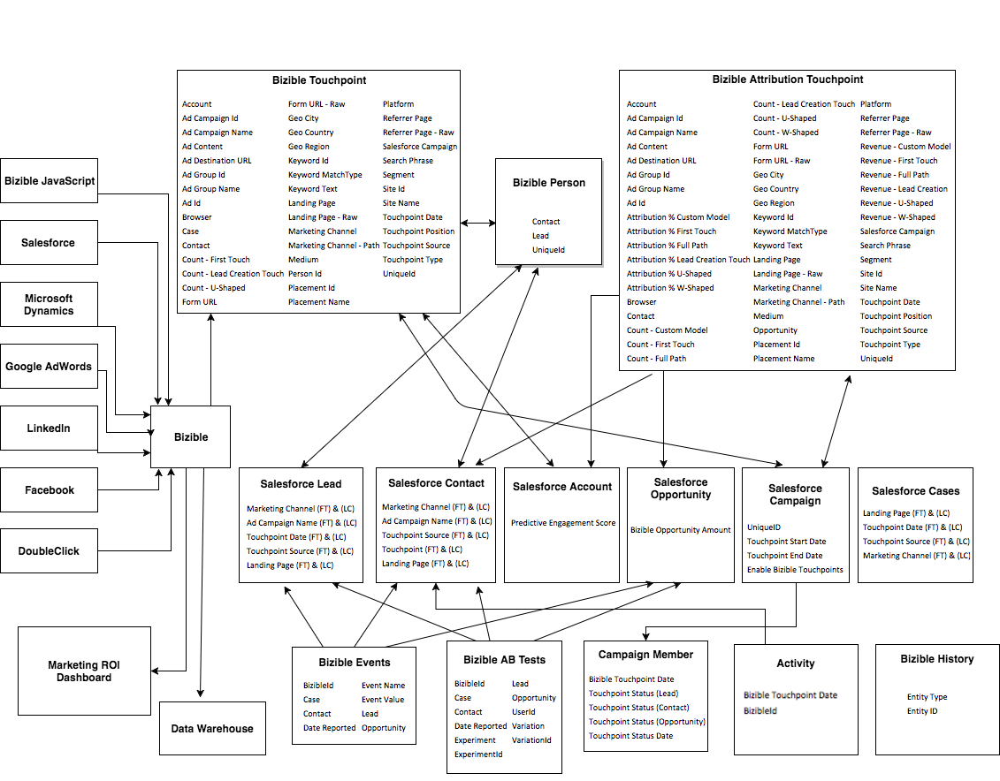

# [!DNL Marketo Measure] Taxonomia de objeto e campo {#marketo-measure-object-and-field-taxonomy}

Abaixo está um fluxograma que representa como [!DNL Marketo Measure] Objetos Personalizados estão relacionados a [!DNL Salesforce] Objetos Padrão.

Para a imagem em tamanho real, [clique aqui](assets/bizible-object-and-field-taxonomy-graph-full.png).

As definições dos campos [!DNL Marketo Measure] que vivem em cada objeto [&#x200B; podem ser encontradas aqui](/help/introduction-to-marketo-measure/overview-resources/glossary-of-marketo-measure-fields.md).

## Perguntas frequentes {#faq}

**Qual é a lógica nas setas?**

Cada seta descreve a relação entre um objeto e o outro. Por exemplo, você vê que a Pessoa [!DNL Marketo Measure] preenche campos no Objeto de cliente em potencial [!DNL Salesforce] padrão. Se estiver apontando para ela, então significa que está preenchendo a extremidade receptora da seta.

**O que é a Pessoa [!DNL Marketo Measure]?**

É um Objeto [!DNL Marketo Measure] Personalizado no [!DNL Salesforce] que vincula os Pontos de Contato do Comprador aos Clientes Potenciais e Contatos.

**O que é o [!DNL Bizible].JS?**

É nosso JavaScript personalizado que utilizamos para rastrear informações da Web que uma pessoa tem em um site específico.

**O que é o Painel de ROI de Marketing?**

É um painel de canais de marketing personalizado que está no aplicativo [!DNL Marketo Measure]. Ele pode ser acessado indo até a guia [!DNL Marketo Measure] em [!DNL Salesforce].
