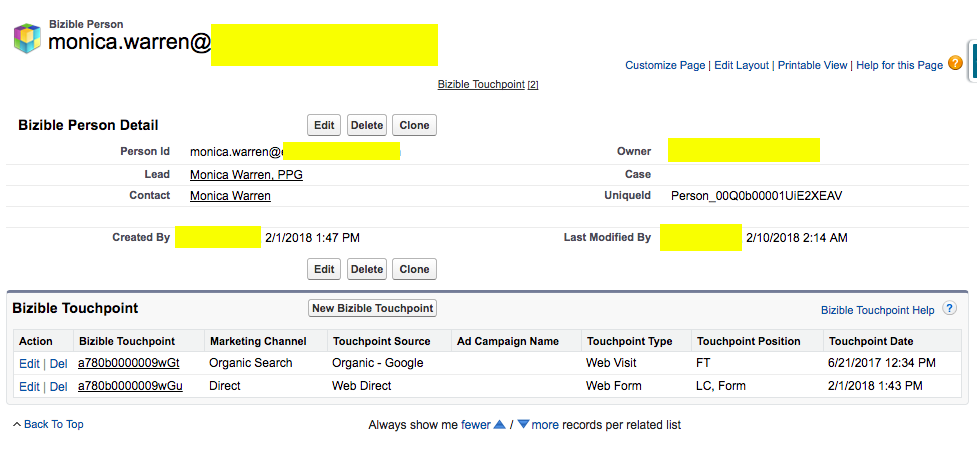

# [!DNL Marketo Measure] Objetos do Salesforce {#marketo-measure-salesforce-objects}

>[!NOTE]
>
>Você pode ver instruções especificando &quot;[!DNL Marketo Measure]&quot; em nossa documentação, mas ainda veja &quot;Bizible&quot; em seu CRM. Estamos trabalhando para atualizar isso e a reformulação da marca será refletida em seu CRM em breve.

Quando [!DNL Marketo Measure] está instalado em [!DNL Salesforce] (SFDC), vários relatórios [!DNL Marketo Measure] Objetos são adicionados. Este artigo fornece uma explicação de vários desses [!DNL Marketo Measure] Objetos. Alguns Objetos que [!DNL Marketo Measure] adiciona a [!DNL Salesforce] são:

* [Ponto de contato do comprador](#touchpoint)
* [Ponto de contato de atribuição do comprador](#attribution)
* [[!DNL Marketo Measure] Pessoa](#person)
* [[!DNL Marketo Measure] Teste A/B](#ab)
* [[!DNL Marketo Measure] Eventos](#events)

Os pontos de contato capturados pelas coisas que você deseja rastrear gravarão nos objetos personalizados criados pela instalação do [!DNL Bizible Salesforce] pacote.

[!DNL Marketo Measure] Os objetos estão relacionados a um padrão específico [!DNL Salesforce] Objetos. Isso permite criar relatórios sobre [!DNL Marketo Measure] e [!DNL Salesforce] Objetos juntos. O quadro seguinte mostra [!DNL Salesforce] Objeto do [!DNL Marketo Measure] Objeto relacionado a.

## Ponto de contato do comprador {#buyer-touchpoint}

A variável [!UICONTROL Ponto de contato do comprador] (BT) Object conta a história de marketing de um indivíduo. Ele armazena todos os dados relacionados aos pontos de contato de marketing gerados por clientes potenciais e contatos. O BT mostra informações como de qual canal de marketing o ponto de contato veio ou qual Campanha publicitária trouxe esse lead/contato específico para seu site.

O objeto BT é visível nas páginas de clientes em potencial e contatos como um **Lista relacionada** (veja a imagem abaixo).

A Lista Relacionada ao BT exibe todos os pontos de contato que pertencem ao Lead ou Contato. Na lista estão os personalizados [!DNL Marketo Measure] Campos que fornecem mais detalhes sobre cada ponto de contato. Ao clicar no número de ID do ponto de contato do comprador, você será direcionado para a página Detalhes do ponto de contato do comprador, que fornece ainda mais detalhes sobre o ponto de contato, como a primeira página da Web que o lead/contato visitou durante essa sessão da Web (**landing page**).

## Ponto de contato de atribuição do comprador {#buyer-attribution-touchpoint}

A variável [!UICONTROL Ponto de contato de atribuição do comprador] Objeto conta a história das interações de marketing de seus contatos relacionadas a uma oportunidade. Ele exibe a variável *atribuição* dados relacionados aos pontos de contato de marketing. Esse Objeto permite que você veja quanto crédito de receita é atribuído a cada ponto de contato de marketing. O tipo de modelo de atribuição que você está usando determinará a porcentagem de receita atribuída aos pontos de contato.

Os Pontos de contato de atribuição do comprador (BATs) são criados apenas depois que uma Oportunidade é criada e se relaciona aos contatos que têm dados de Pontos de contato do comprador (BT). As MTDs não serão criadas sem uma oportunidade. Depois que a oportunidade for criada, o objeto BAT usará a variável [!DNL Salesforce] *Quantidade* na Oportunidade para entender quanta receita deve ser atribuída aos pontos de contato.

A **fluxo de trabalho** deve ser criado se você usar um [campo Valor personalizado](/help/advanced-marketo-measure-features/custom-revenue-amount/using-a-custom-revenue-amount-field.md) para mostrar a receita no Objeto da oportunidade. [!DNL Marketo Measure] O não consegue ler as informações exibidas nos campos de Valor personalizado e, consequentemente, não pode preencher dados de atribuição de receita nos pontos de contato. Este fluxo de trabalho usará o **[!DNL Marketo Measure]Valor da oportunidade** Campo, um dos [!DNL Marketo Measure] campos personalizados, para mapear o valor de receita do campo Valor personalizado para o campo Valor da oportunidade.

O objeto MTD é visível na [!UICONTROL Oportunidade], [!UICONTROL Contato], e [!UICONTROL Conta] Objeto como uma lista relacionada. Esta lista exibe todos os pontos de contato com os dados de atribuição pertencentes a uma Oportunidade. Ao clicar na ID de ponto de contato de atribuição do comprador, você será direcionado para a página Detalhes do ponto de contato de atribuição do comprador. Aqui você poderá ver dados de atribuição e informações mais específicas sobre de onde o ponto de contato veio (semelhantes ao que é fornecido a partir do Objeto de ponto de contato do comprador).

## [!DNL Marketo Measure] Pessoa {#marketo-measure-person}

A variável [!DNL Marketo Measure] Objeto Pessoa relaciona os objetos Cliente Potencial e Contato. Imediatamente, o Salesforce não fornece a opção de criar relatórios usando os objetos de cliente potencial e contato no mesmo relatório. Ao se relacionar com o Objeto de Cliente Potencial e Contato, o [!DNL Marketo Measure] Pessoa permite relatar ambos os Objetos no mesmo relatório. Isso é especialmente útil quando um cliente potencial é convertido em um Contato. Em um [!DNL Marketo Measure] Registro de pessoa você verá uma pesquisa no registro de cliente potencial e/ou contato correspondente, uma lista relacionada dos pontos de contato vinculados à pessoa e a ID de pessoa (que é sempre o endereço de email do cliente potencial/contato). Uma vez que a [!DNL Marketo Measure] A pessoa se relaciona com o objeto de cliente potencial e contato; nunca haverá uma [!DNL Marketo Measure] Registro de pessoa vinculado a um ponto de contato de atribuição do comprador. Veja abaixo um exemplo de [!DNL Marketo Measure] Registro de pessoa no Salesforce:

## [!DNL Marketo Measure] Teste A/B {#marketo-measure-a-b-test}

Se você estiver executando testes A/B até [!DNL Optimizely] ou VWO (Visual Web Otimizer), você pode conectar essas contas ao seu [!DNL Marketo Measure] para exibir dados de teste A/B no Salesforce. A variável [!DNL Marketo Measure] O objeto de teste A/B permite essencialmente obter dados de teste A/B do Otimizely/VWO e vincular os dados a clientes potenciais e contatos.

A variável [!DNL Marketo Measure] O objeto de teste A/B é exibido como uma lista relacionada no [!UICONTROL Clientes potenciais], [!UICONTROL Contatos] e [!UICONTROL Oportunidade] páginas. A lista exibe todos os experimentos e variações que você está executando Otimizely ou VWO e permite que você veja os experimentos/variações que estão relacionados a clientes potenciais e contatos específicos.

## [!DNL Marketo Measure] Eventos {#marketo-measure-events}

A variável [!DNL Marketo Measure] Events Object permite rastrear eventos específicos que ocorrem em seu site. Para rastrear eventos específicos que ocorrem no seu site, é necessário adicionar um código personalizado às suas páginas, além da [!DNL Marketo Measure] Javascript As informações capturadas serão exibidas no [!DNL Marketo Measure] Lista Relacionada a Objetos, que pode ser encontrada no [!UICONTROL Clientes potenciais], [!UICONTROL Contatos] e [!UICONTROL Oportunidade] páginas. A variável [!DNL Marketo Measure] Objeto Events *não* vincular aos dados de atribuição. A finalidade deste objeto é ver se as pessoas estão executando ações específicas no site.

## [!DNL Marketo Measure] Campos {#marketo-measure-fields}

Dados capturados pelo [!DNL Marketo Measure] O JavaScript será enviado para o [!DNL Marketo Measure] Campos em nossos [!DNL Marketo Measure] Objetos. Determinados campos só estarão presentes em determinados objetos. Para obter um glossário de todas as [!DNL Marketo Measure] campos, [clique aqui](/help/introduction-to-marketo-measure/overview-resources/glossary-of-marketo-measure-fields.md). Para uma visualização da qual [!DNL Marketo Measure] Objeto cada [!DNL Marketo Measure] O campo está relacionado a, [clique aqui](/help/configuration-and-setup/marketo-measure-and-salesforce/marketo-measure-object-and-field-taxonomy.md).

## [!DNL Marketo Measure] Relatórios e painéis {#marketo-measure-reports-and-dashboards}

A variável [!DNL Marketo Measure] Relatórios e painéis adicionados ao seu [!DNL Salesforce] O fornece recursos de visualização de dados e relatórios prontos para uso. Estas são as [!DNL Marketo Measure] relatórios para permitir que você organize, analise e entenda rapidamente os dados de ponto de contato.
