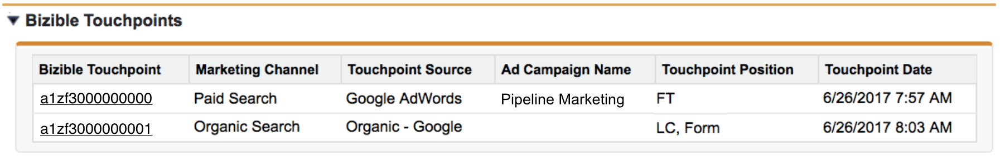

# Objetos do Salesforce do [!DNL Marketo Measure] {#marketo-measure-salesforce-objects}

>[!NOTE]
>Você pode ver instruções específicas para o “[!DNL Marketo Measure]” na documentação, mas ainda notar o termo “Bizible” em seu CRM. Estamos trabalhando na atualização e a reformulação da marca será refletida em seu CRM em breve.

Quando [!DNL Marketo Measure] está instalado no [!DNL Salesforce] (SFDC), vários objetos personalizados do [!DNL Marketo Measure] são adicionados. Este artigo fornece uma explicação de vários desses objetos personalizados do [!DNL Marketo Measure]. Alguns dos objetos que o [!DNL Marketo Measure] adiciona ao [!DNL Salesforce] são:

* [Buyer Touchpoint](#touchpoint)
* [Buyer Attribution Touchpoint](#attribution)
* [Pessoa do [!DNL Marketo Measure]](#person)
* [Teste A/B do [!DNL Marketo Measure]](#ab)
* [Eventos do [!DNL Marketo Measure]](#events)

Os touchpoints capturados pelas coisas que você deseja monitorar gravarão nos objetos personalizados criados pela instalação do pacote do [!DNL Bizible Salesforce].

Os objetos do [!DNL Marketo Measure] estão relacionados a objetos padrão específicos do [!DNL Salesforce]. Isso permite criar relatórios sobre objetos do [!DNL Marketo Measure] e do [!DNL Salesforce] ao mesmo tempo. A tabela a seguir mostra a qual objeto do [!DNL Salesforce] o objeto do [!DNL Marketo Measure] se relaciona.

## Buyer Touchpoint {#buyer-touchpoint}

O objeto [!UICONTROL Buyer Touchpoint] (BT) conta a história de marketing de uma pessoa. Ele armazena todos os dados relacionados aos touchpoints de marketing gerados por leads e contatos. O BT mostra informações como de qual canal de marketing o touchpoint veio ou qual campanha publicitária trouxe esse leads/contato específico para seu site.

O objeto BT é visível nas páginas de leads e contatos como uma **Lista relacionada** (veja a imagem abaixo).

A lista relacionada do BT exibe todos os touchpoints que pertencem ao lead ou contato. Na lista estão os campos personalizados do [!DNL Marketo Measure] que fornecem mais detalhes sobre cada touchpoint. Ao clicar no número de ID do Buyer Touchpoint, você será direcionado para a página Detalhes dele, que fornece ainda mais detalhes sobre o touchpoint, como a primeira página da web que o lead/contato visitou durante essa sessão da web (**página de destino**).

## Buyer Attribution Touchpoint {#buyer-attribution-touchpoint}

O objeto [!UICONTROL Buyer Attribution Touchpoint] conta a história das interações de marketing de seus contatos relacionadas a uma oportunidade. Ele exibe os dados de *atribuição* relacionados aos touchpoints de marketing. Esse Objeto permite que você veja quanto crédito de receita é atribuído a cada touchpoint de marketing. O tipo de modelo de atribuição que você está usando determinará a porcentagem de receita atribuída aos touchpoints.

Os Buyer Attribution Touchpoints (BATs) são criados apenas depois que uma oportunidade é criada, e se relacionam aos contatos que têm dados de Buyer Touchpoint (BT). Os BATs não serão criados sem uma oportunidade. Depois que a oportunidade for criada, o objeto BAT usará o campo *Valor* do [!DNL Salesforce] na oportunidade para entender quanta receita deve ser atribuída aos touchpoints.

Um **fluxo de trabalho** precisa ser criado se você usar um [campo personalizado Valor](/help/advanced-features/custom-revenue-amount/using-a-custom-revenue-amount-field.md) para mostrar a receita no objeto da oportunidade. O [!DNL Marketo Measure] não consegue ler as informações exibidas nos campos personalizados Valor e, consequentemente, não pode preencher dados de atribuição de receita nos touchpoints. Este fluxo de trabalho usará o campo Valor da oportunidade **do**&#x200B;[!DNL Marketo Measure], um dos campos personalizados do [!DNL Marketo Measure], para mapear o valor de receita do campo personalizado Valor para o campo Valor da oportunidade.

O objeto BAT é visível nos objetos [!UICONTROL Oportunidade], [!UICONTROL Contato] e [!UICONTROL Conta] como uma lista relacionada. Esta lista exibe todos os touchpoints com os dados de atribuição pertencentes a uma oportunidade. Ao clicar na ID do Buyer Attribution Touchpoint, você será direcionado para a página Detalhes dele.  Aqui você poderá ver dados de atribuição e informações mais específicas sobre de onde o touchpoint veio (semelhante ao que é fornecido a partir do objeto Buyer Touchpoint).

## Pessoa do [!DNL Marketo Measure] {#marketo-measure-person}

O objeto Pessoa do [!DNL Marketo Measure] se relaciona aos objetos Lead e Contato. O Salesforce não fornece uma opção pronta para uso de criar relatórios usando os objetos Lead e Contato no mesmo relatório. Ao se relacionar com os objetos Lead e Contato, o objeto Pessoa do [!DNL Marketo Measure] permite incluir ambos os objetos no mesmo relatório. Isso é especialmente útil quando um lead é convertido em um contato. Em um registro de Pessoa [!DNL Marketo Measure], você verá uma pesquisa no registro de Cliente Potencial e/ou Contato correspondente, uma lista relacionada dos Pontos de contato vinculados à pessoa e a ID de pessoa (que é sempre o endereço de email do Cliente Potencial/Contato). Como o objeto Pessoa do [!DNL Marketo Measure] se relaciona com os objetos Lead e Contato, nunca haverá um registro de Pessoa do [!DNL Marketo Measure] vinculado a um Buyer Attribution Touchpoint. Veja abaixo um exemplo de registro do objeto Pessoa do [!DNL Marketo Measure] no Salesforce:

## Teste A/B do [!DNL Marketo Measure] {#marketo-measure-a-b-test}

Se você estiver executando testes A/B através do [!DNL Optimizely] ou do VWO (Visual Web Otimizer), pode conectar essas contas à sua conta do [!DNL Marketo Measure] para exibir dados de teste A/B no Salesforce. O objeto Teste A/B do [!DNL Marketo Measure] permite essencialmente obter dados de teste A/B do Optimizely/VWO e vincular os dados a leads e contatos.

O objeto Teste A/B do [!DNL Marketo Measure] é exibido como uma lista relacionada nas páginas [!UICONTROL Leads], [!UICONTROL Contatos] e [!UICONTROL Oportunidade]. A lista exibe todos os experimentos e variações que você está executando Otimizely ou VWO e permite que você veja os experimentos/variações que estão relacionados a leads e contatos específicos.

## Eventos do [!DNL Marketo Measure] {#marketo-measure-events}

O objeto Eventos do [!DNL Marketo Measure] permite monitorar eventos específicos que ocorrem em seu site. Para monitorar eventos específicos que ocorrem no seu site, é necessário adicionar um código personalizado às suas páginas, além do Javascript do [!DNL Marketo Measure]. As informações capturadas serão exibidas na lista relacionada de objetos do [!DNL Marketo Measure], que pode ser encontrada nas páginas [!UICONTROL Leads], [!UICONTROL Contatos] e [!UICONTROL Oportunidade]. O objeto Eventos do [!DNL Marketo Measure] *não* é vinculado aos dados de atribuição. A finalidade deste objeto é conferir se as pessoas estão executando ações específicas no seu site.

## Campos do [!DNL Marketo Measure] {#marketo-measure-fields}

Os dados capturados pelo JavaScript [!DNL Marketo Measure] são enviados para os Campos [!DNL Marketo Measure] personalizados dentro dos Objetos [!DNL Marketo Measure]. Determinados campos estão presentes somente em determinados objetos. Você pode revisar o [glossário de [[!DNL Marketo Measure] campos]](/help/glossary.md) e uma [visualização dos [!DNL Marketo Measure] Objetos](/help/configuration-and-setup/marketo-measure-and-salesforce/marketo-measure-object-and-field-taxonomy.md) relacionados.

## Relatórios e painéis do [!DNL Marketo Measure] {#marketo-measure-reports-and-dashboards}

Os Relatórios e painéis do [!DNL Marketo Measure] adicionados ao [!DNL Salesforce] fornecem recursos de visualização de dados e relatórios prontos para uso. Eles são relatórios básicos do [!DNL Marketo Measure] que permitem organizar, analisar e entender rapidamente os dados de touchpoint.
