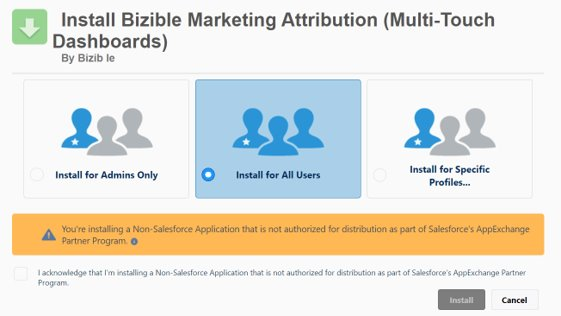

# [!DNL Marketo Measure] Instalação e configuração do pacote Salesforce {#marketo-measure-salesforce-package-installation-and-set-up}

Antes de instalar o [!DNL Marketo Measure] [!DNL Salesforce] pacote básico, você precisa determinar se será instalado primeiro em uma sandbox [!DNL Salesforce] antes de migrar para a instância de produção do Salesforce.

>[!NOTE]
>
>Uma vez que a conta do [!DNL Marketo Measure] está conectada a uma instância de produção do [!DNL Salesforce], não é possível mover-se para trás e se conectar a uma sandbox. Além disso, uma conta do [!DNL Marketo Measure] só pode ser conectada a uma instância de produção do [!DNL Salesforce].

O pacote básico do [!DNL Marketo Measure] contém:

* 7 objetos [!DNL Marketo Measure] personalizados
* Campos [!DNL Marketo Measure] personalizados
* 25 relatórios do [!DNL Stock]

O [!DNL Marketo Measure] é capaz de ler como padrão objetos, campos e registros do [!DNL Salesforce], no entanto, o [!DNL Marketo Measure] nunca atualizará ou enviará dados para eles. Todos os dados coletados pelo JavaScript do [!DNL Marketo Measure] serão exibidos nos Objetos e campos personalizados do [!DNL Marketo Measure].

Siga as etapas abaixo para instalar o pacote básico do [!DNL Marketo Measure Salesforce].

1. Usando um navegador incógnito, acesse o [Salesforce Appexchange](https://appexchange.salesforce.com/appxListingDetail?listingId=a0N3000000B3KLuEAN){target="_blank"} e faça logon.

1. Instalar o pacote do [!DNL Marketo Measure] na sandbox ou na produção.

1. Faça logon no [!DNL Salesforce] como Administrador.

1. Selecione **[!UICONTROL Instalar] para Todos os usuários**.

   

1. Quando a instalação estiver concluída, você poderá visualizá-la.

   

Após concluir a instalação, você pode atualizar os [[!DNL Salesforce] layouts de página](/help/configuration-and-setup/marketo-measure-and-salesforce/page-layout-instructions.md){target="_blank"} com os campos [!DNL Marketo Measure], se desejar.

>[!NOTE]
>
>Leia sobre o [!DNL Marketo Measure] Conjuntos de permissões criados e [como eles serão usados](/help/configuration-and-setup/marketo-measure-and-salesforce/marketo-measure-permission-sets.md){target="_blank"}.

## Instalar o Pacote do painel do [!DNL Marketo Measure] {#install-marketo-measure-dashboard-package}

O Pacote da extensão do [!UICONTROL Painel] contém três painéis pré-criados. Recomendamos instalar [!UICONTROL na] Produção para todos os usuários.

1. Instale o pacote do [[!DNL Salesforce] Appexchange](https://login.salesforce.com/packaging/installPackage.apexp?p0=04t610000001jI6){target="_blank"}.

1. Selecione **[!UICONTROL Instalar para Todos os usuários]**.

   

## Criação de um Perfil e usuário do [!DNL Marketo Measure] {#creating-a-marketo-measure-profile-and-user}

O [!DNL Marketo Measure] envia e recebe dados por meio de um usuário conectado do [!DNL Salesforce] no aplicativo [!DNL Marketo Measure].

Para enviar dados do touchpoint para a instância do [!DNL Salesforce], o usuário conectado deve ter acesso aos objetos personalizados do [!DNL Marketo Measure] (por exemplo, Buyer Touchpoint e Buyer Attribution Touchpoint), assim como objetos padrão do [!DNL Salesforce] como Leads e Contatos.

Crie um perfil do [!DNL Marketo Measure] para garantir que você não tenha erros de validação ao enviar dados para o Salesforce.

Etapa 1: Criar um perfil específico do [!DNL Marketo Measure]

1. Atribua as seguintes permissões:

* “[!DNL Marketo Measure] Conjunto de permissões do administrador”
   * O conjunto de permissões gerenciadas oferece a um administrador do SFDC a capacidade de criar, ler, gravar, excluir registros de objetos do [!DNL Marketo Measure].
* “Exibir e editar conjunto de permissões de leads convertidos”
   * Isso permite que o [!DNL Marketo Measure] decore leads depois de serem convertidos em contatos. Se esse conjunto de permissões não estiver ativado, pode haver grandes lacunas no rastreamento de dados.

>[!NOTE]
>
>Este perfil pode ser um clone de um perfil de Administrador do sistema.

Etapa 2: Criar um usuário dedicado do [!DNL Marketo Measure] para que você possa acompanhar o impacto do [!DNL Marketo Measure] em sua instância do [!DNL Salesforce]

1. Atribua o novo perfil do [!DNL Marketo Measure] a esse usuário.

1. Habilite “Usuário de marketing” como uma permissão de nível de usuário.

* A caixa de seleção [!UICONTROL Usuário de marketing] permite que o usuário crie campanhas e use os Assistentes de importação de campanha. Se esta opção não estiver selecionada, o usuário só poderá visualizar campanhas e configuração avançada de campanha, editar o Histórico de campanha de um único lead ou contato e executar relatórios de campanha. O [!DNL Marketo Measure] precisa poder ler e gravar no objeto de campanha.

Etapa 3: Excluir este perfil de todos os acionadores, workflows e processos

Etapa 4: Fazer logon na conta do [!DNL Marketo Measure] e reautorizar a conexão do [!DNL Salesforce] com o novo usuário

1. Acesse apps.bizible.com e faça logon com a nova produção de usuário [!DNL Salesforce] credenciais.

1. Selecione **[!UICONTROL Configurações]** no menu suspenso **[!UICONTROL Minha conta]**.

1. Selecione **[!UICONTROL Conexões]** no agrupamento **[!UICONTROL Integrações]**.

1. Clique no ícone Chave à direita da conexão do [!DNL Salesforce] atual e selecione **Reautorizar novamente com a produção**. Faça logon com as novas credenciais do usuário novamente (se solicitado).
