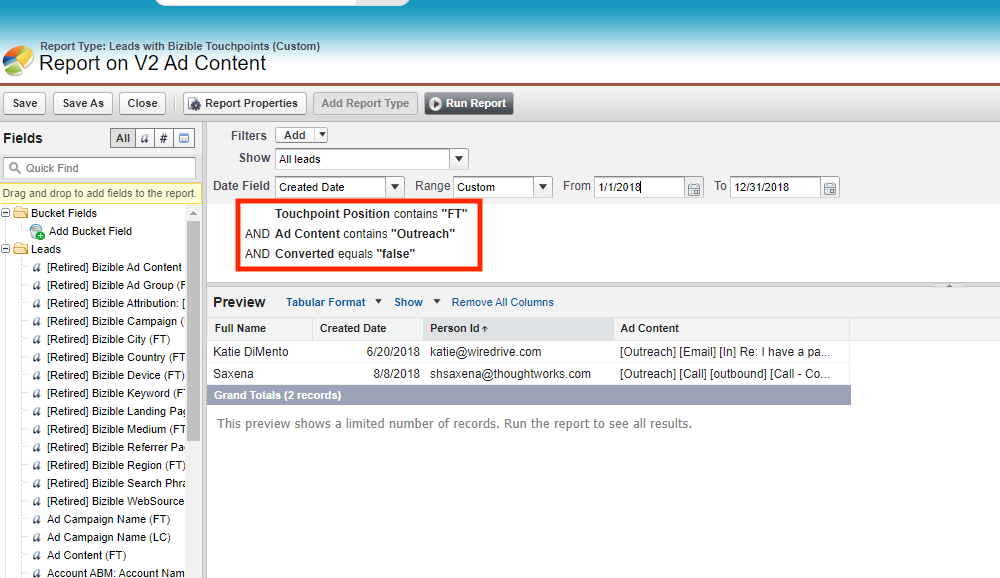

# Consolidação de pacotes do [!DNL Salesforce] {#salesforce-package-consolidation}

Para aprimorar a experiência do usuário e simplificar o uso, os pacotes existentes estão sendo compilados em um único pacote abrangente.

## Aposentadoria de Pacote {#package-retirement}

Como consequência dessa consolidação, os pacotes V1, V2_EXT, V2_Security e todos os relatórios atuais serão desativados após agosto de 2023. Se você já tiver o pacote V2 instalado, deverá atualizá-lo para a nova versão consolidada.

## Novo pacote consolidado {#new-consolidated-package}

O novo pacote V2 consolidado incorpora todos os recursos e funcionalidades dos pacotes anteriores, fornecendo uma experiência do usuário aprimorada. Este pacote atualizado permite um rastreamento mais eficiente do desempenho de marketing e vendas, além de informações mais detalhadas sobre o comportamento do cliente.

Há dois novos campos para aprimorar seus recursos de relatórios:

* form_name: agora disponível em objetos BT/BAT, esse campo permite criar relatórios com base em nomes de formulário.
* user_touchpoint_id: esse campo permite que os usuários criem relatórios com contagens de pontos de contato de usuário exclusivas (`bizible2__User_Touchpoint_V2__c` no Salesforce).

## Suporte e transição {#support-and-transition}

A variável [Equipe de suporte](https://nation.marketo.com/t5/support/ct-p/Support){target="_blank"} O está disponível para responder a qualquer pergunta e ajudar a garantir uma transição suave para o novo pacote consolidado.

## Ações necessárias {#retired-actions}

* Se você já tiver o pacote V2 instalado, deverá atualizá-lo para a nova versão consolidada.
* Se você tiver relatórios ou painéis de controle de qualquer pacote de relatórios, é possível recriá-los facilmente sem qualquer modificação necessária, pois todos os campos existem no pacote consolidado.
* Se você tiver relatórios usando campos no pacote V2_EXT, poderá recriá-los no pacote consolidado através das etapas abaixo:
   * Todos os dados nos campos V2_EXT estão disponíveis nos campos de ponto de contato, portanto, você pode modificar seus relatórios para buscar dados dos campos de ponto de contato V2 correspondentes, adicionando um filtro na posição do ponto de contato.
   * Exemplo de relatório que busca todos os leads com a FT de conteúdo do anúncio contendo o texto &quot;Outreach&quot;.
      * Consulta V2_EXT:
         * bizible2_ext_Ad_Content_FT_c contém Outreach

* Query correspondente no pacote consolidado:
   * bizible2_Touchpoint_Position_c contém FT E
   * bizible2_Ad_Content_c contém Outreach

## Perguntas frequentes {#faq}

**O pacote consolidado entrará em conflito com os campos do meu pacote existente?**

Não é necessário desinstalar o pacote antes de instalar o pacote consolidado. Não haverá conflitos nos campos, pois eles estão em um namespace diferente.

**Como posso preencher retroativamente os dados dos meus pacotes atuais?**

Você pode arquivar um tíquete [com suporte](https://nation.marketo.com/t5/support/ct-p/Support){target="_blank"} para preenchimento retroativo e reprocessamento de dados BT/BAT para preencher os campos ID do ponto de contato e ID do formulário.

**Os campos nos pacotes V1 e V2_EXT estarão disponíveis no pacote consolidado?**

Sim. O pacote consolidado contém os mesmos campos em V1, com detalhamentos adicionais por objetos e campos V2_EXT por meio de campos Touchpoint.

**Os relatórios que usam os campos V2_EXT podem ser recriados no pacote consolidado?**

Sim. Siga as etapas na guia [Ações necessárias](#retired-actions) seção.
