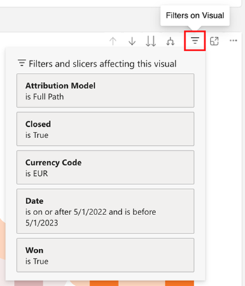
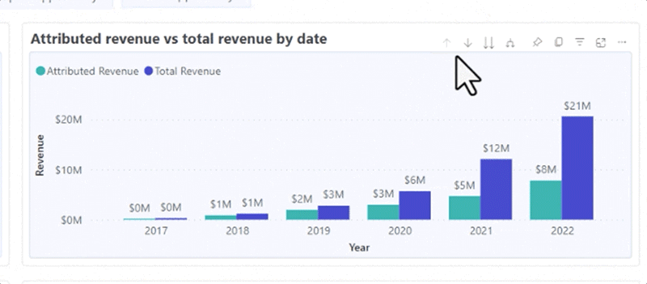
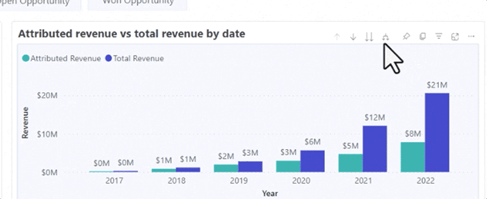
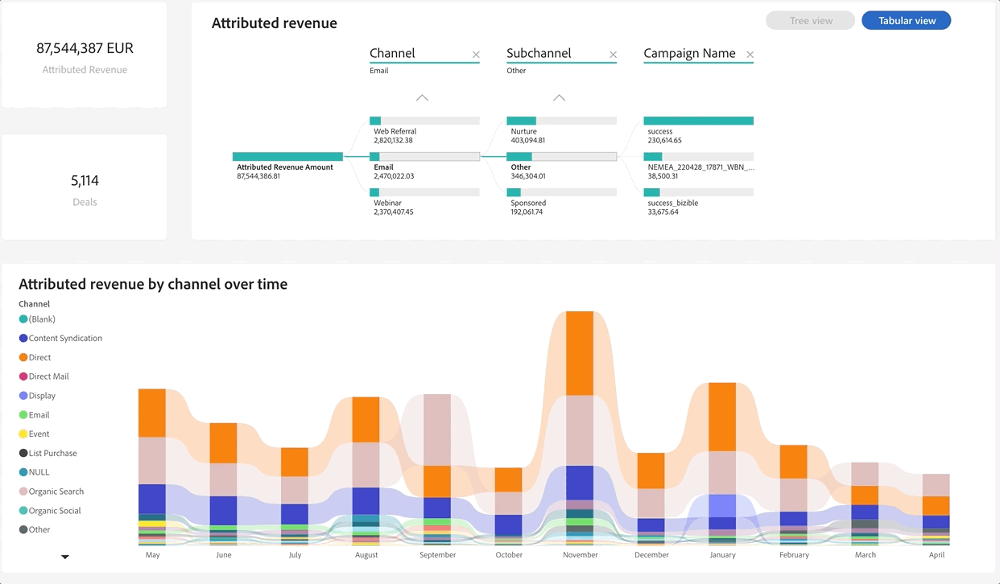
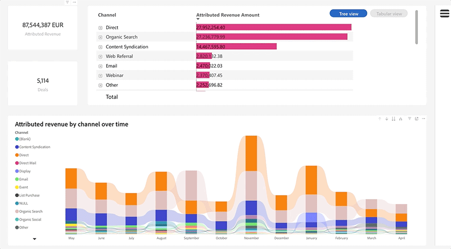
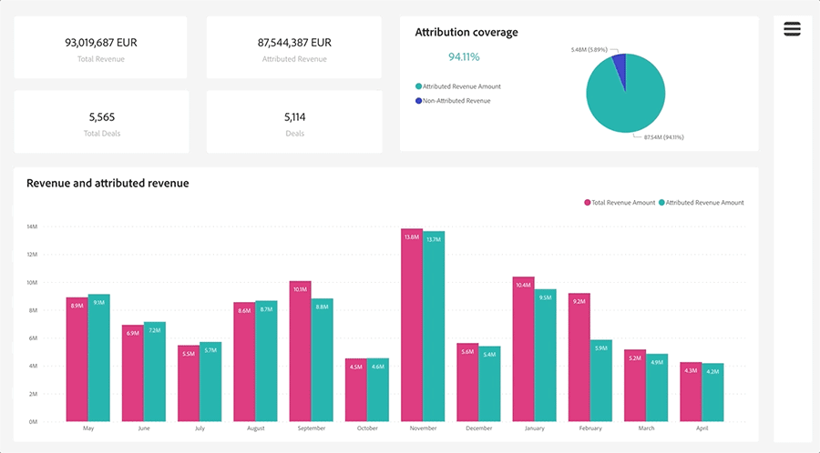

# Noções básicas do painel do Discover {#discover-dashboard-basics}

Este artigo o guiará pelos recursos fundamentais da interface reprojetada, garantindo que você possa acessar e interpretar seus dados com facilidade. Analise a dinâmica do painel de filtros e descubra as complexidades de nossas funcionalidades de relatórios aprimoradas, como recursos de drill, filtragem cruzada e dicas de ferramentas.

## Painel de Filtro {#filter-pane}

Cada painel tem uma variedade de filtros, acompanhados pelos seguintes controles para navegação e personalização ininterruptas.

| Nome | Descrição |
| --- | --- |
| Botão de alternância do filtro | Alterne o painel de filtro aberto ou fechado. |||||||||||||||||||||||||![ — | — |] (apng) |
| Barra de pesquisa | Use a pesquisa na parte superior do painel de filtros para procurar um filtro específico. Cada filtro também tem sua própria barra de pesquisa. ||||||||||||||||||||||||||![ — | — |] (apng) |
| Botão Limpar Filtro | Para limpar um filtro, clique no ícone de borracha localizado no canto superior direito de cada filtro. ||||||||||||||||||||||||||![ — | — |] (apng) |
| Botão Aplicar | Clique em para confirmar e implementar as alterações no filtro no painel. |||||||||||||||||||||![ — | — |] (apng) |

## Filtros no visual {#filters-on-visual}

Passe o mouse sobre o canto superior direito de um visual para ver uma lista somente leitura dos filtros aplicados.

## Recursos do relatório {#report-capabilities}

### Detalhar e aumentar {#drill-down-and-up}

* Passe o mouse sobre um visual para identificar se ele tem uma hierarquia; a presença de opções de controle de drill na barra de ação indica isso.

* Ative o drill-down clicando na seta para baixo única, realçada por um plano de fundo cinza. Para reverter, use o ícone de drill-up.

Para detalhar um campo por vez, ative o ícone de detalhamento e selecione um elemento visual, como uma barra.

Use o ícone de drill-down da seta dupla para avançar para o próximo nível de hierarquia.

Use o ícone de bifurcação para adicionar outro nível de hierarquia na exibição atual.

### Drill-through {#drill-through}

Para explorar os dados por trás do visual, clique com o botão direito do mouse no elemento visual e selecione a opção de &quot;drill-through&quot;.

### Exportar dados {#export-data}

Para exportar os dados subjacentes de um visual, passe o mouse sobre o canto superior direito. Clique no botão &quot;mais opções&quot;, escolha &quot;exportar dados&quot;, selecione o formato de sua preferência e clique em &quot;exportar&quot;.

### Modo de foco {#focus-mode}

Para aplicar mais zoom a um visual ou bloco gráfico específico, passe o mouse sobre o canto superior direito e selecione o botão &quot;foco&quot;.

### Filtragem cruzada {#cross-filtering}

Selecionar um rótulo de valor ou eixo em uma visualização filtrará outros visuais na página do relatório, garantindo que eles exibam apenas os dados relevantes filtrados.

### Dicas de ferramentas {#tooltips}

As dicas de ferramentas oferecem detalhes adicionais sobre os dados exibidos. Passe o mouse sobre um elemento visual e uma dica de ferramenta contextual será exibida, fornecendo insights ou explicações relacionados a esse ponto de dados específico.

