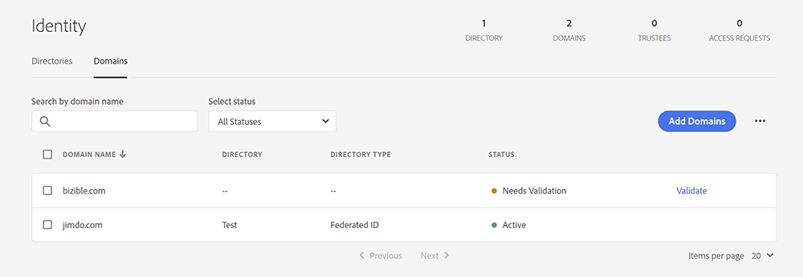
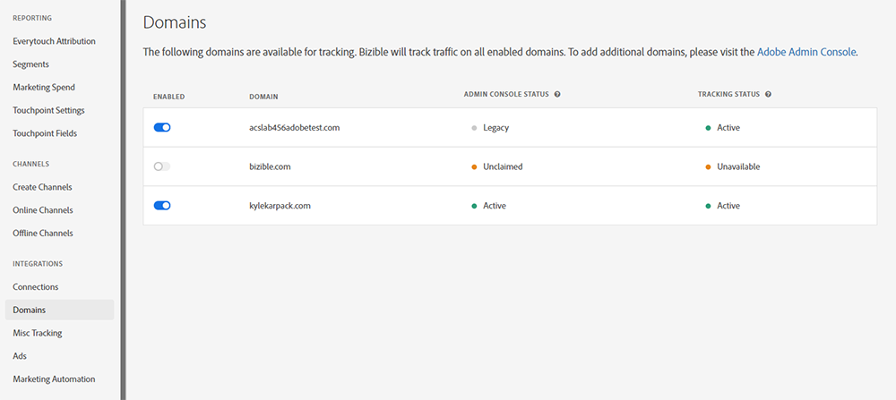
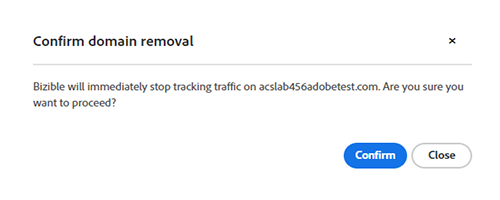

# Gerenciamento de domínio {#domain-management}

Para locatários habilitados para IMS que executam o [!DNL Marketo Measure] na Interface do Experience Cloud, o [!DNL Marketo Measure] fornece uma interface que permite que os usuários gerenciem sua própria lista de domínios. [!DNL Marketo Measure] usuários devem primeiro verificar todos os domínios que desejam rastrear no [Adobe Admin Console](https://adminconsole.adobe.com/). Depois que os domínios forem verificados na Admin Console, os usuários poderão gerenciar se [!DNL Marketo Measure] os utiliza para rastrear o tráfego do site.

## Adicionar domínios no Admin Console {#adding-domains-in-admin-console}

Os usuários do IMS com acesso à Adobe Admin Console podem adicionar e validar os domínios que possuem. A validação de domínio envolve adicionar um registro DNS para cada domínio e permitir que a Admin Console verifique esse registro.

As instruções para adicionar domínios podem ser encontradas na [documentação do Admin Console](https://helpx.adobe.com/enterprise/using/add-domains-directories.html). Após adicionar um domínio, ele deve ser [vinculado a um diretório](https://helpx.adobe.com/enterprise/using/add-domains-directories.html#link-domains-to-directoies).

## Gerenciando Domínios em [!DNL Marketo Measure] {#managing-domains-in-marketo-measure}

Depois que um domínio é adicionado ao Admin Console, o [!DNL Marketo Measure] sincroniza regularmente esse registro no banco de dados. Esta sincronização ocorre à noite e sempre que um usuário visita a página **[!UICONTROL Domínios]** na interface do usuário do [!DNL Marketo Measure]. Por padrão, todos os registros que [!DNL Marketo Measure] importa são desabilitados, e o locatário deve habilitar manualmente cada domínio.

Na página **[!UICONTROL Integração]** > **[!UICONTROL Domínios]**, o usuário vê todos os domínios que registrou na Admin Console, juntamente com seus status. Cada domínio pode ser ativado ou desativado. Se um domínio estiver habilitado, o rastreamento do [!DNL Marketo Measure] coletará todo o tráfego visto nesse domínio. Se um domínio estiver desabilitado, [!DNL Marketo Measure] ignorará qualquer tráfego proveniente dele e não criará pontos de contato ou outros dados. [!DNL Marketo Measure] confirma a desativação de um domínio e avisa sobre as ramificações:

O impacto da alternância de um domínio é imediato e as alterações não são retroativas. No futuro, o [!DNL Marketo Measure] limpará os dados de domínios desabilitados após um período definido.

## Status {#statuses}

Os status do Admin Console são categorizados da seguinte maneira:

* **VALIDADO**: este domínio é verificado no Admin Console
* **NÃO VERIFICADO**: este domínio não foi totalmente verificado no Admin Console e não está qualificado para rastreamento em [!DNL Marketo Measure]
* **INVÁLIDO**: este domínio pode ter expirado ou sido removido do Admin Console. Rastreamento de dados em [!DNL Marketo Measure] marcado para exclusão
* **LEGACY**: este domínio foi criado em [!DNL Marketo Measure] e não existe na Admin Console

Os status de rastreamento podem ser os seguintes:

* **ATIVE**: [!DNL Marketo Measure] está recebendo dados deste domínio
* **DISABLED**: este domínio está disponível para rastreamento, mas está desabilitado
* **INDISPONÍVEL**: este domínio não está disponível para rastreamento porque não foi verificado

Passar o mouse sobre qualquer item de status individual aciona uma dica de ferramenta que explica melhor esse status.

## Perguntas frequentes {#faq}

**O que acontece quando um domínio é removido na Admin Console?**

Quando um domínio é removido na Admin Console, o [!DNL Marketo Measure] marca o domínio como excluído. [!DNL Marketo Measure] interrompe imediatamente o rastreamento do tráfego neste domínio, mas não remove nenhum dado coletado anteriormente.

**Por que não consigo habilitar um domínio?**

Há vários motivos pelos quais um domínio pode não ser permitido para seleção nesta página. Se o domínio não for validado na Admin Console, ele não estará disponível em [!DNL Marketo Measure]. Da mesma forma, se o domínio for de propriedade de uma Organização Adobe diferente do locatário atual do [!DNL Marketo Measure], ele poderá ficar indisponível para seleção.

**Como remover um domínio desta lista?**

Se um domínio tiver a opção &quot;habilitada&quot; desativada, o [!DNL Marketo Measure] a ignorará e será efetivamente removido do [!DNL Marketo Measure]. Para remover permanentemente um domínio de [!DNL Marketo Measure], você deve desabilitá-lo em [!DNL Marketo Measure] e removê-lo da Admin Console.
