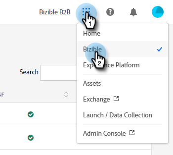
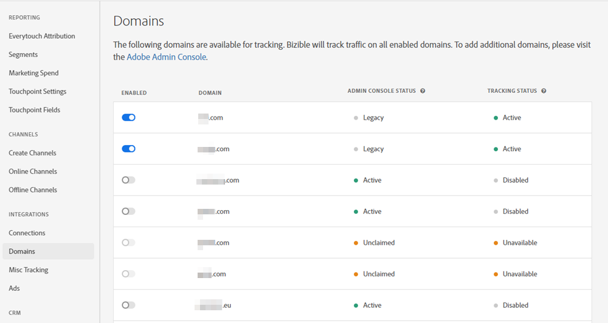

# Visão geral da interface da Adobe Experience Cloud {#experience-cloud-interface-overview}

A interface da Adobe Experience Cloud alinha a aparência dos aplicativos e serviços da Adobe Experience Cloud. Mas isso é mais do que apenas um novo design. É um aplicativo de página única que oferece experiência de usuário em uma única instância.

## Fluxo de usuário {#user-flow}

Se você já estiver conectado a um produto Adobe Experience Cloud, clique no ícone de menu e selecione **[!DNL Marketo Measure]**.

>[!NOTE]
>
>O menu suspenso pode parecer diferente dependendo dos produtos da Adobe Experience Cloud aos quais você está inscrito.

Se você já _não_ fez logon em um produto da Adobe Experience Cloud, faça logon diretamente em [!DNL Marketo Measure] aqui: [https://experience.adobe.com/marketo-measure](https://experience.adobe.com/marketo-measure).

## Novos recursos {#new-features}

Além da aparência atualizada, observe os seguintes recursos:

**Gerenciamento de domínio**

[Gerencie seus [!DNL Marketo Measure] domínios](/help/domain-management.md) sem a assistência do [!DNL Marketo Measure].

**Central de ajuda integrada**

Procure por artigos de suporte, envie tíquetes, forneça feedback, tudo dentro do aplicativo [!DNL Marketo Measure].

**Alternador de aplicativos**

Aqueles com acesso a vários produtos da Adobe podem alternar facilmente entre eles.

**Notificações e anúncios**

Visualize e interaja com notificações específicas e anúncios gerais de produtos da Adobe diretamente no aplicativo.

**Configurações da Adobe**

Para alterar o idioma ou outras preferências do Adobe, clique no ícone do perfil. Você também pode fazer [!DNL Marketo Measure] alterações específicas clicando em **Minhas Configurações**.

## Perguntas frequentes {#faq}

**O que acontece com meus favoritos?**

Os marcadores são redirecionados. Por exemplo, se você navegasse até https://apps.marketo-measure.com/Discover/391, seria redirecionado para https://experience.adobe.com/marketo-measure/Discover/391 após concluir a autenticação.

**Não consigo fazer logon no [!DNL Marketo Measure] por meio da Interface do Experience Cloud. Qual pode ser o problema?**

Se você conseguir fazer logon no Adobe Experience Cloud, mas visualizar uma página como a seguinte, o problema pode estar no lado de [!DNL Marketo Measure]:

Se você receber o erro acima, [contate o Suporte](https://nation.marketo.com/t5/support/ct-p/Support) para obter assistência.
