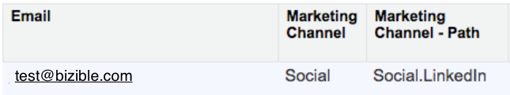

# Glossário de campos de medida do Marketo {#glossary-of-marketo-measure-fields}

Este artigo fornece um glossário de todos os Campos de medida do Marketo adicionados ao seu Salesforce a partir do Pacote base de medidas do Marketo. Você também encontrará informações sobre em qual Objeto o Campo pode ser encontrado e como cada Campo é preenchido com informações.

Para um mapa ao qual cada Campo de Medida do Marketo está relacionado, [clique aqui](/help/configuration-and-setup/marketo-measure-and-salesforce/marketo-measure-object-and-field-taxonomy.md).

[A](#a) ・ ・ [B](#b) ・ ・ [C](#c) ・ ・ [D](#d) ・ ・ [E](#e) ・ ・ [F](#f) ・ ・ [G](#g) H ・ I ・ J ・ [K](#k) ・ ・ [L](#l) ・ ・ [M](#m) ・ N ・ [O](#o) ・ ・ [P](#p) ・ Q ・ [R](#r) ・ ・ [S](#s) ・ ・ [T](#t) ・ ・ [U](#u) ・ ・ [V](#v) ・ W ・ X ・ Y ・ Z

## A {#a}

**Conta** | Encontrado no ponto de contato da atribuição do comprador

Esse campo é preenchido com o nome Conta associado ao BAT.

**Id Da Campanha Publicitária** | Encontrado no Ponto de Contato do Comprador, Ponto de Contato da Atribuição do Comprador

Há três maneiras de preencher esse campo:

`1)` Se o ponto de contato vem de um esforço de pesquisa paga (AdWords ou BingAds), o ID da campanha de anúncio da plataforma de anúncio será exibido aqui.

`2)` Se o ponto de contato não veio da pesquisa paga, o campo será preenchido usando o valor utm_campaign do URL da página de aterrissagem.

Ex.: `http://info.marketomeasure.com/adwords-for-lead-generation?utm_source=Event&utm_medium=booth&utm_campaign=Marketo%20Virtual%20Event%20sep2014`

Neste exemplo, a ID da campanha de publicidade exibiria: __GAId__ Evento virtual de marketing sept2014

`3)` Se o ponto de contato for proveniente de uma Campanha do Salesforce offline (uma conferência, jantar, etc.), a ID da campanha de anúncio exibirá a ID da campanha do Salesforce

Se nenhuma das opções acima, esse campo ficará em branco.

**Nome da campanha publicitária** | Ponto de contato do comprador, ponto de contato da atribuição do comprador

`1)` Se o ponto de contato vem de uma pesquisa paga (AdWords/Bing Ads), o nome da campanha publicitária da plataforma de anúncio será exibido aqui.

`2)` Se o ponto de contato não veio da pesquisa paga e o URL da página de aterrissagem contiver um valor para utm_campaign, esse valor será preenchido aqui.

`3)` Se o ponto de contato veio de uma campanha do Salesforce, o nome da campanha do Salesforce será exibido aqui.

`4)` Isso será preenchido com o Nome da campanha definido para Pontos de contato gerados a partir de Atividades, conforme criado em sua Conta de medida do Marketo.

Se nenhuma das opções acima, esse campo ficará em branco.

**Nome da campanha publicitária (FT)** | Ponto de contato do comprador

Este campo é preenchido da mesma forma que o Nome da campanha de anúncio. No entanto, esse campo mostra especificamente o nome da campanha publicitária que gerou o ponto de contato Primeiro contato.

**Nome da campanha de publicidade (LC)** | Ponto de contato do comprador

Este campo é preenchido da mesma forma que o Nome da campanha de anúncio. No entanto, esse campo mostra especificamente o nome da campanha publicitária que gerou o ponto de contato de Criação de leads.

**Conteúdo do anúncio** | Ponto de contato do comprador, ponto de contato da atribuição do comprador

`1)` Se o ponto de contato for de pesquisa paga (AdWords/Bing Ads), o campo exibirá a cópia completa do anúncio da plataforma do anúncio.

`2)` Se o ponto de contato não for de pesquisa paga, esse campo exibirá o valor utm_content no URL da página de aterrissagem.

`3)` Isso será preenchido com o valor Assunto da Atividade relacionada que gerou o Ponto de contato.

Se nenhuma das opções acima, esse campo ficará em branco.

**URL de Destino da Publicidade** | Ponto de contato do comprador, ponto de contato da atribuição do comprador

`1)` Se o ponto de contato for de pesquisa paga, esse campo exibirá o destino do URL ao qual você é direcionado depois de clicar no anúncio do mecanismo de pesquisa.

Se o ponto de contato não for de pesquisa paga, o campo ficará em branco.

**Id Do Grupo De Publicidade** | Ponto de contato do comprador, ponto de contato da atribuição do comprador

`1)` Se o ponto de contato veio da pesquisa paga, a ID do grupo de anúncios do AdWords/Bing Ads será exibida aqui.

Se o ponto de contato não tiver vindo da pesquisa paga, o campo ficará em branco.

**Nome do grupo de anúncios** | Ponto de contato do comprador, ponto de contato da atribuição do comprador

`1)` Se o ponto de contato veio da pesquisa paga, o Nome do grupo de anúncios do AdWords/Bing Ads será exibido aqui.

Se o ponto de contato não tiver vindo da pesquisa paga, o campo ficará em branco.

**ID da Publicidade** | Ponto de contato do comprador, ponto de contato da atribuição do comprador

`1)` Se o ponto de contato veio da pesquisa paga, a ID do anúncio do AdWords/Bing Ads será exibida aqui.

`2)` Isso será preenchido com a ID externa da atividade se o ponto de contato for gerado de uma atividade de CRM.

Se o ponto de contato não tiver vindo da pesquisa paga, o campo ficará em branco.

**Modelo Personalizado % Atribuição** | Ponto de contato da atribuição do comprador

Se você estiver usando um Modelo de atribuição personalizado, esse campo exibirá a porcentagem da receita atribuída a um ponto de contato de acordo com os valores definidos no Modelo personalizado.

Se você não estiver usando um Modelo personalizado, esse campo ficará em branco.

**% Atribuição Primeiro contato** | Ponto de contato da atribuição do comprador

Este campo exibirá a porcentagem da receita atribuída a um ponto de contato de acordo com um Modelo de primeiro contato.

**% de Atribuição Total** | Ponto de contato da atribuição do comprador

Este campo exibirá a porcentagem da receita atribuída a um ponto de contato de acordo com um Modelo de caminho completo.

**Criação de leads % atribuição** | Ponto de contato da atribuição do comprador

Este campo exibirá a porcentagem da receita atribuída a um ponto de contato, de acordo com um Modelo de criação de leads.

**% de atribuição no formato de U** | Ponto de contato da atribuição do comprador

Este campo exibirá a porcentagem da receita atribuída a um ponto de contato de acordo com um Modelo de Forma de U.

**Atribuição % Forma de W** | Ponto de contato da atribuição do comprador

Este campo exibirá a porcentagem da receita atribuída a um ponto de contato de acordo com um Modelo com Forma de W.

[Clique aqui para retornar à parte superior da página](#top)

## B {#b}

**Valor da Oportunidade de Medida da Marketo** | Oportunidade do Salesforce

Se você estiver usando um campo Quantia personalizado para relatar a receita da Oportunidade, a Medida do Marketo não poderá ler esses campos de Quantia personalizados. O Valor da Oportunidade de Medida do Marketo é um campo oculto usado para criar um fluxo de trabalho que permite que a Medida do Marketo leia campos de Quantia personalizados na Oportunidade.

**Navegador** | Ponto de contato do comprador, ponto de contato da atribuição do comprador

Este campo exibe o tipo de navegador da Web usado durante a sessão da Web (Chrome, Safari, Firefox, etc.).

[Clique aqui para retornar à parte superior da página](#top)

## C {#c}

**Contato** | Ponto de contato do comprador, ponto de contato da atribuição do comprador

O campo exibe o campo Contato ao qual o ponto de contato pertence.

**Contagem - Modelo personalizado** | Ponto de contato da atribuição do comprador

Se você estiver usando um Modelo de atribuição personalizado, esse campo mostrará, em formato decimal, a porcentagem de crédito de receita fornecida a um ponto de contato de acordo com os valores definidos no Modelo personalizado.

Se não estiver utilizando um modelo personalizado, esse campo ficará em branco.

**Contagem - Modelo personalizado** | Ponto de contato do comprador

Se você estiver usando um Modelo de atribuição personalizado, esse campo mostrará, em formato decimal, a porcentagem de crédito de atribuição dado a um ponto de contato de acordo com os valores definidos no Modelo personalizado. Como esse campo se refere ao Objeto de ponto de contato do comprador, não é um reflexo do crédito de receita, apenas do crédito de atribuição.

Se não estiver utilizando um modelo personalizado, esse campo ficará em branco.

**Contagem - Primeiro contato** | Ponto de contato da atribuição do comprador

Este campo mostra, em formato decimal, a porcentagem de crédito de receita atribuído a um ponto de contato de acordo com um Modelo de primeiro contato.

**Contagem - Primeiro contato** | Ponto de contato do comprador

Este campo mostra, em formato decimal, a porcentagem de crédito de atribuição dado a um ponto de contato de acordo com um Modelo de primeiro contato. Se o ponto de contato for o Primeiro contato, esse campo sempre será 1,0 (indicando 100% de crédito de atribuição). Se o ponto de contato não for o Primeiro contato, esse campo sempre será 0 (indicando 0 % de crédito de atribuição).

Como esse campo se refere ao Objeto de ponto de contato do comprador, não é um reflexo do crédito de receita, apenas do crédito de atribuição.

**Contagem - Caminho completo** | Ponto de contato da atribuição do comprador

Este campo mostra, em formato decimal, a porcentagem da receita fornecida para um ponto de contato de acordo com um Modelo de caminho completo.

**Contagem - Toque de Criação de Lead** | Ponto de contato da atribuição do comprador

Este campo mostra, em formato decimal, a porcentagem do crédito de receita atribuído a um ponto de contato de acordo com um Modelo de criação de lead.

**Contagem - Toque de Criação de Lead** | Ponto de contato do comprador

Este campo mostra, em formato decimal, a porcentagem de crédito de atribuição dado a um ponto de contato de acordo com um Modelo de criação de leads. Se o ponto de contato for o contato de Criação de leads, esse campo sempre será 1,0 (indicando 100% de crédito de atribuição). Se o ponto de contato não for o contato de Criação de leads, esse campo sempre será 0 (indicando 0% de crédito de atribuição).

Como esse campo se refere ao Objeto de ponto de contato do comprador, não é um reflexo do crédito de receita, apenas do crédito de atribuição.

**Contagem - Forma de U** | Ponto de contato da atribuição do comprador

Este campo mostra, em formato decimal, a porcentagem do crédito de receita atribuído a um ponto de contato de acordo com um Modelo de Forma de U.

**Contagem - Forma de U** | Ponto de contato do comprador

Este campo mostra, em formato decimal, a porcentagem de crédito de atribuição dado a um ponto de contato de acordo com um Modelo de Forma de U. No modelo em Forma de U, o crédito é dividido entre o Primeiro contato, o Toque de criação de lead e quaisquer envios de formulário intermediário que ocorreram entre o Primeiro contato e o Toque de criação de lead.

Como esse campo se refere ao Objeto de ponto de contato do comprador, não é um reflexo do crédito de receita, apenas do crédito de atribuição.

**Contagem - Forma de W** | Ponto de contato da atribuição do comprador

Este campo mostra, em formato decimal, a porcentagem de crédito atribuída a um ponto de contato de acordo com um Modelo de Forma de W.

[Clique aqui para retornar à parte superior da página](#top)

## D {#d}

Data de comunicação | Marketo Measure ABTest, Evento de medida Marketo

Evento de medida do Marketo - a data em que um usuário tomou uma ação específica em seu site, ativando um Evento

Marketo Measure ABTest - a data em que um usuário participou de um teste A/B em seu site

[Clique aqui para retornar à parte superior da página](#top)

## E {#e}

**Nome do evento** | Evento de medida Marketo

Este campo exibe o nome da ação que acionou o evento (ou seja, Exibição de página).

**Valor do evento** | Evento de medida Marketo

A descrição do evento (ou seja, Página inicial)

**Nome do experimento** | Marketo Measure ABTest

Este campo exibe o nome do experimento (ou seja, o botão Avaliação)

**ID do experimento** |Teste AB de medida Marketo

O código de identificação único para cada experimento

[Clique aqui para retornar à parte superior da página](#top)

## F {#f}

URL do formulário | Ponto de contato do comprador, ponto de contato da atribuição do comprador

Esse campo exibirá uma versão reduzida do URL de uma página em que o preenchimento do formulário ocorreu (sem parâmetros de UTM)

URL do formulário - bruto | Ponto de contato do comprador, ponto de contato da atribuição do comprador

Esse campo exibe o URL da página inteira em que o preenchimento do formulário ocorreu, incluindo parâmetros de UTM

[Clique aqui para retornar à parte superior da página](#top)

## G {#g}

Cidade geográfica | Ponto de contato do comprador, ponto de contato da atribuição do comprador

Este campo exibe o nome da cidade onde o cliente potencial/contato visitou seu site. Isso é feito por meio da pesquisa de IP reverso.

País geográfico | Ponto de contato do comprador, ponto de contato da atribuição do comprador

Este campo exibe onde o país onde o cliente potencial/contato visitou seu site. Isso é feito por meio da pesquisa de IP reverso.

Região geográfica | Ponto de contato do comprador, ponto de contato da atribuição do comprador

Este campo exibe a região ou o estado em que o cliente potencial/contato visitou seu site. Isso é feito por meio da pesquisa de IP reverso.

[Clique aqui para retornar à parte superior da página](#top)

## K {#k}

**Id Da Palavra-Chave** | Ponto de contato do comprador, ponto de contato da atribuição do comprador

Se o ponto de contato for proveniente de uma pesquisa paga, esse campo exibirá a ID da palavra-chave da plataforma do anúncio (Adwords/BingAds).

Se esse ponto de contato não veio da pesquisa paga, esse campo ficará em branco.

**MatchType da palavra-chave** | Ponto de contato do comprador, ponto de contato da atribuição do comprador

Se o ponto de contato for proveniente de uma pesquisa paga, esse campo exibirá o tipo de correspondência da plataforma do anúncio (Adwords/Bing).

**Texto da palavra-chave** | Ponto de contato do comprador, ponto de contato da atribuição do comprador

`1)` Se o ponto de contato for proveniente de uma pesquisa paga, esse campo exibirá o texto da palavra-chave da plataforma de publicidade (Adwords/BingAds) OU o valor do parâmetro _bk no URL da página inicial.

Ex.: `http://info.marketomeasure.com/intro-guide-b2b-marketing-attribution?_bt=12345678&_bk=marketing%20attribution&_bm=p&gclid=ABc123def456ghi789jkl`

`2)` Se o ponto de contato não for proveniente de uma pesquisa paga, esse campo exibirá o valor utm_term do URL da página de aterrissagem.

`http://www.marketomeasure.com/blog/lead-generation?utm_source=linkedin&utm_medium=Social&utm_campaign=ABC%20Blog&utm_content=Lead%20Gen&utm_term=lead%20gen`.

Se o ponto de contato não tiver vindo da pesquisa paga ou se não houver um valor utm_term, esse campo ficará em branco.

[Clique aqui para retornar à parte superior da página](#top)

## L {#l}

**Página de aterrissagem** | Ponto de contato do comprador, ponto de contato da atribuição do comprador

Este campo exibe a versão reduzida do URL (sem parâmetros de UTM) da primeira página da Web visitada durante uma sessão da Web.

**Página de aterrissagem - Bruta** | Ponto de contato do comprador, ponto de contato da atribuição do comprador

Este campo exibe todo o URL (incluindo parâmetros de UTM) da primeira página da Web visitada durante uma sessão da Web.

**Líder** | Ponto de contato do comprador, Pessoa de medida da Marketo

Este campo exibe o nome do lead ao qual um ponto de contato pertence.

[Clique aqui para retornar à parte superior da página](#top)

## M {#m}

**Canal de marketing** | Ponto de contato do comprador, ponto de contato da atribuição do comprador

Este campo mostra o grupo geral de atividades de marketing ou canal de marketing ao qual o ponto de contato pertence (ou seja, Pesquisa paga, Direta, Social etc.). Os pontos de contato são agrupados de acordo com a configuração dos canais no aplicativo Marketo Measure. Para obter mais informações sobre canais de marketing ou como configurar seus canais, [clique aqui](/help/channel-tracking-and-setup/online-channels/online-custom-channel-setup.md).

**Canal de marketing - Caminho** | Ponto de contato do comprador, ponto de contato da atribuição do comprador

Este campo mostra o canal de marketing e o subcanal ao qual um ponto de contato pertence. No exemplo abaixo, Canal de marketing - Caminho é Social.Linkedin, onde o canal de marketing é Social, e o subcanal é LinkedIn.

**Médio** | Ponto de contato do comprador, ponto de contato da atribuição do comprador

`1)` Se o ponto de contato for proveniente de uma pesquisa paga, a mídia de Adwords/BingAds será exibida aqui (ou seja, CPC).

`2)` Se o ponto de contato não for proveniente de uma pesquisa paga, esse campo exibirá o valor utm_medium do URL da página de aterrissagem.

`3)` Se o ponto de contato vir de uma campanha offline, esse campo exibirá o campo &quot;Tipo&quot; na campanha Salesforce.

`4)` Isso será preenchido com o valor Tipo de atividade da Atividade relacionada que gerou o Ponto de contato.

Se nenhuma das situações anteriores, a Marketo Measure definirá automaticamente um valor Médio.

[Clique aqui para retornar à parte superior da página](#top)

O

**Oportunidade** | Ponto de contato da atribuição do comprador

Este campo exibe a oportunidade à qual o BAT pertence.

[Clique aqui para retornar à parte superior da página](#top)

P

**Plataforma** | Ponto de contato do comprador, ponto de contato da atribuição do comprador

Este campo exibe o tipo de computador ou telefone e o tipo de sistema operacional usado durante a sessão da Web.

[Clique aqui para retornar à parte superior da página](#top)

R

**Página Referenciador** | Ponto de contato do comprador, ponto de contato da atribuição do comprador

Este campo exibe o URL (sem parâmetros de UTM) da última página da Web em que o Lead/Contato estava que os direcionava ao seu site.

Por exemplo:

- Se o ponto de contato veio da pesquisa Paga/Orgânico, o campo mostrará o URL do mecanismo de pesquisa

- Se o ponto de contato veio do Social, o campo mostrará o URL do site social (ou seja, LinkedIn)

**Página Referenciador - Bruta** | Ponto de contato do comprador, ponto de contato da atribuição do comprador

Esse campo exibe as mesmas informações que a Página do referenciador, exceto que esse campo exibirá todo o URL de referência (incluindo parâmetros de UTM).

**Receita - Modelo personalizado** | Ponto de contato da atribuição do comprador

Se você estiver usando um Modelo de atribuição personalizado, esse campo mostrará a receita em dólar atribuída a um ponto de contato de acordo com a porcentagem de atribuição definida no Modelo personalizado.

Se você não estiver usando um modelo personalizado, o valor do dólar será 0.

**Receita - Primeiro contato** | Ponto de contato da atribuição do comprador

Este campo mostra o valor da receita em dólar atribuído a um ponto de contato de acordo com a porcentagem da atribuição no Modelo de primeiro contato.

**Receita - Caminho completo** | Ponto de contato da atribuição do comprador

Este campo mostra o valor da receita em dólar atribuído a um ponto de contato de acordo com a porcentagem da atribuição no Modelo de caminho completo.

**Receita - Toque de criação de clientes potenciais** | Ponto de contato da atribuição do comprador

Este campo mostra o valor da receita em dólar atribuído a um ponto de contato de acordo com a porcentagem de atribuição no Modelo de criação de leads.

**Receita - Forma de U** | Ponto de contato da atribuição do comprador

Este campo mostra o valor da receita em dólar atribuído a um ponto de contato de acordo com a porcentagem de atribuição no Modelo de Forma de U.

**Receita - Forma de W** | Ponto de contato da atribuição do comprador

Este campo mostra o valor da receita em dólar atribuído a um ponto de contato de acordo com a porcentagem da atribuição no Modelo de Forma de W.

[Clique aqui para retornar à parte superior da página](#top)

S

**Campanha Salesforce** | Ponto de contato do comprador, ponto de contato da atribuição do comprador

Este campo exibe a Campanha do Salesforce à qual o ponto de contato pertence.

**Frase de pesquisa** | Ponto de contato do comprador, ponto de contato da atribuição do comprador

Se o ponto de contato veio de uma pesquisa paga ou orgânica, esse campo exibirá a frase de pesquisa digitada no mecanismo de pesquisa. No entanto, por motivos de privacidade, essas informações geralmente não estão disponíveis.

**Segmento** | Ponto de contato da atribuição do comprador

Este campo exibirá os segmentos aos quais o ponto de contato pertence. Isso dependerá de como você configurou suas regras de segmentação no aplicativo Marketo Measure.

[Clique aqui para retornar à parte superior da página](#top)

T

**Data do ponto de contato** | Ponto de contato do comprador, ponto de contato da atribuição do comprador

`1)` Se o ponto de contato veio de uma fonte online, esse campo exibirá a data e a hora em que o ponto de contato ocorreu.

`2)` Se o ponto de contato veio de um evento offline, esse campo exibirá a data e a hora definidas na Campanha do Salesforce ou do campo de data selecionado nas Regras de sincronização da campanha.

`3)` Se o ponto de contato vier de uma Atividade, esse campo exibirá a data e a hora do campo selecionado como a Data do ponto de contato nas Regras de atividade.

**Data do ponto de contato (FT)** | Ponto de contato do comprador

Esse é o mesmo campo que a Data do ponto de contato, no entanto, esse campo exibe especificamente a data e a hora em que o ponto de contato de primeiro contato ocorreu.

**Data do ponto de contato (LC)** | Ponto de contato do comprador

Esse é o mesmo campo que a Data do ponto de contato, no entanto, esse campo exibe especificamente a data e a hora em que o ponto de contato da Criação de leads ocorreu.

**Posição do ponto de contato** | Ponto de contato do comprador, ponto de contato da atribuição do comprador

Este campo exibe a posição do ponto de contato. A posição do ponto de contato reflete os principais pontos de contato de marco na jornada do cliente (ou seja, FT, Form, LC, OC, Closed). A posição do ponto de contato depende de quando ele ocorreu na jornada do cliente e um único ponto de contato pode ter mais de uma posição. As diferentes posições de ponto de contato são as seguintes:

Primeiro contato (FT) - A primeira interação de marketing que alguém tem com sua marca

Criação de leads (LC) - a primeira interação de marketing conhecida (geralmente um envio de formulário ou uma inclusão de campanha do Salesforce)

Formulário - Quando um visitante preenche um formulário online

Criação da oportunidade (OC) - A interação de marketing mais próxima de quando a opção é criada

Fechado - A interação de marketing mais próxima de quando o Opp for fechado (vencido ou perdido)

**Fonte do ponto de contato** | Ponto de contato do comprador, ponto de contato da atribuição do comprador

`1)` Se o ponto de contato veio da pesquisa paga, esse campo exibirá o nome da plataforma do anúncio (AdWords/BingAds)

`2)` Se o ponto de contato veio de uma pesquisa orgânica, esse campo exibirá o nome do mecanismo de pesquisa

`3)` Se não for #1 ou #2, e o valor utm_source estiver presente no URL da página de aterrissagem do ponto de contato, esse valor será exibido aqui

`4)` Isso será preenchido como Campanha CRM se o ponto de contato for gerado a partir de uma Campanha CRM.

`5)` Isso será preenchido como Atividade do CRM se o ponto de contato for gerado a partir de uma Atividade do CRM.

Se nenhuma das opções acima, esse campo será preenchido como &#39;Web Direct&#39; ou &#39;Web&#39;.

**Fonte do ponto de contato (FT)** | Ponto de contato do comprador

Esse é o mesmo campo que a Fonte do ponto de contato, no entanto, esse campo exibe especificamente a origem do ponto de contato de primeiro contato.

**Fonte do ponto de contato (LC)** | Ponto de contato do comprador

Esse é o mesmo campo que a Fonte do ponto de contato, no entanto, esse campo exibe especificamente a origem do ponto de contato Criação do cliente potencial.

**Tipo de ponto de contato** | Encontrado no ponto de contato do comprador e no ponto de contato da atribuição do comprador.

Este campo exibirá o tipo de interação do ponto de contato. Ele será exibido como: Visita à Web, Formulário da Web ou Bate-papo da Web para pontos de contato do JavaScript. Para pontos de contato de campanha do CRM, ele será exibido como CRM. Ele será preenchido com a Tarefa ou o Tipo de evento para Pontos de contato da atividade.

[Clique aqui para retornar à parte superior da página](#top)

U

**UniqueId** | Ponto de contato do comprador, ponto de contato da atribuição do comprador

A ID exclusiva associada a cada ponto de contato

**ID de usuário** | Marketo Measure ABTest

Código de identificação exclusivo da Otimizely para cada uso

[Clique aqui para retornar à parte superior da página](#top)

## V {#v}

**Variação** | Marketo Measure ABTest

Nome da variação do teste A/B

**ID de variação** | Marketo Measure ABTest

O código de identificação exclusivo para cada variação de Teste A/B.

[Clique aqui para retornar à parte superior da página](#top)
