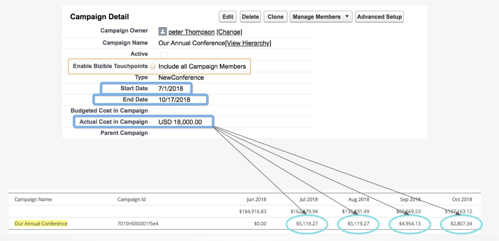

# Custos de campanhas de CRM {#crm-campaign-costs}

Mais [!DNL Marketo Measure] Os clientes usam campanhas CRM para rastrear atividades de marketing offline. Os profissionais de marketing que utilizam essas campanhas também monitorarão os custos dentro do CRM, de modo que esse recurso facilita a participação dos profissionais de marketing ao permitir [!DNL Marketo Measure] para ler esses custos e aplicá-los aos gastos de marketing relatados no [!DNL Marketo Measure]. Até o momento, os clientes precisavam inserir manualmente os custos de cada campanha por mês, mas com as informações necessárias fornecidas para nós, [!DNL Marketo Measure] O pode automatizar esse processo para que os profissionais de marketing possam gastar mais tempo analisando seus gastos e ROI.

## Disponibilidade {#availability}

Este recurso está disponível para todos [!DNL Salesforce] e clientes do Dynamics.

## Como funciona {#how-it-works}

[!DNL Marketo Measure] O primeiro procura Campanhas que foram &quot;ativadas&quot; para pontos de contato, de modo que haja uma regra de Sincronização de campanha correspondente que foi criada ou o valor Ativar pontos de contato do comprador é &quot;Incluir todos os membros da campanha&quot; ou &quot;Incluir membros da campanha &#39;respondidos&#39;&quot;. Além disso, [!DNL Marketo Measure] É necessário importar os valores corretos e saber como distribuir os custos, de modo que precisamos que os seguintes campos contenham um valor:

**[!DNL Salesforce]**: Custo Real, Data Inicial, Data Final

**[!DNL Microsoft Dynamics]**: custo total, início real, valor real

Se algum dos três campos estiver faltando um valor, [!DNL Marketo Measure] não importará os custos. Você pode corrigir isso atualizando o registro do Campaign no CRM. Também é importante observar que não importaremos os custos se ele estiver explicitamente definido como $0 porque [!DNL Salesforce] O trata em branco e o $0 como o mesmo.

Para [!DNL Marketo Measure] para determinar a distribuição de uma campanha durante meses, usamos a data de início e término da campanha e distribuímos o valor uniformemente por dia.

Neste exemplo, temos uma campanha que dura 109 dias, então com um custo total de $18.000, o gasto por dia chega a ~$165,14.

Com base no número de dias por mês, obtemos esses totais mensais, como você pode ver na tabela:

Julho de 2018: ($18.000/109) x 31 = $5.119,27

Ago 2018: ($18.000/109) x 31 = $5.119,27

Set. 2018: ($18.000/109) x 30 = $4.954.13

Out 2018: ($18.000/109) x 17 = $2.807,34

## Gasto Relatado Histórico {#historical-reported-spend}

Não se preocupe! Se você tiver inserido os gastos para Campanhas que rastreamos no passado que foram mapeadas para uma Campanha CRM, não substituiremos nenhum dos custos inseridos. Se a mesma campanha no CRM for modificada, ainda a ignoraremos e daremos prioridade às alterações feitas anteriormente no upload do CSV.

Se preferir que o custo da Campanha de CRM avance, o que você pode fazer é alterar o valor do CSV para $0, o que anulará a entrada. Em seguida, na próxima vez que executarmos nossos trabalhos para importar os custos, verificaremos todos os registros que tenham sido editados anteriormente e enviaremos esses registros.

## Campanhas sem pontos de contato {#campaigns-with-no-touchpoints}

Muitos profissionais de marketing optam por relatar os gastos com marketing em Campanhas de CRM que não geraram pontos de contato ou que, ao que tudo indica, não têm membros da campanha para fins de rastreamento de gastos. Contanto que os 3 campos sejam preenchidos (data inicial, data final, custo) e a campanha seja ativada para pontos de contato, [!DNL Marketo Measure] O ainda obterá esse custo, independentemente de haver ou não pontos de contato associados a ele.

Isso pode ser útil para rastrear os gastos com custos de marketing excessivos ou ferramentas para acumulá-los em seus cálculos de ROI.

## Sincronização do programa Marketo {#marketo-program-sync}

Se você incluir Programas Marketo no CRM como Campanhas, deverá garantir que terá o mapeamento Data Inicial, Data Final e Custo do Período configurado para os campos do CRM necessários. Como não há mapeamento para o campo Ativar pontos de contato do comprador , você ainda precisará ativar essas campanhas para que saibamos arrecadar os custos para elas.

## Editar os custos {#editing-the-costs}

Depois que uma campanha é importada do CRM, ela será tratada de forma semelhante a um Provedor de anúncios de API e não aparecerá no CSV para fazer alterações de custo.

Quaisquer mudanças no custo ou na distribuição devem ser feitas no CRM para que possamos apontar um único ponto de verdade.

## Perguntas frequentes {#faq}

**Fiz uma alteração na minha campanha - quando devo esperar ver as alterações na tabela de gastos de marketing ou em meus relatórios?**

3 a 4 horas

**Eu tenho a data de início, a data de término e o custo preenchido, mas por que meus custos ainda não estão aparecendo em [!DNL Marketo Measure]?**

Verifique se o valor Ativar ponto de contato do comprador está definido como &quot;Incluir todos os membros da campanha&quot; ou, pelo menos, &quot;Incluir membros da campanha &#39;respondidos&#39;&quot;, ou se você criou uma regra personalizada de Sincronização de campanha que inclui essa campanha. Caso tenha confirmado isso e ainda não veja a Campanha, entre em contato com [Suporte Marketo](https://nation.marketo.com/t5/support/ct-p/Support){target="_blank"} para que possamos verificar se suas Campanhas estão importando corretamente.

**Preciso mudar a distribuição da minha Campanha para que eu possa pesá-la mais em alguns meses. Como faço isso?**

A repartição dos custos baseia-se exclusivamente numa distribuição uniforme entre a data de início e a data de termo. Infelizmente, não podemos alterá-lo para que seus custos tenham um peso diferente além das datas definidas. Você pode controlar isso ajustando as datas de início e término da campanha, pois cada dia do mês é importante.

**Tenho custos configurados em minha Campanha pai - como as Campanhas de crianças recebem o custo da Campanha pai?**

Na verdade, a forma como os custos serão recebidos será diretamente de uma única campanha, independentemente de qualquer relacionamento Pai ou Filho. Aconselhamos que o custo vai para as Campanhas Crianças, juntamente com as datas da campanha, e então usamos o Pai como a campanha principal, onde a Campanha Pai não seria habilitada para pontos de contato.

**Como alterar o custo de um mês em [!DNL Marketo Measure]?**

Como dependemos do CRM como única fonte de verdade, todas as alterações precisam ser feitas no CRM. Depois que a Campanha for importada por [!DNL Marketo Measure], os valores de Campaign não são editáveis em [!DNL Marketo Measure] ou no arquivo CSV.

**Em que cenário uma Campanha apareceria na tabela Gastos de marketing e não apareceria mais?**

Continuaremos a exigir que todos os três campos principais tenham um valor: Data Inicial, Data Final e Custo. Nosso comportamento padrão é que importamos apenas Campanhas com um valor maior que $0. Idealmente, importaríamos Campanhas em que há um $0 explícito e não importaríamos aquelas que ficam em branco, mas a API do Salesforce as importa como $0, independentemente do valor. Além disso, se o valor Ativar ponto de contato do comprador mudar de &quot;Incluir tudo&quot; ou &quot;Incluir &quot;Respondido&quot; para &quot;Excluir tudo&quot;, removeremos a Campanha e o Custo da tabela de Gastos de marketing.

**Qual custo teria prioridade se uma linha já tivesse sido baixada do CRM e eu inserisse outra linha no CSV com a mesma ID da campanha?**

Embora você possa fazer upload do arquivo com êxito, [!DNL Marketo Measure] não usará essa linha porque já temos uma ID da campanha com o mesmo valor que foi automaticamente extraído da integração.

**Como você sugere que traçamos custos de nossas Campanhas Digitais que configuramos no CRM?**

Porque nossa [!DNL Marketo Measure] o javascript já está rastreando a atividade da Web em seu site. Recomendamos não sincronizar campanhas que rastreiem membros do Campaign a partir de formulários da Web ou outras atividades do site, pois contará duas vezes os toques. Por causa disso, talvez você queira continuar usando a opção Upload de CSV na Marketing Spend para rastrear esses custos online/digitais se ainda não estivermos integrados a essa plataforma (ou seja, Twitter, Adroll).
