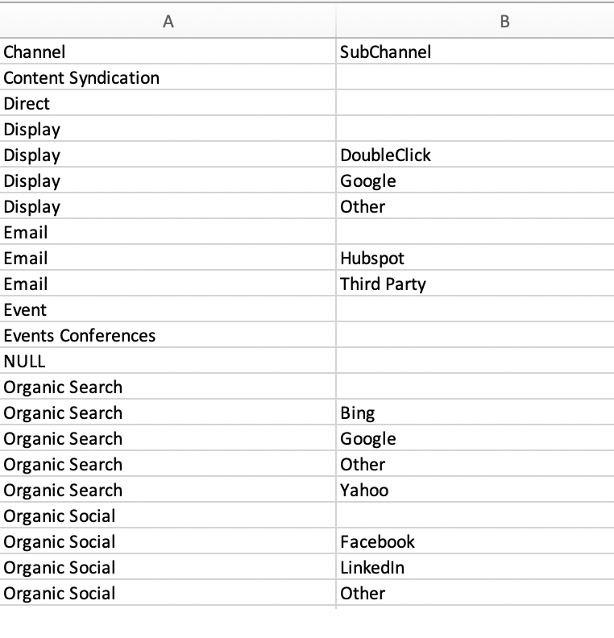

# Custos de canal de marketing {#marketing-channel-costs}

Um dos benefícios mais fundamentais de usar [!DNL Marketo Measure] é a capacidade de conectar os esforços de marketing diretamente ao impacto na receita, com a granularidade desejada. É possível ver o retorno do investimento no nível do ponto de contato. Para aproveitar esse benefício, os custos de canal precisam apenas ser carregados no [!DNL Marketo Measure] aplicativo. Os relatórios de ROI são criados e disponibilizados automaticamente na **Painel de ROI de marketing** in [experience.adobe.com/marketo-measure](https://experience.adobe.com/marketo-measure){target="_blank"}.

[Clique aqui para navegar diretamente para as instruções.](/help/marketing-spend/spend-management/marketing-channel-costs.md#uploading-marketing-costs)

A variável [!DNL Marketo Measure] O recurso de gasto com marketing permite que os clientes façam upload de seus gastos em todos os canais, subcanais e campanhas. Quanto mais dados forem adicionados pelos clientes, mais relatórios de ROI poderemos exibir no Painel de atribuição de receita.

Os custos relatados e importados das conexões de anúncios diretos são automaticamente obtidos no nível mais granular e não precisam ser carregados. Isso inclui nossas integrações atuais com o Google AdWords, Bing Ads, Doubleclick e Facebook.

[Clique aqui para acessar diretamente as Perguntas frequentes.](/help/marketing-spend/spend-management/marketing-channel-costs.md#faq)

## Definições {#definitions}

**Gastos por campanha**

No nível mais granular, os clientes podem inserir gastos por Campanhas individuais, agrupadas em seu respectivo Canal. Para campanhas CRM, [!DNL Marketo Measure] O puxou a ID da campanha em uma coluna separada que ajudará você a mapear os gastos offline da campanha do seu CRM para esta tabela. Adicionar gastos nesse nível permitirá que os clientes visualizem o ROI do Campaign e otimizem o desempenho por meio do Campaign.

O total de todas as campanhas não precisa somar quaisquer valores inseridos no Subcanal ou Canal, mas não pode ser maior do que quaisquer valores inseridos no Subcanal ou Canal. Se a soma for menor que o valor inserido no Subcanal ou Canal, [!DNL Marketo Measure] O adicionará automaticamente uma linha para &quot;Outros&quot; para cobrir a diferença e preencher quaisquer lacunas.

**Gastos por Subcanal**

Em um nível superior, os clientes podem inserir gastos por Subcanal, agrupados abaixo de seu Canal. Adicionar gastos neste nível permitirá que os clientes visualizem o ROI do subcanal e otimizem o desempenho por subcanal.

O total de todos os subcanais não precisa totalizar até os valores inseridos no Canal, mas não pode ser maior do que os valores inseridos no Canal. Se a soma for menor que o valor inserido no Channel, [!DNL Marketo Measure] O adicionará automaticamente uma linha para &quot;Outros&quot; para cobrir a diferença e preencher quaisquer lacunas.

**Gastos por canal**

No nível mais alto, os clientes podem inserir gastos por canal. A adição de gastos nesse nível permitirá que os clientes visualizem o ROI do canal e otimizem o desempenho por canal.

**Seletor de data**

O intervalo de datas padrão começará a partir da data inicial com [!DNL Marketo Measure] até o mês atual. Para garantir que os custos permaneçam corretos, você não poderá inserir custos para meses futuros, mas poderá inserir custos para meses anteriores à sua parceria com a [!DNL Marketo Measure].

**Filtro**

Para restringir seus resultados na tabela de Gastos com marketing, selecione um Canal na parte superior para filtrar outros canais. Isso é útil quando você tem uma equipe focada em um canal único.

**Pesquisar**

Use a caixa Pesquisar para localizar o texto correspondente de Canais, Subcanais ou Campanhas.

**Baixar Custos Atuais**

O CSV baixado extrairá os resultados da tela atual, o que significa que as datas, os filtros ou as pesquisas aplicados serão baixados como estão.

**Fazer upload de CSV**

Independentemente da visualização que estiver localizada no navegador, se for uma visualização filtrada ou a visualização padrão com todas as datas e canais, você poderá fazer upload de qualquer CSV.

O erro mais comum que enfrentamos é o formato das colunas de data, que acontece se o formato de data é alterado e pode ocorrer intencionalmente se mover entre o Excel e/ou o Google Sheets. Lembre-se de que a data deve ser MM-AA, portanto, setembro de 12 e não setembro de 12, ou maio de 12 e não 05-12.

## Antes de começar {#before-you-begin}

[!DNL Marketo Measure] O vem com 13 canais padrão que podem ser usados ou expandidos. Além disso, até 40 canais online e offline podem ser criados para acomodar sua estrutura de marketing exclusiva. Com base nisso, um total de 200 subcanais também pode ser criado para dar suporte a esses canais online e offline.

[!DNL Marketo Measure] O baixará automaticamente os custos do canal de marketing de plataformas com as quais ele tem uma integração de API, como Bing Ads e Google AdWords. Custos para plataformas que não estão integradas no [!DNL Marketo Measure] precisará ser carregado manualmente. Os canais de marketing devem ser configurados antes que os dados de custo sejam carregados.

## Fazer upload de custos de marketing {#uploading-marketing-costs}

Depois que os canais e as regras de marketing forem configurados ou atualizados, os custos associados poderão ser carregados. Para fazer isso, siga as etapas abaixo:

**Etapa 1: acesse a página Gastos com marketing no [!DNL Marketo Measure] Aplicativo.**

Vá para a **[!UICONTROL Minha conta]** clique em **[!UICONTROL Configurações]** e navegue até o **[!UICONTROL Gastos com marketing]** na barra lateral esquerda, sob a caixa **[!UICONTROL Relatórios]** seção.

**Etapa 2: baixe o CSV de custos atuais**

Navegue até o lado direito da tela e clique em **[!UICONTROL Baixar Custos Atuais].** Essa opção permite baixar uma planilha no formato CSV.

**Etapa 3: abrir o arquivo CSV e fazer alterações**

Você pode importar o arquivo e abri-lo utilizando o Google Sheets, Apple Numbers, Microsoft Excel ou sua escolha de software. [!DNL Marketo Measure] A recomenda usar o Google Sheets.

Após importar a planilha, faça as alterações desejadas, como adicionar custos aos canais e subcanais ou atualizar as informações existentes.

Verifique as regras de lógica na sua planilha. Cada linha deve conter um canal e um de seus subcanais separados por um (.) ponto no final. É importante usar esse formato de maneira consistente.

Por exemplo, para indicar o Facebook como o subcanal e social como o canal, a regra deve ser escrita da seguinte maneira: &quot;Social.Facebook&quot;. Da mesma forma, para rastrear um evento offline, a sintaxe do canal deve ser: &quot;Events.Big Conference&quot;. Os exemplos são mostrados na imagem abaixo:

_Observações adicionais_:

Não modifique as datas na planilha porque isso pode causar problemas quando o documento for carregado.

Não deixe nenhum campo em branco. Mesmo se não houver um valor em dólar para adicionar, insira $0 como o valor em dólar.

Os custos do Bing Ads e do Google AdWords não precisam ser inseridos ou atualizados porque [!DNL Marketo Measure] O extrai automaticamente esses dados da conexão da API com essas plataformas.

**Etapa 4: salvar arquivo no formato CSV**

Se estiver trabalhando no Google Sheets, baixe o arquivo primeiro. Não exclua ou exclua dados mensais pois isso causará dificuldades ao tentar fazer upload do arquivo CSV para [!DNL Marketo Measure] posteriormente.

**Etapa 5: Fazer upload do arquivo CSV**

Vá para a **[!UICONTROL Custo]** seção do [!DNL Marketo Measure] e clique em **[!UICONTROL Upload.CSV]**. O sistema será atualizado e refletirá as novas informações.

## Perguntas frequentes {#faq}

**Por que os números aparecem no CSV?**

Se nenhum valor for inserido em um nível superior, como Canal ou Subcanal, [!DNL Marketo Measure] O somará automaticamente os níveis secundários para você, que serão apresentados quando o arquivo for carregado. Além disso, se a soma dos filhos for menor que um valor inserido para o pai, [!DNL Marketo Measure] adicionará uma linha &quot;Outros&quot; para mostrar a diferença no total.

**Como as Campanhas são determinadas na lista que estou vendo?**

No momento, nossos resultados listam as Campanhas que já vimos serem creditadas com um ponto de contato. Se houve atividade de uma Campanha, mostraremos essa Campanha com base na Data do ponto de contato em que ocorreu.

**Há muitas linhas e colunas para filtrar. É possível consolidar a exibição?**

Com a capacidade de alterar o intervalo de datas, filtrar o canal ou pesquisar valores, é possível consolidar os resultados da tabela para melhor atender às suas necessidades.

**Por que não posso carregar um arquivo?**

Temos diferentes conjuntos de permissões na [!DNL Marketo Measure] Aplicativo. Para carregar um arquivo, você precisa ser um &quot;AccountAdmin&quot;. Para contornar isso, solicite acesso ao seu AccountAdmin ou peça a ele que carregue o arquivo em seu nome. Uma lista de usuários e suas funções pode ser encontrada em **[!UICONTROL Minha conta]** > **[!UICONTROL Configurações]** > **[!UICONTROL Exibir/adicionar usuários da conta]**.
