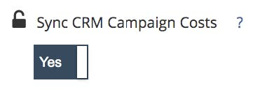

# Métodos de gerenciamento de gastos {#spend-management-methods}

Os dados de gastos são fundamentais para o sucesso da geração de relatórios de ROI com [!DNL Marketo Measure]. Para ter relatórios de ROI precisos e abrangentes em todos os canais e subcanais, é necessário garantir que você tenha os dados de gastos apropriados sendo transferidos para o [!DNL Marketo Measure].

Há três maneiras de obter dados de gastos em [!DNL Marketo Measure]. Cada método é projetado para obter dados de gastos de entradas de dados específicas.

**1) Contas conectadas da API**

Qualquer conta publicitária à qual você tenha se conectado [!DNL Marketo Measure] por meio de uma API terá seu gasto automaticamente recebido [!DNL Marketo Measure] para relatórios de ROI. Para verificar quais contas você conectou e, portanto, obter gastos, vá para a [!DNL Marketo Measure] e selecione a variável [!UICONTROL Conexões] na guia [!UICONTROL Integrações] seção. Para obter mais detalhes sobre como configurar suas conexões de API, consulte nossa [Plataformas de publicidade integradas](/help/api-connections/utilizing-marketo-measures-api-connections/integrated-ad-platforms.md#how-to-connect-ad-platforms) artigo.

**2) Sincronização de custo da campanha do CRM**

A cada [!DNL Marketo Measure] A conta do tem acesso a um recurso chamado [Sincronizar Custos de Campanha do CRM](/help/marketing-spend/spend-management/crm-campaign-costs.md#availability). Por padrão, esse bit de recurso está definido como &quot;Não&quot;, mas pode ser ativado a qualquer momento.

Depois de habilitado, esse recurso extrairá automaticamente os gastos de qualquer campanha/programa de CRM que atenda aos seguintes critérios

i) [!DNL Marketo Measure] primeiro, verifica se a Campanha/Programa está criando pontos de contato, seja a partir de um correspondente [Regra de sincronização de campanha](/help/channel-tracking-and-setup/offline-channels/custom-campaign-sync.md) que foi criado ou um [Regra de sincronização de programa](/help/marketo-measure-and-marketo/marketo-measure-integrations-with-marketo/marketo-engage-programs-integration.md) que foi criado ou o [Ativar valor de Pontos de contato do comprador](/help/channel-tracking-and-setup/offline-channels/deprecated-processes/syncing-offline-campaigns.md#how-to-create-a-campaign-and-sync-buyer-touchpoints) é &quot;Incluir todos os membros da campanha&quot; ou &quot;Incluir membros da campanha &#39;Respondidos&#39;&quot;.

ii) Uma Data de início deve ser preenchida na campanha/programa

iii) Uma Data final também deve ser preenchida na campanha/programa

iv) Por fim, um Custo Real (para Campanhas no SFDC) ou Custo do Período (para Programas no Marketo) deve ser especificado.

**3) Upload manual de custos**

Esse método permite [carregar dados de gastos manualmente](/help/marketing-spend/spend-management/marketing-channel-costs.md#uploading-marketing-costs) para os canais e subcanais que não são cobertos pelas contas conectadas à API ou pela sincronização de custos da campanha do CRM. Ao navegar até a seção Gasto com marketing no seu [!DNL Marketo Measure] , você pode fazer upload dos dados de gastos por meio de um arquivo CSV para qualquer um dos seus canais.

Os clientes podem usar uma combinação dos três métodos para gerenciar seus gastos e dependerão da configuração específica do [!DNL Marketo Measure]. Como há três métodos de importação de gastos para [!DNL Marketo Measure], recomendamos que você utilize seu painel de Gastos com marketing localizado em Discover para obter uma visualização abrangente de todos os dados de gastos. Este painel é o único local onde você poderá ver todos os seus canais e seus gastos associados. O quadro Gasto com marketing pode ajudar você a identificar rapidamente onde pode haver lacunas em seus dados de gastos e como você pode melhorar seus relatórios de ROI.
