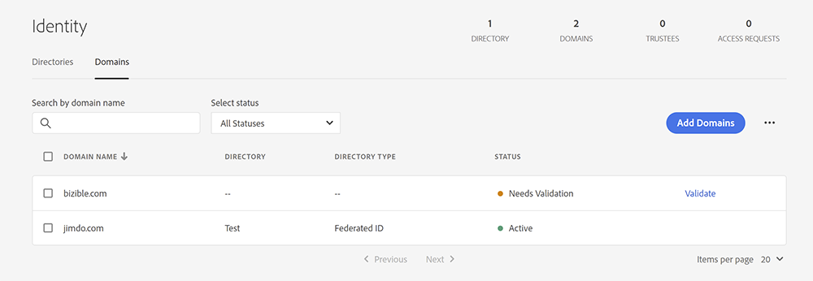

# Gerenciamento de domínio {#domain-management}

Para locatários habilitados para IMS em execução [!DNL Marketo Measure] na interface do Experience Cloud, [!DNL Marketo Measure] O fornece uma interface que permite aos usuários gerenciar sua própria lista de domínios. [!DNL Marketo Measure] usuários devem primeiro verificar todos os domínios que desejam rastrear no [Adobe Admin Console](https://adminconsole.adobe.com/). Depois que os domínios forem verificados no Admin Console, os usuários poderão gerenciar se [!DNL Marketo Measure] O usa esses domínios para rastrear o tráfego do site.

## Adicionar domínios no Admin Console {#adding-domains-in-admin-console}

Os usuários do IMS com acesso à Adobe Admin Console podem adicionar e validar os domínios que possuem. A validação de domínio envolve adicionar um registro DNS para cada domínio e permitir que o Admin Console verifique esse registro.

As instruções para adicionar domínios podem ser encontradas na [Documentação do Admin Console](https://helpx.adobe.com/enterprise/using/add-domains-directories.html). Depois que um domínio é adicionado, ele deve ser [vinculado a um diretório](https://helpx.adobe.com/enterprise/using/add-domains-directories.html#link-domains-to-directoies).

## Gerenciamento de domínios no [!DNL Marketo Measure] {#managing-domains-in-marketo-measure}

Depois que um domínio é adicionado ao Admin Console, [!DNL Marketo Measure] O sincroniza este registro no banco de dados regularmente. Essa sincronização acontece à noite e também sempre que um usuário visita a **[!UICONTROL Domínios]** página no [!DNL Marketo Measure] IU. Por padrão, todos os registros que [!DNL Marketo Measure] as importações estão desativadas e o locatário deve ativar manualmente cada domínio.

No **[!UICONTROL Integração]** > **[!UICONTROL Domínios]** página, o usuário vê todos os domínios que registrou no Admin Console, juntamente com seu status. Cada domínio pode ser ativado ou desativado. Se um domínio estiver ativado, [!DNL Marketo Measure] O rastreamento do coleta qualquer tráfego que seja visto nesse domínio. Se um domínio estiver desativado, [!DNL Marketo Measure] O ignora qualquer tráfego proveniente desse domínio e não cria pontos de contato ou outros dados. [!DNL Marketo Measure] confirma a desativação de um domínio e avisa sobre qualquer ramificação:

O impacto da alternância de um domínio é imediato e as alterações não são retroativas. No futuro, [!DNL Marketo Measure] O removerá dados de domínios desativados após um período definido.

## Status {#statuses}

Os status de Admin Console são classificados da seguinte maneira:

* **VALIDADO**: Este domínio é verificado no Admin Console
* **NÃO VERIFICADO**: este domínio não é totalmente verificado no Admin Console e não está qualificado para rastreamento no [!DNL Marketo Measure]
* **INVÁLIDO**: Este domínio pode ter expirado ou sido removido do Admin Console. Rastreamento de dados no [!DNL Marketo Measure] está sinalizado para exclusão
* **LEGACY**: Este domínio foi criado em [!DNL Marketo Measure] e não existe no Admin Console

Os status de rastreamento podem ser os seguintes:

* **ATIVO**: [!DNL Marketo Measure] está recebendo dados deste domínio
* **DESATIVADO**: este domínio está disponível para rastreamento, mas está desativado
* **INDISPONÍVEL**: este domínio não está disponível para rastreamento porque não foi verificado

Passar o mouse sobre qualquer item de status individual aciona uma dica de ferramenta que explica melhor esse status.

## Perguntas frequentes {#faq}

**O que acontece quando um domínio é removido no Admin Console?**

Quando um domínio é removido no Admin Console, [!DNL Marketo Measure] marca o domínio como excluído. [!DNL Marketo Measure] O interrompe imediatamente o rastreamento do tráfego neste domínio, mas não remove os dados coletados anteriormente.

**Por que não consigo habilitar um domínio?**

Há vários motivos pelos quais um domínio pode não ser permitido para seleção nesta página. Se o domínio não for validado no Admin Console, ele não estará disponível no [!DNL Marketo Measure]. Da mesma forma, se o domínio for de propriedade de uma Adobe Org diferente da atual [!DNL Marketo Measure] locatário, pode estar indisponível para seleção.

**Como remover um domínio desta lista?**

Se um domínio tiver a opção &quot;habilitado&quot; desligada, [!DNL Marketo Measure] o ignora e é efetivamente removido de [!DNL Marketo Measure]. Para remover permanentemente um domínio do [!DNL Marketo Measure], você deve desativá-lo em [!DNL Marketo Measure]e, em seguida, remova-o do Admin Console.
