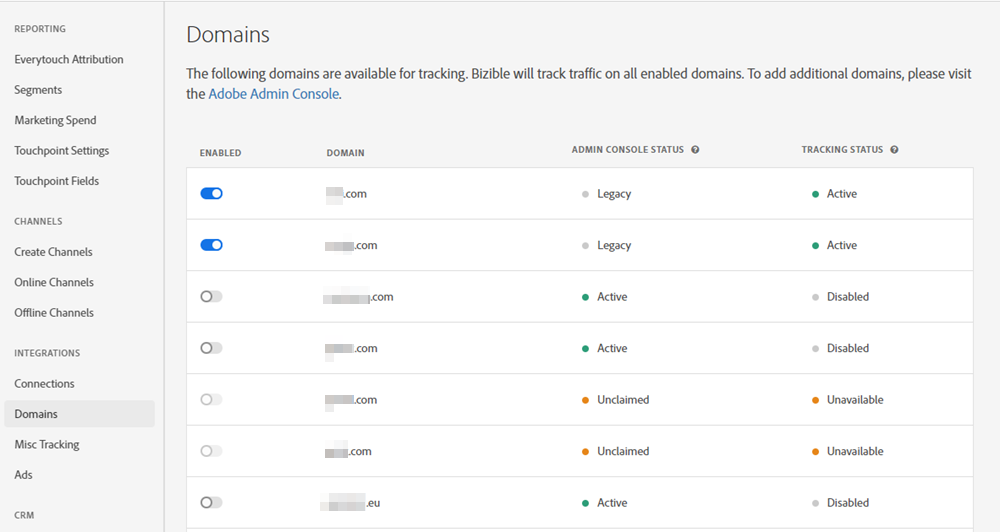
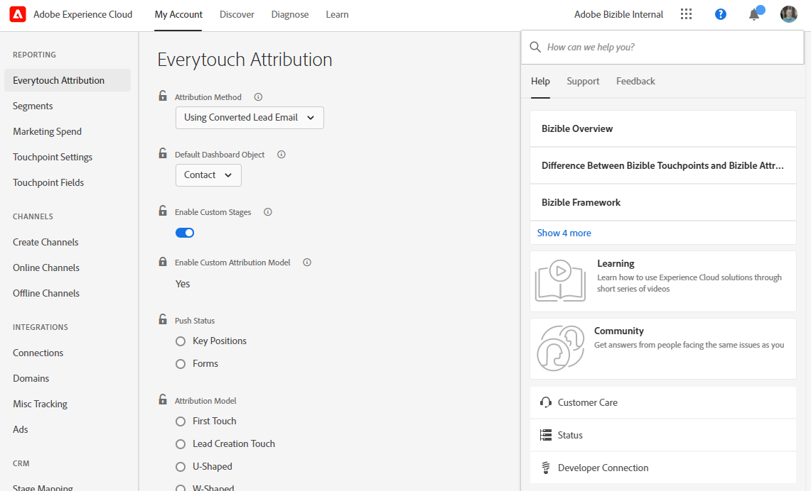
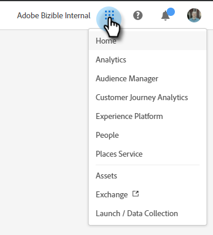
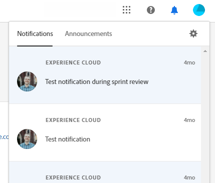

# Visão geral da interface do Adobe Experience Cloud {#experience-cloud-interface-overview}

A interface da Adobe Experience Cloud alinha a aparência dos aplicativos e serviços da Adobe Experience Cloud. Mas é mais do que um novo design. É um aplicativo de página única que fornece experiência do usuário em uma única instância.

## Fluxo de usuário {#user-flow}

Se você já estiver conectado a um produto Adobe Experience Cloud, clique no ícone do menu e selecione **[!DNL Marketo Measure]**.

>[!NOTE]
>
>O menu suspenso pode parecer diferente dependendo dos produtos da Adobe Experience Cloud aos quais você está inscrito.

Se você estiver _não_ já estiver conectado a um produto Adobe Experience Cloud, faça logon diretamente no [!DNL Marketo Measure] aqui: [https://experience.adobe.com/marketo-measure](https://experience.adobe.com/marketo-measure).

## Novos recursos {#new-features}

Além da aparência atualizada, você observará os seguintes recursos:

**Gerenciamento de domínio**

[Gerencie seu [!DNL Marketo Measure] domínios](/help/marketo-measure-and-adobe/domain-management.md) sem a assistência de [!DNL Marketo Measure].

**Centro de ajuda integrado**

Procure por artigos de suporte, envie tíquetes, forneça feedback, tudo dentro do [!DNL Marketo Measure] aplicação.

**Alternador de aplicativos**

Aqueles com acesso a vários produtos de Adobe poderão alternar facilmente entre eles.

**Notificações e anúncios**

Visualize e interaja com notificações específicas de produtos e anúncios gerais de produtos do Adobe diretamente no aplicativo.

**Configurações do Adobe**

Clique no ícone do perfil para alterar o idioma ou outras preferências do Adobe. Você também pode fazer [!DNL Marketo Measure]Alterações específicas do clicando em **Minhas configurações**.

## Perguntas frequentes {#faq}

**O que acontece com meus marcadores?**

Os marcadores serão redirecionados. Por exemplo, se você navegasse até https://apps.marketo-measure.com/Discover/391, seria redirecionado para https://experience.adobe.com/marketo-measure/Discover/391 após concluir a autenticação.

**Não consigo fazer login no [!DNL Marketo Measure] por meio da interface Experience Cloud. Qual pode ser o problema?**

Se você conseguir fazer logon no Adobe Experience Cloud, mas visualizar uma página como a seguinte, o problema pode estar na guia [!DNL Marketo Measure] lado:

Se você receber o erro acima, [entre em contato com o Suporte](https://nation.marketo.com/t5/support/ct-p/Support) para obter assistência.
