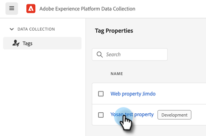
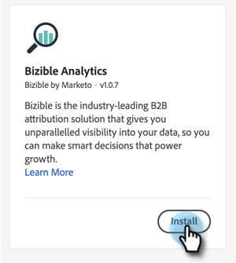
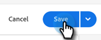
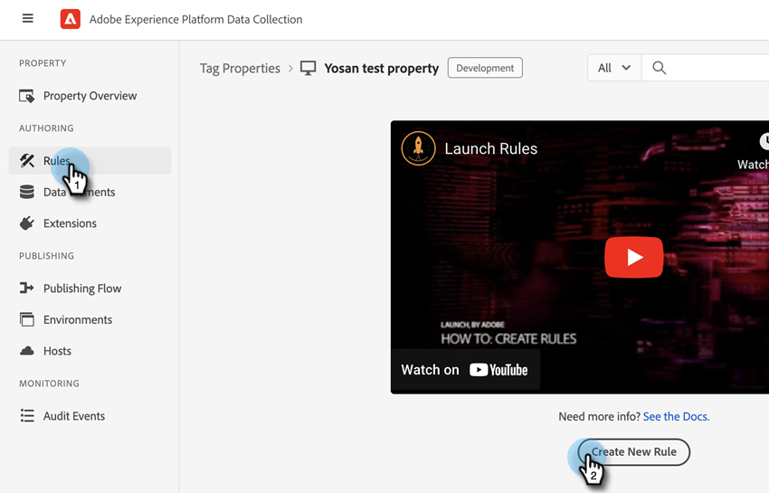
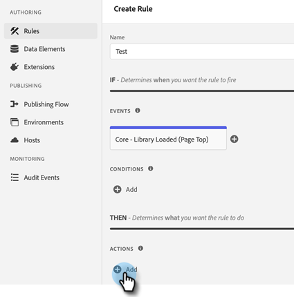

# [!DNL Marketo Measure] Integrações com o Adobe Launch {#marketo-measure-integrations-with-adobe-launch}

A extensão do Adobe Launch foi projetada para os usuários existentes do [!DNL Marketo Measure] que já usam o Adobe Launch em seus sites. A extensão do serve como uma solução de gerenciamento de tags que você pode usar para configurar e carregar scripts dinamicamente em suas páginas com base em determinados eventos e condições.

Quando instalada e configurada no Adobe Launch, a extensão [!DNL Marketo Measure] carrega o script bizible.js nas páginas em que o script Adobe Launch está presente. Isso permite que os profissionais de marketing adicionem bizible.js por meio da configuração do Adobe Launch, em vez de modificar explicitamente a página da Web para adicionar a tag de script bizible.js.

## Configurar a extensão do Adobe Launch {#configure-the-adobe-launch-extension}

>[!PREREQUISITES]
>
>Confira os links a seguir para saber mais sobre o Adobe Launch e suas extensões:
>
>* [[!DNL Marketo Measure] Extensão](https://experienceleague.adobe.com/docs/experience-platform/destinations/catalog/email/bizible.html?lang=pt-BR#catalog){target="_blank"}
>* [Visão Geral Da Inicialização Do Adobe](https://experienceleague.adobe.com/docs/platform-learn/implement-in-websites/overview.html?lang=pt-BR){target="_blank"}
>* [Visão Geral Da Extensão Do Adobe Launch](https://experienceleague.adobe.com/docs/experience-platform/tags/extension-dev/overview.html?lang=pt-BR){target="_blank"}

1. Crie uma propriedade seguindo as etapas [neste artigo](https://experienceleague.adobe.com/docs/platform-learn/implement-in-websites/configure-tags/create-a-property.html?lang=pt-BR#go-to-the-data-collection-interface){target="_blank"}.

1. Clique na propriedade que você criou.

   

1. Clique em **[!UICONTROL Extensões]**.

   

1. Clique na guia **[!UICONTROL Catálogo]** e procure por &quot;[!UICONTROL Bizible]&quot;.

   

1. No bloco [!UICONTROL Bizible Analytics], clique em **[!UICONTROL Instalar]**.

   

1. No campo Bizible AccountId, digite a URL do seu site (por exemplo, `adobe.com`).

   

1. Clique em **[!UICONTROL Salvar]**.

   

1. Clique em **[!UICONTROL Regras]** e selecione **[!UICONTROL Criar nova regra]**.

   

1. Clique no botão **[!UICONTROL Adicionar]** em [!UICONTROL Eventos].

   

1. Na lista suspensa Extensão, selecione **[!UICONTROL Core]**. Em seguida, na lista suspensa Tipo de evento, selecione **[!UICONTROL Biblioteca carregada (Início da página)]**. Se você não atribuir um nome ao evento, será aplicado um nome padrão. Clique em **[!UICONTROL Manter alterações]** quando terminar.

   

1. Clique no botão **[!UICONTROL Adicionar]** em Ações.

   

1. Na lista suspensa Extensão, selecione **[!UICONTROL Bizible Analytics]**. Em seguida, no menu suspenso Tipo de ação, selecione **[!UICONTROL Inicializar]**. Se você não atribuir um nome à ação, será aplicado um padrão. Clique em **[!UICONTROL Manter alterações]** quando terminar.

   

1. Clique em **[!UICONTROL Salvar]**.

   

