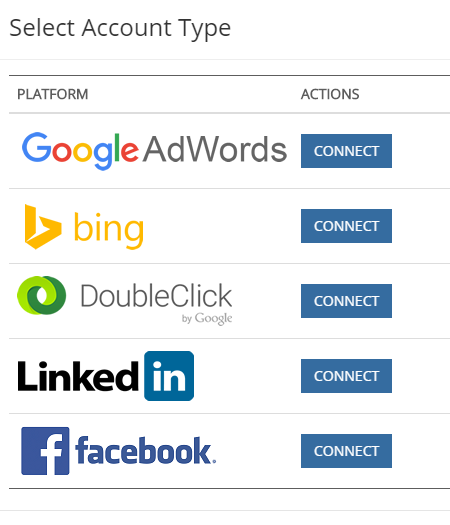

# Guia de instalação do [!DNL Microsoft Dynamics] CRM {#microsoft-dynamics-crm-installation-guide}

>[!NOTE]
>
>Você pode ver instruções específicas para o “[!DNL Marketo Measure]” na documentação, mas ainda notar o termo “Bizible” no CRM. Estamos trabalhando na atualização e a reformulação da marca será refletida em seu CRM em breve.

## Versões compatíveis {#supported-versions}

O [!DNL Marketo Measure] é compatível com as seguintes versões do [!DNL Microsoft Dynamics CRM]:

* [!DNL Microsoft Dynamics 2016] (online e local)
* [!DNL Microsoft Dynamics 365] (online e local)

Para conexão e autenticação, o [!DNL Marketo Measure] oferece suporte às seguintes versões dos Serviços Federados do Active Directory (ADFS):

* ADFS 4.0 - [!DNL Windows Server 2016]
* ADFS 5.0 - [!DNL Windows Server 2019]

## Instalar a solução gerenciada {#install-the-managed-solution}

[Baixe e instale](assets/marketo-measure-dynamics-extension.zip) o arquivo zip do Dynamics CRM.

**[!UICONTROL Configurações]** > **[!UICONTROL Personalizações]** > **[!UICONTROL Soluções]** > **[!UICONTROL Importar]** (botão) > **[!UICONTROL Escolher arquivo]**.

>[!NOTE]
>
>As duas capturas de tela a seguir podem variar um pouco na sua instância, pois foram feitas durante uma atualização da solução.

## Criação de um usuário do [!DNL Marketo Measure] {#creating-a-marketo-measure-user}

É recomendável criar um usuário dedicado do Marketo Measure como um “Usuário do aplicativo” no Dynamics para exportar e importar dados, evitando problemas com outros usuários no CRM. Anote o nome de usuário, a senha e o URL do ponto de acesso, pois eles serão usados ao criar a conta do [!DNL Marketo Measure].

## Funções de segurança {#security-roles}

Se sua organização usa as funções de segurança do Dynamics, verifique se o usuário conectado ou o usuário dedicado do [!DNL Marketo Measure] tem as permissões de leitura/gravação apropriadas para as entidades necessárias.

As funções de segurança estão localizadas em **[!UICONTROL Configurações]** > **[!UICONTROL Segurança]** > **[!UICONTROL Funções de segurança]**.

Para entidades personalizadas do [!DNL Marketo Measure], precisamos de permissão total em todas as entidades.

As permissões de &quot;Criação&quot; do Campaign também são necessárias, além das permissões de leitura/gravação para entidades padrão.

>[!NOTE]
>
>Os usuários que fecham oportunidades também precisam de permissão total.

Para entidades padrão do Dynamics, consulte o documento de esquema do [!DNL Marketo Measure] Dynamics. No contexto geral, o [!DNL Marketo Measure] analisa determinadas entidades para coletar os dados apropriados e os grava em campos personalizados instalados com a solução gerenciada. Os registros padrão não são criados e os campos padrão não são atualizados.

## Incluir pontos de contato em layouts de página: {#include-touchpoints-on-page-layouts}

1. Navegue até o editor de formulário de cada entidade. Você pode encontrá-lo em **[!UICONTROL Configurações]** > **[!UICONTROL Personalizações]** > **[!UICONTROL Personalizar o sistema]** > `[Entity]` > **[!UICONTROL Formulários]**. Alternativamente, é possível encontrá-lo nas configurações ao visualizar um registro.

   * As entidades a serem configuradas são: Conta, Oportunidade, Contato, Lead e Campanha.

   * Para configurar campanhas, você deve ativar a opção “Sincronização de campanha” em **[!UICONTROL CRM]** > **[!UICONTROL Campanhas]**.

   

1. Layouts de página: primeiro, adicione um bloco “[!UICONTROL Uma coluna]” na seção em que deseja manter os pontos de contato. Nessa nova coluna, precisamos adicionar uma subgrade em cada formulário nas entidades Conta, Oportunidade, Contato e Lead.

   

   

1. Selecione o objeto (Buyer Attribution Touchpoints ou Buyer Touchpoints) a ser renderizado na subgrade, que depende do relacionamento do objeto. Opcionalmente, altere as colunas exibidas clicando em Editar. O layout padrão é definido pela solução gerenciada.

   Subgrade Buyer Attribution Touchpoint - Contas, oportunidades e contato\
   Subgrade Buyer Touchpoint - Leads e contatos

   

1. Quando terminar de atualizar o formulário, publique e salve as alterações.

## Considerações relacionadas ao esquema {#schema-related-considerations}

**Receita**

Por padrão, o [!DNL Marketo Measure] indica o campo padronizado Receita efetiva. Se não estiver usando essa opção, explique como você relata a receita para a engenharia de soluções ou gerente de sucesso, pois será necessário um fluxo de trabalho personalizado.

**Data de fechamento**

Por padrão, o [!DNL Marketo Measure] indica o campo Data de fechamento real. Se não estiver usando essa opção ou se também usa o campo Data de fechamento estimada, explique seu processo à engenharia de soluções ou gerente de sucesso. Um fluxo de trabalho personalizado pode ser necessário para considerar ambos os campos.

## Configuração de conexões e provedores de dados {#configuring-your-connections-and-data-providers}

Depois de fazer logon no aplicativo [!DNL Marketo Measure] e configurar seu usuário no Adobe Admin Console, o próximo passo é configurar as várias conexões de dados.

**CRM como provedor de dados**

1. Na conta do [!DNL Marketo Measure], clique no menu suspenso **[!UICONTROL Minha conta]** e selecione **[!UICONTROL Configurações]**.

   

1. Em [!UICONTROL Integrações] na navegação à esquerda, clique em **[!UICONTROL Conexões]**.

   

1. Clique em **[!UICONTROL Configurar nova conexão do CRM]**.

   

1. Ao lado de [!UICONTROL Microsoft Dynamics CRM], clique em **[!UICONTROL Conectar]**.

   

1. Selecione [!UICONTROL Credenciais] ou [!UICONTROL OAuth].

   

   >[!NOTE]
   >
   >Para obter mais informações sobre OAuth, consulte [este artigo](/help/marketo-measure-and-dynamics/getting-started-with-marketo-measure-and-dynamics/oauth-with-azure-active-directory-for-dynamics-crm.md). Em caso de dúvidas sobre o processo, entre em contato com o(a) representante de conta do [!DNL Marketo Measure].

1. Neste exemplo, escolhemos a opção Credenciais. Insira suas credenciais e clique em **[!UICONTROL Próximo]**.

Após conectar, você verá os detalhes da conexão do Dynamics na lista Conexões de CRM/MAP.

**Conexões de conta de anúncios**

Para conectar suas contas de anúncios com o [!DNL Marketo Measure], comece acessando a guia [!UICONTROL Conexões] no aplicativo do [!DNL Marketo Measure].

1. Siga as etapas 1 e 2 da seção _CRM como provedor de dados_.

1. Clique em **[!UICONTROL Configurar nova conexão do CRM]**.

   

1. Selecione a plataforma desejada.

   

Javascript do **[!DNL Marketo Measure]**

Para que o [!DNL Marketo Measure] rastreie suas atividades da web, há várias etapas para configuração.

1. Clique no menu suspenso **[!UICONTROL Minha conta]** e selecione **[!UICONTROL Configuração da conta]**.

   

1. Insira um número de telefone. No campo de site, insira o domínio raiz principal que o [!DNL Marketo Measure] usa para rastrear no seu site. Clique em **[!UICONTROL Salvar]** quando terminar.

   

   >[!NOTE]
   >
   >Para adicionar vários domínios raiz, entre em contato com o(a) representante de conta do [!DNL Marketo Measure].

1. Insira o [[!DNL Marketo Measure] JavaScript](/help/marketo-measure-tracking/setting-up-tracking/adding-marketo-measure-script.md) em todo o site e nas páginas de destino. Recomendamos codificar o script no cabeçalho das páginas de destino ou adicionar por meio de um sistema de gerenciamento de tags, como o [Google Tag Manager](/help/marketo-measure-tracking/setting-up-tracking/adding-marketo-measure-script-via-google-tag-manager.md).

   >[!NOTE]
   >
   >Por padrão, o [!DNL Marketo Measure] exporta 200 registros por crédito de API sempre que um trabalho envia dados para seu CRM. Para a maioria dos clientes, isso fornece o equilíbrio ideal entre os créditos de API consumidos pelo [!DNL Marketo Measure] e os requisitos de recursos da CPU no CRM. No entanto, para clientes com configurações complexas de CRM, como fluxos de trabalho e acionadores, um tamanho de lote menor pode ser útil para melhorar o desempenho do CRM. Para isso, o [!DNL Marketo Measure] permite que os clientes configurem o tamanho do lote de exportação do CRM. Essa configuração está disponível na página Configurações > CRM > Geral no aplicativo web do [!DNL Marketo Measure] e permite que clientes escolham entre tamanhos de lote de 200 (padrão), 100, 50 ou 25.
   >
   >Ao modificar essa configuração, lembre-se de que tamanhos de lote menores consumirão mais créditos de API do seu CRM. É aconselhável reduzir o tamanho do lote somente se você estiver atingindo o tempo limite da CPU ou gerando uma alta carga de CPU no CRM.

   >[!NOTE]
   >
   >Desabilitar a exportação de dados do Marketo Measure para o Dynamics não remove nenhum dado existente. Para obter ajuda sobre como remover dados existentes, entre em contato com o Suporte do Dynamics.

   >[!MORELIKETHIS]
   >
   >[Notificações de erro](/help/configuration-and-setup/getting-started-with-marketo-measure/error-notifications.md){target="_blank"}
