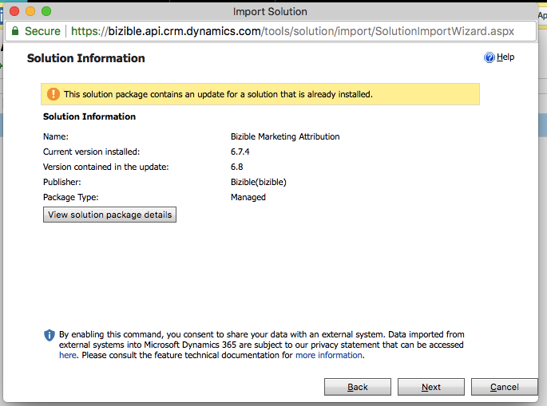
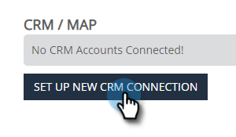

# [!DNL Microsoft Dynamics] Guia de instalação do CRM {#microsoft-dynamics-crm-installation-guide}

>[!NOTE]
>
>Você pode ver instruções especificando “[!DNL Marketo Measure]” em nossa documentação, mas ainda ver “Bizible” em seu CRM. Estamos trabalhando para atualizar isso e a reformulação da marca será refletida em seu CRM em breve.

## Versões suportadas {#supported-versions}

[!DNL Marketo Measure] suporta o seguinte [!DNL Microsoft Dynamics CRM] versões:

* [!DNL Microsoft Dynamics 2016] (Online e no local)
* [!DNL Microsoft Dynamics 365] (Online e no local)

Para conexão e autenticação, [!DNL Marketo Measure] O oferece suporte às seguintes versões dos Serviços Federados do Ative Diretory (ADFS):

* ADFS 4.0 - [!DNL Windows Server 2016]
* ADFS 5.0 - [!DNL Windows Server 2019]

## Instalar a solução gerenciada {#install-the-managed-solution}

[Baixar e instalar](assets/marketo-measure-dynamics-extension.zip) o arquivo zip no Dynamics CRM.

**[!UICONTROL Configurações]** > **[!UICONTROL Personalizações]** > **[!UICONTROL Soluções]** > **[!UICONTROL Importar]** (botão) > **[!UICONTROL Escolher arquivo]**.

>[!NOTE]
>
>As duas capturas de tela a seguir podem variar um pouco da sua, pois foram feitas durante uma atualização da solução.

## [!DNL Marketo Measure] Permissões de usuário {#marketo-measure-user-permissions}

Recomendamos a criação de um [!DNL Marketo Measure] O usuário do Dynamics pode exportar e importar dados para o para evitar problemas com outros usuários do seu CRM. Anote o nome de usuário e a senha, bem como o URL do endpoint, pois eles serão usados ao criar o [!DNL Marketo Measure] conta.

## Funções de segurança {#security-roles}

Se sua organização usar Funções de Segurança do Dynamics, verifique se o usuário conectado ou o [!DNL Marketo Measure] O usuário tem permissões de leitura/gravação suficientes para as entidades necessárias.

As Funções de segurança estão localizadas aqui: **[!UICONTROL Configurações]** > **[!UICONTROL Segurança]** > **[!UICONTROL Funções de segurança]**.

Para [!DNL Marketo Measure] entidades personalizadas, precisaremos de permissões completas em todas as entidades.

>[!NOTE]
>
>Os usuários que fecharão oportunidades também precisarão das permissões completas.

Para entidades padrão do Dynamics, consulte a [!DNL Marketo Measure] Documento de esquema dinâmico. Em um alto nível, [!DNL Marketo Measure] O só precisa ler em determinadas entidades para coletar os dados apropriados e gravar em campos personalizados que serão instalados com a solução gerenciada. Não criaremos novos registros padrão, nem atualizaremos campos padrão.

## Incluir pontos de contato em layouts de página: {#include-touchpoints-on-page-layouts}

1. Para cada Entidade, navegue até o Editor de formulário. Você pode encontrá-lo em **[!UICONTROL Configurações]** > **[!UICONTROL Personalizações]** > **[!UICONTROL Personalizar o sistema]** > `[Entity]` > **[!UICONTROL Forms]**. Ou você pode encontrá-lo nas configurações enquanto visualiza um registro.

   * As entidades a serem configuradas: Account, Opportunity, Contact, Lead e Campaign.

   * Para configurar Campanhas, você precisa ativar a opção &quot;Sincronização de campanha&quot; no **[!UICONTROL CRM]** > **[!UICONTROL Campanhas]**.

   

1. Layouts de página: primeiro adicione um &quot;[!UICONTROL Uma coluna]O bloco &quot; na seção em que você deseja que os pontos de contato entrem em funcionamento. Nessa nova coluna, será necessário adicionar uma subgrade a cada formulário nas entidades Conta, Oportunidade, Contato e Cliente Potencial.

   

   

1. Selecione o objeto (Pontos de contato da atribuição do comprador ou Pontos de contato do comprador) que deve ser renderizado na subgrade, que depende do relacionamento do objeto. Opcionalmente, altere as colunas que serão exibidas clicando no botão Editar. Um layout padrão foi definido pela solução gerenciada.

   Subgrade de Ponto de Contato de Atribuição do Comprador - Contas, Oportunidades e Contato\
   Subgrade do ponto de contato do comprador - clientes em potencial e contatos

   

1. Quando terminar de atualizar o formulário, publique e salve as alterações.

## Considerações relacionadas ao esquema {#schema-related-considerations}

**Receita**

[!DNL Marketo Measure] aponta para o campo padrão Receita Real por padrão. Se você não estiver usando esse recurso, explique como relata a receita ao seu engenheiro de soluções ou gerente de sucesso, pois será necessário um fluxo de trabalho personalizado.

**Data de fechamento**

[!DNL Marketo Measure] aponta para o campo Data Real de Fechamento pronto para uso. Se você não estiver usando essa opção ou também usar o campo Data de fechamento estimada, explique seu processo ao seu engenheiro de soluções ou gerente de sucesso. Um fluxo de trabalho personalizado pode ser necessário para considerar ambos os campos.

## Configuração de conexões e provedores de dados {#configuring-your-connections-and-data-providers}

Depois de fazer logon na [!DNL Marketo Measure] e foram configurados como usuário no Adobe Admin Console, o próximo passo é configurar suas várias conexões de dados.

**CRM como provedor de dados**

1. No seu [!DNL Marketo Measure] clique no link **[!UICONTROL Minha conta]** e selecione **[!UICONTROL Configurações]**.

   

1. Em [!UICONTROL Integrações] na navegação à esquerda, clique em **[!UICONTROL Conexões]**.

   

1. Clique em **[!UICONTROL Configurar Nova Conexão do CRM]** botão.

   

1. Ao lado de [!UICONTROL Microsoft Dynamics CRM], clique no link **[!UICONTROL Conectar]** botão.

   

1. Selecionar [!UICONTROL Credenciais] ou [!UICONTROL OAuth].

   

   >[!NOTE]
   >
   >Para obter mais informações sobre OAuth, visite [este artigo](/help/marketo-measure-and-dynamics/getting-started-with-marketo-measure-and-dynamics/oauth-with-azure-active-directory-for-dynamics-crm.md). Se tiver dúvidas sobre o processo, entre em contato com o [!DNL Marketo Measure] Representante de conta.

1. Neste exemplo, escolhemos Credenciais. Insira suas credenciais e clique em **[!UICONTROL Próxima]**.

Depois de se conectar, você verá os detalhes da conexão do Dynamics na lista Conexões CRM/MAP.

**Conexões da conta de anúncio**

Para conectar suas contas publicitárias com a [!DNL Marketo Measure], comece visitando o [!UICONTROL Conexões] na guia [!DNL Marketo Measure] aplicação.

1. Siga as etapas 1 e 2 acima _CRM como provedor de dados_ seção.

1. Clique em **[!UICONTROL Configurar Nova Conexão do CRM]** botão.

   

1. Selecione a plataforma desejada.

   

**[!DNL Marketo Measure]Javascript**

A fim de [!DNL Marketo Measure] para rastrear suas atividades da web, há várias etapas para configuração.

1. Clique em **[!UICONTROL Minha conta]** e selecione **[!UICONTROL Configuração da conta]**.

   

1. Insira seu número de telefone. Para o site, insira o domínio raiz primário que será usado para [!DNL Marketo Measure] no seu site. Clique em **[!UICONTROL Salvar]** quando terminar.

   

   >[!NOTE]
   >
   >Para adicionar vários domínios raiz, entre em contato com [!DNL Marketo Measure] Representante da Conta.

1. A variável [[!DNL Marketo Measure] JavaScript](/help/marketo-measure-tracking/setting-up-tracking/adding-marketo-measure-script.md) depois deve ser colocada em todo o site e landing pages. Recomendamos codificar o script no cabeçalho das páginas de aterrissagem ou adicionar por meio de um sistema Tag Management, como [Gerenciador de tags da Google](/help/marketo-measure-tracking/setting-up-tracking/adding-marketo-measure-script-via-google-tag-manager.md).

   >[!NOTE]
   >
   >Por padrão, o [!DNL Marketo Measure] exporta 200 registros por crédito de API sempre que um trabalho envia dados para seu CRM. Para a maioria dos clientes, isso fornece o equilíbrio ideal entre os créditos de API consumidos pelo [!DNL Marketo Measure] e os requisitos de recursos da CPU no CRM. No entanto, para clientes com configurações complexas de CRM, como fluxos de trabalho e acionadores, um tamanho de lote menor pode ser útil para melhorar o desempenho do CRM. Para isso, o [!DNL Marketo Measure] permite que os clientes configurem o tamanho do lote de exportação do CRM. Essa configuração está disponível na página Configurações > CRM > Geral no aplicativo web do [!DNL Marketo Measure], e os clientes podem escolher entre tamanhos de lote de 200 (padrão), 100, 50 ou 25.
   >
   >Ao modificar essa configuração, lembre-se de que tamanhos de lote menores consumirão mais créditos de API do seu CRM. É aconselhável reduzir o tamanho do lote somente se você estiver atingindo o tempo limite da CPU ou uma alta carga de CPU no CRM.

   >[!NOTE]
   >
   >Ao desativar a exportação de dados para o Dynamics, o Marketo Measure não removerá os dados existentes. Para obter ajuda sobre como remover dados existentes, entre em contato com o Suporte ao Dynamics.
