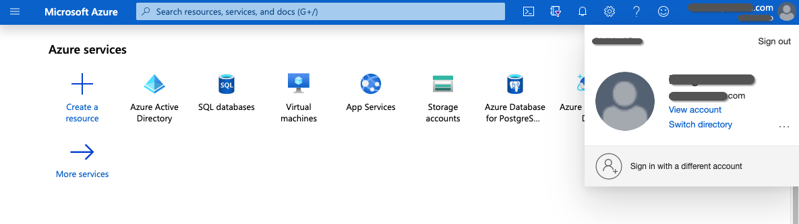

# OAuth com [!DNL Azure Active Directory] para Dynamics CRM {#oauth-with-azure-active-directory-for-dynamics-crm}

## Quem é afetado {#who-s-affected}

Esta configuração é para novos [!DNL Marketo Measure] clientes que usam o Dynamics CRM com um [!DNL Azure Active Directory] (AAD) ou para clientes que desejam migrar do nome de usuário e senha herdados para [!DNL Azure Active Directory] com OAuth.

>[!NOTE]
>
>Para ambos os cenários, o AAD é configurado aqui para facilitar a conexão da instância do Dynamics no [!DNL Marketo Measure] como um provedor de dados.

## Configurar Novo Aplicativo {#set-up-new-application}

1. Faça logon no [Portal do Azure](https://portal.azure.com/#home).

1. Escolha o locatário do Azure AD clicando em sua conta no canto superior direito da página, seguido por um clique na navegação do Diretório de alternância e selecionando o locatário apropriado. Ignore esta etapa se você tiver apenas um locatário do Azure AD na sua conta ou se já tiver selecionado o locatário apropriado do Azure AD.

   

1. Pesquisar por &quot;[!DNL Azure Active Directory]&quot; na barra de pesquisa e clique no nome a ser aberto.

   

1. Clique em **[!UICONTROL Registros do aplicativo]** no menu à esquerda.

   

1. Clique em **[!UICONTROL Novo registro]** no topo.

   

1. Siga os prompts e crie um aplicativo. Não importa se é um aplicativo web ou um aplicativo cliente público (dispositivos móveis e desktop), mas se você quiser exemplos específicos de aplicativos web ou aplicativos cliente públicos, confira o [inicializações rápidas](https://learn.microsoft.com/en-us/azure/active-directory/develop/v2-overview).\
   a. Nome é o nome do aplicativo e descreve o aplicativo para os usuários finais.\
   b. Em Tipos de conta compatíveis, selecione Contas em qualquer diretório organizacional e contas pessoais da Microsoft.\
   c. Forneça o URI de redirecionamento. Para Aplicativos Web, este é o URL base do seu aplicativo no qual os usuários podem fazer logon. Por exemplo, `http://localhost:12345`. Para clientes públicos (dispositivos móveis e desktop), o Azure AD o usa para retornar respostas de token. Insira um valor específico para seu aplicativo. Por exemplo, `http://MyFirstAADApp`.

1. Depois que você concluir o registro, o Azure AD atribuirá ao seu aplicativo um identificador de cliente exclusivo (a ID do aplicativo). Você precisa desse valor na próxima seção, portanto, copie-o da página do aplicativo.

1. Para encontrar seu aplicativo no portal do Azure, clique em **[!UICONTROL Registros do aplicativo]** e, em seguida, clique em **[!UICONTROL Todos os aplicativos]**. Abra o aplicativo recém-criado

1. Clique em **[!UICONTROL Autenticação]** no menu à esquerda.

   

1. Adicione o [!DNL Marketo Measure] URLs de redirecionamento: `https://apps.bizible.com/OAuth2` e `https://apps.bizible.com/OAuth2?identityOnly=true` à lista de URLs de redirecionamento.

   

1. Navegue até a guia Permissões de API e verifique se as permissões corretas foram atribuídas ao aplicativo.

   

1. Aqui, digite &quot;[!UICONTROL empresa]&quot; na caixa de pesquisa e clique em **[!UICONTROL Aplicativos empresariais]**.

   

1. Novamente, encontre e abra seu novo aplicativo na lista de aplicativos.

1. Na guia Permissões, clique em **[!UICONTROL Conceder consentimento administrativo para (nome da instância)]**.

   

1. Clique em **[!UICONTROL Aceitar]**.

   

1. No campo &quot;[!UICONTROL Usuários e grupos]&quot;, verifique se os &quot;Usuários e grupos&quot; válidos estão atribuídos ao Aplicativo.

   

## Criando um usuário da aplicação {#creating-an-application-user}

Quando o registro do aplicativo estiver concluído, um usuário do aplicativo poderá ser criado.

1. Navegar até o ambiente Common Data Service (`https://[org].crm.dynamics.com`).

1. Navegue até **[!UICONTROL Configurações]** > **[!UICONTROL Segurança]** > **[!UICONTROL Usuários]**.

1. Escolher **[!UICONTROL Usuários do aplicativo]** no filtro de exibição.

1. Selecionar **[!UICONTROL + Novo]**.

1. No form Usuário do Aplicativo, especifique as informações necessárias.

   >[!NOTE]
   >
   >* As informações de nome de usuário não devem corresponder a um usuário que exista no [!DNL Azure Active Directory].
   >
   >* No campo ID do Aplicativo, insira a ID do aplicativo registrado anteriormente no Azure AD.

1. Se a configuração estiver correta, depois de selecionar **[!UICONTROL Salvar]**, o **[!UICONTROL URI da ID do aplicativo]** e **[!UICONTROL ID do Objeto do Azure AD]** Os campos serão preenchidos automaticamente com os valores corretos.

1. Antes de sair do formulário do usuário, escolha **[!UICONTROL Gerenciar Funções]** e atribua uma função de segurança a esse usuário do aplicativo para que ele possa acessar os dados da organização desejada.

## Conectar sua instância do Dynamics via OAuth {#connecting-your-dynamics-instance-via-oAuth}

1. Ao configurar sua conexão com o Dynamics pela primeira vez, siga as etapas 1 a 5 da seção &quot;CRM como Provedor de Dados&quot; em [este artigo](/help/marketo-measure-and-dynamics/getting-started-with-marketo-measure-and-dynamics/microsoft-dynamics-crm-installation-guide.md).

1. Quando solicitado a fornecer credenciais do OAuth, preencha a ID do cliente, o Segredo do cliente e o URI da ID do aplicativo que foram configurados na seção acima.

a. A ID do cliente é a ID da Etapa #7 na seção acima. Se você não anotou, a ID do aplicativo é exibida nas Configurações do registro do aplicativo.

b. Segredo do cliente é o segredo do aplicativo criado no Portal do Azure para seu aplicativo em Certificados e segredos.

c. O URI da ID do aplicativo é o URL da API da Web de destino (recurso seguro). Para localizar a URL da ID do aplicativo, no Portal do Azure, clique em [!DNL Azure Active Directory], clique em Registros do aplicativo, abra a página Configurações do aplicativo e clique em Propriedades. Também pode ser um recurso externo, como `https://graph.microsoft.com`. Normalmente, essa é a URL da instância do Dynamics.

1. Depois de clicar em **[!UICONTROL Enviar]**, será solicitado que você faça logon com [!DNL Azure Active Directory]. Quando a autenticação é bem-sucedida, sua conta do Dynamics é conectada como provedor de dados no [!DNL Marketo Measure].

## Reautenticar sua conta do Dynamics {#re-authenticating-your-dynamics-account}

1. Quando você estiver na [!DNL Marketo Measure] aplicativo, vá para **[!UICONTROL Minhas configurações]** > **[!UICONTROL Configurações]** > **[!UICONTROL Conexões]**.

1. Clique no ícone de chave na seção CRM ao lado da conexão do Dynamics.

1. Quando a tecla for clicada, uma janela pop-up será exibida e você será solicitado a inserir a ID do cliente, o segredo do cliente e o URI da ID do aplicativo, semelhantes ao fluxo de inscrição.

   

1. Depois de clicar em **[!UICONTROL Enviar]**, será solicitado que você faça logon com [!DNL Azure Active Directory]. Quando a autenticação for bem-sucedida, sua conta do Dynamics será reautorizada dentro [!DNL Marketo Measure].
