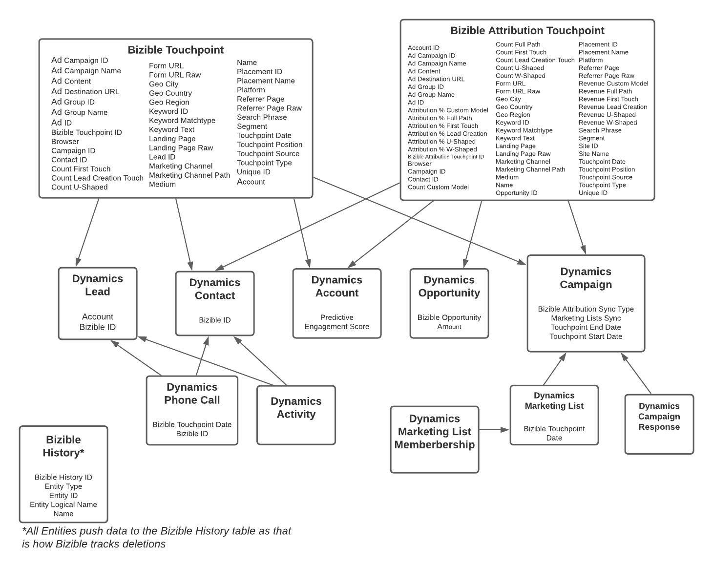

# [!DNL Marketo Measure] e taxonomia do Dynamics {#marketo-measure-and-dynamics-taxonomy}

Abaixo está um fluxograma que representa como os [!DNL Marketo Measure] Objetos Personalizados se relacionam com os Objetos do Dynamics Standard.

