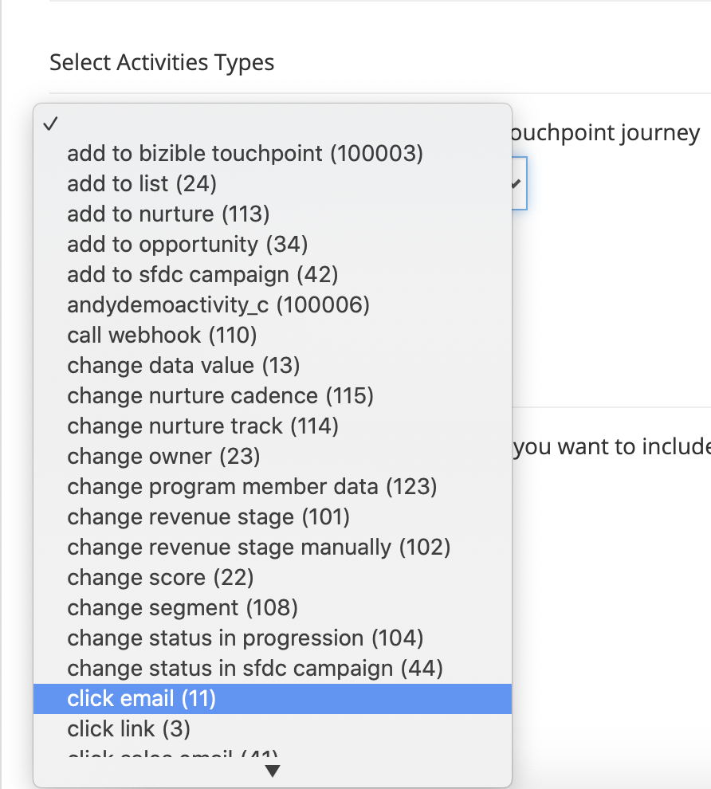
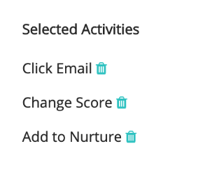
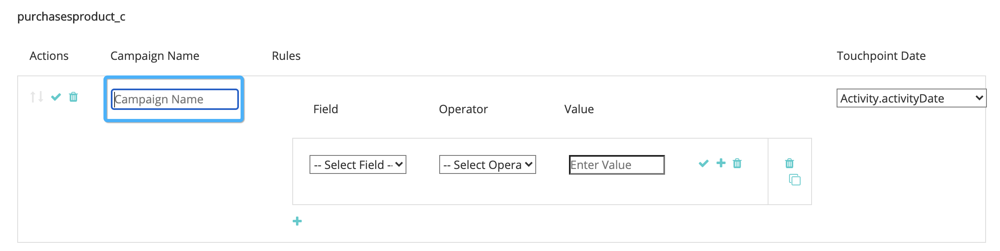
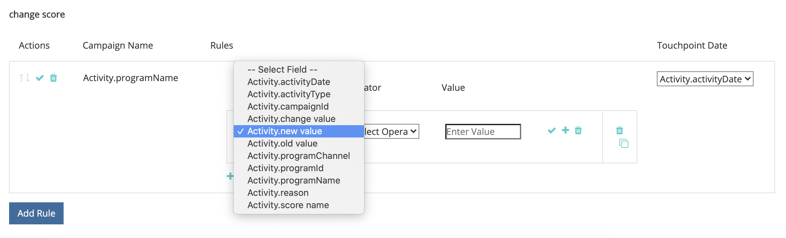

# [!DNL Marketo Engage] Integração de atividades {#marketo-engage-activities-integration}

No âmbito do quadro [!DNL Marketo Measure] e [!DNL Marketo Engage] Integração, esse esforço de inclusão das atividades do Marketo desempenha um papel enorme. Por meio das Atividades do Marketo, o sistema rastreia eventos como Clique em email, Alterar pontuação ou Alterar status na progressão - esses tipos de atividades podem ser analisados e definidos para selecionar um subconjunto elegível para pontos de contato. Depois que os pontos de contato são criados nessas atividades, eles são rastreados na jornada de envolvimento e medidos junto com seus outros canais de marketing, como pesquisa paga ou marketing de parceiros.

## Requisitos {#requirements}

* Instância do Marketo de produção
* Produção [!DNL Salesforce] ou [!DNL Microsoft Dynamics] instância
* Quaisquer [!DNL Marketo Measure] subscrição
* Sincronização de pessoas do Marketo habilitada ([!DNL Marketo Measure] Settings)
* Programas do Marketo ativados ([!DNL Marketo Measure] Settings)
* Atividades do Marketo ativadas ([!DNL Marketo Measure] Settings)

## Configuração {#setup}

1. Para começar a configurar as Atividades do Marketo, navegue até **Minha conta** > **Configurações** > **Atividades**.

   

   

   A primeira coisa necessária é selecionar a lista de Tipos de atividade para os quais você planeja criar regras. Não há necessidade de um número excessivo de tipos de atividades, mas também recomendamos que você não sobrecarregue seus pontos de contato e dilua a importância de marcos significativos. Dito isso, talvez você não precise de mais de cinco tipos de atividades para rastrear os contratos relevantes.

1. Clique no menu suspenso em [!UICONTROL Selecionar tipos de atividades] para começar a escolher os vários tipos.

   

1. Depois que todas as atividades necessárias forem selecionadas, você também as verá preenchidas em [!UICONTROL Lista de atividades selecionadas] bem como sob [!UICONTROL Definir regras].

   

1. Para cada Tipo de atividade, será necessário definir uma ou mais regras que determinam quais registros são qualificados para pontos de contato. Para nosso exemplo, adicionaremos uma regra para o tipo de atividade &quot;Alterar pontuação&quot; para que o sistema crie um ponto de contato quando uma pessoa do Marketo atingir uma pontuação de 90 ou superior.

1. Primeiro, dependendo do Tipo de atividade, talvez seja necessário configurar um [!DNL Marketo Measure] Nome da campanha que pode ser usado posteriormente para mapeamento do canal. [!DNL Marketo Measure] Os Nomes de Campanha podem ser reutilizados em várias regras. Isso ajuda a ter nomes mais amplos que podem ser usados em uma única regra de canal. Nem todos os tipos de atividades contêm um programa Marketo, portanto, é necessário ter um nome nesta primeira etapa.

   Este é um exemplo de como seria essa etapa extra:

   

1. Em nosso exemplo de &quot;Pontuação de alteração&quot;, não precisamos inserir um Nome de campanha, pois podemos obter essas informações do Programa Marketo. Agora você pode criar a expressão de regra. Seguindo nosso exemplo, queremos selecionar o campo &quot;[!UICONTROL Novo Valor]&quot; com um operador de &quot;[!UICONTROL é maior que]&quot; com um valor de 90.

   É possível expandir as regras e adicionar filtros ou critérios adicionais, adicionando instruções &quot;and&quot; ou &quot;or&quot; para restringir os resultados.

   

   

1. Por fim, escolha o que devemos usar como a Data do ponto de contato. Todos os campos de data ou hora disponíveis aparecerão aqui no Marketo. A menos que tenha campos de data personalizados, você verá &quot;[!UICONTROL Data da atividade].&quot;

   

1. Certifique-se de clicar em **[!UICONTROL Salvar como rascunho]** ao longo do caminho para que você não perca suas alterações.

   

1. Navegue até a **[!UICONTROL Mapeamento de atributos]** guia.

   

1. Para cada Tipo de atividade que você selecionou, você tem a opção de mapear atributos adicionais do Marketo para campos de Pontos de contato para que possa visualizar e relatar esses valores em [!DNL Marketo Measure Discover] ou no CRM.

   Muitos dos campos foram mapeados automaticamente e não podem ser alterados para serem consistentes com nossas outras integrações. Consulte a seção Mapeamentos de campo abaixo para localizar esses valores. Para alguns tipos de atividade, o Marketo inclui atributos para uma página de aterrissagem, página de referenciador ou navegador que você pode mapear para um campo de Touchpoint. No exemplo abaixo, fizemos algumas sugestões adicionais que podem ser removidas.

1. Selecione o campo Ponto de contato do comprador na coluna esquerda para a qual você deseja mapear. Em seguida, escolha o Atributo do Marketo que deseja preencher no campo Ponto de contato do comprador. Lembre-se de que esses são mapeamentos adicionais opcionais além daqueles que [!DNL Marketo Measure] já foi estabelecida.

   Campos Mapeáveis:

   * Cidade
   * País
   * Região

   * Página
   * Página de indicação
   * Página do formulário
   * Data do formulário
   * Plataforma
   * Navegador

   >[!NOTE]
   >
   >Campos de anúncios como Conteúdo do anúncio ou Palavra-chave não estão disponíveis nesta lista, pois são reservados para nossas integrações da plataforma de anúncios.

## Tipos de atividade {#activity-types}

Alguns tipos de atividades nos fornecem a ID do programa e o Nome do programa, portanto, é fácil mapeá-los para a ID da campanha e o Nome da campanha no ponto de contato do comprador. Para outros, não há associação de programa, portanto, parte da definição de regras exigirá que você crie um [!DNL Marketo Measure] Nome da campanha. Abaixo estão as listas de cada categoria:

**Tipos de atividade com ID de programa**

Enviar e-mail (6)\
Email entregue (7)\
Email rejeitado (8)\
Cancelar assinatura de email (9)\
Abrir e-mail (10)\
Clique em Email (11)\
Alterar valor dos dados (13)\
Alterar pontuação (22)\
Adicionar à lista (24)\
Alterar status na progressão (104)\
Adicionar ao ambiente (113)\
Alterar cadência de criação (115)

>[!NOTE]
>
>Dos Tipos de atividades em que esperamos uma ID de programa, se uma atividade for detectada sem um programa, [!DNL Marketo Measure] não aceitará isso como um ponto de contato elegível, pois não podemos ter valores nulos de Campanha.

**Tipos de atividade sem ID do programa**

Clique em Link (3)\
Novo lead (12)\
Cliente Potencial de Sincronização com SFDC (19)\
Converter lead (21)\
Alterar proprietário (23)\
Remover da lista (25)\
Atividade da SFDC (26)\
Email Devolvido Temporariamente (27)\
Excluir cliente em potencial do SFDC (29)\
Mesclar clientes em potencial (32)\
Adicionar à oportunidade (34)\
Remover da oportunidade (35)\
Atualizar oportunidade (36)\
Excluir cliente em potencial (37)\
Enviar alerta (38)\
Enviar email de vendas (39)\
Email de vendas em aberto (40)\
Clique em E-mail de vendas (41)\
Adicionar à campanha SFDC (42)\
Remover da campanha SFDC (43)\
Alterar status na campanha do SFDC (44)\
Receber email de vendas (45)\
Campanha de solicitação (47)\
Email de vendas rejeitado (48)\
Alterar estágio de receita (101)\
Alterar estágio de receita manualmente (102)\
Alterar segmento (108)\
Chamar Webhook (110)\
Enviado para um e-mail amigo (111)\
Email de encaminhamento para um amigo recebido (112)\
Alterar trilha de sustentação (114)\
Enviar lead para o Marketo (145)\
Cliente Potencial de Sincronização com o Microsoft (300)\
Compartilhar conteúdo (400) Caixa de diálogo Envolvida (158) Documento interagido com (159) Caixa de diálogo Compromisso agendado (160) Caixa de diálogo Meta atingida (161) Atividade personalizada (xxx)

## Mapeamento de canal {#channel-mapping}

Para qualquer uma das regras de um Tipo de atividade com uma ID de programa, o Canal de programa do Marketo é determinado a partir do programa. Usamos o Canal do programa para mapear para seus canais offline personalizados, portanto, você deve se certificar de que seus canais estejam configurados corretamente [conforme instruído aqui](/help/marketo-measure-and-marketo/marketo-measure-integrations-with-marketo/marketo-engage-programs-integration.md#channel-mapping).

E para qualquer uma das regras de um Tipo de atividade sem uma ID de programa, seu primeiro passo foi criar um Nome de campanha. Use este Nome de campanha para configurar seus Canais online personalizados [apresentado aqui](/help/channel-tracking-and-setup/online-channels/online-custom-channel-setup.md).

Se os Canais das suas Atividades do Marketo não estiverem configurados corretamente, é provável que seus novos pontos de contato estejam no canal &quot;Outros&quot;.

## Custos do programa {#program-costs}

Por meio da importação de dados dos Programas do Marketo, os custos são baixados automaticamente a partir dos Custos do período e o custo relatado no Marketo é distribuído ao longo do mês atribuído. Por exemplo, se US$ 1000 forem relatados para janeiro de 2021, US$ 1000 serão divididos em 31 dias. Os custos podem ser encontrados em [!DNL Marketo Measure Discover].

## Mapeamento de cookies {#cookie-mapping}

Como resultado da [!DNL Marketo Measure] integração com o Marketo, a [!DNL Marketo Measure] Agora a ID do cookie também está mapeada e sincronizada com o [!DNL Marketo Munchkin Id]. Isso ajuda a fechar a lacuna para atribuir o primeiro contato anônimo a uma sessão da Web, em vez de atribuir os toques FT e LC a uma atividade de Marketo. Imagine este cenário:

Mark clica em um anúncio do Facebook e chega em wayneenterprises.com onde ele é guiado [!DNL Marketo Measure] ID 123 e [!DNL Marketo Munchkin Id] 456. Não ocorre preenchimento de formulário.

A equipe de marketing da Wayne Enterprises envia uma explosão de email para clientes potenciais direcionados específicos, sendo um deles `mark@email.com`.

`mark@email.com` recebe o email, clica e acessa `wayneenterprises.com`. Isso se torna `mark@email.com's` segunda visita a `wayneenterprise.com` com as mesmas IDs de cookie, mas não havia preenchimento de formulário, portanto, [!DNL Marketo Measure], eles ainda são um visitante anônimo.

A equipe de marketing da Wayne Enterprises cria uma regra de Atividade do Marketo para gerar pontos de contato para um tipo de atividade &quot;Clique no email&quot;.

A implementação atual criaria um único ponto de contato FT e LC para `mark@email.com` da Atividade do Marketo no tipo de atividade &quot;Clique em email&quot;.

Com esse aprimoramento no mapeamento de cookies, a FT voltava e era creditada ao anúncio do Facebook e a LC era creditada ao email.

>[!NOTE]
>
>Com o comportamento de mapeamento de cookies, você pode encontrar alguns pontos de contato LC que vêm de uma visita à Web. É possível que um lead tenha aparecido no Marketo sem nenhuma atividade associada, então [!DNL Marketo Measure] baixou o cliente potencial, correspondeu aos cookies associados e o rastreou até a sessão da web mais recente, mesmo se não houver atividade de formulário que tenha criado o cliente potencial.

## Perguntas frequentes {#faq}

**Como saberei se devo criar uma regra de Programas Marketo ou uma regra de Atividades Marketo?**

A variável [!DNL Marketo Engage] A integração de programas é uma maneira simples de gerar pontos de contato com base no fato de uma pessoa ser ou não membro de um programa. Se estiver interessado em definir uma regra com base no momento em que uma Pessoa muda para um status de Programa específico, a variável [!DNL Marketo Engage] A Integração de atividades será a configuração desejada, especificamente o tipo de atividade &quot;Alterar status na progressão&quot;, para que a Data do ponto de contato possa ser mapeada para a Data da atividade gerada pelo sistema.

**Por que o nome do meu Tipo de ponto de contato está truncado?**

O campo Tipo de ponto de contato foi criado no [!DNL Marketo Measure] pacote com 16 caracteres. Infelizmente, alterar o limite de caracteres do campo exigiria a substituição do campo existente e a criação de um novo. O valor do Tipo de ponto de contato é o Tipo de atividade, que também é definido no campo Médio.

**Por que meu tipo de atividade personalizado não aparece na lista de atividades disponíveis?**

Mostramos apenas tipos de atividades personalizadas &quot;Aprovado&quot; e não Rascunho ou Aprovado com Rascunho.

**Como determino para quais tipos de atividade quero gerar um ponto de contato?**

Embora não haja limite para o número de Tipos de atividade que você pode criar, geralmente recomendamos não mais do que 5 tipos de atividade. Leva tempo para determinar quais atividades de marketing são relevantes o suficiente para fazer parte da jornada de ponto de contato. Por exemplo, &quot;Cancelar inscrição do email&quot; pode não ser um ponto de contato significativo para rastrear, mas &quot;Clicar no email&quot; com filtros adicionais pode ser um bom ponto de contato. Isso varia de acordo com cada organização e equipe, portanto, sugerimos que você trabalhe com suas equipes para discutir a melhor abordagem aqui.

**Por que meu nome de navegador está cortado?**

A variável [!DNL Marketo Measure] O Nome do navegador tem um limite rígido de 20 caracteres, embora o valor do Agente do usuário que recebemos do Marketo tenda a ser uma string mais longa.

BrowserInfo.Name\
BrowserInfo.Version\
PlatformInfo.Name\
PlatformInfo.Version
